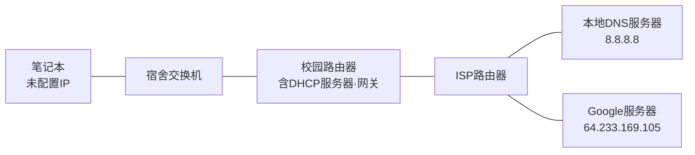
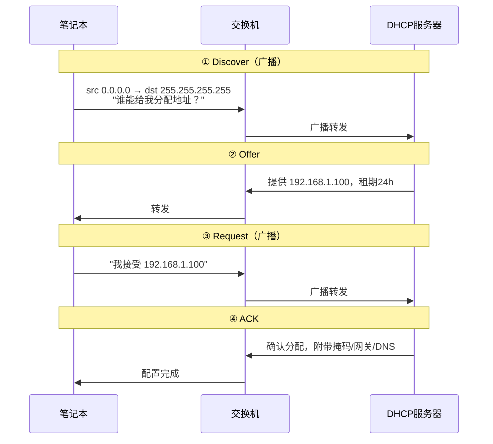
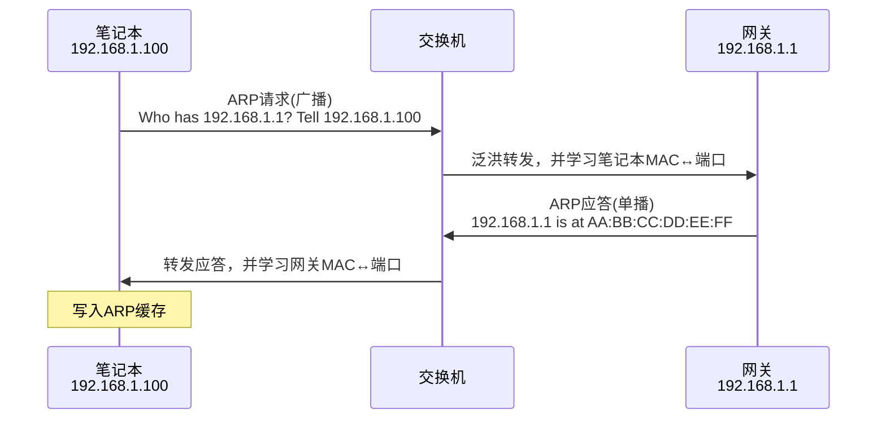
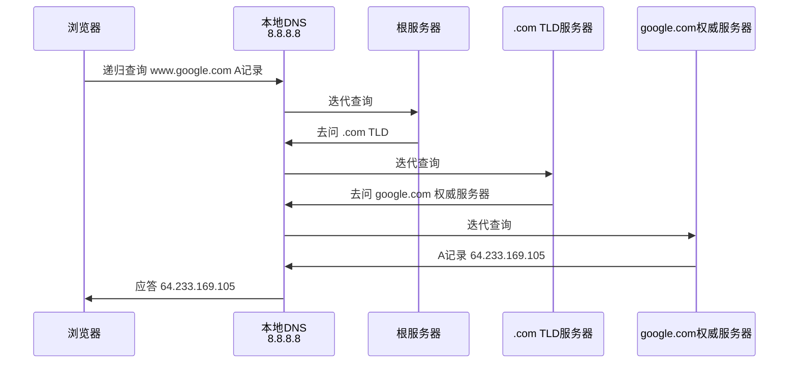
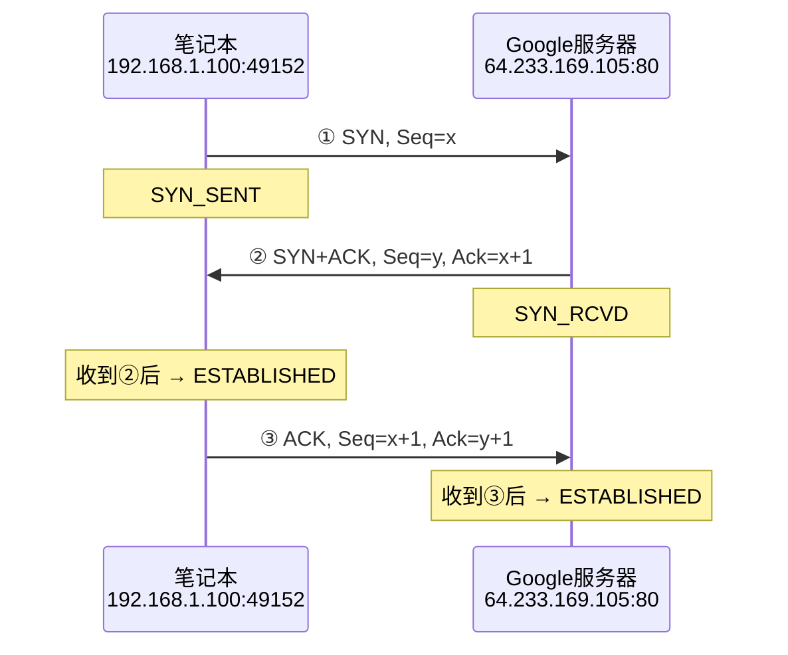
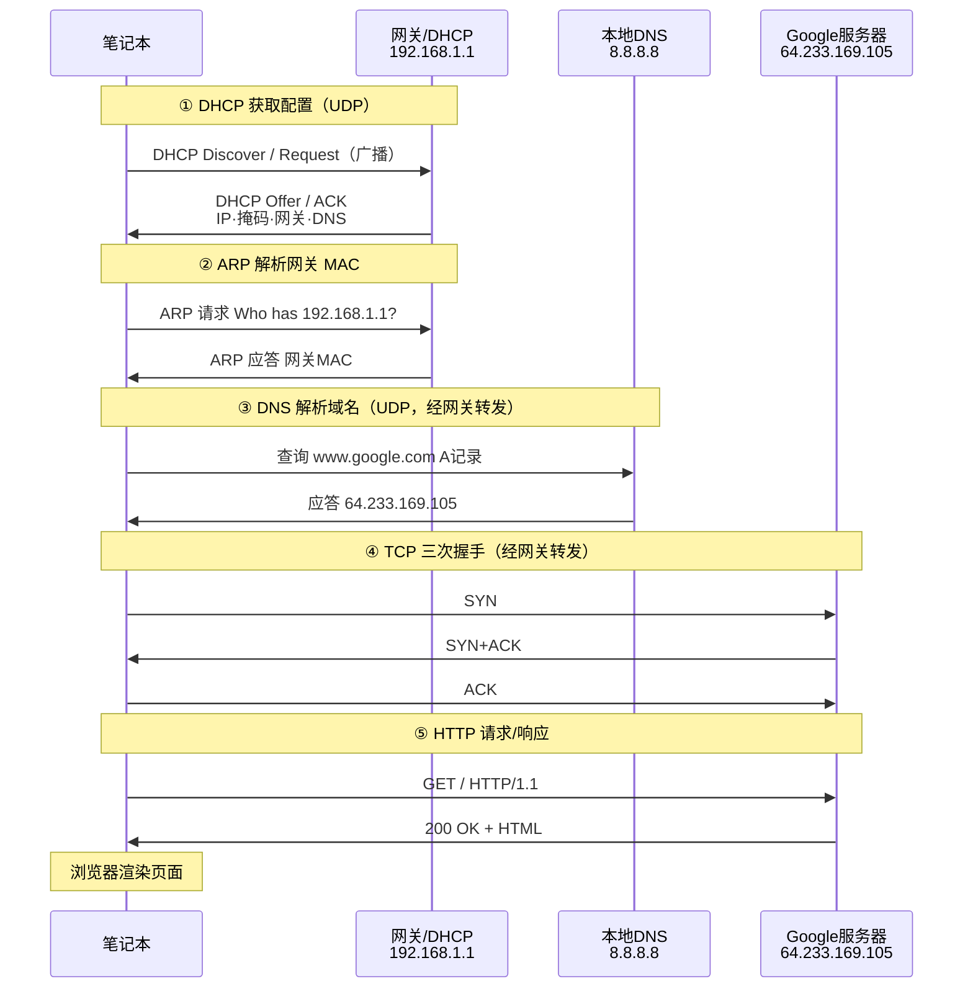
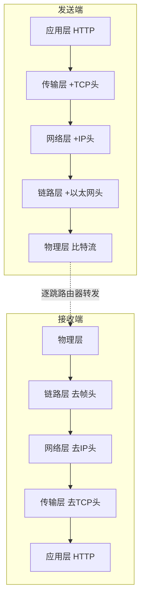

# 6.7 链路层：Web请求历程

## 目录

1. [Web请求场景设置](#web请求场景设置)
2. [DHCP获取IP地址](#dhcp获取ip地址)
3. [ARP获取MAC地址](#arp获取mac地址)
4. [DNS解析域名](#dns解析域名)
5. [TCP连接建立](#tcp连接建立)
6. [HTTP请求和响应](#http请求和响应)
7. [完整协议栈协作](#完整协议栈协作)

---

## Web请求场景设置

把前面各章的协议串成一条完整链路：学生在宿舍用笔记本，通过以太网接入校园网，在浏览器里访问 `www.google.com`。从刚开机（接口未配置）到页面显示，依次经过 DHCP、ARP、DNS、TCP、HTTP 五个环节。

### 网络拓扑



注：本例中校园路由器同时充当 DHCP 服务器与默认网关（IP `192.168.1.1`），这是家庭/小型园区网的常见做法；本地 DNS 服务器（`8.8.8.8`）由 DHCP 一并下发。

### 涉及的协议层

| 层次 | 本节用到的协议 | 在本流程中的作用 |
|-----|---------|----------|
| 应用层 | HTTP、DNS | 请求 Web 页面、解析域名 |
| 传输层 | TCP、UDP | TCP 承载 HTTP，UDP 承载 DNS |
| 网络层 | IP | 跨网段路由转发 |
| 链路层 | 以太网、ARP | 帧传输、IP→MAC 地址解析 |
| 物理层 | - | 比特信号传输 |

---

## DHCP获取IP地址

笔记本刚开机时没有 IP，无法发送任何 IP 分组。第一步用 DHCP 向服务器申请地址及配套配置。DHCP 报文承载于 UDP（客户端端口 68、服务器端口 67），因为此时还没有可靠连接的前提。

### DHCP四步交互

DHCP 交互俗称 DORA（Discover、Offer、Request、ACK）：



注：第三步仍用**广播**，是为了让网络中可能存在的其他 DHCP 服务器都知道客户端已选定某一个 Offer，从而撤回各自的预留地址。

### DHCP报文格式

DHCP 报文结构（RFC 2131）：

```
DHCP报文格式 (最小576字节)
 0                   1                   2                   3
 0 1 2 3 4 5 6 7 8 9 0 1 2 3 4 5 6 7 8 9 0 1 2 3 4 5 6 7 8 9 0 1
┌───────────┬───────────┬───────────┬───────────────────────────────┐
│  Op (8位) │Htype(8位) │Hlen(8位)  │          Hops (8位)           │
│ 操作码    │硬件类型   │硬件长度   │          中继跳数             │
│1=请求2=回复│1=以太网   │6=MAC长度  │          路由跳数             │
├───────────┴───────────┴───────────┴───────────────────────────────┤
│                    Transaction ID (32位)                        │
│                  事务标识符，客户端生成                            │
├───────────────────────┬───────────────────────┬───────────────────┤
│   Seconds (16位)      │    Flags (16位)       │                   │
│   获取地址经历秒数     │   标志位（广播等）     │                   │
├───────────────────────┴───────────────────────┼───────────────────┤
│              Client IP Address (32位)         │                   │
│              客户端IP地址（如果已知）           │                   │
├───────────────────────────────────────────────┼───────────────────┤
│               Your IP Address (32位)          │                   │
│               分配给客户端的IP地址              │                   │
├───────────────────────────────────────────────┼───────────────────┤
│              Server IP Address (32位)         │                   │
│              DHCP服务器IP地址                  │                   │
├───────────────────────────────────────────────┼───────────────────┤
│              Gateway IP Address (32位)        │                   │
│              网关（中继代理）IP地址             │                   │
├───────────────────────────────────────────────┴───────────────────┤
│                Client Hardware Address (128位，16字节)            │
│                客户端硬件地址（MAC地址）                           │
├───────────────────────────────────────────────────────────────────┤
│                    Server Name (512位，64字节)                    │
│                    服务器主机名（可选）                           │
├───────────────────────────────────────────────────────────────────┤
│                   Boot File Name (1024位，128字节)                │
│                   启动文件名（可选）                              │
├───────────────────────────────────────────────────────────────────┤
│                     Options (变长)                               │
│                     DHCP选项字段                                  │
│                     Magic Cookie: 99.130.83.99                   │
└───────────────────────────────────────────────────────────────────┘
```

### 配置结果

DHCP 一次交互下发的不只是 IP，还包括后续 ARP、DNS、路由都要用到的关键参数：

| 参数 | 值 | 后续用途 |
|-----|----|---------|
| IP 地址 | 192.168.1.100 | 作为本机所有分组的源地址 |
| 子网掩码 | 255.255.255.0 | 判断目标是否同网段，决定要不要走网关 |
| 默认网关 | 192.168.1.1 | 访问外网时下一跳，ARP 要解析它的 MAC |
| DNS 服务器 | 8.8.8.8 | 解析 `www.google.com` |
| 租期 | 24 小时 | 到期前需续租 |

---

## ARP获取MAC地址

拿到 IP 后，本机要发出的第一个分组其实是 DNS 查询，目的地是 `8.8.8.8`。用掩码 `255.255.255.0` 一算，`8.8.8.8` 与本机 `192.168.1.100` 不在同一网段，因此分组必须先交给**默认网关** `192.168.1.1`，再由网关转发出去。

链路层只认 MAC 地址，所以本机要先用 ARP 求出网关的 MAC（而不是 `8.8.8.8` 的 MAC——跨网段时永远只解析下一跳）。ARP 原理详见 [6.4 链路层：交换局域网](6.4链路层：交换局域网.md)。

### ARP查询流程



解析完成后，本机 ARP 缓存与交换机转发表各记下一条：

```
笔记本 ARP 缓存
IP地址          MAC地址              类型    生存时间
192.168.1.1    AA:BB:CC:DD:EE:FF   动态    120秒

交换机 MAC 地址表
MAC地址              端口    生存时间
11:22:33:44:55:66   1      300秒   (笔记本)
AA:BB:CC:DD:EE:FF   24     300秒   (网关)
```

注：之后访问任何外网地址都复用这条网关 ARP 记录，不会每次都重新解析。

---

## DNS解析域名

ARP 解析出网关 MAC 后，本机就能把第一个 DNS 查询发出去了：浏览器要把 `www.google.com` 转成 IP 才能建连接。DNS 报文承载于 UDP（端口 53），整条路径是：本机 → 网关 → ISP → 本地 DNS `8.8.8.8`。这一段封装时，以太网帧的目的 MAC 是网关 MAC，但 IP 首部的目的地址是 `8.8.8.8`——典型的"MAC 指下一跳、IP 指最终目的"。

### DNS查询流程

主机到本地 DNS 用**递归**（把活全交给本地服务器），本地 DNS 再对根、TLD、权威服务器逐级发**迭代**查询：



注：递归/迭代的完整说明见 [2.4 应用层：DNS域名系统](2.4应用层：DNS域名系统.md)。实际命中缓存时往往不必跑满三级，这里展示的是缓存全空的最坏情况。

### DNS报文格式

```
 0                   1                   2                   3
 0 1 2 3 4 5 6 7 8 9 0 1 2 3 4 5 6 7 8 9 0 1 2 3 4 5 6 7 8 9 0 1
┌───────────────────────────────┬───────────────────────────────┐
│ 标识符 ID (16位)               │ 标志位 Flags (16位)            │
│ 查询标识，用于匹配请求和响应    │ QR|Opcode|AA|TC|RD|RA|Z|RCODE │
├───────────────────────────────┼───────────────────────────────┤
│ 问题数 QDCOUNT (16位)         │ 回答数 ANCOUNT (16位)         │
│ 查询问题的数量                 │ 回答资源记录的数量             │
├───────────────────────────────┼───────────────────────────────┤
│ 权威数 NSCOUNT (16位)         │ 附加数 ARCOUNT (16位)         │
│ 权威资源记录的数量             │ 附加资源记录的数量             │
├───────────────────────────────┴───────────────────────────────┤
│ 查询部分 (变长) - Question Section                             │
│ 查询域名 (变长，以0结束) + 查询类型 (2字节) + 查询类 (2字节)    │
└───────────────────────────────────────────────────────────────┘
```

查询结果：查询类型为 A 记录（IPv4 地址），`www.google.com` 解析为 `64.233.169.105`，TTL 300 秒（缓存有效期）。

---

## TCP连接建立

拿到 `64.233.169.105` 后，浏览器与 Web 服务器建立 TCP 连接。注意从这里起，分组的最终目的 IP 变成了服务器地址，但以太网帧的目的 MAC 仍是网关 MAC——目标在外网，下一跳始终是网关。三次握手原理见 [3.4 传输层：TCP协议基础](3.4传输层：TCP协议基础.md)。

### 三次握手时序



注：客户端收到第②个报文即进入 ESTABLISHED，服务器收到第③个 ACK 才进入。第③个 ACK 可捎带 HTTP 请求数据。

### 数据包封装层次

握手成功后，HTTP 请求自上而下逐层封装。一个完整分组的结构如下（自外向内）：

```
┌─────────────────────────────────────────────────────────────────┐
│ 以太网头部 (14字节) - Ethernet Header                            │
│ 目标MAC地址(6) + 源MAC地址(6) + 类型字段(2)                      │
├─────────────────────────────────────────────────────────────────┤
│ IP头部 (20字节) - IP Header                                     │
│ 版本(4位) + 头长(4位) + 服务类型(8位) + 总长度(16位)              │
│ 标识(16位) + 标志(3位) + 片偏移(13位)                           │
│ 生存时间(8位) + 协议(8位) + 头部校验和(16位)                     │
│ 源IP地址(32位) + 目标IP地址(32位)                               │
├─────────────────────────────────────────────────────────────────┤
│ TCP头部 (20字节) - TCP Header                                   │
│ 源端口(16位) + 目标端口(16位)                                   │
│ 序列号(32位) + 确认号(32位)                                     │
│ 头长(4位) + 保留(6位) + 标志(6位) + 窗口(16位)                   │
│ 校验和(16位) + 紧急指针(16位)                                   │
├─────────────────────────────────────────────────────────────────┤
│ HTTP数据 (变长) - Application Data                              │
│ GET / HTTP/1.1                                                 │
│ Host: www.google.com                                           │
│ User-Agent: Mozilla/5.0...                                    │
│ Accept: text/html,application/xhtml+xml...                     │
└─────────────────────────────────────────────────────────────────┘
```

---

## HTTP请求和响应

TCP 连接建好，浏览器在连接上发出 HTTP GET 请求，服务器返回页面。HTTP 报文格式详见 [2.2 应用层：万维网和HTTP技术](2.2应用层：万维网和HTTP技术.md)。

### HTTP GET请求

```http
GET / HTTP/1.1
Host: www.google.com
User-Agent: Mozilla/5.0 (Windows NT 10.0; Win64; x64) AppleWebKit/537.36
Accept: text/html,application/xhtml+xml,application/xml;q=0.9,*/*;q=0.8
Accept-Language: en-US,en;q=0.5
Accept-Encoding: gzip, deflate
Connection: keep-alive
```

### HTTP响应报文

```http
HTTP/1.1 200 OK
Date: Mon, 23 May 2024 12:00:00 GMT
Server: gws
Last-Modified: Wed, 21 May 2024 10:00:00 GMT
Content-Type: text/html; charset=UTF-8
Content-Length: 12345
Connection: keep-alive

<!DOCTYPE html>
<html>
<head>
    <title>Google</title>
</head>
<body>
    <h1>Welcome to Google</h1>
    ...
</body>
</html>
```

---

## 完整协议栈协作

### 端到端时序总览

把前面五个环节按发生顺序串起来，就是从开机到页面显示的完整历程。下图是本节的核心：



注：③④⑤中本机发出的帧，目的 MAC 始终是网关 MAC，目的 IP 才是真正的对端（`8.8.8.8` 或服务器）。报文跨网段每经一跳，IP 地址不变、MAC 地址逐跳改写。

### 逐层封装

应用数据自上而下逐层加首部，到链路层成为完整的以太网帧：



中间路由器只解析到网络层（看 IP 首部决定下一跳），不动传输层及以上；交换机只看链路层。

### 各协议小结

| 协议 | 作用 | 承载于 |
|-----|---------|----------|
| DHCP | 自动下发 IP、掩码、网关、DNS | UDP |
| ARP | 把下一跳 IP 解析为 MAC | 直接封进以太网帧 |
| DNS | 把域名解析为 IP | UDP |
| TCP | 建立可靠连接、承载 HTTP | IP |
| IP | 端到端逐跳路由 | 以太网帧 |
| HTTP | 请求并获取 Web 页面 | TCP |

### 时间线

首次访问的各环节耗时量级（DHCP 仅首次接入时发生，后续访问可跳过）：

| 环节 | 量级 |
|-----|------|
| DHCP 配置 | 秒级（仅首次接入） |
| ARP 解析 | 毫秒级 |
| DNS 查询 | 10–100 ms（取决于缓存命中） |
| TCP 握手 | 1 个 RTT |
| HTTP 请求响应 | 10–500 ms |
| 页面渲染 | 100 ms 以上 |

易混：DHCP 与 ARP 只在本地链路完成，不出网关；DNS、TCP、HTTP 都要跨网段，分组都得先发给网关再转发出去。

---

**下一章预告**：[7.0 无线网络和移动网络](7.0 无线网络和移动网络.md) - 当接入方式从有线以太网换成 WiFi 或蜂窝，链路特征与移动性会带来新的问题。
 