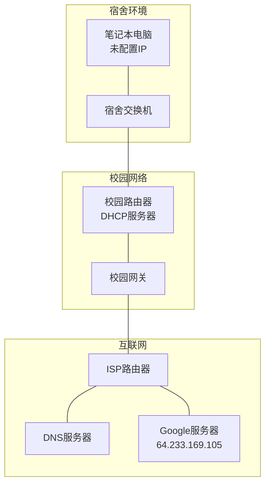
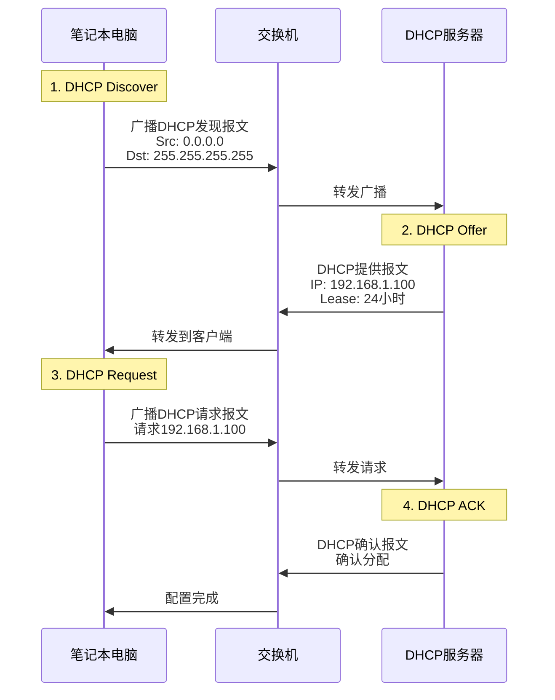
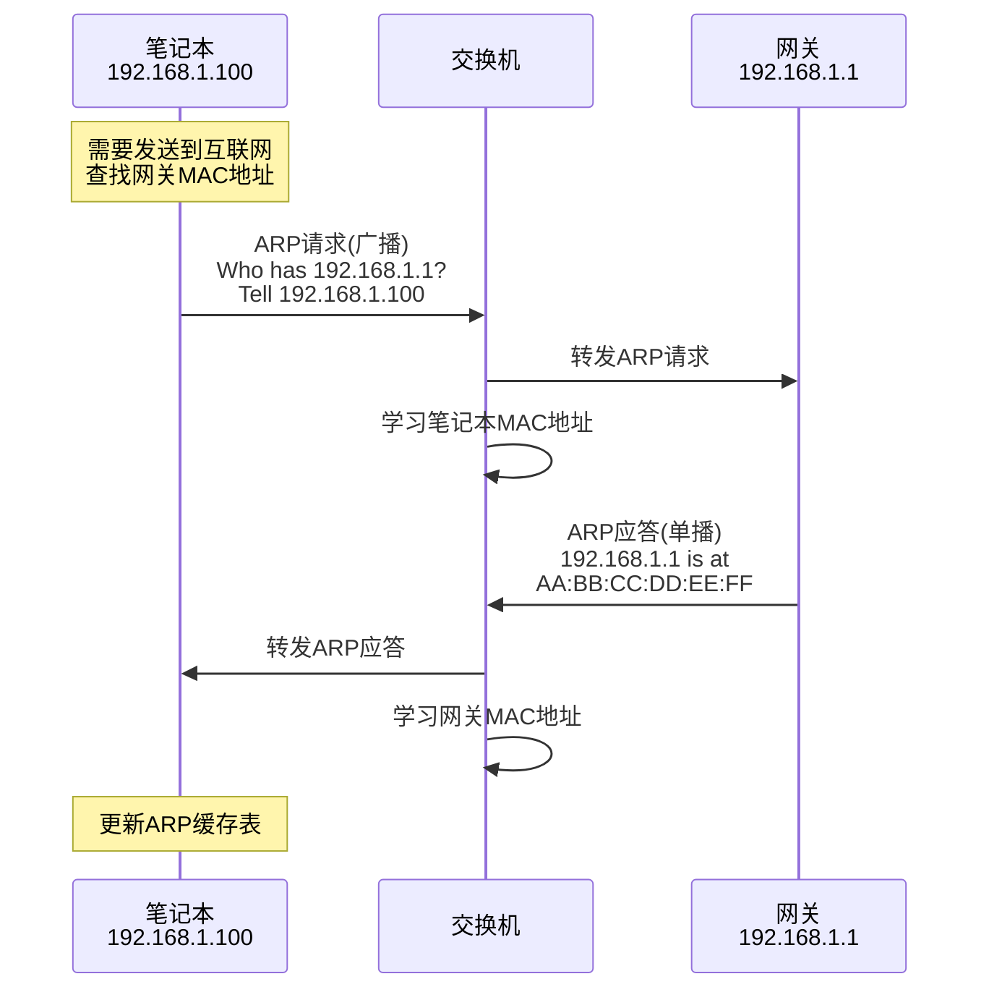
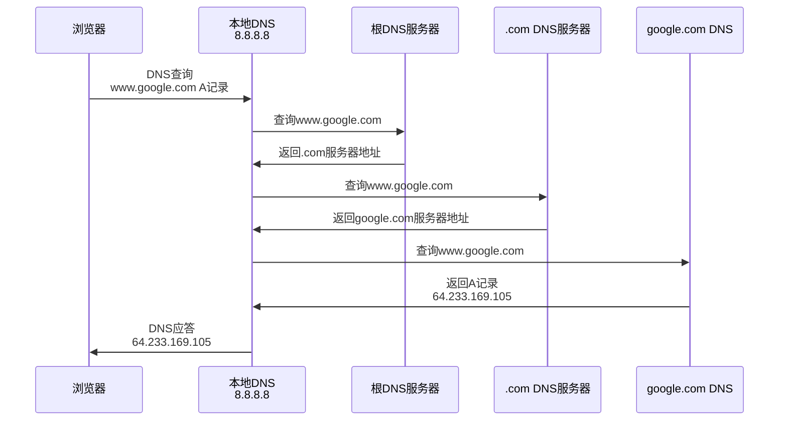
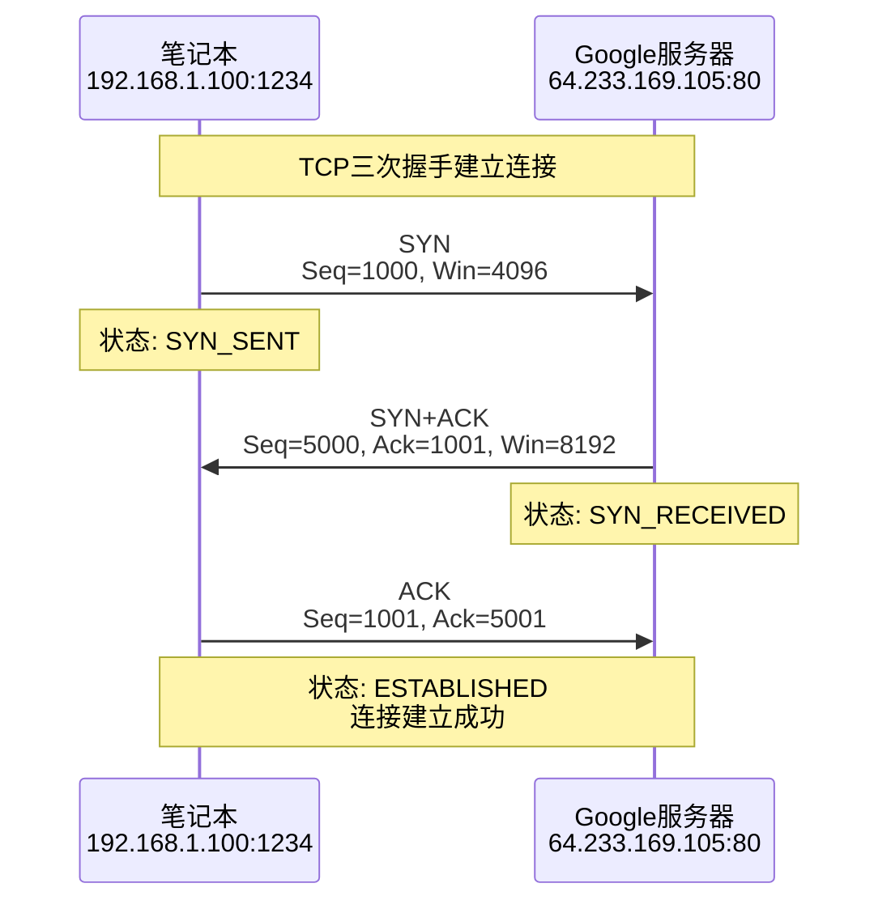
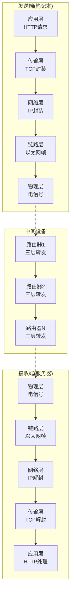

# 6.7 链路层：Web请求历程

## 目录

1. [Web请求场景设置](#web请求场景设置)
2. [DHCP获取IP地址](#dhcp获取ip地址)
3. [ARP获取MAC地址](#arp获取mac地址)
4. [DNS解析域名](#dns解析域名)
5. [TCP连接建立](#tcp连接建立)
6. [HTTP请求和响应](#http请求和响应)
7. [完整协议栈协作](#完整协议栈协作)


---

## Web请求场景设置

### 典型网络环境

> **场景描述**
> 
> 学生在宿舍使用笔记本电脑，通过以太网连接到校园网，访问位于互联网上的Web服务器www.google.com。

#### 网络拓扑结构



**初始状态**：
- 笔记本电脑刚开机，网络接口未配置
- 需要获取IP地址才能访问网络
- 目标：在浏览器中访问www.google.com

### 协议栈概览

#### 涉及的协议层

| 层次 | 主要协议 | 功能作用 |
|-----|---------|----------|
| 应用层 | HTTP, DNS | Web页面请求，域名解析 |
| 传输层 | TCP, UDP | 可靠连接，数据传输 |
| 网络层 | IP, ICMP | 路由转发，错误报告 |
| 链路层 | Ethernet, ARP | 帧传输，地址解析 |
| 物理层 | - | 信号传输 |

---

## DHCP获取IP地址

### DHCP工作流程

> **动态主机配置协议（DHCP）**
> 
> 自动为网络设备分配IP地址和其他网络配置参数的协议。

#### DHCP四步交互



#### DHCP报文格式

**DHCP报文结构**：
```
DHCP报文格式 (最小576字节) - RFC 2131标准
 0                   1                   2                   3
 0 1 2 3 4 5 6 7 8 9 0 1 2 3 4 5 6 7 8 9 0 1 2 3 4 5 6 7 8 9 0 1
┌───────────┬───────────┬───────────┬───────────────────────────────┐
│  Op (8位) │Htype(8位) │Hlen(8位)  │          Hops (8位)           │
│ 操作码    │硬件类型   │硬件长度   │          中继跳数             │
│1=请求2=回复│1=以太网   │6=MAC长度  │          路由跳数             │
├───────────┴───────────┴───────────┴───────────────────────────────┤
│                    Transaction ID (32位)                        │
│                  事务标识符，客户端生成                            │
├───────────────────────┬───────────────────────┬───────────────────┤
│   Seconds (16位)      │    Flags (16位)       │                   │
│   获取地址经历秒数     │   标志位（广播等）     │                   │
├───────────────────────┴───────────────────────┼───────────────────┤
│              Client IP Address (32位)         │                   │
│              客户端IP地址（如果已知）           │                   │
├───────────────────────────────────────────────┼───────────────────┤
│               Your IP Address (32位)          │                   │
│               分配给客户端的IP地址              │                   │
├───────────────────────────────────────────────┼───────────────────┤
│              Server IP Address (32位)         │                   │
│              DHCP服务器IP地址                  │                   │
├───────────────────────────────────────────────┼───────────────────┤
│              Gateway IP Address (32位)        │                   │
│              网关（中继代理）IP地址             │                   │
├───────────────────────────────────────────────┴───────────────────┤
│                Client Hardware Address (128位，16字节)            │
│                客户端硬件地址（MAC地址）                           │
├───────────────────────────────────────────────────────────────────┤
│                    Server Name (512位，64字节)                    │
│                    服务器主机名（可选）                           │
├───────────────────────────────────────────────────────────────────┤
│                   Boot File Name (1024位，128字节)                │
│                   启动文件名（可选）                              │
├───────────────────────────────────────────────────────────────────┤
│                     Options (变长)                               │
│                     DHCP选项字段                                  │
│                     Magic Cookie: 99.130.83.99                   │
└───────────────────────────────────────────────────────────────────┘
```

### 配置结果

**客户端获得的配置**：
- **IP地址**：192.168.1.100
- **子网掩码**：255.255.255.0
- **默认网关**：192.168.1.1
- **DNS服务器**：8.8.8.8
- **租期**：24小时

---

## ARP获取MAC地址

### ARP解析过程

> **地址解析需求**
> 
> 获得IP配置后，要发送数据需要知道下一跳（默认网关）的MAC地址。

#### ARP查询流程



#### ARP表更新

**笔记本ARP表**：
```
IP地址          MAC地址              类型    生存时间
192.168.1.1    AA:BB:CC:DD:EE:FF   动态    120秒
```

**交换机MAC地址表**：
```
MAC地址              端口    生存时间
11:22:33:44:55:66   端口1   300秒  (笔记本)
AA:BB:CC:DD:EE:FF   端口24  300秒  (网关)
```

---

## DNS解析域名

### DNS查询流程

> **域名解析需求**
> 
> 浏览器需要将www.google.com解析为IP地址才能建立连接。

#### 递归DNS查询



#### DNS报文分析

**DNS查询报文格式**：

```
 0                   1                   2                   3
 0 1 2 3 4 5 6 7 8 9 0 1 2 3 4 5 6 7 8 9 0 1 2 3 4 5 6 7 8 9 0 1
┌───────────────────────────────┬───────────────────────────────┐
│ 标识符 ID (16位)               │ 标志位 Flags (16位)            │
│ 查询标识，用于匹配请求和响应    │ QR|Opcode|AA|TC|RD|RA|Z|RCODE │
├───────────────────────────────┼───────────────────────────────┤
│ 问题数 QDCOUNT (16位)         │ 回答数 ANCOUNT (16位)         │
│ 查询问题的数量                 │ 回答资源记录的数量             │
├───────────────────────────────┼───────────────────────────────┤
│ 权威数 NSCOUNT (16位)         │ 附加数 ARCOUNT (16位)         │
│ 权威资源记录的数量             │ 附加资源记录的数量             │
├───────────────────────────────┴───────────────────────────────┤
│ 查询部分 (变长) - Question Section                             │
│ 查询域名 (变长，以0结束) + 查询类型 (2字节) + 查询类 (2字节)    │
└───────────────────────────────────────────────────────────────┘
```

**查询结果**：
- **查询类型**：A记录（IPv4地址）
- **域名**：www.google.com
- **解析结果**：64.233.169.105
- **TTL**：300秒

---

## TCP连接建立

### 三次握手过程

> **TCP连接建立**
> 
> 在获得目标IP地址后，浏览器与Web服务器建立可靠的TCP连接。

#### 连接建立时序



#### 数据包封装层次

**完整数据包封装结构**：

```
┌─────────────────────────────────────────────────────────────────┐
│ 以太网头部 (14字节) - Ethernet Header                            │
│ 目标MAC地址(6) + 源MAC地址(6) + 类型字段(2)                      │
├─────────────────────────────────────────────────────────────────┤
│ IP头部 (20字节) - IP Header                                     │
│ 版本(4位) + 头长(4位) + 服务类型(8位) + 总长度(16位)              │
│ 标识(16位) + 标志(3位) + 片偏移(13位)                           │
│ 生存时间(8位) + 协议(8位) + 头部校验和(16位)                     │
│ 源IP地址(32位) + 目标IP地址(32位)                               │
├─────────────────────────────────────────────────────────────────┤
│ TCP头部 (20字节) - TCP Header                                   │
│ 源端口(16位) + 目标端口(16位)                                   │
│ 序列号(32位) + 确认号(32位)                                     │
│ 头长(4位) + 保留(6位) + 标志(6位) + 窗口(16位)                   │
│ 校验和(16位) + 紧急指针(16位)                                   │
├─────────────────────────────────────────────────────────────────┤
│ HTTP数据 (变长) - Application Data                              │
│ GET / HTTP/1.1                                                 │
│ Host: www.google.com                                           │
│ User-Agent: Mozilla/5.0...                                    │
│ Accept: text/html,application/xhtml+xml...                     │
└─────────────────────────────────────────────────────────────────┘
```

---

## HTTP请求和响应

### HTTP请求发送

#### HTTP GET请求

```http
GET / HTTP/1.1
Host: www.google.com
User-Agent: Mozilla/5.0 (Windows NT 10.0; Win64; x64) AppleWebKit/537.36
Accept: text/html,application/xhtml+xml,application/xml;q=0.9,*/*;q=0.8
Accept-Language: en-US,en;q=0.5
Accept-Encoding: gzip, deflate
Connection: keep-alive
```

### HTTP响应接收

#### HTTP响应报文

```http
HTTP/1.1 200 OK
Date: Mon, 23 May 2024 12:00:00 GMT
Server: gws
Last-Modified: Wed, 21 May 2024 10:00:00 GMT
Content-Type: text/html; charset=UTF-8
Content-Length: 12345
Connection: keep-alive

<!DOCTYPE html>
<html>
<head>
    <title>Google</title>
</head>
<body>
    <h1>Welcome to Google</h1>
    ...
</body>
</html>
```

---

## 完整协议栈协作

### 端到端通信视图

#### 协议栈处理流程



### 关键过程总结

#### 各协议的关键作用

| 协议 | 关键作用 | 处理阶段 |
|-----|---------|----------|
| DHCP | 自动配置网络参数 | 连接初始化 |
| ARP | IP地址到MAC地址映射 | 链路层通信 |
| DNS | 域名到IP地址解析 | 应用准备阶段 |
| TCP | 可靠连接和数据传输 | 传输层服务 |
| IP | 端到端路由和转发 | 网络层路由 |
| HTTP | Web应用协议 | 应用层通信 |

#### 时间线分析

**完整请求时间分解**：
1. **DHCP配置**：2-5秒（首次连接）
2. **ARP解析**：1-3毫秒
3. **DNS查询**：10-100毫秒
4. **TCP连接建立**：1-10毫秒（1.5个RTT）
5. **HTTP请求响应**：10-500毫秒
6. **页面渲染**：100-1000毫秒

**总计**：约150-1600毫秒（首次访问）

---
 