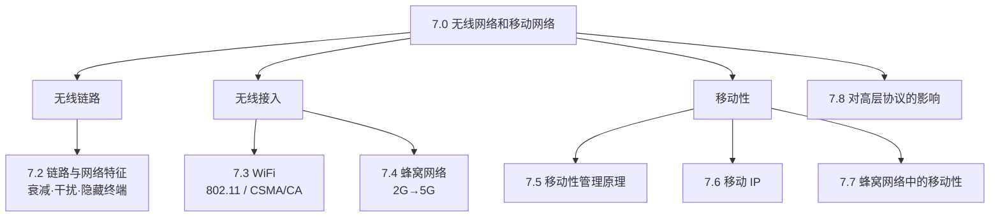

# 7.0 无线网络和移动网络

> 前几章默认主机通过有线链路接入、且接入点固定不变。本章打破这两个假设：先看无线链路本身的特性——信号会衰减、会被干扰、误码率高，这迫使无线协议在差错处理和信道共享上另起炉灶；再落到两类主流无线接入：WiFi（802.11 无线局域网）和蜂窝网络。后半章转向移动性——主机在网络间移动时，如何让通信不中断、如何让对端始终找得到它，这是移动性管理与移动 IP 要解决的问题。最后看无线与移动如何动摇了 TCP 等高层协议的设计前提。

## 两个正交的概念：无线 vs 移动

本章标题里的"无线"和"移动"是两件独立的事，常被混为一谈：

- **无线（wireless）** 描述的是**链路**——主机用电磁波而非电缆接入网络。
- **移动（mobility）** 描述的是**位置变化**——主机在通信过程中改变接入网络的位置。

两者可以任意组合：

| | 固定 | 移动 |
|---|---|---|
| **有线** | 台式机插网线 | 笔记本换工位重新插线 |
| **无线** | 家里固定不动的 WiFi 台灯 | 边走边用蜂窝网络的手机 |

> 易混：无线 ≠ 移动。无线主机也可以静止不动（如固定的无线传感器），移动主机也可以全程有线（如换地方再插网线的笔记本）。本章前半部分（7.2-7.4）讲的是"无线链路"的问题，后半部分（7.5-7.7）讲的是"移动"的问题，最后（7.8）看两者对高层协议的共同冲击。

## 无线网络的三个要素

无论 WiFi 还是蜂窝，无线网络都由这三部分构成：

```
   ┌─────────┐                    ┌──────────┐
   │ 无线主机 │ ····无线链路····   │  基站     │ ── 有线网络 ── 因特网
   │ host    │   (electromagnetic)│ base     │   (backbone)
   └─────────┘                    │ station  │
   笔记本/手机/IoT                  └──────────┘
                                   AP / 蜂窝基站
```

- **无线主机（wireless host）**：运行应用的端设备，如笔记本、手机、IoT 设备。主机不一定移动。
- **基站（base station）**：无线网络的核心，负责在关联的无线主机与更大的有线网络之间中继分组。如 WiFi 的接入点（AP）、蜂窝网络的基站。
- **无线链路（wireless link）**：主机与基站之间、或主机之间的通信信道，用电磁波传输，带宽和误码率随距离、干扰显著变化。

> 注：主机与某个基站建立联系称为**关联（associated）**。处于基站覆盖范围内并通过该基站收发分组，就是"关联"到了它。

## 本章脉络



> 阅读顺序：7.1 先把无线 vs 移动、无线网络三要素这套术语讲清楚；7.2 是无线链路的物理特性，它是后面一切协议设计的约束源头；7.3、7.4 是两类主流无线接入技术——WiFi 用 CSMA/CA 在局域网内共享信道，蜂窝则是运营商的广域接入；7.5 抽象出移动性管理的两大任务（找得到、不中断），7.6、7.7 分别是它在 IP 层（移动 IP）和蜂窝网络中的落地；7.8 回到全书主线，看无线与移动如何挑战了 TCP 的设计假设。
>
> 注：7.2 的无线信道共享与 6.3 的多路访问协议同源，可对照来看——CSMA/CA 正是 CSMA/CD 在无线环境下的变体。

## 章节目录

- **[7.1 无线网络：概述](7.1无线网络：概述.md)**
  - 无线网络基本概念
  - 无线网络分类与特点
  - 无线 vs 移动的区分

- **[7.2 无线网络：链路特征](7.2无线网络：链路特征.md)**
  - 无线信道特性
  - 信号衰减与干扰
  - 隐藏终端与暴露终端问题

- **[7.3 无线网络：WiFi技术](7.3无线网络：WiFi技术.md)**
  - 802.11 体系结构
  - CSMA/CA 协议机制
  - 802.11 帧格式与 MAC 协议
  - WiFi 安全机制

- **[7.4 无线网络：蜂窝网络](7.4无线网络：蜂窝网络.md)**
  - 蜂窝网络体系结构
  - 2G/3G/4G/5G 技术演进
  - 蜂窝网络接入技术

- **[7.5 无线网络：移动性管理](7.5无线网络：移动性管理.md)**
  - 移动性基本概念
  - 位置管理与切换管理
  - 移动性管理架构

- **[7.6 无线网络：移动IP](7.6无线网络：移动IP.md)**
  - 移动 IP 基本原理
  - 移动 IPv4 与 IPv6
  - 三角路由问题与优化

- **[7.7 无线网络：蜂窝移动性](7.7无线网络：蜂窝移动性.md)**
  - GSM 移动性管理
  - 切换过程与优化
  - 位置更新策略

- **[7.8 无线网络：协议影响](7.8无线网络：协议影响.md)**
  - TCP 在无线环境中的性能
  - 移动感知协议设计
  - 应用层适配策略

---

**开始学习：[7.1 无线网络：概述](7.1无线网络：概述.md)**
