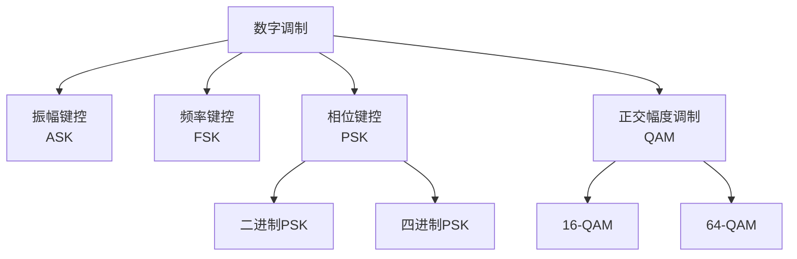

# 7.1 无线网络：概述

## 目录

1. [无线网络基本概念](#无线网络基本概念)
2. [无线网络的要素](#无线网络的要素)
3. [无线网络分类](#无线网络分类)
4. [无线网络的覆盖范围分级](#无线网络的覆盖范围分级)
5. [移动性与无线性区分](#移动性与无线性区分)
6. [无线网络发展历程](#无线网络发展历程)
7. [无线网络应用场景](#无线网络应用场景)

---

## 无线网络基本概念

> **无线网络**
> 
> 利用无线电波、红外线、微波等电磁波作为传输介质，实现网络节点间数据通信的网络系统。

无线通信的一条链路可抽象为"信源 → 发射机（调制）→ 无线信道 → 接收机（解调）→ 信宿"。与有线信道相比，无线信道的传输介质是开放空间中的电磁波，因而引入了一系列有线链路没有的难题：

- 传输介质：电磁波在自由空间传播，信号强度随距离快速衰减
- 频谱资源：可用频谱有限，需在多个用户、多个网络间分配
- 传播特性：多径效应、阴影效应导致信号忽强忽弱
- 动态环境：节点移动使信道随时间变化

注：这些特性是后续各节的主线——[7.2](7.2无线网络：链路特征.md) 讲信道的衰减与干扰，[7.3](7.3无线网络：WiFi技术.md)/[7.4](7.4无线网络：蜂窝网络.md) 讲如何在这样的信道上组网。

### 无线通信原理

#### 电磁波传播机制

**自由空间传播模型**：
$$P_r = P_t \cdot G_t \cdot G_r \cdot \left(\frac{\lambda}{4\pi d}\right)^2$$

其中 $P_r$ 为接收功率，$P_t$ 为发射功率，$G_t$、$G_r$ 为发射和接收天线增益，$\lambda$ 为波长，$d$ 为传播距离。

**路径损耗**：
$$L_{dB} = 20\log_{10}\left(\frac{4\pi d}{\lambda}\right)$$

### 无线传播计算例题

#### 例题1：自由空间传播损耗

> **题目**：某WiFi系统工作频率2.4GHz，发射功率20dBm，天线增益各3dBi，传输距离100m。求接收功率。

**解题步骤**：

**步骤1**：计算波长
$$\lambda = \frac{c}{f} = \frac{3 \times 10^8}{2.4 \times 10^9} = 0.125 \text{m}$$

**步骤2**：计算自由空间路径损耗
$$L_{dB} = 20\log_{10}\left(\frac{4\pi d}{\lambda}\right) = 20\log_{10}\left(\frac{4\pi \times 100}{0.125}\right)$$
$$= 20\log_{10}(10053) = 80.0 \text{dB}$$

**步骤3**：计算接收功率
$$P_r(dBm) = P_t(dBm) + G_t(dBi) + G_r(dBi) - L_{dB}$$
$$= 20 + 3 + 3 - 80 = -54 \text{dBm}$$

接收功率为 -54 dBm，而 WiFi 接收灵敏度通常约 -90 dBm，二者相差 36 dB，信号裕度充足。

#### 例题2：覆盖范围计算

> **题目**：某基站发射功率43dBm，天线增益18dBi，接收端灵敏度-100dBm，天线增益0dBi。工作频率900MHz，求最大覆盖半径（忽略阴影衰落）。

**解答**：

**步骤1**：计算允许的最大路径损耗
$$L_{max} = P_t + G_t + G_r - P_{r,min}$$
$$= 43 + 18 + 0 - (-100) = 161 \text{dB}$$

**步骤2**：计算波长
$$\lambda = \frac{3 \times 10^8}{900 \times 10^6} = 0.333 \text{m}$$

**步骤3**：根据路径损耗公式反推距离
$$161 = 20\log_{10}\left(\frac{4\pi d}{0.333}\right)$$
$$\frac{4\pi d}{0.333} = 10^{161/20} = 10^{8.05} = 1.12 \times 10^8$$
$$d = \frac{1.12 \times 10^8 \times 0.333}{4\pi} = 2.97 \times 10^6 \text{m} \approx 2970 \text{km}$$

注：自由空间模型只计直射路径，反推出的距离远超实际。真实环境中还要叠加多径衰落、阴影效应和地物遮挡，蜂窝宏小区的典型覆盖半径仅约 5～15 km。

### 调制与解调

> **调制技术**
> 
> 将基带数字信号变换为适合无线信道传输的高频信号的过程。

**常用调制方式**：



**调制性能对比**：

| 调制方式 | 频谱效率 | 抗噪声性能 | 所需SNR | 实现复杂度 | 应用场景 |
|---------|---------|-----------|---------|-----------|----------|
| BPSK | 1 bit/s/Hz | 最好 | 10dB | 简单 | 低速可靠通信 |
| QPSK | 2 bit/s/Hz | 好 | 13dB | 中等 | 卫星通信 |
| 16-QAM | 4 bit/s/Hz | 中等 | 18dB | 复杂 | 4G LTE |
| 64-QAM | 6 bit/s/Hz | 较差 | 24dB | 很复杂 | 5G高速率 |
| 256-QAM | 8 bit/s/Hz | 差 | 30dB | 极复杂 | WiFi-6 |

阶数越高，单位带宽承载的比特越多，但对信噪比的要求也越高。实际系统采用**自适应调制**：信道好时切到高阶（64/256-QAM）抢速率，信道差时退回低阶（BPSK/QPSK）保可靠。

频谱效率：

$$\eta = \frac{R_b}{B} = \frac{\log_2 M}{T_s \cdot B} \quad \text{(bit/s/Hz)}$$

其中 $M$ 为调制阶数，QPSK 的 $M=4$，16-QAM 的 $M=16$。

---

## 无线网络的要素

任何一个无线网络，无论是家里的 WiFi 还是城市的蜂窝网，都由下面几类基本构件组成：

| 要素 | 说明 | 例子 |
|------|------|------|
| 无线主机（Wireless Host） | 运行应用的端设备，可以是固定的也可以是移动的 | 手机、笔记本、IoT 传感器 |
| 基站（Base Station） | 连接有线网络与无线主机的中枢，负责协调所辖无线主机的收发 | WiFi 接入点（AP）、蜂窝基站 |
| 无线链路（Wireless Link） | 主机与基站、或主机与主机之间的无线信道 | 802.11、4G/5G 空口 |
| 网络基础设施（Infrastructure） | 无线主机想要接入的更大网络 | 因特网、企业内网 |

```
        因特网 / 网络基础设施
                │
         ┌──────┴──────┐
         │   有线链路    │
    ┌────┴────┐   ┌────┴────┐
    │  基站 A  │   │  基站 B  │   ← 覆盖区（小区/BSS）
    └────┬────┘   └────┬────┘
   无线链路 │           │ 无线链路
    ┌──┴──┐         ┌──┴──┐
   主机1  主机2      主机3  主机4
```

> **基站**
> 
> 无线网络中的关键设备，本身不属于无线主机，而是把无线主机连接到更大网络基础设施的"中转点"。与某基站建立连接、并通过它收发数据的主机，称为以**基础设施模式（infrastructure mode）**运行。

**关联（association）**：无线主机选定一个基站、与之建立连接的过程，称为与该基站关联。完成关联后，主机的所有数据都经此基站中转。

**切换（handoff）**：当主机移动、离开当前基站覆盖范围时，改为与新基站关联的过程。切换是移动性管理的核心问题，详见 [7.5](7.5无线网络：移动性管理.md)。

易混：**无线 ≠ 移动**。无线指传输介质，移动指位置变化；二者相互独立，详见后文[移动性与无线性区分](#移动性与无线性区分)。

---

## 无线网络分类

按"是否经过基站（有无基础设施）"和"主机到基础设施是单跳还是多跳"两个维度，无线网络可分为四类：

```
                  单跳（single-hop）        多跳（multi-hop）
              ┌───────────────────────┬───────────────────────┐
   有基础设施  │ 主机经一跳无线连到基站  │ 主机经其他节点中继       │
   (经基站)   │ 例：WiFi、4G/5G 蜂窝   │ 才能到达基站            │
              │                       │ 例：无线网状网（Mesh）   │
              ├───────────────────────┼───────────────────────┤
   无基础设施  │ 主机之间直接一跳互通    │ 主机间多跳转发，无基站   │
   (无基站)   │ 例：蓝牙、WiFi Direct  │ 例：MANET、车载自组网    │
              └───────────────────────┴───────────────────────┘
```

- **单跳，有基础设施**：最常见，主机一跳连到基站，再经基站接入因特网。家庭 WiFi、蜂窝数据都属此类。
- **多跳，有基础设施**：主机离基站太远，需借助其他无线节点中继才能到达基站，如无线网状网。
- **单跳，无基础设施**：没有基站，主机之间直接通信，如蓝牙、WiFi Direct。
- **多跳，无基础设施**：既无基站，又需多跳中继，由节点自行组网和路由，如移动自组织网络（MANET）和车载自组网（VANET）。

> **自组织网络（Ad Hoc Network）**
> 
> 没有基站等基础设施、由对等节点临时组建的无线网络。节点既是终端也是路由器，靠彼此转发实现通信，常用于临时会议、战场、灾后救援等场景。

注：上面是以"接入方式"划分。日常更常按**覆盖范围**给无线网络分级（PAN/LAN/MAN/WAN），见下一节。两种分类视角不同、并不冲突。

---

## 无线网络的覆盖范围分级

### 个人区域网（PAN）

> **无线个人区域网（WPAN）**
> 
> 覆盖范围约10米以内，连接个人设备的短距离无线网络。

**主要技术**：
- **蓝牙（Bluetooth）**：2.4GHz ISM频段
- **红外线（IrDA）**：点对点通信
- **近场通信（NFC）**：极短距离通信
- **USB无线**：高速短距离传输

**应用场景**：
- 手机与耳机连接
- 键盘鼠标无线连接
- 智能穿戴设备
- 移动支付NFC

### 局域网（LAN）

> **无线局域网（WLAN）**
> 
> 覆盖范围通常在100-300米，为建筑物内或校园内提供高速网络接入。

**IEEE 802.11系列标准**：

| 标准 | 频段 | 信道带宽 | 最高速率 | 调制方式 | MIMO | 覆盖范围 | 发布年份 |
|-----|------|---------|---------|---------|------|---------|---------|
| 802.11 | 2.4GHz | 20MHz | 2Mbps | DSSS | 无 | 50m | 1997 |
| 802.11b | 2.4GHz | 20MHz | 11Mbps | CCK | 无 | 100m | 1999 |
| 802.11a | 5GHz | 20MHz | 54Mbps | OFDM | 无 | 50m | 1999 |
| 802.11g | 2.4GHz | 20MHz | 54Mbps | OFDM | 无 | 100m | 2003 |
| 802.11n | 2.4/5GHz | 20/40MHz | 600Mbps | OFDM | 4×4 | 150m | 2009 |
| 802.11ac | 5GHz | 20-160MHz | 6.93Gbps | OFDM | 8×8 | 100m | 2013 |
| 802.11ax | 2.4/5GHz | 20-160MHz | 9.6Gbps | OFDMA | 8×8 | 120m | 2019 |

注：从 802.11n 起引入 MIMO 多天线，速率大幅跃升；802.11ax（WiFi 6）改用 OFDMA，支持多用户在一个信道上并行传输。802.11 的详细机制见 [7.3](7.3无线网络：WiFi技术.md)。

### 城域网（MAN）

> **无线城域网（WMAN）**
> 
> 覆盖城市范围，提供宽带无线接入服务。

**主要技术**：
- **WiMAX (IEEE 802.16)**：固定和移动宽带接入
- **LTE**：长期演进移动通信技术
- **5G NR**：新一代移动通信

### 广域网（WAN）

> **无线广域网（WWAN）**
> 
> 覆盖国家或洲际范围的移动通信网络。

**蜂窝网络演进**：

| 代际 | 时代 | 主要制式 | 峰值速率 | 频谱效率 | 延迟 | 核心技术 | 主要业务 |
|-----|------|---------|---------|---------|------|---------|---------|
| 1G | 1980s | AMPS, NMT | 9.6Kbps | 低 | 高 | FDMA模拟 | 语音 |
| 2G | 1990s | GSM, CDMA | 14.4Kbps | 中 | 200-300ms | TDMA/CDMA | 语音+短信 |
| 3G | 2000s | UMTS, CDMA2000 | 2Mbps | 中 | 100-200ms | W-CDMA | 移动数据 |
| 4G | 2010s | LTE, LTE-A | 1Gbps | 高 | 30-50ms | OFDMA, MIMO | 移动宽带 |
| 5G | 2020s | 5G NR | 20Gbps | 极高 | 1ms | 毫米波, Massive MIMO | 万物互联 |

从 1G 到 5G，峰值速率约每十年提升千倍，时延从数百毫秒降到 1 ms 量级，单位面积可接入的设备数也提升了上万倍。蜂窝网络的体系结构与代际技术详见 [7.4](7.4无线网络：蜂窝网络.md)。

注：覆盖范围分级与上一节的接入方式分类是两套独立视角。例如 WiFi 按覆盖属 LAN，按接入方式属"单跳、有基础设施"；蓝牙按覆盖属 PAN，按接入方式属"单跳、无基础设施"。

---

## 移动性与无线性区分

无线和移动是两个常被混为一谈、实则独立的概念。

> **无线性（Wireless）**：使用无线传输介质收发数据。关注信号传播、衰减与干扰。
> 
> **移动性（Mobility）**：节点改变接入点位置时仍保持连接。关注位置管理与切换。

移动性又可细分为终端移动性（设备移动）、个人移动性（用户在不同设备间切换）、服务移动性（服务在网络间迁移）。

两者的关键区别：

| 特性 | 移动性 | 无线性 |
|-----|-------|--------|
| 定义 | 位置变化能力 | 传输介质类型 |
| 核心问题 | 位置管理、切换 | 信号传播、干扰 |
| 技术挑战 | 路由更新、QoS保持 | 调制解调、功率控制 |
| 协议支持 | Mobile IP、切换协议 | MAC协议、物理层技术 |
| 典型场景 | 行走中通话 | 固定WiFi使用 |
| 性能影响 | 切换延迟、丢包 | 误码率、吞吐量 |

### 四种组合场景

移动性与无线性正交，两两组合得到四种场景，技术挑战由易到难：

```
              无线性 → 无            无线性 → 有
           ┌──────────────────┬──────────────────┐
  无移动性  │ 台式机插网线上网   │ 固定位置用 WiFi    │
           │ 配置简单、性能稳定 │ 主要关心信号与干扰 │
           ├──────────────────┼──────────────────┤
  有移动性  │ 笔记本换办公室插网 │ 手机移动中通话上网 │
           │ 需重配 IP 与路由   │ 信号+切换，挑战最大 │
           └──────────────────┴──────────────────┘
```

注：**有移动性但有线**也有意义——笔记本换房间后重新插网线、需重新获取 IP，这是移动性问题而非无线问题；反之**无线但不移动**（固定 WiFi）只需应对信号与干扰，不涉及切换。可见两个维度确实独立。

---

## 无线网络发展历程

蜂窝网络从模拟语音演进到万物互联，每一代的核心变化集中在多址方式、是否数字化、是否全 IP 三条线索上：

| 代际 | 关键转变 | 多址/核心技术 | 代表制式 | 主要业务 |
|------|---------|--------------|---------|---------|
| 1G | 模拟语音 | FDMA + 模拟调频 | AMPS、NMT、TACS | 语音 |
| 2G | 数字化 | TDMA / CDMA | GSM、IS-95 | 语音 + 短信 |
| 3G | 移动数据 | 宽带 CDMA | W-CDMA、CDMA2000 | 移动多媒体 |
| 4G | 全 IP 网络 | OFDMA + MIMO | LTE、LTE-A | 移动宽带 |
| 5G | 万物互联 | 毫米波 + Massive MIMO | 5G NR | eMBB / uRLLC / mMTC |

注：1G 是模拟制式，从 2G 起全面数字化；4G 起核心网与空口全部 IP 化，语音也走 IP（VoLTE）。

> **5G 三大应用场景**
> 
> - **eMBB（增强移动宽带）**：追求峰值速率，面向高清视频、AR/VR
> - **uRLLC（超可靠低时延通信）**：时延低至 1 ms 量级，面向工业控制、车联网
> - **mMTC（海量机器类通信）**：单位面积可接入海量设备，面向大规模 IoT

各代蜂窝网络的体系结构与具体技术详见 [7.4 蜂窝因特网接入](7.4无线网络：蜂窝网络.md)。

---

## 无线网络应用场景

无线网络的应用可大致归为三类：

- **移动通信与上网**：蜂窝语音/VoIP、SMS/MMS、手机上网、位置服务（LBS）；WiFi 提供家庭、办公室和公共热点接入。
- **物联网（IoT）**：海量低功耗设备的连接。短距离用蓝牙/Zigbee，广域用 LPWAN（NB-IoT、LoRa、Sigfox），典型路径是"传感器 → 网关 → 云 → 应用"，落地于智慧城市、工业、医疗、农业。
- **车联网（V2X）与工业无线**：V2X 含 V2V（车-车）、V2I（车-路）、V2P（车-人）、V2N（车-网），支撑碰撞预警与自动驾驶；工业控制则要求超低时延（< 1 ms）、高可靠（99.999%）和确定性传输。

注：IoT 与车联网/工业控制的需求差异很大——前者重连接密度和功耗，后者重时延和可靠性，这正对应 5G 的 mMTC 与 uRLLC 两类场景。

---

**下一节**：[7.2 无线网络：链路特征](7.2无线网络：链路特征.md)
