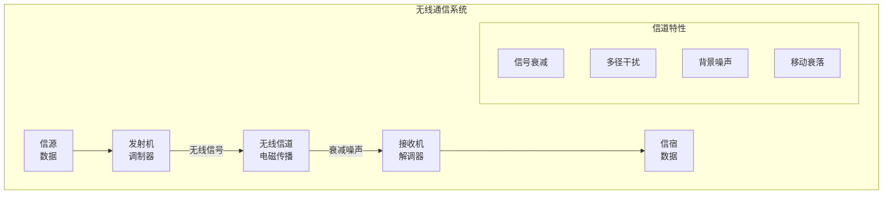
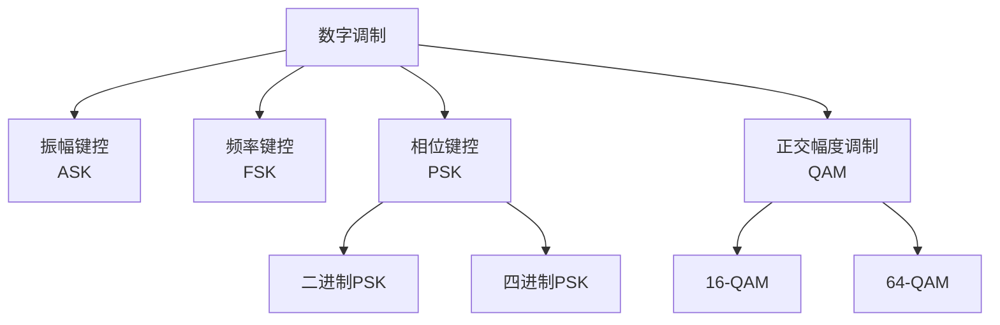
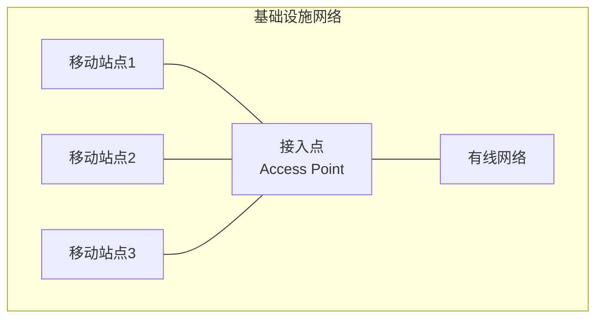
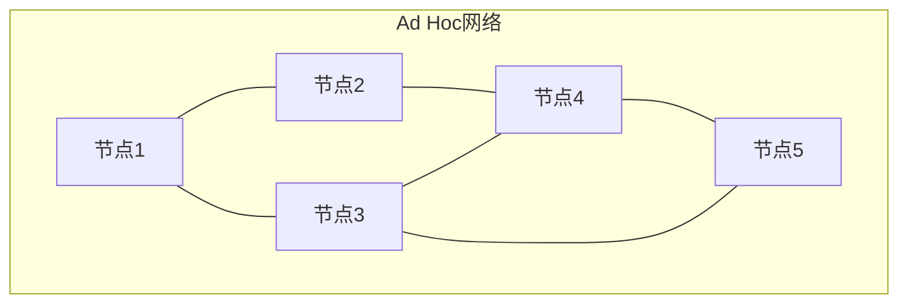
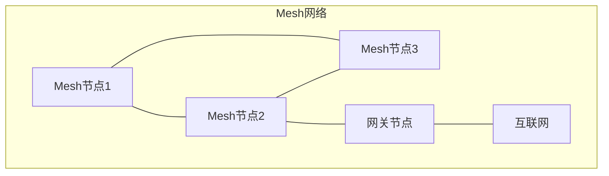
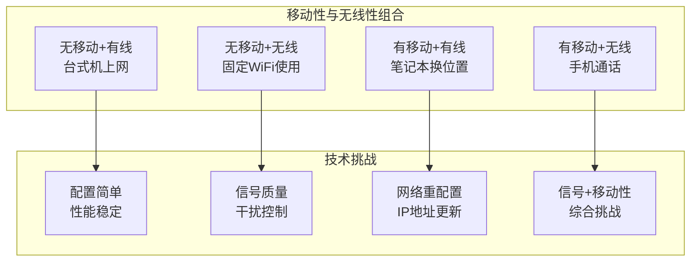
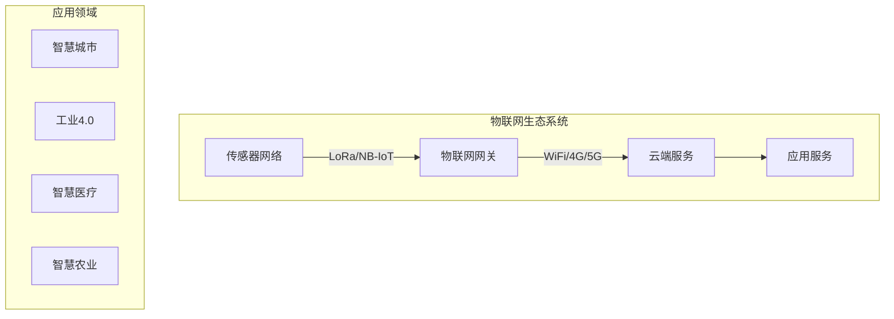

# 7.1 无线网络：概述

## 目录

1. [无线网络基本概念](#无线网络基本概念)
2. [无线网络分类与特点](#无线网络分类与特点)
3. [移动性与无线性区分](#移动性与无线性区分)
4. [无线网络发展历程](#无线网络发展历程)
5. [无线网络应用场景](#无线网络应用场景)

---

## 无线网络基本概念

### 无线通信定义

> **无线网络**
> 
> 利用无线电波、红外线、微波等电磁波作为传输介质，实现网络节点间数据通信的网络系统。

#### 无线通信基本要素

**核心特征**：
- **传输介质**：电磁波在自由空间传播
- **频谱资源**：有限的无线频谱需要合理分配
- **传播特性**：信号衰减、多径效应、阴影效应
- **动态环境**：移动性导致信道时变特性

### 无线通信原理

#### 电磁波传播机制

**自由空间传播模型**：
$$P_r = P_t \cdot G_t \cdot G_r \cdot \left(\frac{\lambda}{4\pi d}\right)^2$$

其中：
- P_r：接收功率
- P_t：发射功率  
- G_t, G_r：发射和接收天线增益
- λ：波长
- d：传播距离

**路径损耗**：
$$L_{dB} = 20\log_{10}\left(\frac{4\pi d}{\lambda}\right)$$

### 无线传播计算例题

#### 例题1：自由空间传播损耗

> **题目**：某WiFi系统工作频率2.4GHz，发射功率20dBm，天线增益各3dBi，传输距离100m。求接收功率。

**解题步骤**：

**步骤1**：计算波长
$$\lambda = \frac{c}{f} = \frac{3 \times 10^8}{2.4 \times 10^9} = 0.125 \text{m}$$

**步骤2**：计算自由空间路径损耗
$$L_{dB} = 20\log_{10}\left(\frac{4\pi d}{\lambda}\right) = 20\log_{10}\left(\frac{4\pi \times 100}{0.125}\right)$$
$$= 20\log_{10}(10053) = 80.0 \text{dB}$$

**步骤3**：计算接收功率
$$P_r(dBm) = P_t(dBm) + G_t(dBi) + G_r(dBi) - L_{dB}$$
$$= 20 + 3 + 3 - 80 = -54 \text{dBm}$$

**结论**：接收功率为-54dBm，WiFi接收灵敏度通常为-90dBm左右，信号强度良好。

#### 例题2：覆盖范围计算

> **题目**：某基站发射功率43dBm，天线增益18dBi，接收端灵敏度-100dBm，天线增益0dBi。工作频率900MHz，求最大覆盖半径（忽略阴影衰落）。

**解答**：

**步骤1**：计算允许的最大路径损耗
$$L_{max} = P_t + G_t + G_r - P_{r,min}$$
$$= 43 + 18 + 0 - (-100) = 161 \text{dB}$$

**步骤2**：计算波长
$$\lambda = \frac{3 \times 10^8}{900 \times 10^6} = 0.333 \text{m}$$

**步骤3**：根据路径损耗公式反推距离
$$161 = 20\log_{10}\left(\frac{4\pi d}{0.333}\right)$$
$$\frac{4\pi d}{0.333} = 10^{161/20} = 10^{8.05} = 1.12 \times 10^8$$
$$d = \frac{1.12 \times 10^8 \times 0.333}{4\pi} = 2.97 \times 10^6 \text{m} \approx 2970 \text{km}$$

**实际分析**：理论值过大，实际受多径衰落、阴影效应影响，典型覆盖半径约5-15km。

#### 调制与解调

> **调制技术**
> 
> 将基带数字信号变换为适合无线信道传输的高频信号的过程。

**常用调制方式**：

**调制性能对比**：

| 调制方式 | 频谱效率 | 抗噪声性能 | 所需SNR | 实现复杂度 | 应用场景 |
|---------|---------|-----------|---------|-----------|----------|
| BPSK | 1 bit/s/Hz | 最好 | 10dB | 简单 | 低速可靠通信 |
| QPSK | 2 bit/s/Hz | 好 | 13dB | 中等 | 卫星通信 |
| 16-QAM | 4 bit/s/Hz | 中等 | 18dB | 复杂 | 4G LTE |
| 64-QAM | 6 bit/s/Hz | 较差 | 24dB | 很复杂 | 5G高速率 |
| 256-QAM | 8 bit/s/Hz | 差 | 30dB | 极复杂 | WiFi-6 |

**调制方式选择准则**：
- **信道质量好（高SNR）**：选择高阶调制（64/256-QAM），提高速率
- **信道质量差（低SNR）**：选择低阶调制（BPSK/QPSK），保证可靠性
- **自适应调制**：根据信道实时质量动态调整调制方式

**频谱效率计算**：
$$\eta = \frac{R_b}{B} = \frac{\log_2 M}{T_s \cdot B} \text{ (bit/s/Hz)}$$

其中 $M$ 为调制阶数，QPSK的 $M=4$，16-QAM的 $M=16$。

---

## 无线网络分类与特点

### 按覆盖范围分类

#### 个人区域网（PAN）

> **无线个人区域网（WPAN）**
> 
> 覆盖范围约10米以内，连接个人设备的短距离无线网络。

**主要技术**：
- **蓝牙（Bluetooth）**：2.4GHz ISM频段
- **红外线（IrDA）**：点对点通信
- **近场通信（NFC）**：极短距离通信
- **USB无线**：高速短距离传输

**应用场景**：
- 手机与耳机连接
- 键盘鼠标无线连接
- 智能穿戴设备
- 移动支付NFC

#### 局域网（LAN）

> **无线局域网（WLAN）**
> 
> 覆盖范围通常在100-300米，为建筑物内或校园内提供高速网络接入。

**IEEE 802.11系列标准**：

| 标准 | 频段 | 信道带宽 | 最高速率 | 调制方式 | MIMO | 覆盖范围 | 发布年份 |
|-----|------|---------|---------|---------|------|---------|---------|
| 802.11 | 2.4GHz | 20MHz | 2Mbps | DSSS | 无 | 50m | 1997 |
| 802.11b | 2.4GHz | 20MHz | 11Mbps | CCK | 无 | 100m | 1999 |
| 802.11a | 5GHz | 20MHz | 54Mbps | OFDM | 无 | 50m | 1999 |
| 802.11g | 2.4GHz | 20MHz | 54Mbps | OFDM | 无 | 100m | 2003 |
| 802.11n | 2.4/5GHz | 20/40MHz | 600Mbps | OFDM | 4×4 | 150m | 2009 |
| 802.11ac | 5GHz | 20-160MHz | 6.93Gbps | OFDM | 8×8 | 100m | 2013 |
| 802.11ax | 2.4/5GHz | 20-160MHz | 9.6Gbps | OFDMA | 8×8 | 120m | 2019 |

**关键技术演进**：
- **调制技术**：从DSSS/CCK演进到OFDM/OFDMA
- **MIMO技术**：从单天线到8×8 MU-MIMO
- **信道带宽**：从20MHz扩展到160MHz
- **多用户**：802.11ax支持OFDMA多用户并行传输

#### 城域网（MAN）

> **无线城域网（WMAN）**
> 
> 覆盖城市范围，提供宽带无线接入服务。

**主要技术**：
- **WiMAX (IEEE 802.16)**：固定和移动宽带接入
- **LTE**：长期演进移动通信技术
- **5G NR**：新一代移动通信

#### 广域网（WAN）

> **无线广域网（WWAN）**
> 
> 覆盖国家或洲际范围的移动通信网络。

**蜂窝网络演进**：

| 代际 | 时代 | 主要制式 | 峰值速率 | 频谱效率 | 延迟 | 核心技术 | 主要业务 |
|-----|------|---------|---------|---------|------|---------|---------|
| 1G | 1980s | AMPS, NMT | 9.6Kbps | 低 | 高 | FDMA模拟 | 语音 |
| 2G | 1990s | GSM, CDMA | 14.4Kbps | 中 | 200-300ms | TDMA/CDMA | 语音+短信 |
| 3G | 2000s | UMTS, CDMA2000 | 2Mbps | 中 | 100-200ms | W-CDMA | 移动数据 |
| 4G | 2010s | LTE, LTE-A | 1Gbps | 高 | 30-50ms | OFDMA, MIMO | 移动宽带 |
| 5G | 2020s | 5G NR | 20Gbps | 极高 | 1ms | 毫米波, Massive MIMO | 万物互联 |

**性能提升趋势**：
- **速率**：每10年提升约1000倍
- **频谱效率**：从0.1 bit/s/Hz到30 bit/s/Hz
- **延迟**：从300ms降低到1ms
- **连接密度**：从100设备/km²到100万设备/km²

### 按拓扑结构分类

#### 基础设施模式

**特点**：
- 集中式管理和控制
- 通过接入点连接有线网络
- 移动站点间通信需要通过AP
- 便于网络管理和安全控制

#### 自组织网络（Ad Hoc）

**特点**：
- 分布式网络结构
- 节点间直接通信
- 动态路由和网络配置
- 适用于临时和紧急通信

#### 网状网络（Mesh）

**特点**：
- 多跳传输能力
- 自愈和自配置
- 扩展网络覆盖范围
- 提高网络可靠性

---

## 移动性与无线性区分

### 概念区分

#### 移动性（Mobility）

> **移动性**
> 
> 用户或设备在网络中改变位置，同时保持网络连接和通信能力的特性。

**移动性类型**：
- **终端移动性**：设备在网络中移动
- **个人移动性**：用户在不同设备间切换
- **服务移动性**：服务在不同网络中迁移

#### 无线性（Wireless）

> **无线性**
> 
> 使用无线传输介质进行数据通信的特性。

**关键区别**：

| 特性 | 移动性 | 无线性 |
|-----|-------|--------|
| 定义 | 位置变化能力 | 传输介质类型 |
| 核心问题 | 位置管理、切换 | 信号传播、干扰 |
| 技术挑战 | 路由更新、QoS保持 | 调制解调、功率控制 |
| 协议支持 | Mobile IP、切换协议 | MAC协议、物理层技术 |
| 典型场景 | 行走中通话 | 固定WiFi使用 |
| 性能影响 | 切换延迟、丢包 | 误码率、吞吐量 |

### 四种组合场景

**场景分析**：

1. **无移动+有线**：传统以太网连接
   - 技术成熟，性能稳定
   - 配置简单，维护容易

2. **无移动+无线**：固定位置WiFi
   - 主要考虑信号质量和安全
   - 无需移动性管理

3. **有移动+有线**：笔记本换办公室
   - 需要重新配置网络
   - IP地址和路由更新

4. **有移动+无线**：移动通信
   - 最复杂的技术挑战
   - 需要综合解决方案

---

## 无线网络发展历程

### 技术演进路线

#### 第一代（1G）：模拟移动通信

**技术特点**：
- **调制方式**：模拟调频（FM）
- **多址方式**：频分多址（FDMA）
- **主要制式**：AMPS、NMT、TACS
- **服务类型**：仅支持语音通话

**技术局限**：
- 频谱效率低
- 保密性差
- 易受干扰
- 无法支持数据业务

#### 第二代（2G）：数字移动通信

**关键技术进步**：
- **数字调制**：GMSK、π/4-DQPSK
- **多址技术**：TDMA、CDMA
- **信道编码**：卷积码、交织
- **加密算法**：A5算法（GSM）

**主要制式**：
- **GSM**：全球移动通信系统
- **IS-95 CDMA**：码分多址系统
- **PDC**：个人数字蜂窝（日本）

#### 第三代（3G）：移动多媒体

**技术突破**：
- **宽带CDMA**：W-CDMA、CDMA2000
- **高速数据**：最高2Mbps
- **多媒体服务**：视频通话、移动互联网
- **软切换**：无缝移动性支持

#### 第四代（4G）：移动宽带

**核心特征**：
- **全IP网络**：端到端IP架构
- **OFDMA技术**：正交频分多址
- **MIMO**：多输入多输出天线技术
- **高速率**：下行最高1Gbps

#### 第五代（5G）：万物互联

**三大应用场景**：
- **eMBB**：增强移动宽带
- **uRLLC**：超可靠低延迟通信
- **mMTC**：大规模机器类通信

**关键技术**：
- **毫米波**：高频段大带宽
- **大规模MIMO**：数百个天线单元
- **网络切片**：按需定制网络
- **边缘计算**：降低传输延迟

---

## 无线网络应用场景

### 传统应用场景

#### 移动通信

**语音通信**：
- 蜂窝网络语音服务
- VoIP over WiFi
- 紧急通信系统

**短消息服务**：
- SMS/MMS服务
- 即时消息应用
- 推送通知服务

#### 无线数据接入

**移动互联网**：
- 手机上网浏览
- 移动应用使用
- 位置服务（LBS）

**无线局域网**：
- 办公室WiFi接入
- 家庭无线网络
- 公共热点服务

### 新兴应用场景

#### 物联网（IoT）

**关键技术**：
- **LPWAN**：低功耗广域网
- **NB-IoT**：窄带物联网
- **LoRa**：长距离低功耗通信
- **Sigfox**：超窄带通信

#### 车联网（V2X）

**通信类型**：
- **V2V**：车辆到车辆通信
- **V2I**：车辆到基础设施通信
- **V2P**：车辆到行人通信
- **V2N**：车辆到网络通信

**应用服务**：
- 碰撞预警系统
- 交通流量优化
- 自动驾驶支持
- 车载信息娱乐

#### 工业无线

**应用需求**：
- 实时控制系统
- 设备监控与维护
- 安全生产管理
- 供应链追踪

**技术要求**：
- 超低延迟（<1ms）
- 高可靠性（99.999%）
- 确定性传输
- 强抗干扰能力

---
 
**下一章预告**：[7.2 无线网络：链路特征](7.2无线网络：链路特征.md) - 深入学习无线信道的传播特性和技术挑战。
