# 7.2 无线网络：链路特征

## 本章目录

1. [无线信道基本特性](#无线信道基本特性)
2. [信号衰减与传播损耗](#信号衰减与传播损耗)
3. [多径效应与时间弥散](#多径效应与时间弥散)
4. [隐藏终端与暴露终端](#隐藏终端与暴露终端)
5. [无线信道的时变特性](#无线信道的时变特性)
6. [信道质量测量与评估](#信道质量测量与评估)

---

## 无线信道基本特性

### 无线传播环境

> **无线信道**
> 
> 电磁波在自由空间或复杂环境中传播时形成的通信媒介，具有时变、随机、复杂的特性。

#### 传播环境分类

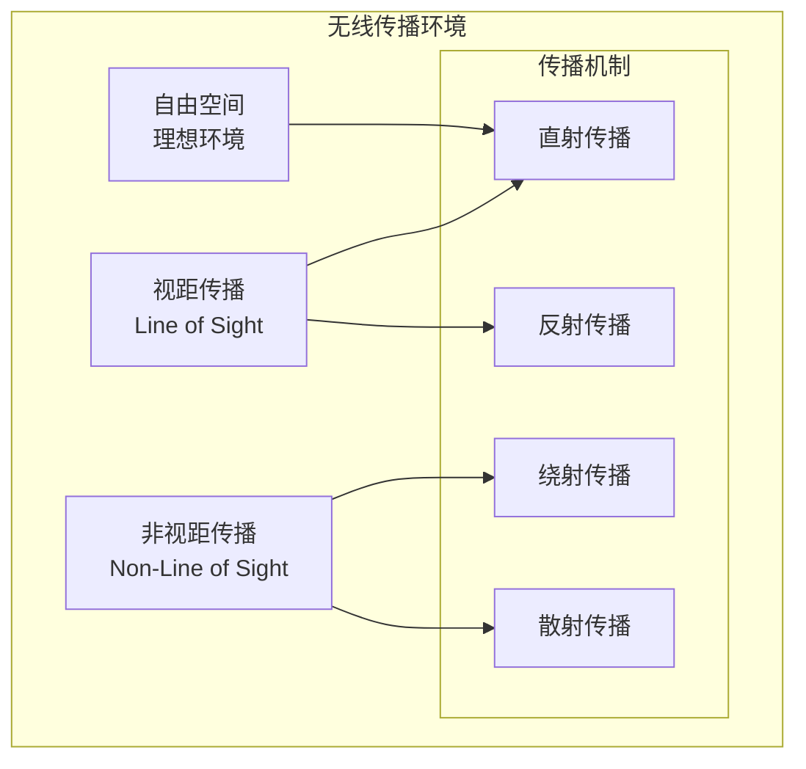

**环境特点对比**：

| 环境类型 | 传播特点 | 信号质量 | 应用场景 |
|---------|---------|---------|----------|
| 自由空间 | 理想传播模型 | 最佳 | 卫星通信 |
| 视距环境 | 直射+少量反射 | 良好 | 基站到基站 |
| 非视距环境 | 多径+遮挡 | 复杂 | 城市移动通信 |
| 室内环境 | 强多径效应 | 变化大 | WiFi网络 |

### 无线信号传播损耗

#### 自由空间传播模型

**Friis传输公式**：
$$P_r = P_t G_t G_r \left(\frac{\lambda}{4\pi d}\right)^2$$

**路径损耗**：
$$L_{fs} = \left(\frac{4\pi d}{\lambda}\right)^2 = \left(\frac{4\pi d f}{c}\right)^2$$

其中：
- d：传播距离（米）
- f：载波频率（Hz）
- c：光速（3×10⁸ m/s）
- λ：波长（米）

#### 实际传播模型

**对数距离路径损耗模型**：
$$PL(d) = PL(d_0) + 10n\log_{10}\left(\frac{d}{d_0}\right) + X_\sigma$$

**参数说明**：
- PL(d₀)：参考距离d₀处的路径损耗
- n：路径损耗指数
- X_σ：阴影衰落（对数正态分布）

**典型路径损耗指数**：

| 环境 | 路径损耗指数n | 标准差σ(dB) | 应用场景 |
|-----|-------------|------------|---------|
| 自由空间 | 2 | 0 | 理论分析 |
| 城市蜂窝 | 2.7-3.5 | 8-10 | 宏蜂窝基站 |
| 阴影城区 | 3-5 | 10-14 | 高楼密集区 |
| 建筑物内 | 4-6 | 6-12 | 室内覆盖 |
| 工厂环境 | 2-3 | 6-8 | 工业物联网 |

#### 传播损耗计算典型例题

**例题1：自由空间传播损耗计算**

某WiFi系统工作频率为2.4GHz，发射功率为20dBm，发射天线增益为3dBi，接收天线增益为3dBi，传播距离为100m。求接收信号功率。

**解答**：

步骤1：计算波长
$$\lambda = \frac{c}{f} = \frac{3 \times 10^8}{2.4 \times 10^9} = 0.125 \text{ m}$$

步骤2：计算自由空间路径损耗
$$L_{fs}(dB) = 20\log_{10}(d) + 20\log_{10}(f) - 147.55$$
$$= 20\log_{10}(100) + 20\log_{10}(2400) - 147.55$$
$$= 40 + 67.6 - 147.55 = -39.95 \text{ dB}$$

步骤3：计算接收功率
$$P_r(dBm) = P_t + G_t + G_r + L_{fs}$$
$$= 20 + 3 + 3 - 39.95 = -13.95 \text{ dBm}$$

**答案**：接收信号功率约为 $-14 \text{ dBm}$ 。

---

**例题2：对数距离路径损耗模型应用**

某城市蜂窝网络，参考距离d₀=100m处测得路径损耗为80dB，路径损耗指数n=3.5。求距离基站500m处的路径损耗。若阴影衰落标准差σ=8dB，求该位置90%覆盖概率所需的链路预算裕度。

**解答**：

步骤1：计算平均路径损耗
$$PL(500) = PL(100) + 10 \times 3.5 \times \log_{10}\left(\frac{500}{100}\right)$$
$$= 80 + 35 \times \log_{10}(5)$$
$$= 80 + 35 \times 0.699 = 80 + 24.5 = 104.5 \text{ dB}$$

步骤2：计算衰落裕度
对于对数正态分布，90%覆盖概率对应1.28倍标准差：
$$\text{衰落裕度} = 1.28 \times \sigma = 1.28 \times 8 = 10.24 \text{ dB}$$

步骤3：总链路预算
$$\text{总路径损耗} = 104.5 + 10.24 = 114.74 \text{ dB}$$

**答案**：平均路径损耗为104.5dB，考虑90%覆盖概率需增加10.24dB裕度，总计114.74dB。

---

**例题3：多普勒频移计算**

某移动终端以速度v=120km/h移动，载波频率fc=2GHz，信号传播方向与运动方向夹角θ=60°。求最大多普勒频移和相干时间。

**解答**：

步骤1：单位转换
$$v = 120 \text{ km/h} = \frac{120 \times 1000}{3600} = 33.33 \text{ m/s}$$

步骤2：计算实际多普勒频移
$$f_d = \frac{v f_c \cos\theta}{c} = \frac{33.33 \times 2 \times 10^9 \times \cos(60°)}{3 \times 10^8}$$
$$= \frac{33.33 \times 2 \times 10^9 \times 0.5}{3 \times 10^8} = 111.1 \text{ Hz}$$

步骤3：计算最大多普勒频移（θ=0°时）
$$f_{d,max} = \frac{v f_c}{c} = \frac{33.33 \times 2 \times 10^9}{3 \times 10^8} = 222.2 \text{ Hz}$$

步骤4：计算相干时间
$$T_c = \frac{0.423}{f_{d,max}} = \frac{0.423}{222.2} = 1.9 \times 10^{-3} \text{ s} = 1.9 \text{ ms}$$

**答案**：实际多普勒频移为111.1Hz，最大多普勒频移为222.2Hz，相干时间约为1.9ms。

---

## 信号衰减与传播损耗

### 大尺度衰落

#### 路径损耗

> **路径损耗**
> 
> 信号功率随传播距离增加而逐渐减弱的现象，主要由传播距离决定。

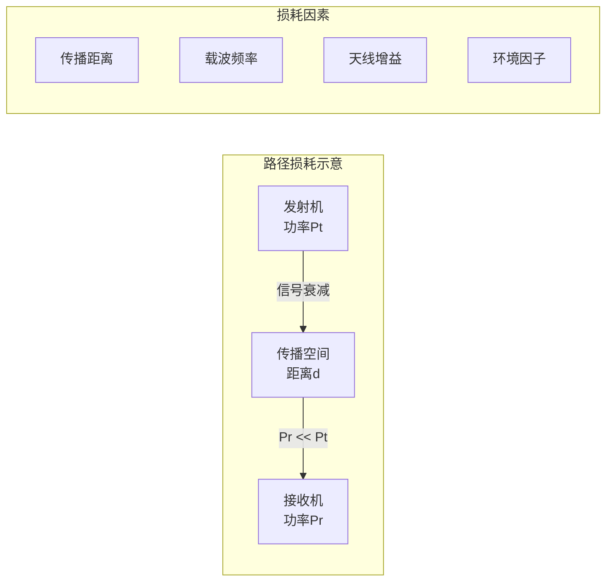

#### 阴影衰落

> **阴影衰落**
> 
> 由于地形起伏、建筑物遮挡等大尺度环境因素造成的信号功率随机变化。

**特征描述**：
- **统计模型**：对数正态分布
- **变化尺度**：几十到几百米
- **变化幅度**：4-12dB标准差
- **影响因素**：地形、建筑物密度、植被

**阴影衰落建模**：
$$P_r = \overline{P_r} \cdot 10^{X_\sigma/10}$$

其中：X_σ ~ N(0, σ²)，σ = 4-12dB

### 小尺度衰落

#### 多径衰落

> **多径衰落**
> 
> 信号通过多条路径到达接收机，各路径信号叠加造成的快速衰落现象。

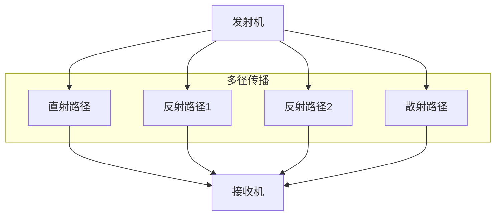

**多径效应后果**：
- **信号幅度衰落**：建设性/破坏性干扰
- **相位失真**：不同路径相位差
- **时间弥散**：符号间干扰（ISI）
- **频率选择性**：不同频率衰落不同

#### 瑞利衰落与莱斯衰落

**瑞利衰落**：
- 无直射路径环境
- 信号包络服从瑞利分布
- 深度衰落频繁发生

**莱斯衰落**：
- 存在主导直射路径
- 信号包络服从莱斯分布
- 衰落深度相对较小

**衰落统计特性**：

| 衰落类型 | 环境条件 | 概率密度函数 | 典型场景 |
|---------|---------|-------------|----------|
| 瑞利衰落 | 无LOS径 | $f(r) = \frac{r}{\sigma^2}e^{-r^2/2\sigma^2}$ | 城市移动 |
| 莱斯衰落 | 有LOS径 | $f(r) = \frac{r}{\sigma^2}e^{-(r^2+s^2)/2\sigma^2}I_0(\frac{rs}{\sigma^2})$ | 郊区/乡村 |

---

## 多径效应与时间弥散

### 多径信道特性

#### 信道冲激响应

> **多径信道模型**
> 
> 将多径信道建模为多个延时、衰减、相移的分量之和。

**数学表达**：
$$h(\tau, t) = \sum_{l=0}^{L-1} \alpha_l(t) e^{j\phi_l(t)} \delta(\tau - \tau_l)$$

其中：
- αₗ(t)：第l条路径的复衰减系数
- φₗ(t)：第l条路径的相位偏移
- τₗ：第l条路径的传播延时
- L：多径分量的总数
- δ(·)：狄拉克函数

#### 多径参数

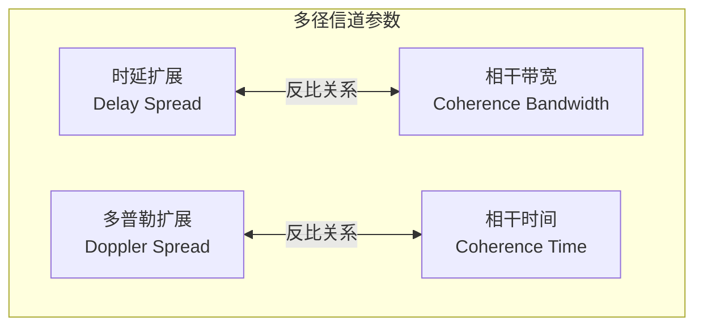

**关键参数定义**：

1. **平均时延**：
   $$\overline{\tau} = \frac{\sum_l \alpha_l^2 \tau_l}{\sum_l \alpha_l^2}$$

2. **时延扩展**：
   $$\sigma_\tau = \sqrt{\frac{\sum_l \alpha_l^2 \tau_l^2}{\sum_l \alpha_l^2} - \overline{\tau}^2}$$

3. **相干带宽**：
   $$B_c \approx \frac{1}{5\sigma_\tau}$$

#### 多径参数计算例题

**例题：时延扩展与相干带宽计算**

某多径信道接收到3条主要路径信号，参数如下：

| 路径 | 延时τ(μs) | 功率P(mW) |
|-----|----------|----------|
| 1 | 0 | 100 |
| 2 | 1 | 50 |
| 3 | 3 | 20 |

求：(1) 平均时延；(2) 时延扩展；(3) 相干带宽；(4) 判断1MHz带宽信号的衰落类型。

**解答**：

步骤1：计算平均时延
$$\overline{\tau} = \frac{\sum P_i \tau_i}{\sum P_i} = \frac{100 \times 0 + 50 \times 1 + 20 \times 3}{100 + 50 + 20}$$
$$= \frac{0 + 50 + 60}{170} = 0.647 \text{ μs}$$

步骤2：计算时延扩展
$$\overline{\tau^2} = \frac{\sum P_i \tau_i^2}{\sum P_i} = \frac{100 \times 0 + 50 \times 1 + 20 \times 9}{170}$$
$$= \frac{0 + 50 + 180}{170} = 1.353 \text{ μs}^2$$

$$\sigma_\tau = \sqrt{\overline{\tau^2} - \overline{\tau}^2} = \sqrt{1.353 - 0.647^2}$$
$$= \sqrt{1.353 - 0.419} = \sqrt{0.934} = 0.967 \text{ μs}$$

步骤3：计算相干带宽
$$B_c = \frac{1}{5\sigma_\tau} = \frac{1}{5 \times 0.967 \times 10^{-6}} = 207 \text{ kHz}$$

步骤4：判断衰落类型
信号带宽 $B_s = 1 \text{ MHz} > B_c = 207 \text{ kHz}$ 

**答案**：平均时延0.647μs，时延扩展0.967μs，相干带宽207kHz。由于 $B_s > B_c$ ，信号经历频率选择性衰落。

---

**例题：相干时间与符号速率关系**

某移动通信系统载波频率900MHz，移动速度为60km/h。系统采用QPSK调制，符号速率为250ksps。判断信道属于快衰落还是慢衰落。

**解答**：

步骤1：计算最大多普勒频移
$$v = 60 \text{ km/h} = 16.67 \text{ m/s}$$
$$f_{d,max} = \frac{vf_c}{c} = \frac{16.67 \times 900 \times 10^6}{3 \times 10^8} = 50 \text{ Hz}$$

步骤2：计算相干时间
$$T_c = \frac{0.423}{f_{d,max}} = \frac{0.423}{50} = 8.46 \text{ ms}$$

步骤3：计算符号周期
$$T_s = \frac{1}{250 \times 10^3} = 4 \text{ μs}$$

步骤4：判断衰落类型
$$\frac{T_c}{T_s} = \frac{8.46 \times 10^{-3}}{4 \times 10^{-6}} = 2115 \gg 1$$

**答案**：$T_c \gg T_s$ ，信道在多个符号周期内保持稳定，属于慢衰落。

### 频率选择性衰落

#### 平坦衰落vs选择性衰落

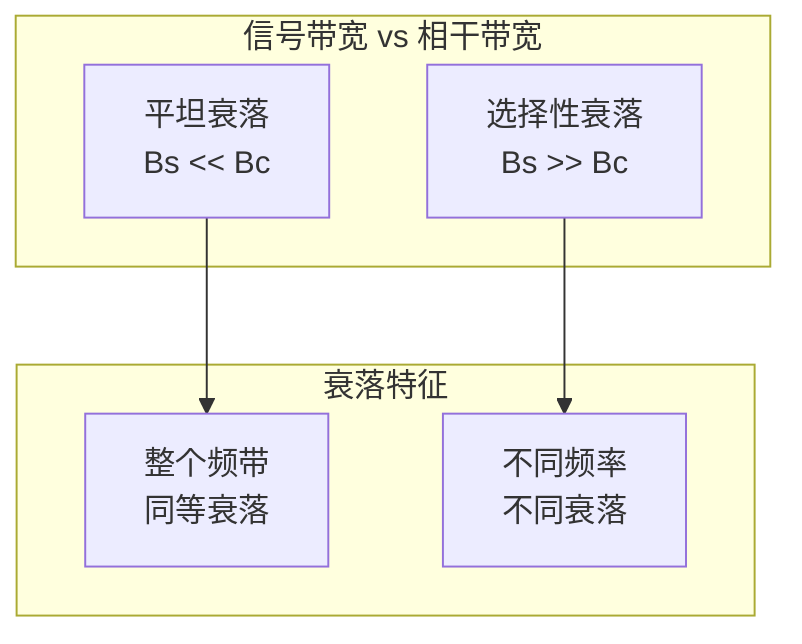

**影响分析**：

| 衰落类型 | 条件 | 特征 | 影响 | 对策 |
|---------|-----|------|------|------|
| 平坦衰落 | Bs ≪ Bc | 均匀衰落 | 信号幅度变化 | 功率控制 |
| 选择性衰落 | Bs ≫ Bc | 频率选择 | 码间干扰 | 均衡技术 |

### 时变特性

#### 多普勒效应

> **多普勒频移**
> 
> 发射机或接收机相对运动引起的载波频率变化。

**多普勒频移**：
$$f_d = \frac{v \cos\theta}{\lambda} = \frac{v f_c \cos\theta}{c}$$

其中：
- v：相对速度
- θ：运动方向与信号传播方向夹角
- fc：载波频率

**多普勒谱**：
- **经典多普勒谱**：U型功率谱密度
- **最大多普勒频移**：fd,max = v/λ

---

## 隐藏终端与暴露终端

### 隐藏终端问题

> **隐藏终端问题**
> 
> 某些节点相互不能直接听到对方的传输，但它们的传输会在接收节点产生冲突的问题。

#### 问题场景

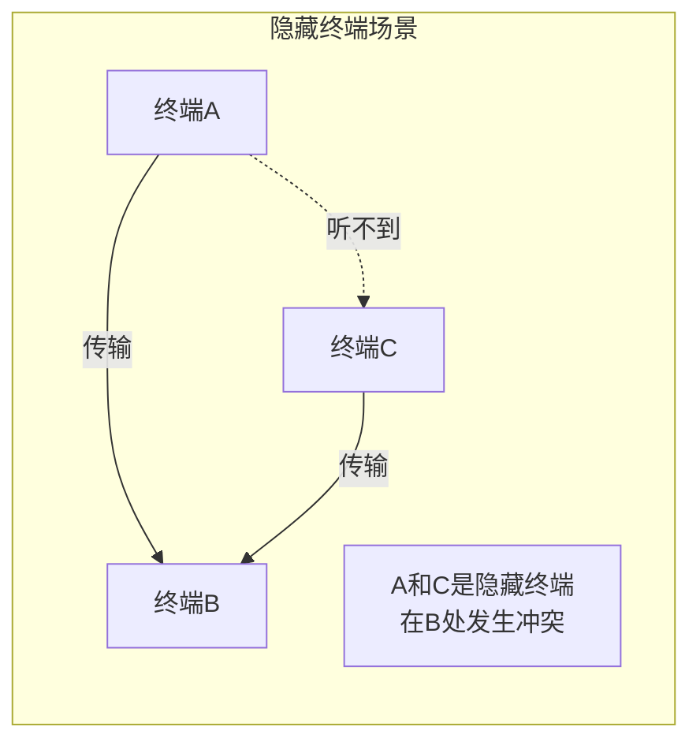

**问题分析**：
- **冲突检测困难**：A和C无法检测到对方
- **载波侦听失效**：CSMA机制失效
- **吞吐量下降**：频繁的冲突和重传
- **不公平接入**：某些节点被阻塞

#### 解决方案

**RTS/CTS握手机制**：

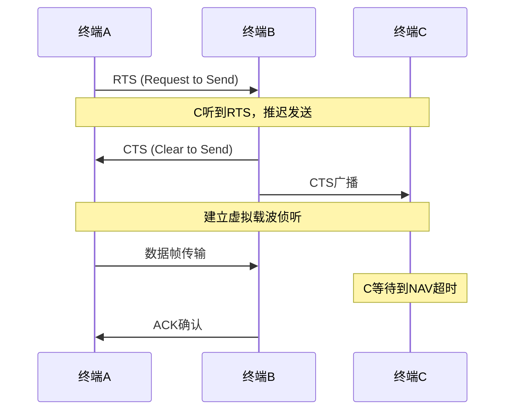

**虚拟载波侦听**：
- **NAV**：网络分配向量
- **持续时间**：从CTS中获取
- **保护期**：防止其他节点干扰

### 暴露终端问题

> **暴露终端问题**
> 
> 某个节点听到了其他节点的传输，误认为信道忙而不敢传输，但实际上其传输不会产生冲突。

#### 问题场景

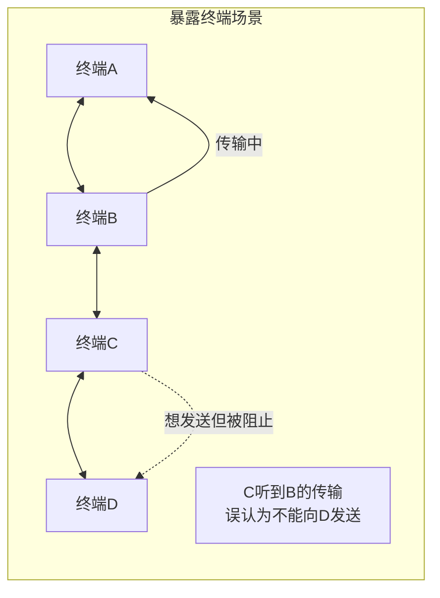

**问题影响**：
- **信道利用率降低**：不必要的传输推迟
- **吞吐量损失**：空间复用机会浪费
- **延迟增加**：等待不必要的时间

#### 解决策略

**功率控制**：
- 降低发射功率
- 减少干扰范围
- 提高空间复用度

**方向性天线**：
- 定向传输
- 减少不必要干扰
- 提高频谱效率

**智能载波侦听**：
- 考虑接收机位置
- 预测干扰影响
- 动态调整策略

### MAC协议性能对比分析

#### 隐藏终端对吞吐量的影响

**吞吐量模型**：

在存在隐藏终端的CSMA网络中，吞吐量会显著下降。设：
- N：网络中节点数
- p：每个节点在时隙内发送概率
- $p_h$ ：隐藏终端概率

**成功传输概率**：
$$P_{success} = Np(1-p)^{N-1}(1-p_h)$$

**吞吐量**：
$$S = P_{success} \times \frac{T_{data}}{T_{slot}}$$

其中：
- $T_{data}$ ：数据传输时间
- $T_{slot}$ ：时隙长度

#### RTS/CTS机制性能分析

**传输开销对比**：

| 机制 | 控制开销 | 数据传输 | 总时间 | 适用场景 |
|-----|---------|---------|--------|---------|
| 纯CSMA | 0 | $T_{data}$ | $T_{data}$ | 小帧、低冲突 |
| RTS/CTS | $T_{RTS} + T_{CTS}$ | $T_{data}$ | $T_{RTS} + T_{CTS} + T_{data} + T_{ACK}$ | 大帧、高冲突 |

**效率计算**：
$$\eta_{RTS/CTS} = \frac{T_{data}}{T_{RTS} + T_{CTS} + T_{SIFS} \times 3 + T_{data} + T_{ACK}}$$

**临界帧长分析**：

设RTS帧长为20字节，CTS帧长为14字节，ACK帧长为14字节，速率为1Mbps。

当数据帧长度大于临界值时，RTS/CTS机制更有效：
$$L_{critical} = \frac{T_{RTS} + T_{CTS}}{P_{collision}}$$

典型值：当冲突概率 $P_{collision} > 0.1$ 且帧长 $L > 500$ 字节时，RTS/CTS机制优于纯CSMA。

#### 性能计算例题

**例题：MAC协议效率对比**

某无线网络有10个节点，数据帧长1500字节，传输速率11Mbps。RTS=20字节，CTS=14字节，ACK=14字节，SIFS=10μs。假设隐藏终端导致冲突概率为0.15。

比较纯CSMA和RTS/CTS机制的有效吞吐量。

**解答**：

步骤1：计算各帧传输时间
$$T_{data} = \frac{1500 \times 8}{11 \times 10^6} = 1091 \text{ μs}$$
$$T_{RTS} = \frac{20 \times 8}{11 \times 10^6} = 14.5 \text{ μs}$$
$$T_{CTS} = T_{ACK} = \frac{14 \times 8}{11 \times 10^6} = 10.2 \text{ μs}$$

步骤2：纯CSMA有效吞吐量
$$S_{CSMA} = (1 - P_{collision}) \times \frac{T_{data}}{T_{data} + T_{overhead}}$$
$$= 0.85 \times \frac{1091}{1091 + 50} = 0.813$$

步骤3：RTS/CTS有效吞吐量
$$T_{total} = T_{RTS} + T_{CTS} + T_{data} + T_{ACK} + 4 \times T_{SIFS}$$
$$= 14.5 + 10.2 + 1091 + 10.2 + 40 = 1165.9 \text{ μs}$$

RTS/CTS机制下冲突概率降低到约0.02：
$$S_{RTS/CTS} = (1 - 0.02) \times \frac{T_{data}}{T_{total}}$$
$$= 0.98 \times \frac{1091}{1165.9} = 0.917$$

**答案**：RTS/CTS机制吞吐量为0.917，纯CSMA为0.813，RTS/CTS机制提升约12.8%。

#### 暴露终端对空间复用的影响

**空间复用度分析**：

理想情况下，无暴露终端问题时的空间复用度：
$$\rho_{ideal} = \frac{A_{total}}{A_{interference}}$$

存在暴露终端时的实际空间复用度：
$$\rho_{actual} = \rho_{ideal} \times (1 - P_{exposed})$$

其中 $P_{exposed}$ 是暴露终端概率。

**性能影响量化**：

| 场景 | 暴露终端概率 | 空间复用损失 | 吞吐量影响 |
|-----|------------|------------|-----------|
| 稀疏网络 | 0.1 | 10% | -9% |
| 中等密度 | 0.3 | 30% | -25% |
| 密集网络 | 0.5 | 50% | -40% |

---

## 无线信道的时变特性

### 移动性导致的信道变化

#### 快衰落与慢衰落

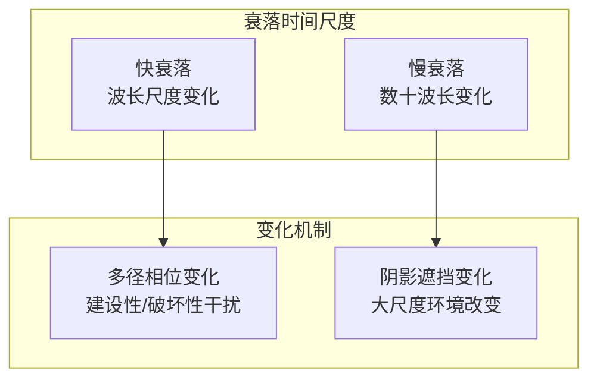

**时间尺度对比**：

| 衰落类型 | 变化速度 | 变化尺度 | 主要原因 | 典型深度 |
|---------|---------|---------|---------|----------|
| 快衰落 | 毫秒级 | λ/2 | 多径干扰 | 20-30dB |
| 慢衰落 | 秒级 | 10-100m | 阴影遮挡 | 6-12dB |

#### 相干时间

> **相干时间**
> 
> 信道特性保持相对稳定的时间长度。

**相干时间估算**：
$$T_c \approx \frac{0.423}{f_{d,max}}$$

**与符号周期关系**：
- **快衰落**：Tc ≪ Ts（符号周期）
- **慢衰落**：Tc ≫ Ts

### 环境变化影响

#### 干扰环境

**同频干扰**：
- 相同频率的其他系统干扰
- 频率复用导致的干扰
- 载干比（C/I）降低

**邻频干扰**：
- 相邻频道泄露干扰
- 发射机非线性产生
- 接收机选择性不足

**宽带噪声**：
- 热噪声（kTB）
- 人工噪声
- 设备内部噪声

#### 动态频谱环境

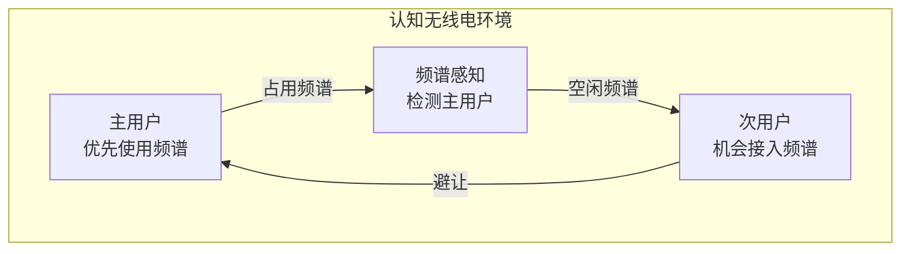

---

## 信道质量测量与评估

### 信道质量指标

#### 接收信号质量

**接收信号强度指示（RSSI）**：
- 接收信号功率测量
- 单位：dBm
- 包含信号+噪声+干扰

**信噪比（SNR）**：
$$SNR = \frac{P_s}{P_n}$$

**载干比（C/I）**：
$$C/I = \frac{P_c}{P_i}$$

#### 误码性能指标

**误码率（BER）**：
$$BER = \frac{\text{错误比特数}}{\text{总比特数}}$$

**误包率（PER）**：
$$PER = \frac{\text{错误包数}}{\text{总包数}}$$

**信号质量对比**：

| 指标 | 测量内容 | 应用 | 优缺点 |
|-----|---------|------|--------|
| RSSI | 总接收功率 | 简单功率测量 | 不区分信号和干扰 |
| SNR | 信号噪声比 | 理论分析 | 忽略干扰影响 |
| C/I | 信号干扰比 | 实际系统 | 更准确反映质量 |
| BER | 实际误码 | 性能评估 | 需要数据传输 |

#### 信道质量计算例题

**例题1：链路预算计算**

某WiFi系统参数如下：
- 发射功率：20dBm
- 发射天线增益：5dBi
- 接收天线增益：3dBi
- 路径损耗：85dB
- 接收机灵敏度：-90dBm
- 衰落裕度：10dB
- 实现裕度：5dB

求：(1) 接收信号强度；(2) 链路是否满足要求；(3) 最大允许路径损耗。

**解答**：

步骤1：计算接收信号强度
$$P_r = P_t + G_t + G_r - L_{path}$$
$$= 20 + 5 + 3 - 85 = -57 \text{ dBm}$$

步骤2：计算所需最小接收功率
$$P_{r,min} = P_{sensitivity} + M_{fade} + M_{impl}$$
$$= -90 + 10 + 5 = -75 \text{ dBm}$$

步骤3：计算链路裕度
$$M_{link} = P_r - P_{r,min} = -57 - (-75) = 18 \text{ dB}$$

步骤4：计算最大允许路径损耗
$$L_{max} = P_t + G_t + G_r - P_{r,min}$$
$$= 20 + 5 + 3 - (-75) = 103 \text{ dB}$$

**答案**：接收信号强度为-57dBm，链路裕度18dB，满足要求。最大允许路径损耗103dB。

---

**例题2：BER与SNR关系**

某QPSK调制系统，接收信号功率-70dBm，噪声功率谱密度N₀=-174dBm/Hz，信号带宽1MHz。求：(1) SNR；(2) 理论BER（已知QPSK的 $BER = \frac{1}{2}\text{erfc}(\sqrt{E_b/N_0})$ ，当 $E_b/N_0 = 10$ dB时，$BER \approx 10^{-5}$ ）。

**解答**：

步骤1：计算噪声功率
$$P_n = N_0 + 10\log_{10}(B)$$
$$= -174 + 10\log_{10}(10^6) = -174 + 60 = -114 \text{ dBm}$$

步骤2：计算SNR
$$SNR = P_s - P_n = -70 - (-114) = 44 \text{ dB}$$

步骤3：计算Eb/N0
QPSK每符号2比特，符号速率 $R_s = B = 1$ MHz，比特速率 $R_b = 2$ Mbps
$$E_b/N_0 = SNR - 10\log_{10}\left(\frac{R_b}{B}\right)$$
$$= 44 - 10\log_{10}(2) = 44 - 3 = 41 \text{ dB}$$

步骤4：估算BER
由于 $E_b/N_0 = 41$ dB远大于10dB，$BER \ll 10^{-5}$ ，实际上几乎无误码。

**答案**：SNR为44dB，Eb/N0为41dB，BER极低（远小于 $10^{-5}$ ），信道质量优秀。

---

**例题3：信道状态信息（CSI）评估**

某OFDM系统有64个子载波，测得各子载波SNR分布如下：
- 20个子载波：SNR > 25dB（可用64-QAM）
- 30个子载波：15dB < SNR < 25dB（可用16-QAM）
- 14个子载波：5dB < SNR < 15dB（可用QPSK）

系统采用自适应调制，求平均频谱效率（64-QAM: 6 bit/s/Hz，16-QAM: 4 bit/s/Hz，QPSK: 2 bit/s/Hz）。

**解答**：

平均频谱效率：
$$\eta_{avg} = \frac{1}{64}(20 \times 6 + 30 \times 4 + 14 \times 2)$$
$$= \frac{1}{64}(120 + 120 + 28) = \frac{268}{64} = 4.19 \text{ bit/s/Hz}$$

相比固定QPSK（2 bit/s/Hz），频谱效率提升：
$$\text{提升比例} = \frac{4.19 - 2}{2} = 109.5\%$$

**答案**：平均频谱效率4.19 bit/s/Hz，相比固定QPSK提升约110%。

### 自适应技术

#### 链路自适应

> **自适应调制编码（AMC）**
> 
> 根据信道质量动态调整调制方式和编码速率，优化传输性能。

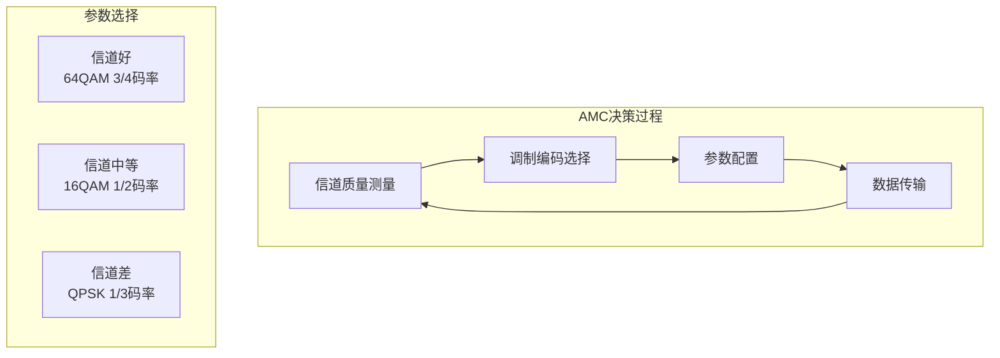

#### 功率控制

**开环功率控制**：
- 基于路径损耗估算
- 反应速度慢
- 实现简单

**闭环功率控制**：
- 基于接收端反馈
- 反应速度快
- 复杂度高

**功率控制算法**：
$$P_{tx}(n+1) = P_{tx}(n) + \Delta P$$

其中ΔP根据信道质量反馈确定。

#### 功率控制计算例题

**例题：闭环功率控制**

某LTE系统目标接收功率为-70dBm，当前测量接收功率为-75dBm。系统采用闭环功率控制，步长为1dB。发射机当前功率为20dBm，路径损耗为95dB，天线增益（发射+接收）为8dB。

求：(1) 需要调整的功率；(2) 新的发射功率；(3) 验证新接收功率。

**解答**：

步骤1：计算功率差
$$\Delta P_{needed} = P_{target} - P_{current} = -70 - (-75) = 5 \text{ dB}$$

步骤2：计算新发射功率
$$P_{tx,new} = P_{tx,old} + \Delta P_{needed} = 20 + 5 = 25 \text{ dBm}$$

步骤3：验证新接收功率
$$P_{rx,new} = P_{tx,new} + G_{total} - L_{path}$$
$$= 25 + 8 - 95 = -62 \text{ dBm}$$

注意：由于采用1dB步长，实际需要5个调整周期才能达到目标。

**答案**：需要提升5dB发射功率，新发射功率为25dBm，达到目标需5个调整周期。
