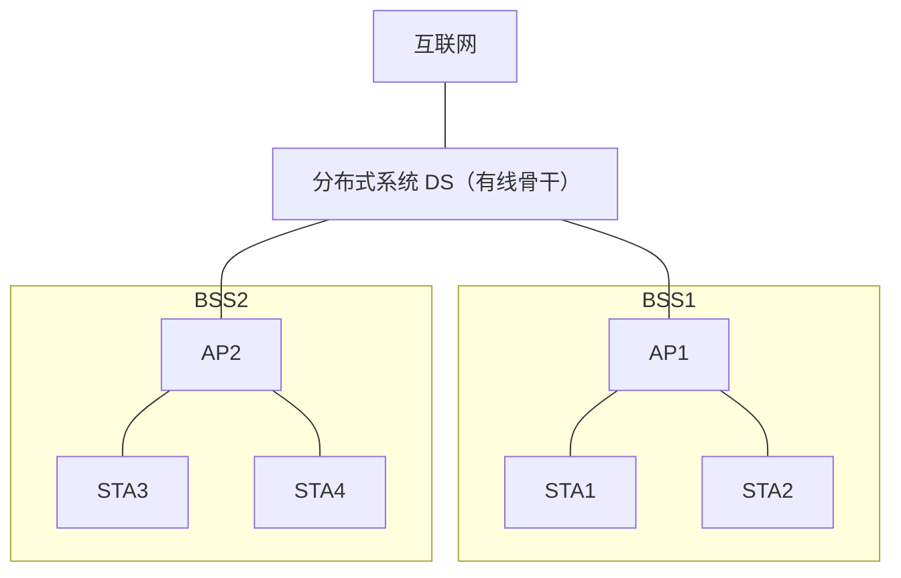
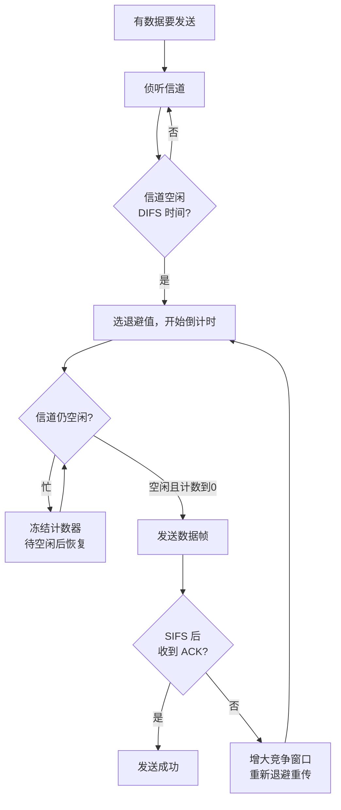
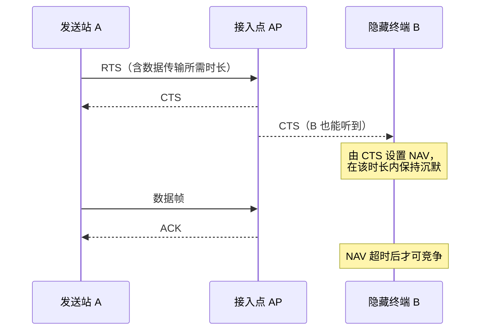
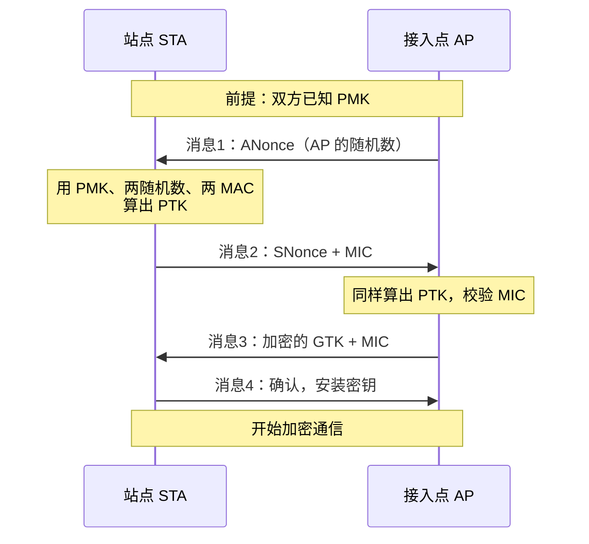
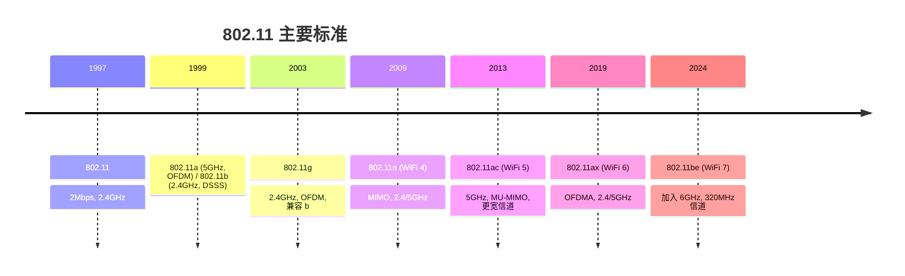

# 7.3 无线网络：WiFi技术

> 本节是《计算机网络：自顶向下方法》7.3 节的学习笔记。IEEE 802.11（WiFi）是最广泛部署的无线局域网技术。无线信道无法可靠检测冲突，所以它不用以太网的 CSMA/CD，而用 **CSMA/CA**——发送前侦听、发送后用 ACK 确认、用退避和 RTS/CTS 尽量避开冲突。本节按体系结构、CSMA/CA、帧格式、安全、标准演进展开。

## 目录

1. [IEEE 802.11体系结构](#ieee-80211体系结构)
2. [CSMA/CA协议机制](#csmaca协议机制)
3. [802.11帧格式](#80211帧格式)
4. [WiFi安全机制](#wifi安全机制)
5. [802.11标准演进](#80211标准演进)

---

## IEEE 802.11体系结构

### 基本服务集BSS

**基本服务集（BSS）** 是 802.11 网络的基本构件，分两种：

- **基础设施 BSS**：含一个接入点（AP），所有站点（STA）经 AP 中转通信。家庭、办公室 WiFi 都属此类。
- **独立 BSS（IBSS / Ad-hoc）**：无 AP，站点之间直接通信，用于临时组网。

```
基础设施 BSS                         独立 BSS (Ad-hoc)

      ┌────┐                            STA-A
 STA1 │ AP │ STA2                       /    \
      └─┬──┘                        STA-B────STA-C
        │ 经 AP 中转                  站点直接通信
   分布式系统(DS)
```

AP 通过**分布式系统（DS）**（通常是有线以太网）接入更大的网络。

### 扩展服务集ESS

多个 BSS 经 DS 连接，构成**扩展服务集（ESS）**，对上层表现为一个统一的网络，支持站点在 BSS 间**漫游**。



- **SSID**：网络名称，同一 ESS 内各 AP 共用一个 SSID。
- **BSSID**：单个 BSS 的标识，即该 AP 的 MAC 地址。
- **漫游**：站点从一个 BSS 移动到另一 BSS，重新关联到新 AP，IP 地址通常不变。

### 扫描与关联

站点接入 AP 前要先发现 AP，再完成关联：

1. **扫描**：被动扫描监听 AP 周期广播的**信标帧（Beacon）**；主动扫描发送**探测请求**，AP 回**探测响应**。
2. **认证**：站点与 AP 完成身份认证。
3. **关联**：站点发送关联请求，AP 回关联响应并分配关联 ID，此后双方可收发数据。

注：关联是 802.11 特有的概念——一个站点在同一时刻只能关联到一个 AP。

---

## CSMA/CA协议机制

### 为什么是CA而不是CD

以太网用 CSMA/CD：边发边检测，撞了就停。无线网络做不到这一点，原因有二：

- **收发功率差异巨大**：网卡自己发出的信号会把同时到达的微弱接收信号完全淹没，无法边发边听出冲突。
- **隐藏终端**：两个站点都能被 AP 听到，但彼此听不到（被障碍或距离隔开），各自侦听都觉得信道空闲却会在 AP 处相撞——发送方根本检测不到这种冲突。

所以 802.11 改用**冲突避免（Collision Avoidance）**：发送前侦听 + 退避降低相撞概率，发送后用 **ACK 确认**来判断是否成功（收不到 ACK 即认为失败，重传）。

> 易混：**CSMA/CD 检测冲突（有线/以太网），CSMA/CA 避免冲突（无线/WiFi）**。CD 靠"撞了就停"省时间；CA 撞了也发现不了，只能事先尽量避开，并靠 ACK 事后确认。

### 帧间间隔与基本流程

802.11 用不同长度的**帧间间隔（IFS）**给不同帧排优先级，间隔越短优先级越高：

- **SIFS**（短）：ACK、CTS 等响应帧使用，确保正在进行的会话能优先抢到信道。
- **DIFS**（长）：普通数据帧在竞争前需等待的间隔，$DIFS = SIFS + 2 \times 时隙时间$。

发送一帧的基本流程：



要点：与以太网"信道空闲就立刻发"不同，CSMA/CA 即使侦听到空闲也要先等 DIFS、再做随机退避才发，以此降低多个等待站点同时抢发的概率。

### 二进制指数退避

站点从竞争窗口 $[0, CW]$ 中均匀随机选一个退避值（以时隙为单位）：

- 每个空闲时隙计数器减 1；信道变忙则**冻结**计数器，待信道重新空闲 DIFS 后**接着倒计时**（不重选）。
- 计数到 0 即发送。
- 每发生一次失败（未收到 ACK），CW 翻倍增大：$CW \leftarrow 2 \times CW + 1$，直到 $CW_{max}$。
- 成功后重置为 $CW_{min}$。

以 802.11b（$CW_{min}=31,\ CW_{max}=1023$）为例，CW 的变化序列：

```
初始/成功后：CW = 31
连续失败：   31 → 63 → 127 → 255 → 511 → 1023(=CWmax，封顶)
```

注：802.11b（DSSS）的 $CW_{min}=31$；802.11a/g/n（OFDM）的 $CW_{min}=15$。两者 $CW_{max}$ 都是 1023。

**例题（退避时间）**：802.11b 网络时隙 20μs，站点连续 3 次失败，求当前竞争窗口与平均退避时间。

第 3 次失败后 $CW = 31 \to 63 \to 127 \to 255$。退避值从 $[0,255]$ 均匀选取，平均为 $255/2 = 127.5$ 个时隙：

$$T_{backoff,avg} = 127.5 \times 20\ \mu s = 2550\ \mu s = 2.55\ ms$$

### RTS/CTS与隐藏终端

为缓解隐藏终端问题，802.11 提供可选的 **RTS/CTS** 握手：发送方先发短的 **RTS（请求发送）**，AP 回 **CTS（允许发送）**。由于 AP 的覆盖范围内所有站点（包括隐藏终端）都能听到 CTS，它们据此设置 **NAV（网络分配向量）**，在指定时长内不发送——相当于"虚拟载波侦听"，为后续数据帧清出信道。



权衡：RTS/CTS 用两个短帧的开销换取对长数据帧冲突的规避。短帧即使相撞损失也小，所以一般只对超过阈值的长帧启用 RTS/CTS。

**例题（开销对比）**：11Mbps 网络，数据帧 1500 字节，RTS=20 字节、CTS=ACK=14 字节，SIFS=10μs、DIFS=50μs（忽略退避）。

不用 RTS/CTS：$T = DIFS + T_{data} + SIFS + T_{ACK}$，其中 $T_{data} = \frac{1500\times8}{11\times10^6} \approx 1091\ \mu s$，$T_{ACK} \approx 10.2\ \mu s$，得 $T \approx 1161\ \mu s$。

用 RTS/CTS：在前面多出 $T_{RTS} + SIFS + T_{CTS} + SIFS \approx 14.5 + 10 + 10.2 + 10 = 44.7\ \mu s$，得 $T \approx 1206\ \mu s$。

对单帧而言 RTS/CTS 增加约 3.9% 开销；它的价值在于**冲突时**——一旦相撞，损失的只是短 RTS 而非整个长数据帧。

---

## 802.11帧格式

### MAC帧结构

```
┌────────┬──────────┬───────┬───────┬───────┬──────┬───────┬──────────┬──────┐
│ 帧控制  │ 持续时间 │ 地址1 │ 地址2 │ 地址3 │ 序列 │ 地址4 │  帧体     │ FCS  │
│  2 字节 │  2 字节  │ 6字节 │ 6字节 │ 6字节 │ 控制 │ 6字节 │ 0~2312   │ 4字节│
│        │  /ID     │       │       │       │ 2字节│(可选) │  字节    │      │
└────────┴──────────┴───────┴───────┴───────┴──────┴───────┴──────────┴──────┘
```

与以太网帧最大的不同是**有 4 个地址字段**（以太网只有源/目的两个）。

- **帧控制**：含协议版本、类型（管理/控制/数据）、子类型，以及 **ToDS / FromDS** 两个关键标志位（指示帧是否经过分布式系统），还有 More Frag、Retry、Pwr Mgmt、加密等标志。
- **持续时间/ID**：用于设置 NAV 的时长（如 RTS/CTS、数据帧）。
- **地址 1~4**：含义随 ToDS/FromDS 而变，见下表。
- **序列控制**：分片号（4 位）+ 序列号（12 位），用于去重和重组。
- **FCS**：CRC-32 校验。

### 为什么需要4个地址

普通收发只需源、目的两个地址；802.11 多出的地址用来标识帧经过的 **AP（BSSID）**，以及在 AP 间无线中继（WDS）时区分"无线链路上的收发方"与"最终的源/目的"。地址 4 仅在 AP 之间通过无线链路互连（ToDS=FromDS=1）时才用：

| ToDS | FromDS | 场景 | 地址1（接收方） | 地址2（发送方） | 地址3 | 地址4 |
|:---:|:---:|------|------|------|------|------|
| 0 | 0 | Ad-hoc 站点间直传 | DA | SA | BSSID | — |
| 0 | 1 | AP → 站点（下行） | DA | BSSID | SA | — |
| 1 | 0 | 站点 → AP（上行） | BSSID | SA | DA | — |
| 1 | 1 | AP ↔ AP 无线中继 | RA | TA | DA | SA |

- DA/SA：最终目的/源地址；RA/TA：本段链路的接收/发送地址；BSSID：所在 BSS 的 AP 地址。

### 主要帧类型

| 类别 | 典型帧 | 作用 |
|------|--------|------|
| 管理帧 | 信标、探测请求/响应、关联请求/响应、认证 | 发现 AP、关联、认证 |
| 控制帧 | RTS、CTS、ACK | 协调信道访问、确认收帧 |
| 数据帧 | 数据 | 承载上层数据 |

---

## WiFi安全机制

802.11 的安全协议经历了 WEP → WPA → WPA2 → WPA3 的演进，核心目标是认证（确认接入者身份）和加密（保护数据机密性与完整性）。

| 特性 | WEP | WPA(TKIP) | WPA2(CCMP) | WPA3 |
|------|-----|-----------|-----------|------|
| 加密算法 | RC4 | RC4 | AES | AES |
| 完整性校验 | CRC-32 | Michael MIC | CBC-MAC | — |
| 密钥管理 | 静态 | 每包动态 | 每包动态 | 每包动态 |
| 个人模式认证 | 共享密钥 | 4 次握手 | 4 次握手 | SAE 握手 |
| 抗离线字典攻击 | — | 否 | 否 | 是 |
| 安全性 | 已破解 | 偏弱 | 强 | 最强 |

### WEP及其缺陷

**有线等效保密（WEP）** 是最早的方案，用 RC4 流密码加密：把 24 位**初始向量（IV）**与密钥拼接后输入 RC4 生成密钥流，再与明文异或。

主要缺陷：

- **IV 太短**：仅 24 位，约 $2^{24}$（1680 万）个值很快用尽，IV 重用导致密钥流重用，可被攻击者还原明文。
- **RC4 弱密钥** + **CRC-32 完整性弱**：可被统计攻击（FMS、PTW）在收集足量数据包后恢复密钥，伪造报文也很容易。

WEP 已被彻底攻破，不应再使用。

### WPA2与四次握手

**WPA2（IEEE 802.11i）** 用 **AES-CCMP** 加密，安全性大幅提升，长期是主流。其密钥协商靠**四次握手**：在双方已知**成对主密钥（PMK）**的前提下，协商出每个会话独立的**成对临时密钥（PTK）**，并把用于组播的 **GTK** 分发给站点。



- 个人模式（WPA2-PSK）：PMK 由口令经 PBKDF2 派生，所有用户共享同一口令。其弱点是攻击者抓到握手包后可**离线**穷举口令——口令越短越弱越容易破。
- 企业模式：用 802.1X + RADIUS 服务器做逐用户认证，PMK 由认证过程动态产生。

### WPA3增强

WPA3 针对 WPA2-PSK 的离线字典攻击弱点，个人模式改用 **SAE（同时认证等价，Dragonfly 握手）**：

- **抗离线字典攻击**：认证基于 Diffie-Hellman 交互，攻击者每猜一个口令都必须与 AP 实时交互，无法离线穷举抓到的握手包。
- **前向保密**：即使口令日后泄露，先前已捕获的加密流量仍无法解密。

此外 WPA3 还提供 **Enhanced Open（OWE）**，让无口令的开放网络也对每个连接加密，防被动窃听。

---

## 802.11标准演进



各代速率随技术（更高阶调制、更宽信道、空间复用 MIMO）逐代提升：

| 标准 | 别名 | 频段 | 最高速率（数量级） | 关键技术 |
|------|------|------|------|------|
| 802.11b | — | 2.4GHz | 11Mbps | DSSS/CCK |
| 802.11a/g | — | 5/2.4GHz | 54Mbps | OFDM |
| 802.11n | WiFi 4 | 2.4/5GHz | 数百 Mbps | MIMO、信道绑定、帧聚合 |
| 802.11ac | WiFi 5 | 5GHz | 约 Gbps | 256-QAM、MU-MIMO、80/160MHz |
| 802.11ax | WiFi 6 | 2.4/5GHz | 数 Gbps | 1024-QAM、OFDMA、BSS 着色、TWT |
| 802.11be | WiFi 7 | 2.4/5/6GHz | 约 10Gbps | 320MHz、多链路、4096-QAM |

注：表中速率为理论峰值的数量级，实际吞吐受信道、距离、干扰影响，通常远低于此。

### 频段与信道

- **2.4GHz**：穿透性好、覆盖远，但带宽小、设备多、干扰严重。常用非重叠信道为 **1、6、11**。
- **5GHz**：可用信道多、带宽大（可用 80/160MHz）、干扰少，但覆盖范围较小、穿墙能力弱。
- **6GHz**（WiFi 6E/7 引入）：频谱更宽、几乎无历史设备干扰。

### WiFi 6关键技术

- **OFDMA**：把一个信道的子载波划成多个**资源单元（RU）**分给不同用户，让多个用户在同一时频资源内并发收发。相比传统"一次只服务一个用户"的 OFDM，在大量小数据包（如 IoT）场景下显著降低排队时延、提升信道利用率。
- **MU-MIMO**：借多天线在空间维度上同时服务多个用户。
- **TWT（目标唤醒时间）**：AP 与设备约定唤醒时刻，设备其余时间深度休眠，大幅降低 IoT 设备功耗。
- **BSS 着色**：给帧标记 BSS 颜色，使设备能区分本 BSS 与邻近同频 BSS 的信号，减少不必要的退避，提升密集部署下的并发。
