# 7.3 无线网络：WiFi技术

## 本章目录

1. [IEEE 802.11体系结构](#ieee-80211体系结构)
2. [CSMA/CA协议机制](#csmaca协议机制)
3. [802.11帧格式详解](#80211帧格式详解)
4. [WiFi安全机制](#wifi安全机制)
5. [802.11标准演进](#80211标准演进)
6. [WiFi性能优化](#wifi性能优化)


---

## IEEE 802.11体系结构

### 基本服务集BSS

> **基本服务集（BSS）**
> 
> 802.11网络的基本构建模块，包含一个接入点（AP）和多个与之关联的站点。

#### BSS网络架构

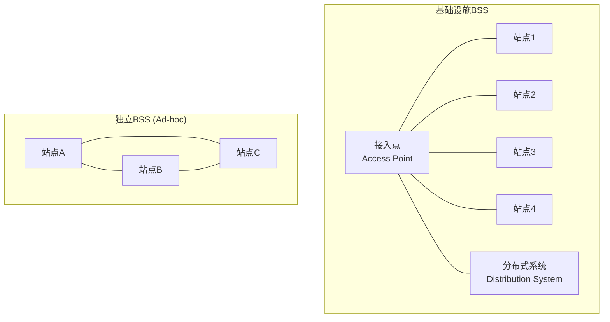

**BSS类型对比**：

| BSS类型 | 结构特点 | 通信方式 | 应用场景 |
|---------|---------|---------|----------|
| 基础设施BSS | 集中式，有AP | 通过AP中转 | 家庭、办公室WiFi |
| 独立BSS (IBSS) | 分布式，无AP | 直接通信 | 临时网络、车载网 |

### 扩展服务集ESS

> **扩展服务集（ESS）**
> 
> 由多个BSS通过分布式系统连接形成的更大网络，支持站点在BSS间漫游。

#### ESS架构组件

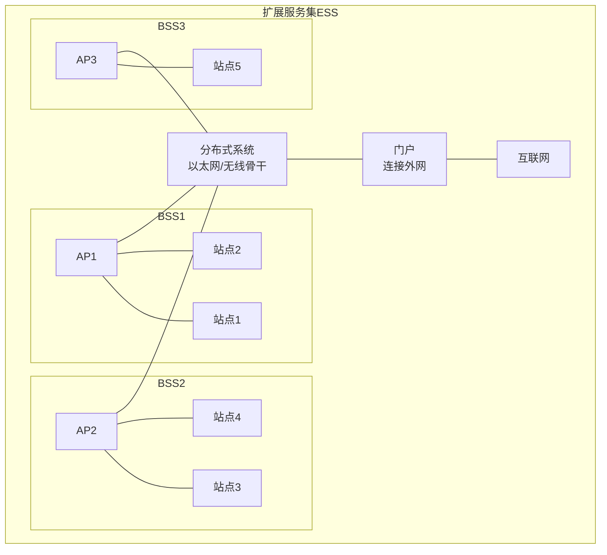

**ESS关键概念**：
- **分布式系统（DS）**：连接多个AP的骨干网络
- **门户（Portal）**：ESS与外网的连接点
- **漫游（Roaming）**：站点在BSS间移动
- **关联（Association）**：站点与AP的连接过程

---

## CSMA/CA协议机制

### 载波侦听多路访问/冲突避免

> **CSMA/CA**
> 
> 无线网络中使用的介质访问控制协议，通过载波侦听和冲突避免机制协调多个站点的信道访问。

#### CSMA/CA基本流程

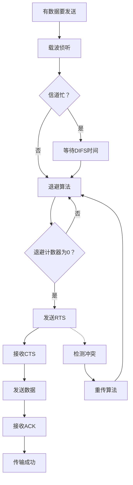

### 分布式协调功能DCF

#### 基本DCF机制

**CSMA/CA操作步骤**：
1. **载波侦听**：检测信道是否空闲
2. **DIFS等待**：信道空闲后等待DIFS时间
3. **退避过程**：随机退避避免冲突
4. **数据传输**：发送数据帧
5. **等待确认**：接收ACK确认

**时间间隔定义**：
- **SIFS**：短帧间间隔（最短）
- **DIFS**：DCF帧间间隔 = SIFS + 2×时隙时间
- **EIFS**：扩展帧间间隔（检测到错误后）

#### 二进制指数退避

> **退避算法**
> 
> 通过随机选择退避时间来减少冲突概率的算法。

**退避过程**：
1. **选择退避值**：从[0, CW-1]中均匀随机选择
2. **递减计数**：每个空闲时隙计数器减1
3. **冲突处理**：检测到冲突后CW = min(2×CW+1, CWmax)
4. **成功重置**：成功传输后CW = CWmin

**802.11标准竞争窗口变化**：
```
初始值：CW = CWmin = 15 (802.11b)
第1次冲突：CW = 31
第2次冲突：CW = 63  
第3次冲突：CW = 127
第4次冲突：CW = 255
第5次冲突：CW = 511
第6次冲突：CW = 1023 = CWmax

重传限制：短帧7次，长帧4次
```

#### CSMA/CA性能计算例题

**例题1：退避时间计算**

某802.11b网络，时隙时间为20μs，站点经历了3次连续冲突。求：(1) 当前竞争窗口大小；(2) 平均退避时间；(3) 最大退避时间。

**解答**：

步骤1：计算竞争窗口
初始：$CW = 15$ 
第1次冲突：$CW = 2 \times 15 + 1 = 31$ 
第2次冲突：$CW = 2 \times 31 + 1 = 63$ 
第3次冲突：$CW = 2 \times 63 + 1 = 127$ 

步骤2：计算平均退避时间
退避值从 $[0, 127]$ 中均匀选择：
$$T_{backoff,avg} = \frac{0 + 127}{2} \times T_{slot} = 63.5 \times 20 = 1270 \text{ μs}$$

步骤3：计算最大退避时间
$$T_{backoff,max} = 127 \times 20 = 2540 \text{ μs}$$

**答案**：竞争窗口为127，平均退避时间1.27ms，最大退避时间2.54ms。

---

**例题2：802.11吞吐量分析**

某802.11g网络，物理速率54Mbps，数据帧长1500字节，ACK帧长14字节，MAC头36字节，SIFS=10μs，DIFS=50μs，平均退避时间=200μs。不考虑RTS/CTS。求MAC层吞吐量。

**解答**：

步骤1：计算各部分传输时间
有效数据长度：1500字节
总帧长：$1500 + 36 = 1536$ 字节 $= 12288$ 比特

数据帧传输时间：
$$T_{data} = \frac{12288}{54 \times 10^6} = 227.6 \text{ μs}$$

ACK传输时间：
$$T_{ACK} = \frac{14 \times 8}{54 \times 10^6} = 2.07 \text{ μs}$$

步骤2：计算总传输周期
$$T_{total} = T_{DIFS} + T_{backoff} + T_{data} + T_{SIFS} + T_{ACK}$$
$$= 50 + 200 + 227.6 + 10 + 2.07 = 489.67 \text{ μs}$$

步骤3：计算吞吐量
$$S = \frac{1500 \times 8}{T_{total}} = \frac{12000}{489.67 \times 10^{-6}} = 24.5 \text{ Mbps}$$

MAC效率：
$$\eta = \frac{24.5}{54} = 45.4\%$$

**答案**：MAC层吞吐量约24.5Mbps，效率45.4%。

---

**例题3：RTS/CTS开销分析**

802.11网络参数：数据速率11Mbps，RTS=20字节，CTS=14字节，ACK=14字节，数据帧=1500字节，SIFS=10μs，DIFS=50μs。比较使用和不使用RTS/CTS的传输时间（忽略退避）。

**解答**：

步骤1：不使用RTS/CTS
$$T_{no-RTS} = DIFS + T_{data} + SIFS + T_{ACK}$$
$$T_{data} = \frac{1500 \times 8}{11 \times 10^6} = 1091 \text{ μs}$$
$$T_{ACK} = \frac{14 \times 8}{11 \times 10^6} = 10.2 \text{ μs}$$
$$T_{no-RTS} = 50 + 1091 + 10 + 10.2 = 1161.2 \text{ μs}$$

步骤2：使用RTS/CTS
$$T_{with-RTS} = DIFS + T_{RTS} + SIFS + T_{CTS} + SIFS + T_{data} + SIFS + T_{ACK}$$
$$T_{RTS} = \frac{20 \times 8}{11 \times 10^6} = 14.5 \text{ μs}$$
$$T_{CTS} = \frac{14 \times 8}{11 \times 10^6} = 10.2 \text{ μs}$$
$$T_{with-RTS} = 50 + 14.5 + 10 + 10.2 + 10 + 1091 + 10 + 10.2 = 1205.9 \text{ μs}$$

步骤3：额外开销
$$\text{额外开销} = \frac{1205.9 - 1161.2}{1161.2} = 3.85\%$$

**答案**：使用RTS/CTS增加约44.7μs开销，相对开销3.85%。

### RTS/CTS机制

#### 四次握手过程

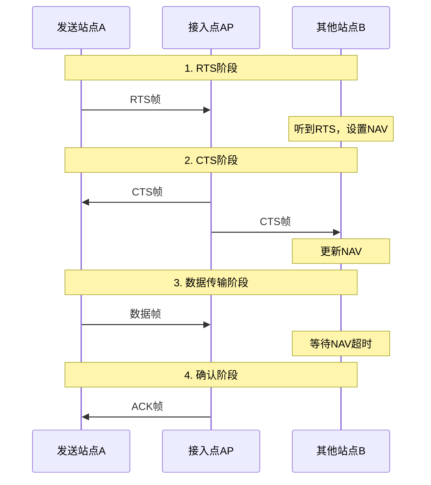

**虚拟载波侦听**：
- **NAV**：网络分配向量
- **持续时间**：从RTS/CTS帧中获取
- **作用**：建立虚拟载波侦听，避免隐藏终端冲突

### 点协调功能PCF

> **PCF（Point Coordination Function）**
> 
> 由AP集中控制的无竞争访问方法，支持实时应用的QoS需求。

#### PCF操作机制

```mermaid
gantt
    title PCF超帧结构
    dateFormat X
    axisFormat %L
    
    section CFP阶段
    无竞争期    :cfp, 0, 400
    
    section CP阶段  
    竞争期      :cp, 400, 600
```

**CFP操作过程**：
1. **Beacon帧**：AP发送信标帧启动CFP
2. **轮询传输**：AP轮询各站点进行数据传输
3. **CF-End帧**：AP发送结束帧终止CFP
4. **竞争期**：恢复DCF竞争访问

---

## 802.11帧格式详解

### 通用帧格式

#### MAC帧结构

**802.11 MAC帧格式**：

```
┌─────────────────────────────────────────────────────────┐
  802.11 MAC帧 - 无线局域网数据链路层帧
├─────────────────────────────────────────────────────────┤
  帧控制 (2字节/16位) - 帧类型、控制标志
  ├─ 协议版本 (2位) - 当前为00
  ├─ 类型 (2位) - 管理帧(00)、控制帧(01)、数据帧(10)
  ├─ 子类型 (4位) - 具体帧类型
  ├─ ToDS (1位) - 发往分布式系统
  ├─ FromDS (1位) - 来自分布式系统
  ├─ More Frag (1位) - 更多分片
  ├─ Retry (1位) - 重传标志
  ├─ Pwr Mgmt (1位) - 功率管理
  ├─ More Data (1位) - 更多数据
  ├─ WEP (1位) - 加密标志
  └─ Order (1位) - 严格顺序
├─────────────────────────────────────────────────────────┤
  持续时间/ID (2字节/16位) - NAV或关联ID
├─────────────────────────────────────────────────────────┤
  地址1 (6字节/48位) - 接收地址（RA）或目标地址（DA）
├─────────────────────────────────────────────────────────┤
  地址2 (6字节/48位) - 传输地址（TA）或源地址（SA）
├─────────────────────────────────────────────────────────┤
  地址3 (6字节/48位) - BSSID、SA或DA
├─────────────────────────────────────────────────────────┤
  序列控制 (2字节/16位) - 分片号和序列号
  ├─ 分片号 (4位)
  └─ 序列号 (12位)
├─────────────────────────────────────────────────────────┤
  地址4 (6字节/48位，可选) - 仅用于无线分布式系统
├─────────────────────────────────────────────────────────┤
  帧体 (0-2312字节，可变长) - 上层协议数据
├─────────────────────────────────────────────────────────┤
  FCS (4字节/32位) - 帧校验序列（CRC-32）
└─────────────────────────────────────────────────────────┘
```

### 帧类型分类

#### 管理帧

| 子类型 | 帧名称 | 功能 |
|-------|--------|------|
| 0000 | 关联请求 | 站点请求关联到AP |
| 0001 | 关联响应 | AP响应关联请求 |
| 0010 | 重关联请求 | 站点漫游时重新关联 |
| 0011 | 重关联响应 | AP响应重关联 |
| 0100 | 探测请求 | 主动扫描AP |
| 0101 | 探测响应 | AP响应探测请求 |
| 1000 | 信标帧 | AP周期性广播 |
| 1011 | 认证 | 身份认证过程 |
| 1100 | 去认证 | 终止认证状态 |

#### 控制帧

| 子类型 | 帧名称 | 功能 |
|-------|--------|------|
| 1010 | PS-Poll | 请求缓存数据 |
| 1011 | RTS | 请求发送 |
| 1100 | CTS | 允许发送 |
| 1101 | ACK | 确认帧 |
| 1110 | CF-End | 结束无竞争期 |

#### 数据帧

**地址字段用法**：

| ToDS | FromDS | 地址1 | 地址2 | 地址3 | 地址4 |
|------|--------|-------|-------|-------|-------|
| 0 | 0 | DA | SA | BSSID | 未使用 |
| 0 | 1 | DA | BSSID | SA | 未使用 |
| 1 | 0 | BSSID | SA | DA | 未使用 |
| 1 | 1 | RA | TA | DA | SA |

**地址含义**：
- **DA**：目标地址
- **SA**：源地址
- **BSSID**：BSS标识符
- **RA**：接收地址
- **TA**：传输地址

---

## WiFi安全机制

### WEP安全协议

> **有线等效保密（WEP）**
> 
> 802.11的早期安全协议，使用RC4流密码进行数据加密。

#### WEP加密过程

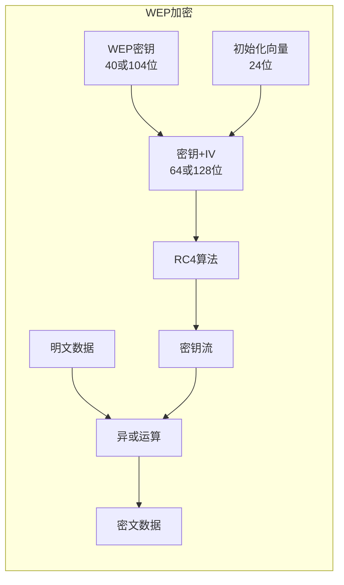

**WEP安全缺陷**：
- **IV重复**：24位IV容易重复
- **弱密钥**：RC4某些密钥存在弱点
- **认证脆弱**：共享密钥认证不安全
- **完整性检查不足**：CRC校验容易伪造

#### WEP安全性分析例题

**例题：WEP IV冲突概率**

WEP使用24位IV，某网络传输速率11Mbps，平均帧长1000字节。求：(1) IV空间大小；(2) 每秒产生的IV数量；(3) 根据生日悖论，IV重复概率达到50%需要多少个数据包？

**解答**：

步骤1：IV空间大小
$$N_{IV} = 2^{24} = 16{,}777{,}216 \approx 1.68 \times 10^7$$

步骤2：每秒产生的IV数量
$$N_{frames/s} = \frac{11 \times 10^6}{1000 \times 8} = 1375 \text{ 帧/秒}$$

步骤3：根据生日悖论估算
重复概率达到50%所需数据包数约为：
$$n \approx 1.2 \times \sqrt{N_{IV}} = 1.2 \times \sqrt{2^{24}} = 1.2 \times 4096 \approx 4915 \text{ 个包}$$

时间：
$$t = \frac{4915}{1375} \approx 3.57 \text{ 秒}$$

**答案**：IV空间约1680万，每秒产生1375个IV，约3.57秒后IV重复概率达到50%，安全性极差。

**WEP攻击方法**：
- **FMS攻击**：利用RC4弱密钥，收集约100万个IV后可恢复密钥
- **PTW攻击**：改进的统计攻击，仅需约40000个数据包
- **碎片攻击**：主动注入流量加速IV收集

### WPA/WPA2安全协议

#### WPA改进

> **WPA（WiFi Protected Access）**
> 
> 针对WEP缺陷的改进安全协议，引入TKIP加密和802.1X认证。

**TKIP特点**：
- **动态密钥**：每个数据包使用不同密钥
- **密钥混合**：增强密钥复杂性
- **序列号检查**：防止重放攻击
- **MIC校验**：消息完整性检查

#### WPA2/IEEE 802.11i

> **WPA2**
> 
> 基于AES-CCMP的强安全协议，提供更高级别的数据保护。

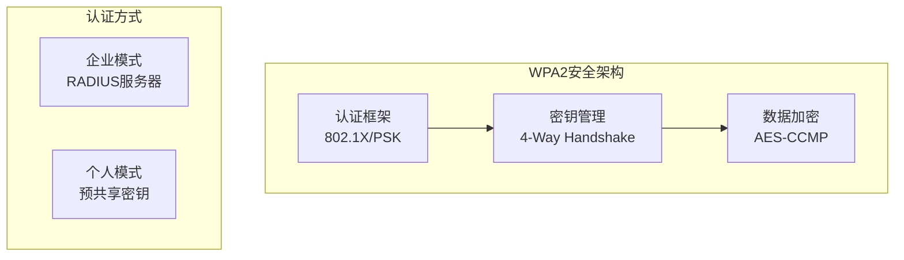

**四次握手过程**：
1. **消息1**：AP发送ANonce
2. **消息2**：STA发送SNonce和MIC
3. **消息3**：AP发送GTK和MIC
4. **消息4**：STA确认密钥安装

#### WPA2密钥派生详解

**密钥层次结构**：

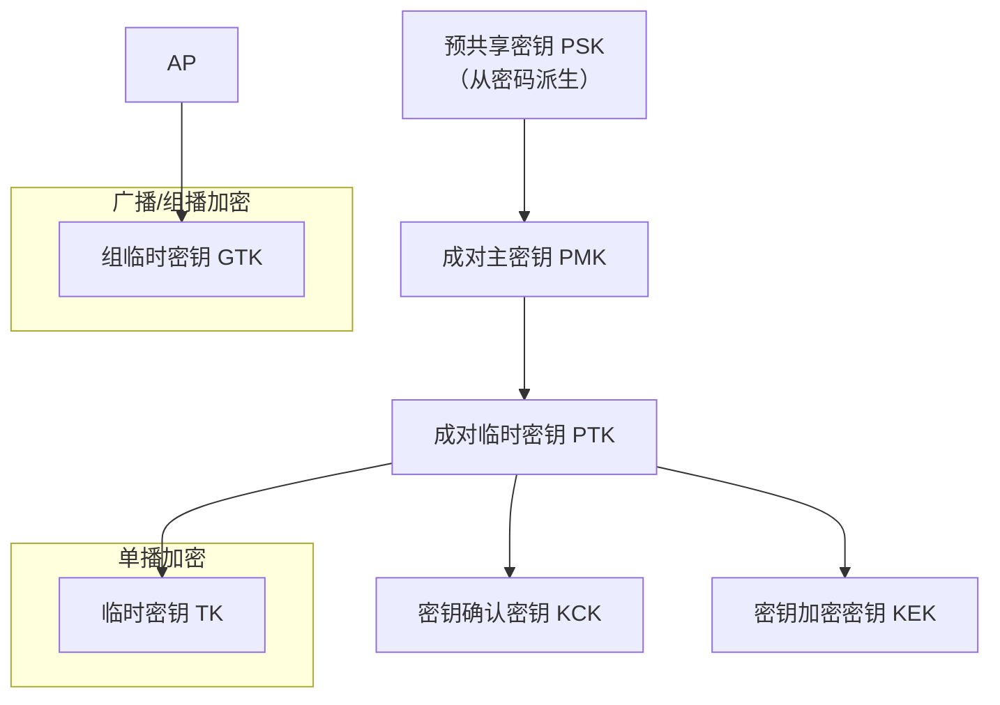

**PMK生成**：
$$PMK = PBKDF2(passphrase, SSID, 4096, 256)$$

其中：
- passphrase：用户密码（8-63个字符）
- SSID：网络名称
- 4096：迭代次数
- 256：输出密钥长度（位）

**PTK生成**：
$$PTK = PRF-512(PMK, "Pairwise key expansion", \text{Min}(AA, SPA) || \text{Max}(AA, SPA) || \text{Min}(ANonce, SNonce) || \text{Max}(ANonce, SNonce))$$

PTK分解（512位）：
- KCK（128位）：用于MIC计算
- KEK（128位）：用于加密GTK
- TK（128位）：用于数据加密
- MIC Key（64位）：TKIP使用
- 保留（64位）

**MIC计算**：
$$MIC = HMAC-SHA1-128(KCK, \text{Message})$$

#### WPA2安全性分析例题

**例题1：PMK计算复杂度**

WPA2-PSK采用PBKDF2算法，迭代4096次。假设攻击者每秒能测试10000个密码。求：(1) 测试一个密码需要的时间；(2) 破解8位纯数字密码（$10^8$个可能）需要的时间。

**解答**：

步骤1：单次密码测试时间
$$t_{single} = \frac{4096}{10000} = 0.4096 \text{ 秒}$$

步骤2：破解全部8位数字密码
密码空间：$10^8 = 100{,}000{,}000$

总时间：
$$T = \frac{10^8}{10000} = 10000 \text{ 秒} = 2.78 \text{ 小时}$$

平均时间（破解50%概率）：
$$T_{avg} = \frac{10000}{2} = 5000 \text{ 秒} \approx 1.39 \text{ 小时}$$

**答案**：4096次迭代使单次测试需0.41秒，破解8位纯数字密码平均需1.39小时。建议使用更长、更复杂的密码。

---

**例题2：KRACK攻击原理**

WPA2四次握手中，如果攻击者重放消息3，会导致什么问题？

**解答**：

KRACK（密钥重装攻击）原理：
1. 客户端收到消息3后安装PTK，重置nonce和重放计数器
2. 攻击者捕获并重放消息3
3. 客户端再次安装相同PTK，nonce被重置为初始值
4. 相同nonce + 相同密钥导致密钥流重用
5. 攻击者可以：
   - 解密数据包
   - 伪造数据包
   - 进行中间人攻击

**防护措施**：
- 客户端只能安装PTK一次
- 检测重放的消息3
- 固件/驱动更新

#### 四次握手详细流程

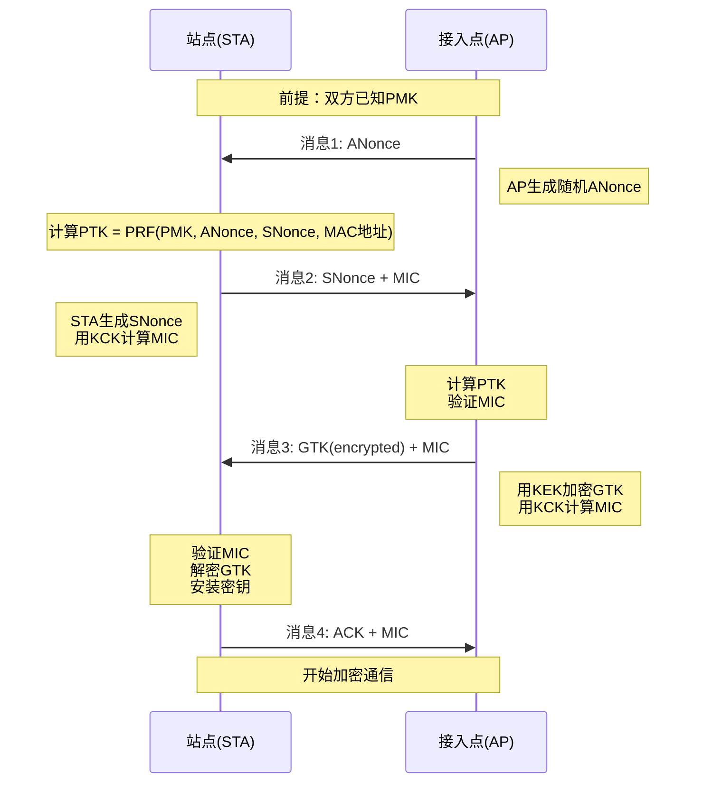

**安全特性对比**：

| 特性 | WEP | WPA(TKIP) | WPA2(CCMP) |
|-----|-----|-----------|-----------|
| 加密算法 | RC4 | RC4 | AES |
| 密钥长度 | 40/104位 | 128位 | 128位 |
| IV长度 | 24位 | 48位 | 48位 |
| 完整性校验 | CRC-32 | Michael MIC | CBC-MAC |
| 密钥管理 | 静态 | 动态（每包） | 动态（每包） |
| 重放保护 | 无 | 有（序列号） | 有（PN） |
| 抗攻击能力 | 极弱 | 中等 | 强 |

### WPA3安全增强

#### 主要改进

**个人模式改进**：
- **SAE认证**：同时认证等价算法
- **前向保密**：密钥泄露不影响历史数据
- **离线字典攻击防护**：增强密码安全

**企业模式增强**：
- **192位安全套件**：更强加密强度
- **认证服务器认证**：防止伪造AP攻击

#### WPA3 SAE（同时认证等价）详解

**SAE vs PSK对比**：

| 特性 | WPA2-PSK | WPA3-SAE |
|-----|----------|----------|
| 认证方法 | 四次握手 | Dragonfly握手 |
| 抗离线字典攻击 | 否 | 是 |
| 前向保密 | 否 | 是 |
| 密钥协商 | 基于PMK | 基于Diffie-Hellman |
| 抗暴力破解 | 弱 | 强（每次尝试需交互） |

**SAE握手过程**：

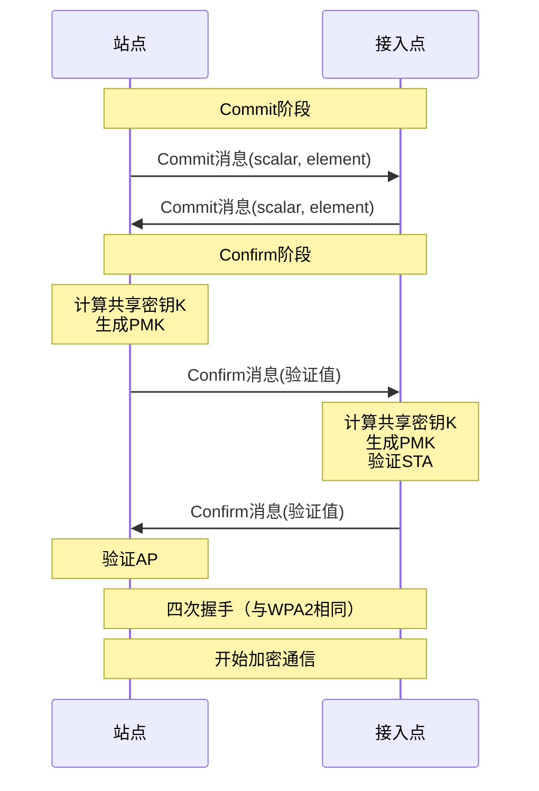

**安全性提升**：
1. **抗离线攻击**：攻击者必须与AP实时交互，无法离线破解捕获的握手包
2. **前向保密**：即使密码泄露，历史通信仍然安全
3. **抗侧信道攻击**：使用constant-time算法
4. **防止降级攻击**：Transition Disable机制

#### WPA3额外特性

**Enhanced Open（增强开放网络）**：
- 公共WiFi加密：即使无密码也加密数据
- 机会性无线加密（OWE）
- 防止被动窃听

**Easy Connect（简化配置）**：
- 二维码配置
- NFC配置
- 简化IoT设备接入

---

## 802.11标准演进

### 技术发展历程

#### 关键技术进步

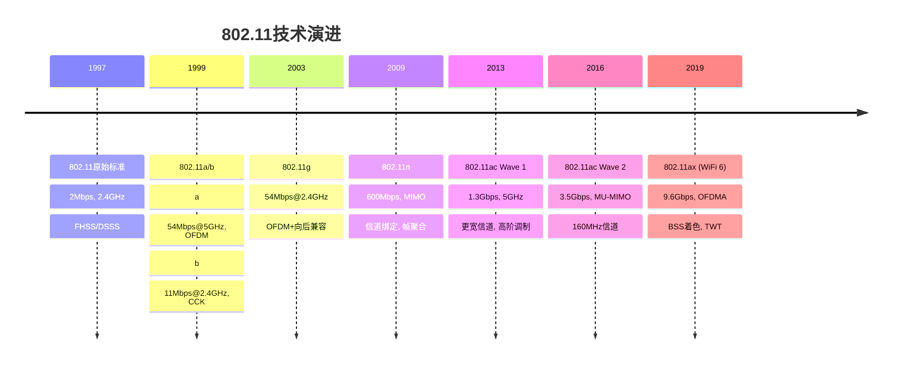

### 现代WiFi技术

#### 802.11ac技术特点

**关键技术**：
- **更宽信道**：80MHz/160MHz
- **高阶调制**：256-QAM
- **MU-MIMO**：多用户MIMO
- **波束成形**：定向传输

#### 802.11ax (WiFi 6)创新

**核心技术突破**：

| 技术特性 | 802.11ac | 802.11ax | 改进效果 |
|---------|----------|----------|----------|
| 调制方式 | 256-QAM | 1024-QAM | 频谱效率提升25% |
| 多址方式 | MU-MIMO | OFDMA+MU-MIMO | 用户并发能力提升4倍 |
| BSS着色 | 无 | 有 | 减少同频干扰 |
| 目标唤醒时间 | 无 | TWT | 功耗降低30% |

**OFDMA技术**：
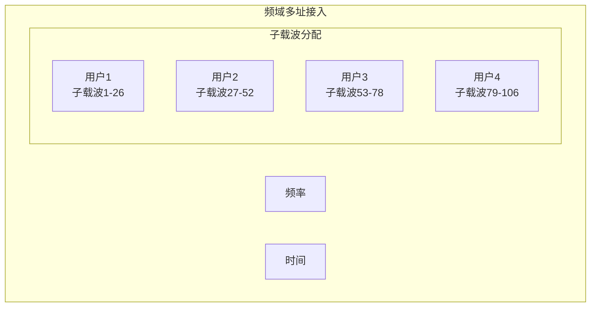

#### WiFi 6性能计算例题

**例题1：WiFi 6 vs WiFi 5吞吐量对比**

比较802.11ac和802.11ax在相同条件下的理论吞吐量：
- 信道带宽：80MHz
- MIMO流：2×2
- 编码率：5/6

**802.11ac参数**：
- 调制：256-QAM（8 bit/symbol）
- 子载波数：234（数据子载波）
- 符号时间：3.6μs

**802.11ax参数**：
- 调制：1024-QAM（10 bit/symbol）
- 子载波数：980（数据子载波）
- 符号时间：13.6μs

**解答**：

步骤1：802.11ac吞吐量
$$R_{ac} = \frac{N_{sc} \times N_{bit} \times N_{ss} \times R_{code}}{T_{symbol}}$$
$$= \frac{234 \times 8 \times 2 \times \frac{5}{6}}{3.6 \times 10^{-6}}$$
$$= \frac{3120}{3.6 \times 10^{-6}} = 866.67 \text{ Mbps}$$

步骤2：802.11ax吞吐量
$$R_{ax} = \frac{980 \times 10 \times 2 \times \frac{5}{6}}{13.6 \times 10^{-6}}$$
$$= \frac{16333.33}{13.6 \times 10^{-6}} = 1201.47 \text{ Mbps}$$

步骤3：性能提升
$$\text{提升} = \frac{1201.47 - 866.67}{866.67} = 38.6\%$$

**答案**：WiFi 6单流吞吐量1.2Gbps，相比WiFi 5提升38.6%。

---

**例题2：OFDMA效率提升分析**

某WiFi 6网络有8个IoT设备，每个设备每次发送100字节数据。比较：
- 方案A：传统OFDM，每个设备独占信道
- 方案B：OFDMA，8个设备共享一个OFDM符号

假设：信道带宽80MHz，每个RU（资源单元）包含26个子载波，OFDM符号13.6μs，开销（前导+MAC）为44μs。

**解答**：

步骤1：方案A（传统OFDM）
每个设备传输时间：
$$T_{single} = 44 + \frac{100 \times 8}{150 \times 10^6} = 44 + 5.33 = 49.33 \text{ μs}$$

8个设备总时间：
$$T_{total,A} = 8 \times 49.33 = 394.64 \text{ μs}$$

步骤2：方案B（OFDMA）
所有设备并发传输：
$$T_{total,B} = 44 + 13.6 = 57.6 \text{ μs}$$

步骤3：效率提升
$$\text{提升} = \frac{394.64 - 57.6}{394.64} = 85.4\%$$

信道利用率提升：
$$\text{利用率} = \frac{8 \times 100 \times 8}{394.64 \times 80 \times 10^6} = 2.03\%$$ （方案A）
$$\text{利用率} = \frac{8 \times 100 \times 8}{57.6 \times 80 \times 10^6} = 13.9\%$$ （方案B）

**答案**：OFDMA使传输时间减少85.4%，信道利用率从2%提升到14%，非常适合多用户小数据场景。

---

**例题3：目标唤醒时间（TWT）节能计算**

某IoT设备使用WiFi 6，每小时上传一次数据（传输耗时100ms，功耗200mW），其他时间休眠（功耗1mW）。

对比：
- 无TWT：设备需保持关联，空闲功耗20mW
- 有TWT：设备可深度休眠，空闲功耗1mW

**解答**：

步骤1：无TWT能耗
$$E_{no-TWT} = 0.1 \times 200 + 59.9 \times 20 = 20 + 1198 = 1218 \text{ mWh}$$

步骤2：有TWT能耗
$$E_{TWT} = 0.1 \times 200 + 59.9 \times 1 = 20 + 59.9 = 79.9 \text{ mWh}$$

步骤3：节能效果
$$\text{节能} = \frac{1218 - 79.9}{1218} = 93.4\%$$

电池续航提升（假设电池3000mAh @ 3.7V）：
- 无TWT：$\frac{3000 \times 3.7}{1218} = 9.1$ 天
- 有TWT：$\frac{3000 \times 3.7}{79.9} = 139$ 天

**答案**：TWT使IoT设备功耗降低93.4%，电池续航从9天延长到139天。

---

## WiFi性能优化

### 网络规划与部署

#### 信道规划

**2.4GHz信道**：
- **可用信道**：1-14（地区差异）
- **非重叠信道**：1、6、11
- **信道间隔**：5MHz
- **重叠影响**：相邻信道干扰

**5GHz信道**：
- **更多信道**：36、40、44、48...
- **更宽带宽**：80MHz/160MHz可用
- **干扰较少**：较少其他设备使用

#### 覆盖优化

**功率控制策略**：
- **覆盖范围**：功率影响覆盖半径
- **干扰控制**：降低同频干扰
- **容量平衡**：负载均衡考虑

### QoS保障机制

#### 802.11e QoS

**接入类别（AC）**：

| 优先级 | 接入类别 | 应用类型 | AIFS | CWmin | CWmax |
|-------|---------|----------|------|-------|-------|
| 最高 | AC_VO | 语音 | 2 | 3 | 7 |
| 高 | AC_VI | 视频 | 2 | 7 | 15 |
| 中 | AC_BE | 尽力而为 | 3 | 15 | 1023 |
| 低 | AC_BK | 背景 | 7 | 15 | 1023 |

**TXOP（传输机会）**：
- 获得信道后可连续传输的时间
- 不同AC有不同的TXOP限制
- 提高高优先级业务的传输效率

#### QoS性能分析例题

**例题1：802.11e接入延迟对比**

某WiFi网络有4个站点同时竞争信道，分别属于AC_VO、AC_VI、AC_BE、AC_BK。时隙时间20μs。求各站点平均退避时间。

**解答**：

根据802.11e参数表：

步骤1：计算各AC的平均退避时间
$$T_{backoff,avg} = AIFS \times T_{slot} + \frac{CWmin}{2} \times T_{slot}$$

AC_VO：
$$T_{VO} = 2 \times 20 + \frac{3}{2} \times 20 = 40 + 30 = 70 \text{ μs}$$

AC_VI：
$$T_{VI} = 2 \times 20 + \frac{7}{2} \times 20 = 40 + 70 = 110 \text{ μs}$$

AC_BE：
$$T_{BE} = 3 \times 20 + \frac{15}{2} \times 20 = 60 + 150 = 210 \text{ μs}$$

AC_BK：
$$T_{BK} = 7 \times 20 + \frac{15}{2} \times 20 = 140 + 150 = 290 \text{ μs}$$

步骤2：接入延迟比较
$$\frac{T_{BK}}{T_{VO}} = \frac{290}{70} = 4.14$$

**答案**：语音流平均退避70μs，背景流290μs，低优先级流延迟是高优先级的4.14倍，有效保障了实时业务的QoS。

---

**例题2：TXOP吞吐量提升计算**

某VoIP流使用AC_VO，每个数据包200字节，传输速率54Mbps，SIFS=10μs，TXOP限制为3.008ms。比较：
- 无TXOP：每个包独立竞争
- 有TXOP：TXOP期内连续传输

假设平均退避时间70μs，ACK帧10μs。

**解答**：

步骤1：单包传输时间
$$T_{data} = \frac{200 \times 8}{54 \times 10^6} = 29.6 \text{ μs}$$

步骤2：无TXOP传输周期
$$T_{no-TXOP} = 70 + 29.6 + 10 + 10 = 119.6 \text{ μs}$$

吞吐量：
$$S_{no-TXOP} = \frac{200 \times 8}{119.6 \times 10^{-6}} = 13.4 \text{ Mbps}$$

步骤3：有TXOP连续传输
TXOP内可传输包数：
$$N = \lfloor\frac{3008}{29.6 + 10 + 10}\rfloor = \lfloor 60.7 \rfloor = 60 \text{ 个包}$$

平均每包时间（包含一次竞争开销）：
$$T_{avg} = \frac{70 + 60 \times (29.6 + 10 + 10)}{60} = \frac{70 + 2976}{60} = 50.8 \text{ μs}$$

吞吐量：
$$S_{TXOP} = \frac{200 \times 8}{50.8 \times 10^{-6}} = 31.5 \text{ Mbps}$$

步骤4：效率提升
$$\text{提升} = \frac{31.5 - 13.4}{13.4} = 135\%$$

**答案**：TXOP机制使VoIP吞吐量从13.4Mbps提升到31.5Mbps，提升135%，显著提高信道利用率。

---

**例题3：多业务QoS保障**

某WiFi网络同时传输：
- 1路VoIP（AC_VO）：64kbps
- 1路视频流（AC_VI）：2Mbps
- 2路数据流（AC_BE）：每路5Mbps

信道容量20Mbps。分析各业务能否得到保障。

**解答**：

步骤1：总需求带宽
$$B_{total} = 0.064 + 2 + 2 \times 5 = 12.064 \text{ Mbps} < 20 \text{ Mbps}$$

步骤2：QoS保障分析
由于 $B_{total} < B_{capacity}$ ，带宽充足。但竞争机制下：

高优先级（VO+VI）占比：
$$P_{high} = \frac{0.064 + 2}{12.064} = 17.1\%$$

由于EDCA机制，高优先级流获得信道概率更高。假设：
- AC_VO获得30%时隙（实际需0.32%）
- AC_VI获得30%时隙（实际需10%）
- AC_BE共享40%时隙（实际需82.7%）

实际可用带宽：
- VO：$20 \times 0.30 = 6$ Mbps ≫ 64kbps ✓
- VI：$20 \times 0.30 = 6$ Mbps ≫ 2Mbps ✓
- BE：$20 \times 0.40 = 8$ Mbps < 10Mbps（需求） ✗

**答案**：高优先级流（VO、VI）可得到充分保障，但数据流可能出现拥塞。建议启用准入控制或限速。
