# 7.4 无线网络：蜂窝网络

## 本章目录

1. [蜂窝网络基本概念](#蜂窝网络基本概念)
2. [蜂窝网络体系结构](#蜂窝网络体系结构)
3. [移动通信技术演进](#移动通信技术演进)
4. [4G LTE技术详解](#4g-lte技术详解)
5. [5G新无线技术](#5g新无线技术)

---

## 蜂窝网络基本概念

### 蜂窝系统原理

> **蜂窝网络**
> 
> 将服务区域划分成若干个小区（蜂窝），每个小区由基站覆盖，通过频率复用实现大容量移动通信的网络系统。

#### 蜂窝结构

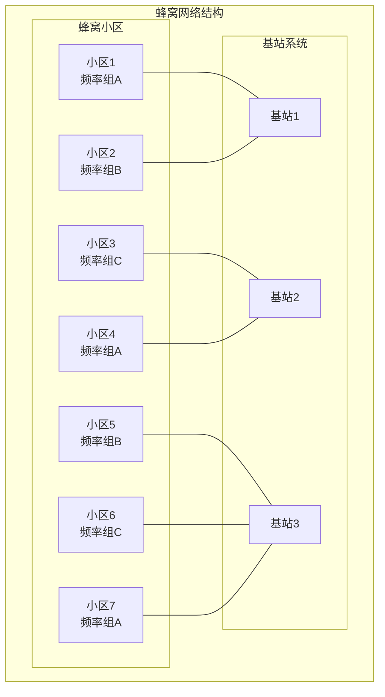

**核心优势**：
- **频率复用**：提高频谱利用率
- **功率控制**：降低干扰和功耗
- **容量扩展**：支持大量并发用户
- **覆盖连续**：无缝服务区域

### 频率复用原理

#### 复用距离计算

**同频干扰保护**：
$$D = R \sqrt{3N}$$

其中：
- D：复用距离
- R：小区半径
- N：复用因子

**典型复用模式**：

| 复用因子N | 复用距离D/R | 同频干扰保护 | 频谱效率 | 典型应用 |
|---------|------------|-------------|----------|---------|
| 3 | 3.0 | 中等 | 高 | CDMA系统 |
| 4 | 3.5 | 较好 | 中等 | GSM密集区 |
| 7 | 4.6 | 很好 | 中等 | GSM标准配置 |
| 12 | 6.0 | 极好 | 较低 | 早期AMPS |

#### 频率复用计算例题

**例题1：蜂窝网络容量计算**

某GSM系统分配的频谱带宽为12.5MHz，信道带宽200kHz，复用因子N=7，每小区3个扇区。求：(1) 总信道数；(2) 每小区信道数；(3) 每扇区信道数。

**解答**：

步骤1：计算总信道数
$$N_{total} = \frac{B_{total}}{B_{channel}} = \frac{12.5 \times 10^6}{200 \times 10^3} = 62.5 \approx 62 \text{ 个信道}$$

步骤2：计算每小区信道数
$$N_{cell} = \frac{N_{total}}{N} = \frac{62}{7} \approx 8.86 \approx 8 \text{ 个信道}$$

步骤3：计算每扇区信道数
$$N_{sector} = \frac{N_{cell}}{3} = \frac{8}{3} \approx 2.67 \approx 2 \text{ 个信道}$$

**答案**：总共62个信道，每小区8个信道，每扇区2-3个信道。

---

**例题2：小区容量与负载分析**

某LTE小区，带宽20MHz，子载波间隔15kHz，有效子载波数1200个（其中导频、控制信道占200个），调制方式64-QAM（编码率3/4），MIMO 2×2。求：(1) 物理层峰值速率；(2) 若单用户平均速率需求2Mbps，该小区可支持多少并发用户？

**解答**：

步骤1：计算符号速率
每个子载波符号速率：15kHz
符号时间（含CP）：71.43μs，有效符号66.67μs

步骤2：计算数据速率
数据子载波数：$1200 - 200 = 1000$
每符号比特数：$\log_2(64) = 6$ 比特
编码后：$6 \times \frac{3}{4} = 4.5$ 比特
MIMO流数：2

物理层峰值速率：
$$R_{peak} = 1000 \times 15000 \times 4.5 \times 2$$
$$= 135 \times 10^6 \text{ bps} = 135 \text{ Mbps}$$

步骤3：计算用户容量（MAC层效率约70%）
$$R_{MAC} = 135 \times 0.7 = 94.5 \text{ Mbps}$$

并发用户数：
$$N_{users} = \frac{94.5}{2} = 47.25 \approx 47 \text{ 用户}$$

**答案**：物理层峰值135Mbps，考虑MAC开销后可支持约47个并发2Mbps用户。

---

**例题3：同频干扰分析（C/I计算）**

六边形蜂窝网络，复用因子N=7，路径损耗指数n=4。假设目标小区中心用户，受6个第一层同频小区干扰，距离都为D。求载干比C/I（dB）。

**解答**：

步骤1：建立功率关系
设小区半径为R，复用距离 $D = R\sqrt{3N} = R\sqrt{21} = 4.58R$

目标信号功率（距离R）：
$$C \propto R^{-n} = R^{-4}$$

每个干扰信号功率（距离D）：
$$I_i \propto D^{-n} = (4.58R)^{-4}$$

步骤2：计算载干比
$$\frac{C}{I} = \frac{R^{-4}}{6 \times (4.58R)^{-4}} = \frac{(4.58)^4}{6}$$
$$= \frac{439.7}{6} = 73.3$$

转换为dB：
$$\frac{C}{I}(dB) = 10\log_{10}(73.3) = 18.7 \text{ dB}$$

步骤3：不同位置的C/I
小区边缘用户（最差情况，距离0.5R到目标基站，距离3.5R到最近干扰基站）：
$$\frac{C}{I}_{edge} = \frac{(0.5R)^{-4}}{(3.5R)^{-4}} = \left(\frac{3.5}{0.5}\right)^4 = 7^4 = 2401$$
$$\frac{C}{I}_{edge}(dB) = 10\log_{10}(2401) = 33.8 \text{ dB}$$

等等，这个计算有问题。让我重新计算边缘用户。

边缘用户距离目标基站R，距离最近干扰基站约 $D-R = (4.58-1)R = 3.58R$ ：
$$\frac{C}{I}_{edge} = \frac{R^{-4}}{1 \times (3.58R)^{-4} + 5 \times (4.58R)^{-4}}$$
$$= \frac{1}{(3.58)^{-4} + 5 \times (4.58)^{-4}} = \frac{1}{\frac{1}{164.3} + \frac{5}{439.7}}$$
$$= \frac{1}{0.0061 + 0.0114} = \frac{1}{0.0175} = 57.1$$
$$\frac{C}{I}_{edge}(dB) = 10\log_{10}(57.1) = 17.6 \text{ dB}$$

**答案**：中心用户C/I约18.7dB，边缘用户约17.6dB。复用因子N=7提供足够的干扰保护。

---

## 蜂窝网络体系结构

### GSM网络架构

#### 系统组成

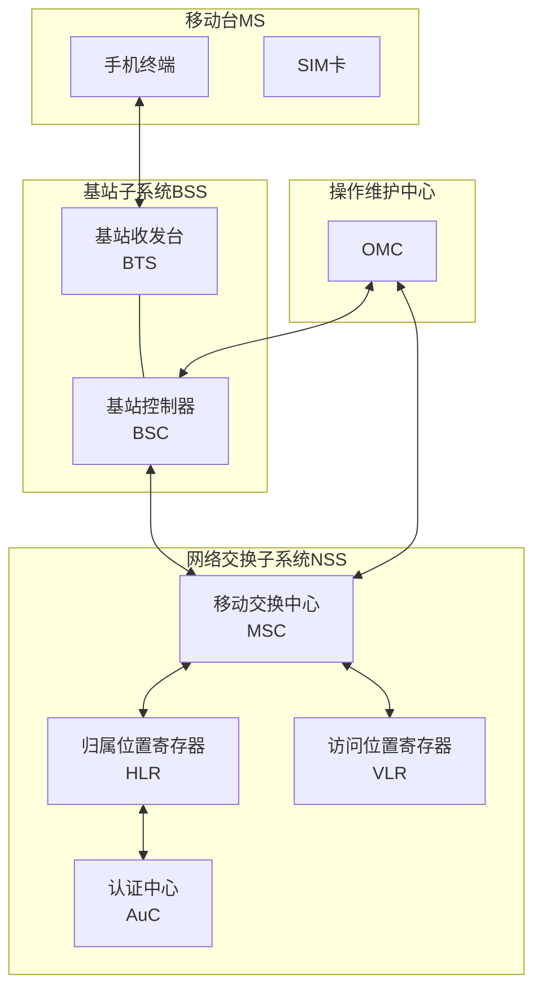

**网络元素功能**：

| 网络元素 | 英文全称 | 主要功能 |
|---------|---------|----------|
| MS | Mobile Station | 移动终端，包含手机和SIM卡 |
| BTS | Base Transceiver Station | 基站收发台，无线接口 |
| BSC | Base Station Controller | 基站控制器，无线资源管理 |
| MSC | Mobile Switching Center | 移动交换中心，呼叫控制 |
| HLR | Home Location Register | 归属位置寄存器，用户数据库 |
| VLR | Visitor Location Register | 访问位置寄存器，临时数据 |

### 现代蜂窝网络架构

#### LTE系统架构

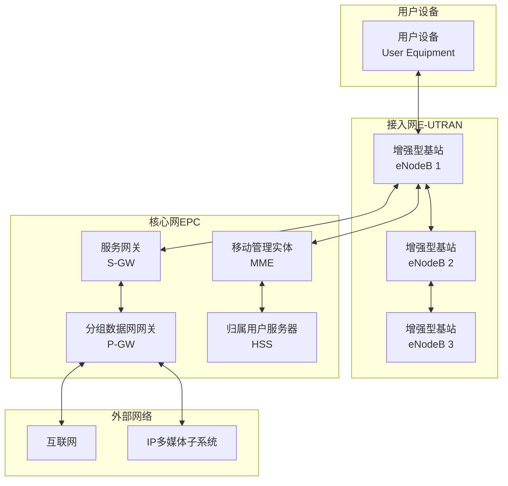

**LTE架构特点**：
- **扁平化架构**：减少网络节点层次
- **全IP网络**：端到端IP传输
- **高速数据**：专为数据业务优化
- **低延迟**：优化的协议栈

### 移动性管理与切换机制

#### 切换类型与触发条件

> **切换（Handover）**
> 
> 移动用户在移动过程中，从一个小区切换到另一个小区，保持通信连续性的过程。

**切换分类**：

| 切换类型 | 定义 | 触发条件 | 中断时间 | 应用场景 |
|---------|------|---------|---------|---------|
| 硬切换 | 先断后连 | 信号质量下降 | 50-100ms | 2G/3G系统 |
| 软切换 | 先连后断 | 同时连接多基站 | 0ms | CDMA系统 |
| 更软切换 | 同基站扇区间 | 扇区信号变化 | 0ms | CDMA扇区 |
| 无缝切换 | LTE硬切换优化 | 测量报告触发 | <27.5ms | LTE系统 |

**切换触发条件**：
1. **信号强度（RSSI）下降**：低于阈值
2. **信号质量（C/I）恶化**：干扰增加
3. **距离过远**：时间提前量超限
4. **负载均衡**：小区过载
5. **业务需求**：切换到更优质网络

#### LTE切换流程详解

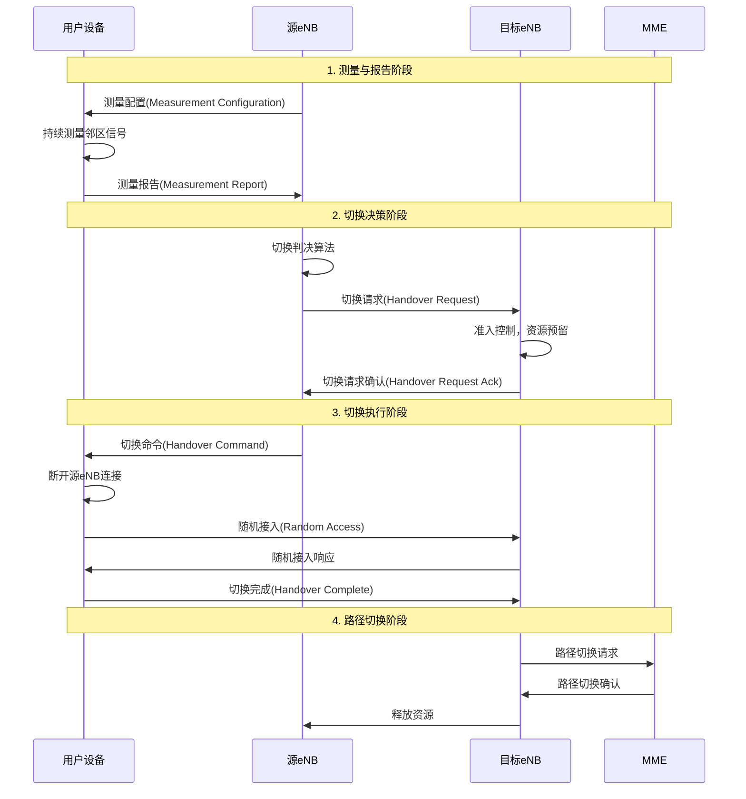

**切换判决算法**：

**事件A3触发**（最常用）：
$$\text{Neighbour\_RSRP} > \text{Serving\_RSRP} + \text{Offset} + \text{Hysteresis}$$

其中：
- Offset：偏移量（可正可负）
- Hysteresis：滞后量（防止乒乓效应）
- 时间窗（TTT）：条件持续满足的时间

**切换时延分析**：
- 测量报告延迟：100-200ms
- 切换准备时间：20-50ms
- 切换执行时间：27.5ms（理想）
- 总切换时延：150-280ms

#### 切换性能计算例题

**例题1：切换区域与切换次数**

某高速公路，小区半径R=1km，车速v=120km/h。求：(1) 穿越一个小区的时间；(2) 行驶100km需要切换多少次？

**解答**：

步骤1：计算穿越时间
$$v = 120 \text{ km/h} = 33.33 \text{ m/s}$$

穿越小区直径（最长路径）：$2R = 2$ km
$$T = \frac{2000}{33.33} = 60 \text{ 秒}$$

步骤2：计算切换次数
100km内的小区数（最坏情况，沿直径穿越）：
$$N = \frac{100}{2} = 50 \text{ 个小区}$$

切换次数（进入新小区即切换）：
$$N_{handover} = 50 - 1 = 49 \text{ 次}$$

平均切换间隔：
$$T_{interval} = \frac{3600}{49} = 73.5 \text{ 秒}$$

**答案**：穿越单个小区约60秒，行驶100km需要切换约49次，平均每73.5秒切换一次。

---

**例题2：切换失败概率分析**

某LTE网络，测量周期200ms，TTT（Time to Trigger）=160ms，切换执行时间27.5ms，总切换延迟387.5ms。用户以100km/h速度移动，小区边界信号下降斜率为1dB/m。切换触发点距小区边界50m，信号跌破最低门限需下降10dB。判断切换是否成功。

**解答**：

步骤1：计算移动距离
$$v = 100 \text{ km/h} = 27.78 \text{ m/s}$$

切换延迟内移动距离：
$$d = 27.78 \times 0.3875 = 10.76 \text{ m}$$

步骤2：判断切换成功性
触发切换时距边界：50m
切换完成时距边界：$50 - 10.76 = 39.24$ m

信号余量：$39.24 \times 1 = 39.24$ dB > 10dB（门限）

**答案**：切换可以成功完成，有充足的信号余量（约39dB > 10dB最低要求）。

---

**例题3：乒乓效应分析**

两个相邻小区A和B，边界处用户测得：$RSRP_A = -95$ dBm，$RSRP_B = -94$ dBm，信号波动±2dB。切换参数：Offset=0dB，Hysteresis=3dB，TTT=480ms。分析是否会发生乒乓切换。

**解答**：

步骤1：A切换到B的条件
$$RSRP_B > RSRP_A + \text{Offset} + \text{Hysteresis}$$
$$-94 > -95 + 0 + 3$$
$$-94 > -92$$ （不满足）

即使B最强（-92dBm），A最弱（-97dBm）：
$$-92 > -97 + 3$$
$$-92 > -94$$ （满足）

步骤2：B切换回A的条件
假设已切换到B，现在判断是否切回A：
$$RSRP_A > RSRP_B + 3$$

即使A最强（-93dBm），B最弱（-96dBm）：
$$-93 > -96 + 3$$
$$-93 > -93$$ （刚好临界）

步骤3：TTT保护作用
由于设置了480ms的TTT，瞬时波动不会触发切换。只有信号稳定优于对方3dB并持续480ms才会切换。

**答案**：3dB的Hysteresis和480ms的TTT有效防止了乒乓效应。在±2dB波动下，切换条件不易满足。

---

## 移动通信技术演进

### 1G到5G发展历程

#### 技术代际特征

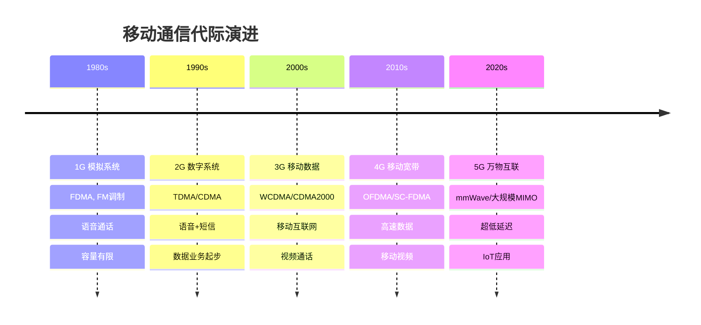

### 多址技术演进

#### 多址方式对比

| 代际 | 多址技术 | 频域 | 时域 | 码域 | 特点 |
|-----|---------|------|------|------|------|
| 1G | FDMA | 分割 | 连续 | 无 | 简单，效率低 |
| 2G | TDMA | 分割 | 分割 | 无 | 数字化，中等效率 |
| 2G/3G | CDMA | 共享 | 共享 | 分割 | 抗干扰，高容量 |
| 4G | OFDMA | 灵活 | 灵活 | 可选 | 高效，低干扰 |
| 5G | NOMA | 共享 | 共享 | 功率域 | 超高效，大连接 |

#### 调制技术进步

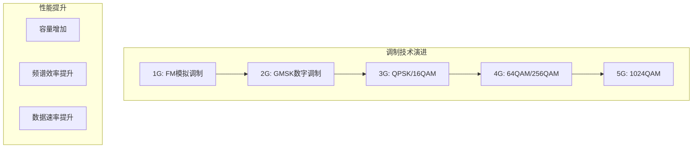

---

## 4G LTE技术详解

### LTE关键技术

#### OFDMA技术

> **正交频分多址（OFDMA）**
> 
> 将系统带宽分成多个正交子载波，不同用户分配不同的子载波组合。

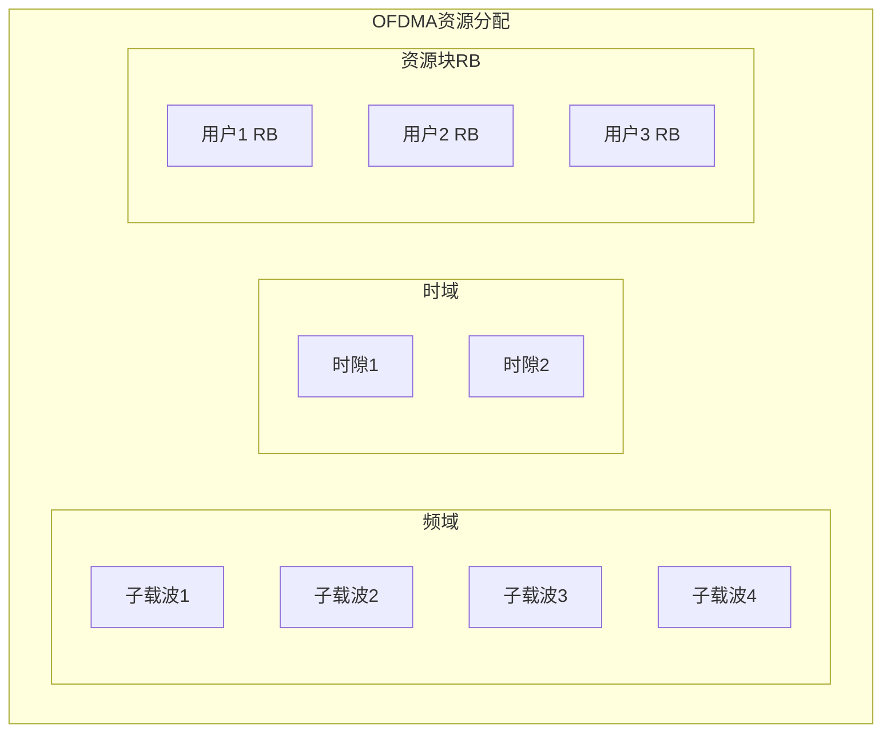

**OFDMA优势**：
- **频谱效率高**：正交子载波无干扰
- **抗多径衰落**：长符号周期+保护间隔
- **灵活资源分配**：按需分配频域资源
- **低复杂度**：FFT实现

#### MIMO技术

> **多输入多输出（MIMO）**
> 
> 使用多个天线发送和接收，提高频谱效率和可靠性。

**MIMO分类**：
- **SISO**：单输入单输出
- **SIMO**：单输入多输出（接收分集）
- **MISO**：多输入单输出（发送分集）
- **MIMO**：多输入多输出（空间复用）

**MIMO增益**：
$$C = \log_2\det\left(I + \frac{\rho}{N_t} HH^H\right)$$

其中：
- ρ：信噪比
- Nt：发送天线数
- H：信道矩阵

### LTE协议栈

#### 用户平面协议栈

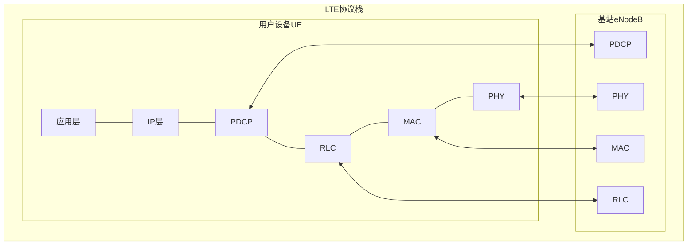

**协议层功能**：
- **PDCP**：IP头压缩、安全、重排序
- **RLC**：分段重组、ARQ重传
- **MAC**：混合ARQ、调度、多路复用
- **PHY**：编码调制、MIMO、OFDMA

#### LTE性能计算例题

**例题1：LTE资源块分配与吞吐量**

LTE系统，带宽20MHz，子载波间隔15kHz。每个资源块（RB）包含12个子载波×7个OFDM符号（普通CP）。使用16-QAM调制，编码率1/2，MIMO 2×2。求：(1) 系统总RB数；(2) 单个RB的数据速率；(3) 系统峰值吞吐量。

**解答**：

步骤1：计算总RB数
20MHz带宽可用子载波数：1200个（扣除保护频带）
$$N_{RB} = \frac{1200}{12} = 100 \text{ 个RB}$$

步骤2：单个RB数据速率
每个RB：$12 \times 7 = 84$ 个资源元素（RE）
其中导频RE约占12个，数据RE：$84 - 12 = 72$ 个

16-QAM：4 bit/symbol
编码率：1/2
MIMO：2流

单RB速率（每时隙0.5ms）：
$$R_{RB} = \frac{72 \times 4 \times \frac{1}{2} \times 2}{0.5 \times 10^{-3}}$$
$$= \frac{288}{0.5 \times 10^{-3}} = 576 \text{ kbps}$$

步骤3：系统峰值吞吐量
$$R_{peak} = 100 \times 576 = 57.6 \text{ Mbps}$$

实际使用64-QAM（6 bit）和编码率3/4时：
$$R_{实际} = 100 \times \frac{72 \times 6 \times \frac{3}{4} \times 2}{0.5 \times 10^{-3}}$$
$$= 100 \times 1296 = 129.6 \text{ Mbps}$$

**答案**：系统有100个RB，16-QAM时单RB速率576kbps，系统峰值57.6Mbps；64-QAM时可达129.6Mbps。

---

**例题2：LTE链路预算计算**

LTE下行链路参数：
- eNB发射功率：46dBm（40W）
- eNB天线增益：18dBi
- UE天线增益：0dBi
- 路径损耗：130dB
- 阴影衰落裕度：8dB
- 穿透损耗：20dB
- 干扰余量：3dB
- UE接收机灵敏度：-100dBm

求：(1) 接收信号强度；(2) 链路裕度；(3) 最大允许路径损耗。

**解答**：

步骤1：计算接收信号强度
$$RSRP = P_{tx} + G_{tx} + G_{rx} - L_{path} - L_{shadow} - L_{penetration}$$
$$= 46 + 18 + 0 - 130 - 8 - 20$$
$$= -94 \text{ dBm}$$

步骤2：计算链路裕度
$$M = RSRP - (Sensitivity + I_{margin})$$
$$= -94 - (-100 + 3)$$
$$= -94 - (-97) = 3 \text{ dB}$$

步骤3：最大允许路径损耗
$$L_{max} = P_{tx} + G_{tx} + G_{rx} - Sensitivity - I_{margin} - L_{shadow} - L_{penetration}$$
$$= 46 + 18 + 0 - (-100) - 3 - 8 - 20$$
$$= 133 \text{ dB}$$

**答案**：接收信号强度-94dBm，链路裕度3dB，最大允许路径损耗133dB。

---

## 5G新无线技术

### 5G技术特征

#### 三大应用场景

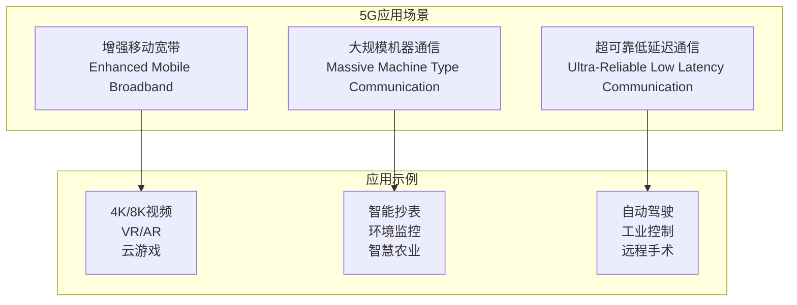

#### 关键性能指标

| 指标 | 4G LTE | 5G目标 | 提升倍数 |
|-----|--------|--------|----------|
| 峰值速率（下行） | 1Gbps | 20Gbps | 20x |
| 峰值速率（上行） | 150Mbps | 10Gbps | 67x |
| 用户体验速率 | 10Mbps | 100Mbps | 10x |
| 连接密度 | 10⁵设备/km² | 10⁶设备/km² | 10x |
| 空口延迟 | 10ms | 0.5ms | 20x |
| 可靠性（uRLLC） | 99% | 99.9999% | - |
| 能效 | 1x | 100x | 100x |
| 移动性 | 350km/h | 500km/h | - |

### 5G关键技术

#### 毫米波通信

> **毫米波**
> 
> 频率在30-300GHz的电磁波，具有大带宽但传播距离有限的特性。

**毫米波特点**：
- **大带宽**：可用带宽数GHz
- **高损耗**：路径损耗大
- **方向性强**：波束窄，定向传输
- **穿透性差**：易被障碍物阻挡

#### 大规模MIMO

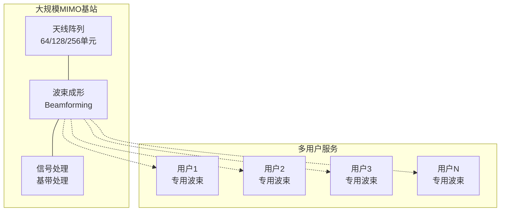

**大规模MIMO优势**：
- **空间分辨率**：精确的波束指向
- **干扰抑制**：多用户干扰消除
- **能效提升**：定向传输降低功耗
- **容量增加**：空间复用增益

#### 5G性能计算例题

**例题1：5G毫米波链路预算**

5G毫米波系统，载频28GHz，基站发射功率30dBm，基站天线增益25dBi，UE天线增益5dBi，传输距离200m，自由空间传播。求：(1) 路径损耗；(2) 接收信号强度；(3) 与Sub-6GHz（3.5GHz）对比。

**解答**：

步骤1：计算28GHz路径损耗
$$L_{fs}(dB) = 20\log_{10}(d) + 20\log_{10}(f) - 147.55$$
$$= 20\log_{10}(200) + 20\log_{10}(28000) - 147.55$$
$$= 46.02 + 88.94 - 147.55 = -12.59 \text{ dB}$$

等等，这个公式结果不对。让我用正确的公式：
$$L_{fs}(dB) = 32.45 + 20\log_{10}(d_{km}) + 20\log_{10}(f_{MHz})$$
$$= 32.45 + 20\log_{10}(0.2) + 20\log_{10}(28000)$$
$$= 32.45 - 13.98 + 88.94 = 107.41 \text{ dB}$$

步骤2：计算接收信号强度
$$RSRP = P_{tx} + G_{tx} + G_{rx} - L_{fs}$$
$$= 30 + 25 + 5 - 107.41 = -47.41 \text{ dBm}$$

步骤3：对比3.5GHz
$$L_{fs,3.5GHz} = 32.45 + 20\log_{10}(0.2) + 20\log_{10}(3500)$$
$$= 32.45 - 13.98 + 70.88 = 89.35 \text{ dB}$$

$$RSRP_{3.5GHz} = 30 + 18 + 0 - 89.35 = -41.35 \text{ dBm}$$

额外损耗：$107.41 - 89.35 = 18.06$ dB

**答案**：28GHz路径损耗107.4dB，接收功率-47.4dBm；相比3.5GHz额外损耗约18dB，需要更高天线增益补偿。

---

**例题2：5G网络切片资源分配**

5G基站总资源100个RB，需要支持三种切片：
- eMBB切片：要求100Mbps，每RB提供2Mbps
- uRLLC切片：要求10Mbps，但需要预留50% RB冗余保证可靠性
- mMTC切片：要求5Mbps，每RB提供0.5Mbps

求：(1) 各切片最少RB数；(2) 资源分配方案；(3) 是否能满足需求。

**解答**：

步骤1：计算各切片RB需求
eMBB：$\frac{100}{2} = 50$ RB

uRLLC：$\frac{10}{2} \times 1.5 = 7.5 \approx 8$ RB（包含50%冗余）

mMTC：$\frac{5}{0.5} = 10$ RB

步骤2：总需求
$$N_{total} = 50 + 8 + 10 = 68 \text{ RB} < 100 \text{ RB}$$

步骤3：资源分配方案
- uRLLC：8 RB（优先级最高，保证延迟）
- eMBB：50 RB（保证速率）
- mMTC：10 RB（灵活调度）
- 预留：32 RB（动态分配、负载均衡）

**答案**：各切片需RB分别为50、8、10个，总计68个，系统资源充足。预留32个RB用于峰值流量和动态调整。

---

**例题3：5G延迟分析**

5G uRLLC场景，需求端到端延迟≤1ms。已知：
- 无线接口传输时延（TTI）：0.125ms（mini-slot）
- 编码处理延迟：0.1ms
- 基站-核心网传输延迟：0.3ms
- 核心网处理延迟：0.2ms

求：(1) 总延迟；(2) 是否满足要求；(3) 与4G LTE对比（LTE TTI=1ms，总延迟约10-15ms）。

**解答**：

步骤1：计算5G总延迟
$$T_{5G} = T_{TTI} + T_{encode} + T_{transport} + T_{core}$$
$$= 0.125 + 0.1 + 0.3 + 0.2 = 0.725 \text{ ms}$$

考虑往返（UE到网络再返回）：
$$T_{RTT} = 0.725 \times 2 = 1.45 \text{ ms}$$

步骤2：判断是否满足
单向延迟0.725ms < 1ms（满足）
往返延迟1.45ms > 1ms（需要优化）

优化方案：边缘计算，减少核心网路径
$$T_{优化} = (0.125 + 0.1 + 0.05) \times 2 = 0.55 \text{ ms}$$

步骤3：与LTE对比
5G延迟：0.55-1.45ms
LTE延迟：10-15ms
**提升**：$\frac{10}{0.73} \approx 14$ 倍

**答案**：5G单向延迟0.73ms满足要求，优化后往返0.55ms。相比LTE的10-15ms，延迟降低约14倍，达到uRLLC要求。

#### 网络切片

> **网络切片**
> 
> 在统一的物理基础设施上创建多个虚拟的端到端网络，为不同应用提供定制化服务。

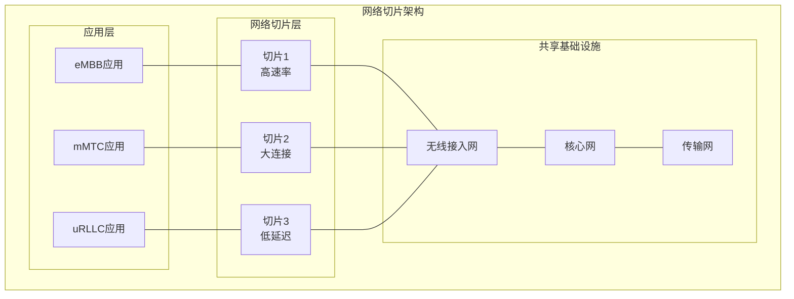

---
 
**下一章预告**：[7.5 无线网络：移动性管理](7.5无线网络：移动性管理.md) - 学习移动性管理的基本原理和实现机制。
