# 7.4 无线网络：蜂窝网络

## 本章目录

1. [蜂窝网络基本概念](#蜂窝网络基本概念)
2. [蜂窝网络体系结构](#蜂窝网络体系结构)
3. [移动通信技术演进](#移动通信技术演进)
4. [4G LTE技术详解](#4g-lte技术详解)
5. [5G新无线技术](#5g新无线技术)
6. [蜂窝网络 vs WiFi](#蜂窝网络-vs-wifi)

---

## 蜂窝网络基本概念

### 蜂窝系统原理

> **蜂窝网络**
> 
> 将服务区域划分成若干个小区（cell），每个小区由一个基站覆盖，通过频率复用实现大容量移动通信的网络系统。

#### 蜂窝结构

把覆盖区切成正六边形小区，相邻小区使用不同频率组以避免干扰；相距足够远的小区可复用同一频率组。下图为复用因子 $N=3$ 的频率复用，三种频率组（A/B/C）周期性铺满平面（每行错半格模拟六边形排布，相同字母表示复用同一频率）：

```
    A   B   C   A   B   C
  C   A   B   C   A   B
    B   C   A   B   C   A
  A   B   C   A   B   C
    C   A   B   C   A   B
```

每个小区由一个基站服务，相同字母的小区使用相同频率组。任一小区周围紧邻的小区都用不同频率，避免同频干扰。

**核心优势**：
- **频率复用**：同一频率在相隔足够远的小区重复使用，提升频谱利用率
- **功率控制**：小区半径小、发射功率低，降低干扰与功耗
- **容量扩展**：通过小区分裂（cell splitting）缩小小区即可增加系统容量
- **覆盖连续**：小区拼接覆盖大范围，配合切换保持通信连续

### 频率复用原理

#### 复用距离计算

**同频干扰保护**：
$$D = R \sqrt{3N}$$

其中：
- D：复用距离
- R：小区半径
- N：复用因子

注：六边形小区中复用因子只能取 $N = i^2 + ij + j^2$（$i,j$ 为非负整数），即 1, 3, 4, 7, 9, 12...，不是任意整数。

**典型复用模式**：

| 复用因子N | 复用距离D/R | 同频干扰保护 | 频谱效率 | 典型应用 |
|---------|------------|-------------|----------|---------|
| 1 | 1.7 | 弱（靠码分） | 最高 | CDMA系统 |
| 3 | 3.0 | 中等 | 高 | GSM密集区 |
| 4 | 3.5 | 较好 | 中等 | GSM配置 |
| 7 | 4.6 | 很好 | 中等 | GSM标准配置 |
| 12 | 6.0 | 极好 | 较低 | 早期AMPS |

注：CDMA 用扩频码区分用户，相邻小区可复用同一载频（$N=1$），靠码分隔离而非频率隔离，这是它与 FDMA/TDMA 系统的根本区别。

#### 频率复用计算例题

**例题1：蜂窝网络容量计算**

某GSM系统分配的频谱带宽为12.5MHz，信道带宽200kHz，复用因子N=7，每小区3个扇区。求：(1) 总信道数；(2) 每小区信道数；(3) 每扇区信道数。

**解答**：

步骤1：计算总信道数
$$N_{total} = \frac{B_{total}}{B_{channel}} = \frac{12.5 \times 10^6}{200 \times 10^3} = 62.5 \approx 62 \text{ 个信道}$$

步骤2：计算每小区信道数
$$N_{cell} = \frac{N_{total}}{N} = \frac{62}{7} \approx 8.86 \approx 8 \text{ 个信道}$$

步骤3：计算每扇区信道数
$$N_{sector} = \frac{N_{cell}}{3} = \frac{8}{3} \approx 2.67 \approx 2 \text{ 个信道}$$

**答案**：总共62个信道，每小区8个信道，每扇区2-3个信道。

---

**例题2：小区容量与负载分析**

某LTE小区，带宽20MHz，子载波间隔15kHz，有效子载波数1200个（其中导频、控制信道占200个），调制方式64-QAM（编码率3/4），MIMO 2×2。求：(1) 物理层峰值速率；(2) 若单用户平均速率需求2Mbps，该小区可支持多少并发用户？

**解答**：

步骤1：计算符号速率
每个子载波符号速率：15kHz
符号时间（含CP）：71.43μs，有效符号66.67μs

步骤2：计算数据速率
数据子载波数：$1200 - 200 = 1000$
每符号比特数：$\log_2(64) = 6$ 比特
编码后：$6 \times \frac{3}{4} = 4.5$ 比特
MIMO流数：2

物理层峰值速率：
$$R_{peak} = 1000 \times 15000 \times 4.5 \times 2$$
$$= 135 \times 10^6 \text{ bps} = 135 \text{ Mbps}$$

步骤3：计算用户容量（MAC层效率约70%）
$$R_{MAC} = 135 \times 0.7 = 94.5 \text{ Mbps}$$

并发用户数：
$$N_{users} = \frac{94.5}{2} = 47.25 \approx 47 \text{ 用户}$$

**答案**：物理层峰值135Mbps，考虑MAC开销后可支持约47个并发2Mbps用户。

---

**例题3：同频干扰分析（C/I计算）**

六边形蜂窝网络，复用因子N=7，路径损耗指数n=4。假设目标小区中心用户，受6个第一层同频小区干扰，距离都为D。求载干比C/I（dB）。

**解答**：

步骤1：建立功率关系
设小区半径为R，复用距离 $D = R\sqrt{3N} = R\sqrt{21} = 4.58R$

目标信号功率（距离R）：
$$C \propto R^{-n} = R^{-4}$$

每个干扰信号功率（距离D）：
$$I_i \propto D^{-n} = (4.58R)^{-4}$$

步骤2：计算载干比
$$\frac{C}{I} = \frac{R^{-4}}{6 \times (4.58R)^{-4}} = \frac{(4.58)^4}{6}$$
$$= \frac{439.7}{6} = 73.3$$

转换为dB：
$$\frac{C}{I}(dB) = 10\log_{10}(73.3) = 18.7 \text{ dB}$$

步骤3：边缘用户的C/I（最差情况）
边缘用户距目标基站约 $R$，距最近的同频干扰基站约 $D-R = (4.58-1)R = 3.58R$，其余 5 个干扰基站仍近似为 $D$：
$$\frac{C}{I}_{edge} = \frac{R^{-4}}{(3.58R)^{-4} + 5 \times (4.58R)^{-4}}$$
$$= \frac{1}{(3.58)^{-4} + 5 \times (4.58)^{-4}} = \frac{1}{\frac{1}{164.3} + \frac{5}{439.7}}$$
$$= \frac{1}{0.0061 + 0.0114} = \frac{1}{0.0175} = 57.1$$
$$\frac{C}{I}_{edge}(dB) = 10\log_{10}(57.1) = 17.6 \text{ dB}$$

**答案**：中心用户C/I约18.7dB，边缘用户约17.6dB。$N=7$ 提供足够的同频干扰保护（一般要求 C/I ≥ 18dB 左右）。

---

## 蜂窝网络体系结构

无论哪一代，蜂窝网络都可抽象为三段：**移动终端 → 无线接入网（基站）→ 核心网 → 外部网络（PSTN/Internet）**。各代的差异主要在接入网与核心网的具体网元上：

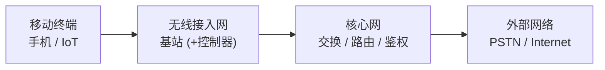

| 代际 | 接入网 | 核心网 |
|-----|--------|--------|
| 2G GSM | BTS + BSC | MSC / HLR / VLR（电路域为主） |
| 4G LTE | eNodeB（无独立控制器） | EPC：MME / SGW / PGW / HSS（全分组） |
| 5G | gNB | 5GC：AMF / SMF / UPF（服务化） |

### GSM网络架构

#### 系统组成

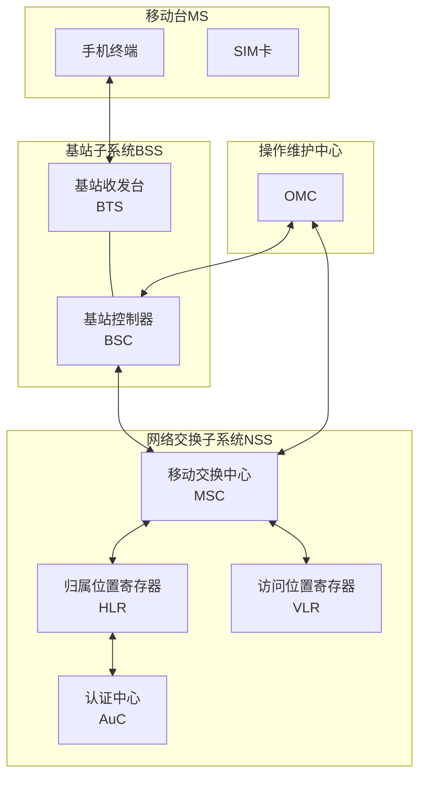

**网络元素功能**：

| 网络元素 | 英文全称 | 主要功能 |
|---------|---------|----------|
| MS | Mobile Station | 移动终端，包含手机和SIM卡 |
| BTS | Base Transceiver Station | 基站收发台，无线接口 |
| BSC | Base Station Controller | 基站控制器，无线资源管理 |
| MSC | Mobile Switching Center | 移动交换中心，呼叫控制 |
| HLR | Home Location Register | 归属位置寄存器，永久用户数据库 |
| VLR | Visitor Location Register | 访问位置寄存器，当前来访用户的临时数据 |
| AuC | Authentication Center | 认证中心，存储鉴权密钥与算法 |

### 现代蜂窝网络架构

#### LTE系统架构

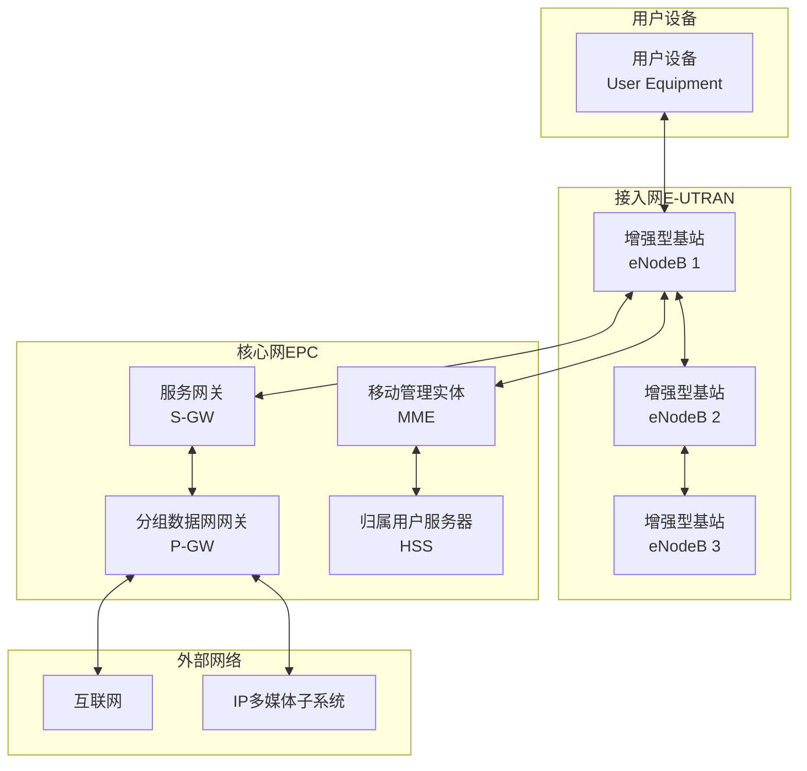

**LTE架构特点**：
- **扁平化架构**：取消 2G/3G 的 BSC/RNC，无线侧只剩 eNodeB，节点层次更少
- **全IP网络**：核心网 EPC 全分组化，承载语音也走 IP（VoLTE）
- **控制面/用户面分离**：MME 处理信令（控制面），SGW/PGW 转发数据（用户面）

**EPC 核心网元功能**：

| 网元 | 英文全称 | 平面 | 主要功能 |
|-----|---------|------|----------|
| MME | Mobility Management Entity | 控制面 | 接入控制、移动性管理、承载管理、鉴权 |
| S-GW | Serving Gateway | 用户面 | 本地移动锚点，转发用户数据，切换时缓存 |
| P-GW | PDN Gateway | 用户面 | 连接外部分组网，分配 IP、计费、策略执行 |
| HSS | Home Subscriber Server | 控制面 | 用户签约信息与鉴权数据库（相当于 LTE 的 HLR+AuC） |

### 移动性管理与切换机制

#### 切换类型与触发条件

> **切换（Handover）**
> 
> 移动用户在移动过程中，从一个小区切换到另一个小区，保持通信连续性的过程。

**切换分类**：

| 切换类型 | 定义 | 触发条件 | 中断时间 | 应用场景 |
|---------|------|---------|---------|---------|
| 硬切换 | 先断后连 | 信号质量下降 | 数十ms | 2G/3G/LTE |
| 软切换 | 先连后断 | 同时连接多基站 | 近似0 | CDMA系统 |
| 更软切换 | 同基站扇区间 | 扇区信号变化 | 近似0 | CDMA扇区 |

注：LTE 仍属硬切换（先断后连），但通过提前测量、源/目标基站间预先准备资源，把中断时间压到很短（理论值约 27.5ms）。软切换是 CDMA 特有的，因为相邻小区同频，终端可同时与多个基站保持链路。

**切换触发条件**：
1. **信号强度（RSSI）下降**：低于阈值
2. **信号质量（C/I）恶化**：干扰增加
3. **距离过远**：时间提前量超限
4. **负载均衡**：小区过载
5. **业务需求**：切换到更优质网络

#### LTE切换流程详解

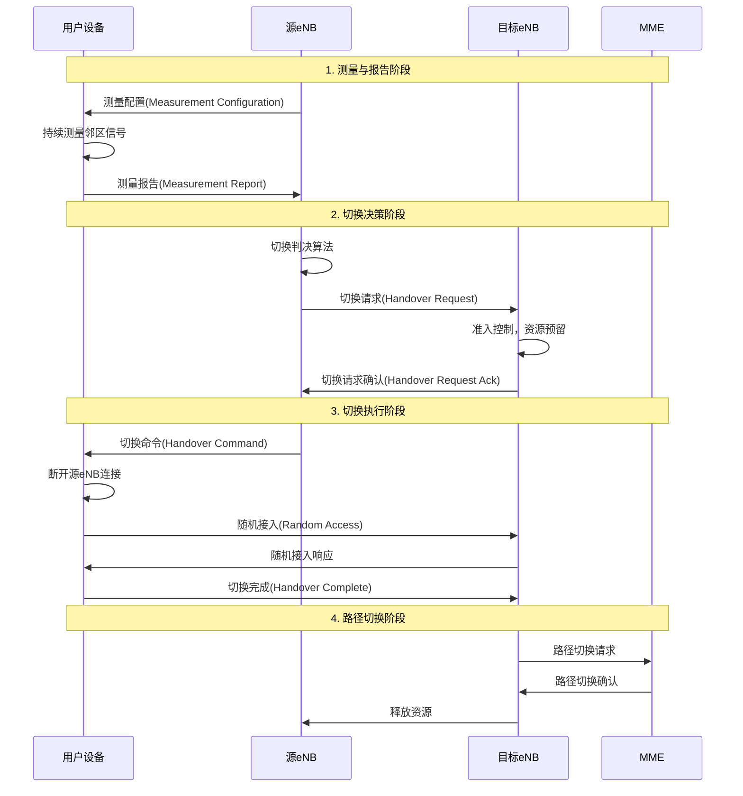

**切换判决算法**：

**事件A3触发**（最常用）：
$$\text{Neighbour\_RSRP} > \text{Serving\_RSRP} + \text{Offset} + \text{Hysteresis}$$

其中：
- Offset：偏移量（可正可负）
- Hysteresis：滞后量（防止乒乓效应）
- 时间窗（TTT）：条件持续满足的时间

**切换时延构成**：测量与上报、源/目标基站切换准备、空口切换执行（随机接入到切换完成）三段之和。其中测量上报受测量周期与 TTT 影响最大，空口执行时间相对很短。

#### 切换性能计算例题

**例题1：切换区域与切换次数**

某高速公路，小区半径R=1km，车速v=120km/h。求：(1) 穿越一个小区的时间；(2) 行驶100km需要切换多少次？

**解答**：

步骤1：计算穿越时间
$$v = 120 \text{ km/h} = 33.33 \text{ m/s}$$

穿越小区直径（最长路径）：$2R = 2$ km
$$T = \frac{2000}{33.33} = 60 \text{ 秒}$$

步骤2：计算切换次数
100km内的小区数（最坏情况，沿直径穿越）：
$$N = \frac{100}{2} = 50 \text{ 个小区}$$

切换次数（进入新小区即切换）：
$$N_{handover} = 50 - 1 = 49 \text{ 次}$$

平均切换间隔：
行驶 100km 总耗时 $\frac{100}{120} \times 3600 = 3000$ 秒：
$$T_{interval} = \frac{3000}{49} \approx 61 \text{ 秒}$$

**答案**：穿越单个小区约60秒，行驶100km需要切换约49次，平均约每61秒切换一次（与穿越单小区时间一致）。

---

**例题2：切换失败概率分析**

某LTE网络，测量周期200ms，TTT（Time to Trigger）=160ms，切换执行时间27.5ms，总切换延迟387.5ms。用户以100km/h速度移动，小区边界信号下降斜率为1dB/m。切换触发点距小区边界50m，信号跌破最低门限需下降10dB。判断切换是否成功。

**解答**：

步骤1：计算移动距离
$$v = 100 \text{ km/h} = 27.78 \text{ m/s}$$

切换延迟内移动距离：
$$d = 27.78 \times 0.3875 = 10.76 \text{ m}$$

步骤2：判断切换成功性
触发切换时距边界：50m
切换完成时距边界：$50 - 10.76 = 39.24$ m

信号余量：$39.24 \times 1 = 39.24$ dB > 10dB（门限）

**答案**：切换可以成功完成，有充足的信号余量（约39dB > 10dB最低要求）。

---

**例题3：乒乓效应分析**

两个相邻小区A和B，边界处用户测得：$RSRP_A = -95$ dBm，$RSRP_B = -94$ dBm，信号波动±2dB。切换参数：Offset=0dB，Hysteresis=3dB，TTT=480ms。分析是否会发生乒乓切换。

**解答**：

步骤1：A切换到B的条件
$$RSRP_B > RSRP_A + \text{Offset} + \text{Hysteresis}$$
$$-94 > -95 + 0 + 3$$
$$-94 > -92$$ （不满足）

即使B最强（-92dBm），A最弱（-97dBm）：
$$-92 > -97 + 3$$
$$-92 > -94$$ （满足）

步骤2：B切换回A的条件
假设已切换到B，现在判断是否切回A：
$$RSRP_A > RSRP_B + 3$$

即使A最强（-93dBm），B最弱（-96dBm）：
$$-93 > -96 + 3$$
$$-93 > -93$$ （刚好临界）

步骤3：TTT保护作用
由于设置了480ms的TTT，瞬时波动不会触发切换。只有信号稳定优于对方3dB并持续480ms才会切换。

**答案**：3dB的Hysteresis和480ms的TTT有效防止了乒乓效应。在±2dB波动下，切换条件不易满足。

---

## 移动通信技术演进

### 1G到5G发展历程

#### 技术代际特征

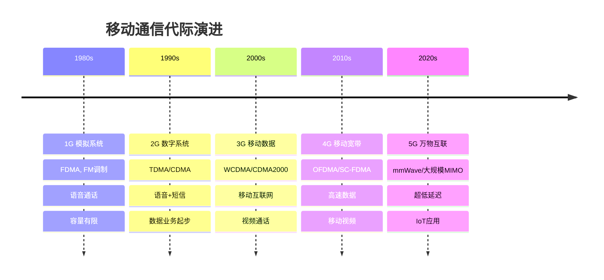

### 多址技术演进

#### 多址方式对比

| 代际 | 多址技术 | 频域 | 时域 | 码域 | 特点 |
|-----|---------|------|------|------|------|
| 1G | FDMA | 分割 | 连续 | 无 | 简单，效率低 |
| 2G | TDMA | 分割 | 分割 | 无 | 数字化，中等效率 |
| 2G/3G | CDMA | 共享 | 共享 | 分割 | 抗干扰，高容量 |
| 4G | OFDMA/SC-FDMA | 灵活 | 灵活 | — | 高效，低干扰 |
| 5G | OFDMA（灵活参数集） | 灵活 | 灵活 | — | 子载波间隔可变，适配多场景 |

注：5G NR 仍以 OFDMA 为基础多址，但引入可变子载波间隔（numerology）适配 eMBB/uRLLC/mMTC。NOMA（功率域非正交多址）是研究中的增强方向，未成为 NR 的强制特性。

#### 调制技术进步

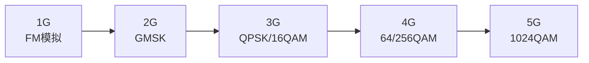

阶数越高，单符号承载比特越多、频谱效率越高，但要求更高的信噪比、对干扰更敏感，因此只在信道质量好时（近基站）才会启用高阶调制。

---

## 4G LTE技术详解

### LTE关键技术

#### OFDMA技术

> **正交频分多址（OFDMA）**
> 
> 将系统带宽分成多个正交子载波，不同用户分配不同的子载波组合。

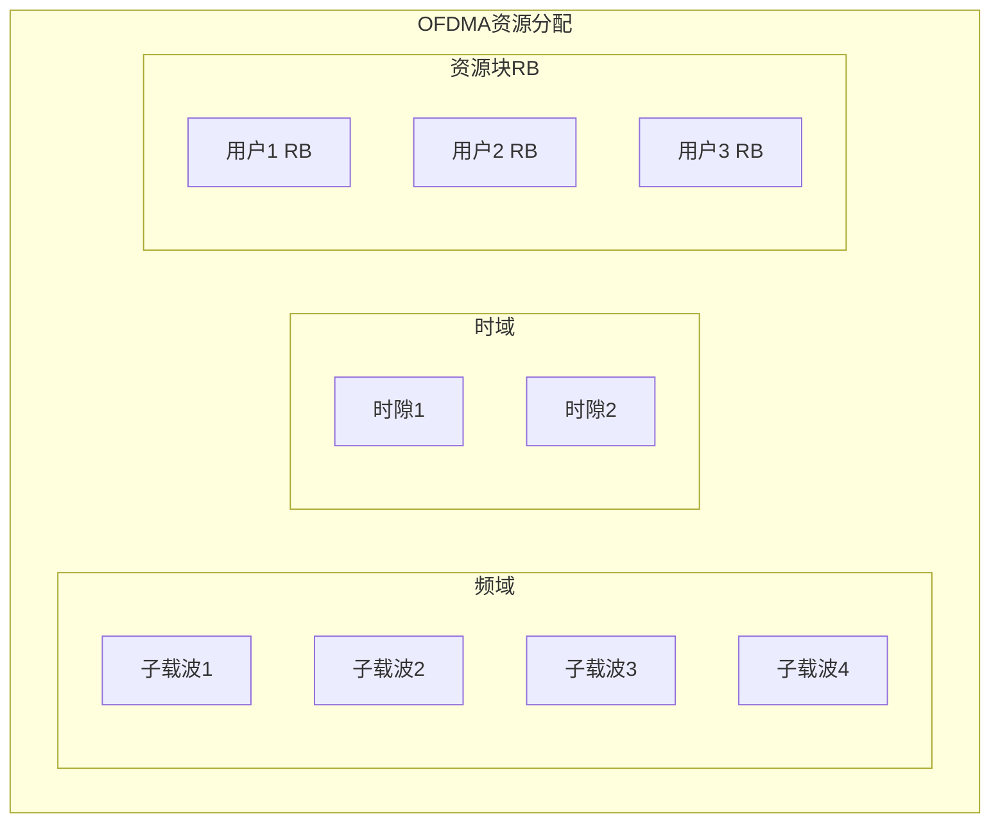

**OFDMA优势**：
- **频谱效率高**：正交子载波无干扰
- **抗多径衰落**：长符号周期+保护间隔
- **灵活资源分配**：按需分配频域资源
- **低复杂度**：FFT实现

#### MIMO技术

> **多输入多输出（MIMO）**
> 
> 使用多个天线发送和接收，提高频谱效率和可靠性。

**MIMO分类**：
- **SISO**：单输入单输出
- **SIMO**：单输入多输出（接收分集）
- **MISO**：多输入单输出（发送分集）
- **MIMO**：多输入多输出（空间复用）

**MIMO增益**：
$$C = \log_2\det\left(I + \frac{\rho}{N_t} HH^H\right)$$

其中：
- ρ：信噪比
- Nt：发送天线数
- H：信道矩阵

### LTE协议栈

#### 用户平面协议栈

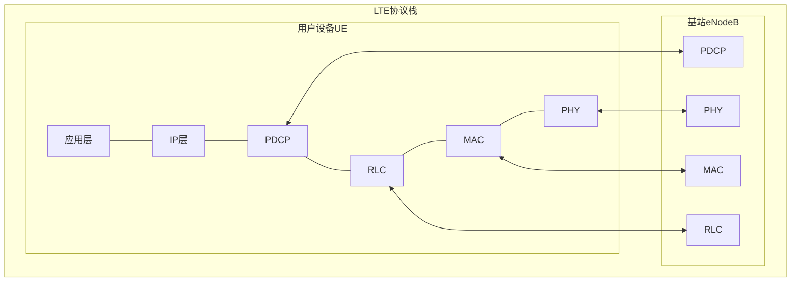

**协议层功能**：
- **PDCP**：IP头压缩、安全、重排序
- **RLC**：分段重组、ARQ重传
- **MAC**：混合ARQ、调度、多路复用
- **PHY**：编码调制、MIMO、OFDMA

#### LTE性能计算例题

**例题1：LTE资源块分配与吞吐量**

LTE系统，带宽20MHz，子载波间隔15kHz。每个资源块（RB）包含12个子载波×7个OFDM符号（普通CP）。使用16-QAM调制，编码率1/2，MIMO 2×2。求：(1) 系统总RB数；(2) 单个RB的数据速率；(3) 系统峰值吞吐量。

**解答**：

步骤1：计算总RB数
20MHz带宽可用子载波数：1200个（扣除保护频带）
$$N_{RB} = \frac{1200}{12} = 100 \text{ 个RB}$$

步骤2：单个RB数据速率
每个RB：$12 \times 7 = 84$ 个资源元素（RE）
其中导频RE约占12个，数据RE：$84 - 12 = 72$ 个

16-QAM：4 bit/symbol
编码率：1/2
MIMO：2流

单RB速率（每时隙0.5ms）：
$$R_{RB} = \frac{72 \times 4 \times \frac{1}{2} \times 2}{0.5 \times 10^{-3}}$$
$$= \frac{288}{0.5 \times 10^{-3}} = 576 \text{ kbps}$$

步骤3：系统峰值吞吐量
$$R_{peak} = 100 \times 576 = 57.6 \text{ Mbps}$$

实际使用64-QAM（6 bit）和编码率3/4时：
$$R_{实际} = 100 \times \frac{72 \times 6 \times \frac{3}{4} \times 2}{0.5 \times 10^{-3}}$$
$$= 100 \times 1296 = 129.6 \text{ Mbps}$$

**答案**：系统有100个RB，16-QAM时单RB速率576kbps，系统峰值57.6Mbps；64-QAM时可达129.6Mbps。

---

**例题2：LTE链路预算计算**

LTE下行链路参数：
- eNB发射功率：46dBm（40W）
- eNB天线增益：18dBi
- UE天线增益：0dBi
- 路径损耗：130dB
- 阴影衰落裕度：8dB
- 穿透损耗：20dB
- 干扰余量：3dB
- UE接收机灵敏度：-100dBm

求：(1) 接收信号强度；(2) 链路裕度；(3) 最大允许路径损耗。

**解答**：

步骤1：计算接收信号强度
$$RSRP = P_{tx} + G_{tx} + G_{rx} - L_{path} - L_{shadow} - L_{penetration}$$
$$= 46 + 18 + 0 - 130 - 8 - 20$$
$$= -94 \text{ dBm}$$

步骤2：计算链路裕度
$$M = RSRP - (Sensitivity + I_{margin})$$
$$= -94 - (-100 + 3)$$
$$= -94 - (-97) = 3 \text{ dB}$$

步骤3：最大允许路径损耗
$$L_{max} = P_{tx} + G_{tx} + G_{rx} - Sensitivity - I_{margin} - L_{shadow} - L_{penetration}$$
$$= 46 + 18 + 0 - (-100) - 3 - 8 - 20$$
$$= 133 \text{ dB}$$

**答案**：接收信号强度-94dBm，链路裕度3dB，最大允许路径损耗133dB。

---

## 5G新无线技术

### 5G技术特征

#### 三大应用场景

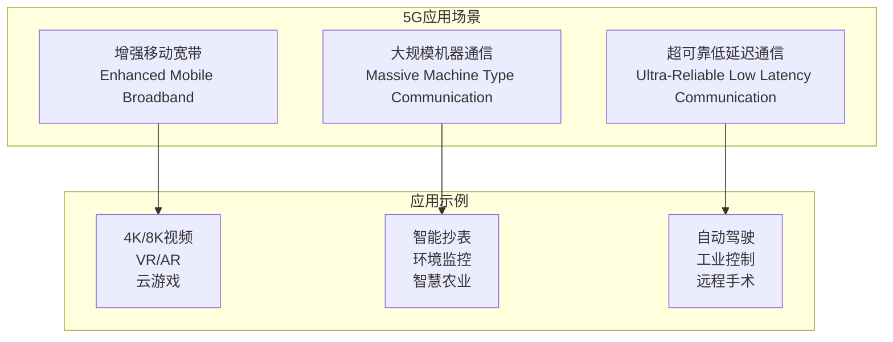

#### 关键性能指标

| 指标 | 4G LTE | 5G目标 | 提升倍数 |
|-----|--------|--------|----------|
| 峰值速率（下行） | 1Gbps | 20Gbps | 20x |
| 峰值速率（上行） | 150Mbps | 10Gbps | 67x |
| 用户体验速率 | 10Mbps | 100Mbps | 10x |
| 连接密度 | 10⁵设备/km² | 10⁶设备/km² | 10x |
| 用户面延迟 | 10ms | 1ms（uRLLC） | 10x |
| 可靠性（uRLLC） | — | 99.999% | — |
| 能效 | 1x | 100x | 100x |
| 移动性 | 350km/h | 500km/h | — |

注：以上为 ITU IMT-2020 提出的 5G 设计目标，并非任一商用网络的实测值。

#### 5G系统架构（SA独立组网）

无线侧 gNB 组成 NG-RAN，核心网 5GC 采用服务化架构，并进一步贯彻控制面/用户面分离（CUPS）：

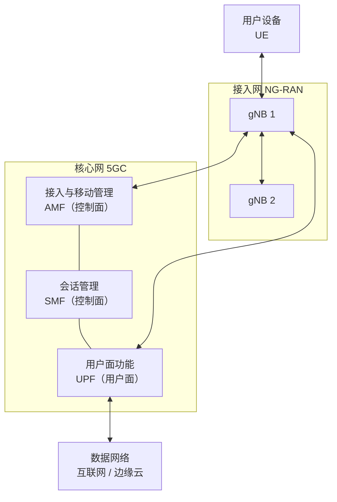

注：5GC 网元与 EPC 大致对应——AMF+SMF 承担原 MME 的控制功能，UPF 对应 SGW/PGW 的转发功能。UPF 可下沉到网络边缘，缩短数据路径，支撑 uRLLC 的低延迟。

### 5G关键技术

#### 毫米波通信

> **毫米波**
> 
> 波长在毫米量级（频率约 30-300GHz）的电磁波，具有大带宽但传播距离有限的特性。5G FR2 频段从约 24GHz 起，习惯上也并入毫米波范畴。

**毫米波特点**：
- **大带宽**：可用带宽达数 GHz，支持极高速率
- **高损耗**：频率越高自由空间损耗越大，覆盖半径小
- **方向性强**：波束窄，需波束成形定向传输
- **穿透性差**：易被建筑、人体、雨衰阻挡

#### 大规模MIMO

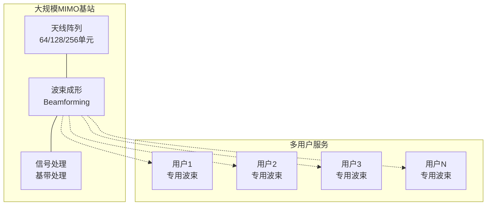

**大规模MIMO优势**：
- **空间分辨率**：精确的波束指向
- **干扰抑制**：多用户干扰消除
- **能效提升**：定向传输降低功耗
- **容量增加**：空间复用增益

#### 5G性能计算例题

**例题1：5G毫米波链路预算**

5G毫米波系统，载频28GHz，基站发射功率30dBm，基站天线增益25dBi，UE天线增益5dBi，传输距离200m，自由空间传播。求：(1) 路径损耗；(2) 接收信号强度；(3) 与Sub-6GHz（3.5GHz）对比。

**解答**：

步骤1：计算28GHz路径损耗

自由空间损耗公式（$d$ 用 km，$f$ 用 MHz）：
$$L_{fs}(dB) = 32.45 + 20\log_{10}(d_{km}) + 20\log_{10}(f_{MHz})$$
$$= 32.45 + 20\log_{10}(0.2) + 20\log_{10}(28000)$$
$$= 32.45 - 13.98 + 88.94 = 107.41 \text{ dB}$$

步骤2：计算接收信号强度
$$RSRP = P_{tx} + G_{tx} + G_{rx} - L_{fs}$$
$$= 30 + 25 + 5 - 107.41 = -47.41 \text{ dBm}$$

步骤3：对比3.5GHz（收发增益取相同值，只看频率带来的路损差）
$$L_{fs,3.5GHz} = 32.45 + 20\log_{10}(0.2) + 20\log_{10}(3500)$$
$$= 32.45 - 13.98 + 70.88 = 89.35 \text{ dB}$$

额外损耗：$107.41 - 89.35 = 18.06$ dB

注：路损与频率平方成正比，频率提高 8 倍（3.5→28GHz）即多约 $20\log_{10}8 = 18$ dB 损耗。毫米波正是用大规模天线阵列形成的高增益波束来补偿这一额外损耗。

**答案**：28GHz路径损耗107.4dB，接收功率-47.4dBm；相比同距离的3.5GHz多约18dB损耗，需更高天线增益补偿。

---

**例题2：5G网络切片资源分配**

5G基站总资源100个RB，需要支持三种切片：
- eMBB切片：要求100Mbps，每RB提供2Mbps
- uRLLC切片：要求10Mbps，但需要预留50% RB冗余保证可靠性
- mMTC切片：要求5Mbps，每RB提供0.5Mbps

求：(1) 各切片最少RB数；(2) 资源分配方案；(3) 是否能满足需求。

**解答**：

步骤1：计算各切片RB需求
eMBB：$\frac{100}{2} = 50$ RB

uRLLC：$\frac{10}{2} \times 1.5 = 7.5 \approx 8$ RB（包含50%冗余）

mMTC：$\frac{5}{0.5} = 10$ RB

步骤2：总需求
$$N_{total} = 50 + 8 + 10 = 68 \text{ RB} < 100 \text{ RB}$$

步骤3：资源分配方案
- uRLLC：8 RB（优先级最高，保证延迟）
- eMBB：50 RB（保证速率）
- mMTC：10 RB（灵活调度）
- 预留：32 RB（动态分配、负载均衡）

**答案**：各切片需RB分别为50、8、10个，总计68个，系统资源充足。预留32个RB用于峰值流量和动态调整。

---

**例题3：5G延迟分析**

5G uRLLC场景，需求端到端延迟≤1ms。已知：
- 无线接口传输时延（TTI）：0.125ms（mini-slot）
- 编码处理延迟：0.1ms
- 基站-核心网传输延迟：0.3ms
- 核心网处理延迟：0.2ms

求：(1) 总延迟；(2) 是否满足要求；(3) 与4G LTE对比（LTE TTI=1ms，总延迟约10-15ms）。

**解答**：

步骤1：计算5G总延迟
$$T_{5G} = T_{TTI} + T_{encode} + T_{transport} + T_{core}$$
$$= 0.125 + 0.1 + 0.3 + 0.2 = 0.725 \text{ ms}$$

考虑往返（UE到网络再返回）：
$$T_{RTT} = 0.725 \times 2 = 1.45 \text{ ms}$$

步骤2：判断是否满足
单向延迟0.725ms < 1ms（满足）
往返延迟1.45ms > 1ms（需要优化）

优化方案：边缘计算，减少核心网路径
$$T_{优化} = (0.125 + 0.1 + 0.05) \times 2 = 0.55 \text{ ms}$$

步骤3：与LTE对比
5G延迟：0.55-1.45ms
LTE延迟：10-15ms
**提升**：$\frac{10}{0.73} \approx 14$ 倍

**答案**：5G单向延迟0.73ms满足要求，优化后往返0.55ms。相比LTE的10-15ms，延迟降低约一个数量级，达到uRLLC要求。

---

#### 网络切片

> **网络切片**
> 
> 在统一的物理基础设施上创建多个虚拟的端到端网络，为不同应用提供定制化服务。

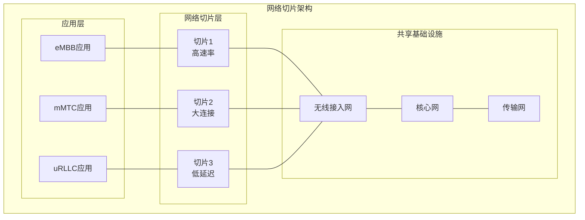

---

## 蜂窝网络 vs WiFi

两者都是无线接入，但定位不同。WiFi（[7.3](7.3无线网络：WiFi技术.md)）面向局域、免授权频段、自管理；蜂窝面向广域、授权频段、运营商集中管理。

| 维度 | 蜂窝网络 | WiFi |
|-----|---------|------|
| 覆盖范围 | 广域（小区半径数百米~数十km） | 局域（数十米） |
| 频谱 | 授权频段（运营商持牌） | 免授权频段（2.4/5/6GHz） |
| 接入控制 | 基站集中调度（无竞争） | CSMA/CA 竞争接入 |
| 移动性 | 高速移动下的无缝切换 | 漫游能力弱，切换不连续 |
| 鉴权 | SIM 卡 + 核心网鉴权 | 密码 / 企业级 802.1X |
| 部署主体 | 运营商 | 个人 / 企业自建 |

易混：

- **接入方式**——蜂窝由基站统一分配资源（调度型），无线信道无竞争冲突；WiFi 用 CSMA/CA 抢占信道（竞争型）。这是二者在 MAC 层最根本的区别。
- **频率复用 vs 信道选择**——蜂窝的"频率复用"是系统级规划（相隔足够远才复用同一频率组）；WiFi 的"信道"是单 AP 选一个相对空闲的信道，二者不是一回事。

---
 
**下一章预告**：[7.5 无线网络：移动性管理](7.5无线网络：移动性管理.md) - 学习移动性管理的基本原理和实现机制。
