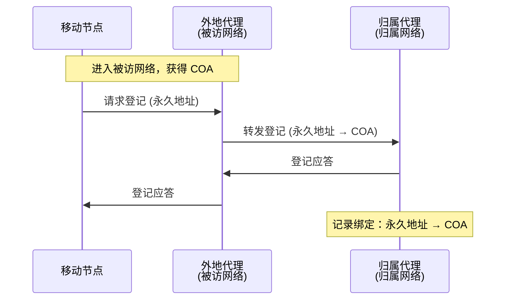
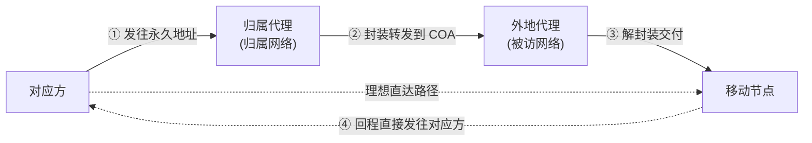
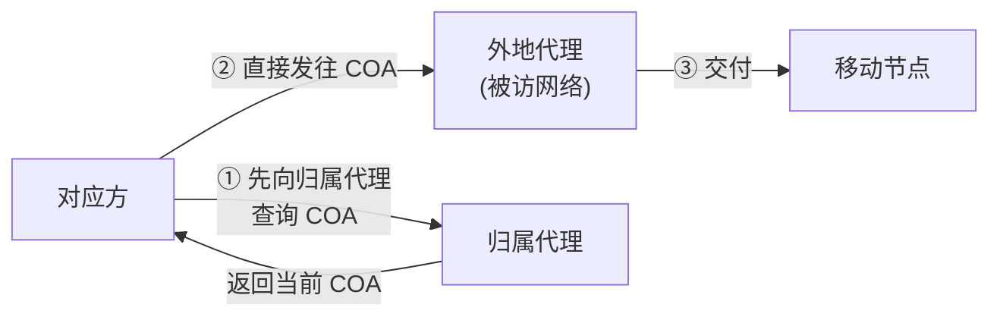

# 7.5 无线网络：移动性管理

## 目录

1. [移动性管理的两大任务](#移动性管理的两大任务)
2. [寻址与术语](#寻址与术语)
3. [间接路由到移动节点](#间接路由到移动节点)
4. [直接路由到移动节点](#直接路由到移动节点)
5. [切换：移动中的连接转移](#切换移动中的连接转移)
6. [位置管理的开销权衡](#位置管理的开销权衡)

---

## 移动性管理的两大任务

前面几节默认主机接入点固定。一旦主机在通信过程中改变接入网络，就要回答两个独立的问题：

- **找得到（定位）**：对应方发数据时，网络如何知道移动节点此刻在哪？
- **不中断（路由）**：移动节点换了网络、换了地址，已建立的连接如何继续？

本节抽象出这套**与具体技术无关**的原理框架。它在 IP 层的落地是移动 IP（见 [7.6 移动IP](7.6无线网络：移动IP.md)），在蜂窝网络中的落地是 HLR/VLR 与切换（见 [7.7 蜂窝移动性](7.7无线网络：蜂窝移动性.md)）。

> 注：移动性有不同程度。本节关注最难的一档——主机在通信过程中跨网络移动且要保持连接。若主机只在不通信时换网络（如笔记本回家重连 WiFi），靠 DHCP 重新取地址即可，不需要移动性管理。

### 移动性的程度

```
低 ←─────────────────────────────────────────────→ 高
不动      只在不通信时换网络      通信中换网络        通信中频繁换网络
(无需处理)  (DHCP 即可)        (需保持连接)      (需快速切换)
                              └──── 移动性管理的核心 ────┘
```

---

## 寻址与术语

移动性管理沿用蜂窝网络的思路：每个移动节点有一个**永久的"家"**，由家来追踪它当前漫游到了哪里。

> **归属网络（home network）**：移动节点的"永久居所"，由其永久地址的网络前缀确定。
>
> **被访网络（visited / foreign network）**：移动节点当前漫游所在的网络。

| 术语 | 含义 |
|------|------|
| 永久地址（permanent address） | 移动节点的固定身份标识，属于归属网络，不随移动改变 |
| 转交地址（care-of address, COA） | 移动节点在被访网络获得的临时地址，标识其**当前位置** |
| 归属代理（home agent） | 归属网络中代表移动节点行事的实体，记录其当前 COA |
| 外地代理（foreign agent） | 被访网络中代表移动节点行事的实体，协助登记并中继数据 |
| 对应方（correspondent） | 与移动节点通信的另一端 |

> 易混：**永久地址 vs 转交地址**。永久地址回答"它是谁"（身份），转交地址回答"它在哪"（位置）。两者解耦正是移动性管理的核心——对应方只认永久地址，而网络靠 COA 把分组送达当前位置。这与 [6.4](6.4链路层：交换局域网.md) 中"IP 标识身份、MAC 标识本地接口"的分层思想一脉相承，区别在于这里要让身份与位置在移动中持续解耦。

### 登记：让归属网络知道 COA

移动节点进入被访网络后，先获得 COA，再把"永久地址 → COA"的绑定登记到归属代理。此后归属代理就知道该把发往永久地址的分组转到哪个 COA。



> 注：登记的协议细节（消息格式、生命期、认证、IPv6 中可省去外地代理等）属于移动 IP，见 [7.6](7.6无线网络：移动IP.md)。本节只需理解：登记之后，归属代理持有当前 COA。

---

## 间接路由到移动节点

对应方不感知移动性，它只会把分组发往移动节点的**永久地址**。分组因此先到达归属网络，由归属代理截获并转发到 COA——这就是**间接路由**。



间接路由的要点：

- **对外透明**：对应方完全不知道移动节点已漫游，照常用永久地址通信。
- **归属代理截获 + 转发**：归属代理把发往永久地址的分组用隧道封装到 COA。
- **回程通常直发**：移动节点回复对应方时，可用对应方地址直接发送，不必再绕归属代理。

> **三角路由问题（triangle routing）**
>
> 即使对应方与移动节点近在咫尺，去程分组也必须绕到（可能很远的）归属代理再折回，路径次优。

```
对应方(北京) ──①────→ 归属代理(广州) ──②──→ 移动节点(天津)
        └──────────── 理想直达 ──────────────┘
                  (但分组实际绕行广州)
```

> 易混：三角路由的低效**只在去程**（对应方→移动节点）。回程移动节点→对应方一般是直达的，所以"三角"是不对称的。

间接路由的另一个好处是**屏蔽移动**：移动节点从一个被访网络换到另一个，只需向归属代理重新登记新 COA，对应方和正在进行的连接都不受影响。

> 注：去程隧道封装（IP-in-IP）、回程的反向隧道、以及消除三角路由的路由优化（绑定更新让对应方直接发往 COA），都属于移动 IP 的协议机制，详见 [7.6](7.6无线网络：移动IP.md)。

---

## 直接路由到移动节点

间接路由透明但低效。**直接路由**让对应方直接把分组发往 COA，绕开三角路由。



直接路由的代价是**打破透明性**：对应方一侧需要一个"对应方代理"先向归属代理查询 COA，之后才能直发。这把复杂度从网络转移给了对应方。

### 移动用户在直接路由下再次切换

间接路由下，移动节点换网络只需重新登记，对应方无感。直接路由下，对应方握着的是**旧 COA**，移动节点一旦再换网络，旧 COA 失效——若每次切换都回头通知所有对应方，开销大且时延高。

解决办法是**锚外地代理（anchor foreign agent）**：把会话开始时所在被访网络的外地代理设为"锚点"。

```
对应方 ──→ 锚外地代理(会话起点) ──→ 当前外地代理 ──→ 移动节点
            (COA 在此固定)         (随移动更新)
```

- 对应方始终把分组发往**锚外地代理**（COA 在对应方看来不变）。
- 移动节点切换到新被访网络时，只向锚外地代理登记新位置。
- 锚外地代理把分组**链式转发**到移动节点当前所在的外地代理。

这样，后续切换被局部化在外地代理之间处理，对应方无需重新查询、连接不中断。代价是分组可能经过多跳外地代理的转发链。

> 易混：**间接路由 vs 直接路由**。
> - 间接路由：对应方透明、永远经归属代理（三角路由低效），移动节点切换只需向归属代理登记。
> - 直接路由：去程高效、绕开归属代理，但对应方需先查 COA（非透明），且移动节点再切换要靠锚外地代理维持连接。

---

## 切换：移动中的连接转移

定位解决"找得到"，切换解决"换接入点时不中断"。

> **切换（handoff / handover）**：移动节点从一个基站（接入点）转移到另一个基站，同时保持正在进行的通信。

按连接断开与建立的先后，分两类：

| 类型 | 时序 | 中断 | 典型场景 |
|------|------|------|----------|
| 硬切换（hard handoff） | 先断后连（break-before-make） | 有短暂中断 | GSM、Wi-Fi |
| 软切换（soft handoff） | 先连后断（make-before-break） | 几乎无中断 | CDMA |

切换的基本触发依据是信号强度：服务基站信号弱到一定程度、且目标基站更强时触发。为防止两基站信号在边界处来回交替而**反复切换（乒乓效应）**，引入迟滞余量 $H$：

$$RSS_{target} > RSS_{serving} + H$$

只有目标信号比当前信号强出 $H$ 才切换。$H$ 太小会乒乓切换，太大会延迟必要切换，工程上常取数 dB。

> 注：蜂窝网络中切换的完整信令流程（GSM 的 MSC 内/间切换、LTE 的 X2/S1 切换）、切换时延的量化分析、以及条件切换等优化，见 [7.7 蜂窝移动性](7.7无线网络：蜂窝移动性.md)。本节只点明切换的两类时序与防乒乓原理。

---

## 位置管理的开销权衡

蜂窝网络用两级数据库实现"找得到"，正是归属/被访网络思想的具体化：

- **HLR（归属位置寄存器）**：移动用户的"家"，存永久签约信息和当前所在 VLR 的指针，对应归属代理。
- **VLR（访问位置寄存器）**：用户当前所在区域的临时记录，对应被访网络。

定位的开销来自两件相互制约的事：

- **位置更新**：移动节点跨越位置区边界时上报，使网络持续知道它在哪。
- **寻呼（paging）**：有呼叫到达时，在用户可能所在的范围内广播寻找它。

> 易混：**位置区越大，更新越少但寻呼越广；位置区越小，寻呼越省但更新越频**。两者此消彼长，存在使总开销最小的位置区大小。

$$C_{total} = C_{update} + C_{paging}$$

直觉上，高速移动、低呼叫频率的用户适合**大位置区**（少更新）；低速、高呼叫频率的用户适合**小位置区**（省寻呼）。

> 注：位置区大小的最优化求解、HLR/VLR 的具体登记流程、寻呼策略（顺序/并行）的量化对比与例题，均在 [7.7 蜂窝移动性](7.7无线网络：蜂窝移动性.md)。这里只给出权衡关系本身。

---

**下一节**：[7.6 无线网络：移动IP](7.6无线网络：移动IP.md)
