# 7.5 无线网络：移动性管理

## 本章目录

1. [移动性基本概念](#移动性基本概念)
2. [位置管理机制](#位置管理机制)
3. [切换管理技术](#切换管理技术)
4. [移动IP原理](#移动ip原理)
5. [移动性能优化](#移动性能优化)

---

## 移动性基本概念

### 移动性定义与分类

> **移动性（Mobility）**
> 
> 移动节点在网络中改变其接入点位置，同时维持ongoing通信会话的能力。

#### 移动性类型

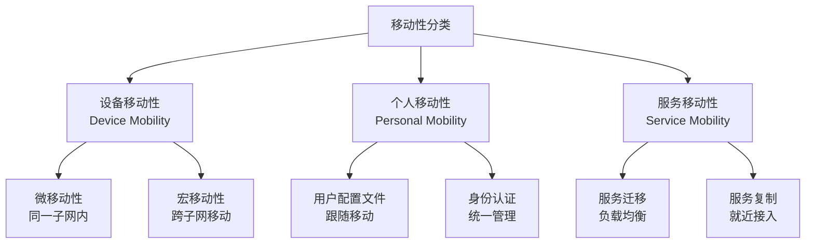

**移动性挑战**：
- **地址变更**：IP地址随位置改变
- **路由更新**：网络路由表需要更新
- **会话连续性**：保持正在进行的通信
- **QoS保证**：维持服务质量水平

### 移动环境特征

#### 网络拓扑动态性

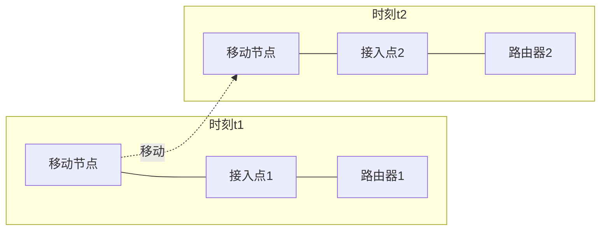

**动态特征影响**：
- **连接不稳定**：信号强度变化
- **带宽波动**：网络条件变化
- **延迟不可预测**：路径改变导致
- **丢包率增加**：切换过程中断

---

## 位置管理机制

### 位置注册与更新

> **位置管理**
> 
> 跟踪移动节点当前位置，维护位置数据库，支持呼叫路由和寻址的管理功能。

#### 两层位置管理

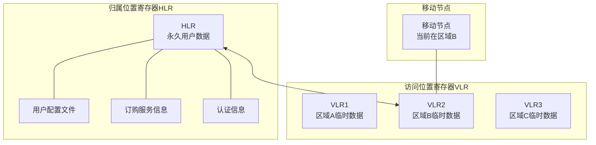

#### 位置更新策略

**基于距离的更新**：
- 移动节点移动超过阈值距离时更新
- 简单实现，但可能更新频繁

**基于时间的更新**：
- 定期进行位置更新
- 避免频繁更新，但可能位置信息过时

**基于移动的更新**：
- 进入新的位置区域时更新
- 平衡更新频率和位置准确性

### 寻呼机制

> **寻呼（Paging）**
> 
> 当有呼叫到达时，在移动节点可能所在的区域内广播寻找移动节点的过程。

#### 寻呼策略

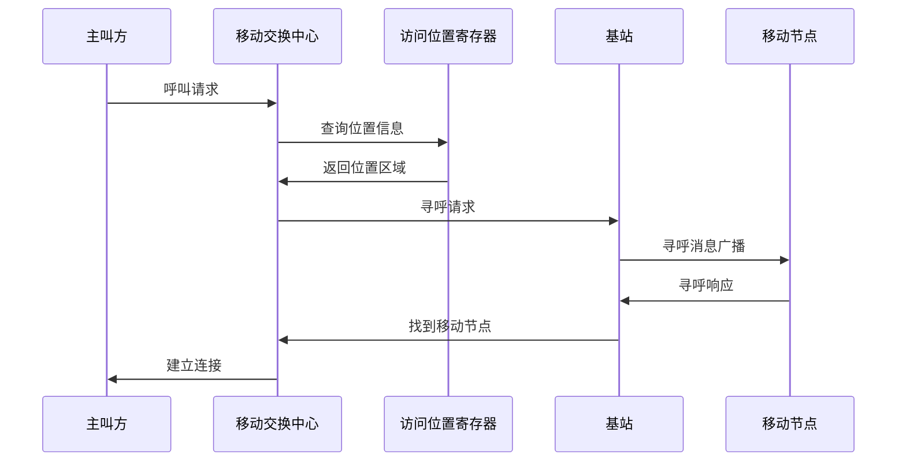

**寻呼开销优化**：
- **顺序寻呼**：按概率从高到低寻呼
- **并行寻呼**：同时在多个区域寻呼
- **智能寻呼**：基于移动模式预测

### 位置管理性能计算

#### 位置更新与寻呼开销分析

> **位置管理开销**
> 
> 位置管理的总开销 = 位置更新开销 + 寻呼开销

**开销模型**：
$$C_{total} = C_{update} + C_{paging}$$

其中：
- $C_{update}$ ：位置更新开销（信令、处理）
- $C_{paging}$ ：寻呼开销（广播、响应）

#### 位置管理计算例题

**例题1：位置区域划分与更新频率**

某蜂窝网络有100个小区，划分为10个位置区域（LA），每个LA包含10个小区。移动用户平均呼叫到达率λ=0.5次/小时，平均移动速率v=30km/h，小区半径R=1km。求：(1) 平均小区驻留时间；(2) 平均LA驻留时间；(3) 位置更新率。

**解答**：

步骤1：计算平均小区驻留时间
假设均匀分布，平均穿越小区直径：
$$T_{cell} = \frac{2R}{v} = \frac{2 \times 1}{30} = 0.067 \text{ 小时} = 4 \text{ 分钟}$$

步骤2：计算平均LA驻留时间
每个LA有10个小区，假设随机游走：
$$T_{LA} = T_{cell} \times \sqrt{N_{cells}} = 4 \times \sqrt{10} \approx 12.6 \text{ 分钟}$$

步骤3：计算位置更新率
$$\mu = \frac{1}{T_{LA}} = \frac{1}{0.21} = 4.76 \text{ 次/小时}$$

步骤4：与呼叫到达率对比
$$\frac{\mu}{\lambda} = \frac{4.76}{0.5} = 9.52$$

**答案**：平均小区驻留时间4分钟，LA驻留时间12.6分钟，位置更新率4.76次/小时。位置更新频率是呼叫频率的9.5倍，需要优化LA划分。

---

**例题2：寻呼开销计算**

某网络位置区域有20个小区，移动用户均匀分布。采用两种寻呼策略：
- 策略A：并行寻呼，同时在所有20个小区寻呼
- 策略B：顺序寻呼，按最可能到最不可能依次寻呼

假设寻呼一个小区成本为C=1单位，用户在第k个小区的概率为 $p_k = \frac{2(21-k)}{20 \times 21}$ 。求两种策略的平均寻呼开销。

**解答**：

步骤1：策略A的开销（并行寻呼）
$$C_A = 20 \times 1 = 20 \text{ 单位}$$

步骤2：策略B的开销（顺序寻呼）
平均需要寻呼的小区数：
$$E[K] = \sum_{k=1}^{20} k \cdot P(\text{在第k次找到})$$

$$P(\text{在第k次找到}) = p_k \times \prod_{i=1}^{k-1}(1-p_i)$$

由于 $p_k$ 递减，近似计算：
$$E[K] \approx \sum_{k=1}^{20} k \cdot p_k = \sum_{k=1}^{20} k \cdot \frac{2(21-k)}{420}$$

$$= \frac{2}{420} \sum_{k=1}^{20} k(21-k) = \frac{2}{420} \times 1540 = 7.33$$

$$C_B = 7.33 \times 1 = 7.33 \text{ 单位}$$

步骤3：开销对比
$$\text{节省} = \frac{20 - 7.33}{20} = 63.35\%$$

**答案**：并行寻呼开销20单位，顺序寻呼开销7.33单位，顺序寻呼节省约63%开销。

---

**例题3：位置管理总开销优化**

某系统参数：位置更新成本 $C_u = 10$ ，寻呼成本 $C_p = 2$ ，呼叫到达率λ=1次/小时，移动速率v=40km/h，小区半径R=1km，位置区域大小N个小区（可调）。求最优LA大小N使总开销最小。

**解答**：

步骤1：建立开销模型
平均小区驻留时间：
$$T_{cell} = \frac{2R}{v} = \frac{2}{40} = 0.05 \text{ 小时}$$

平均LA驻留时间：
$$T_{LA} = T_{cell} \times \sqrt{N}$$

位置更新率：
$$\mu = \frac{1}{T_{LA}} = \frac{1}{0.05\sqrt{N}} = \frac{20}{\sqrt{N}}$$

步骤2：单位时间总开销
位置更新开销：
$$C_{update} = \mu \times C_u = \frac{20}{\sqrt{N}} \times 10 = \frac{200}{\sqrt{N}}$$

寻呼开销（假设在整个LA寻呼）：
$$C_{paging} = \lambda \times N \times C_p = 1 \times N \times 2 = 2N$$

总开销：
$$C_{total}(N) = \frac{200}{\sqrt{N}} + 2N$$

步骤3：求最优N
对N求导并令其为0：
$$\frac{dC_{total}}{dN} = -\frac{100}{N^{3/2}} + 2 = 0$$

$$N^{3/2} = 50$$

$$N = 50^{2/3} = (50^2)^{1/3} = 2500^{1/3} \approx 13.6$$

取 $N = 14$ 个小区

步骤4：验证最小值
$$C_{total}(14) = \frac{200}{\sqrt{14}} + 2 \times 14 = 53.45 + 28 = 81.45$$

**答案**：最优LA大小约为14个小区，此时总开销最小（约81.45单位/小时）。

---

## 切换管理技术

### 切换基本概念

> **切换（Handoff/Handover）**
> 
> 移动节点在移动过程中从一个基站转移到另一个基站，同时保持通信连续性的过程。

#### 切换类型分类

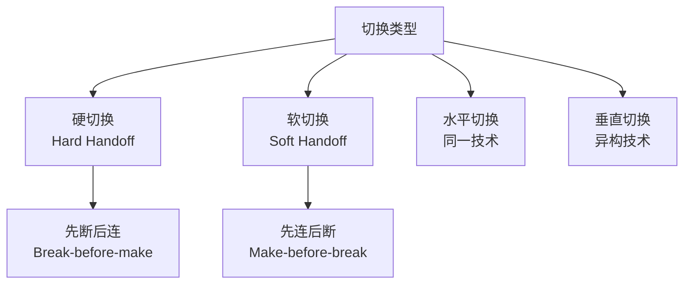

**切换特征对比**：

| 切换类型 | 连接方式 | 中断时间 | 资源占用 | 应用场景 |
|---------|---------|---------|---------|----------|
| 硬切换 | 先断后连 | 较长(50-200ms) | 较少 | GSM、WiFi |
| 软切换 | 先连后断 | 很短(<50ms) | 较多 | CDMA、UMTS |
| 垂直切换 | 跨技术 | 较长(1-5s) | 复杂 | 4G/5G、WiFi |

### 切换决策算法

#### 信号强度切换

**相对信号强度（RSS）算法**：
- 当服务基站信号强度低于阈值时切换
- 选择信号强度最强的目标基站

**RSS with Hysteresis**：
$$RSS_{target} > RSS_{serving} + H$$

其中H为迟滞余量，防止乒乓切换。

#### 切换性能计算例题

**例题1：切换迟滞参数设计**

某网络小区边界处信号波动±3dB，移动速度60km/h，小区半径1km。设计切换迟滞参数H，要求：(1) 避免乒乓切换；(2) 不延迟必要切换。假设信号沿线性衰减，边界处两小区信号相等。

**解答**：

步骤1：计算移动速度
$$v = 60 \text{ km/h} = 16.67 \text{ m/s}$$

步骤2：估算信号变化率
假设路径损耗指数n=4，距离基站d处信号强度：
$$P(d) \propto d^{-4}$$

在小区边界附近（d≈1000m），移动Δd距离：
$$\frac{dP}{dd} \approx -4 \frac{P}{d}$$

单位距离信号变化：约 $\frac{4P}{1000} = 0.004P$ /m

步骤3：确定迟滞参数
考虑信号波动±3dB，为避免误切换，迟滞应大于波动：
$$H > 2 \times 3 = 6 \text{ dB}$$

但也不能过大，否则延迟切换。移动100m约需6秒，此时信号衰减：
$$\Delta P \approx 0.004 \times 100 = 0.4P \approx 4 \text{ dB}$$

综合考虑，选择：
$$H = 3-5 \text{ dB}$$

**答案**：建议迟滞参数H=4dB，既能抵抗3dB波动，又能及时触发切换。

---

**例题2：切换失败率计算**

某系统切换执行时间T=200ms，移动速度v=100km/h，小区边界切换区宽度W=100m，切换区内信号质量满足要求。求：(1) 通过切换区时间；(2) 若切换失败需重试，最多可重试几次？

**解答**：

步骤1：计算通过切换区时间
$$v = 100 \text{ km/h} = 27.78 \text{ m/s}$$

$$T_{zone} = \frac{W}{v} = \frac{100}{27.78} = 3.6 \text{ s}$$

步骤2：计算可用切换次数
$$N_{max} = \lfloor\frac{T_{zone}}{T_{handoff}}\rfloor = \lfloor\frac{3600}{200}\rfloor = 18 \text{ 次}$$

步骤3：考虑重试次数
首次切换 + 最多重试次数 = 18
最多可重试：17次

若切换成功率p=0.95：
$$P(\text{最终失败}) = (1-p)^{18} = 0.05^{18} \approx 3.8 \times 10^{-24}$$

**答案**：通过切换区时间3.6秒，理论上可执行18次切换，最多重试17次。切换成功率95%时，最终失败概率极低。

---

**例题3：软切换资源占用分析**

CDMA系统采用软切换，移动台同时保持与2个基站连接。假设：
- 软切换区域占总覆盖面积比例α=15%
- 平均每小区N=50个活动用户
- 软切换用户资源占用2倍

求：(1) 软切换增加的资源开销；(2) 与硬切换相比的开销差异。

**解答**：

步骤1：计算软切换用户数
$$N_{soft} = N \times \alpha = 50 \times 0.15 = 7.5 \approx 8 \text{ 用户}$$

非软切换用户：
$$N_{normal} = N - N_{soft} = 50 - 8 = 42 \text{ 用户}$$

步骤2：计算总资源占用
软切换用户占用（每用户算2个连接）：
$$R_{soft} = N_{soft} \times 2 = 8 \times 2 = 16 \text{ 单位}$$

普通用户占用：
$$R_{normal} = N_{normal} \times 1 = 42 \times 1 = 42 \text{ 单位}$$

总资源：
$$R_{total} = 16 + 42 = 58 \text{ 单位}$$

步骤3：与硬切换对比
硬切换时总资源：
$$R_{hard} = 50 \times 1 = 50 \text{ 单位}$$

额外开销：
$$\text{开销增加} = \frac{58 - 50}{50} = 16\%$$

**答案**：软切换增加资源开销16%（8用户同时连接2个基站），但换取零中断切换，适合实时业务。

#### 综合决策算法

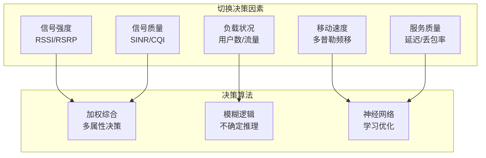

### 切换执行过程

#### GSM切换流程

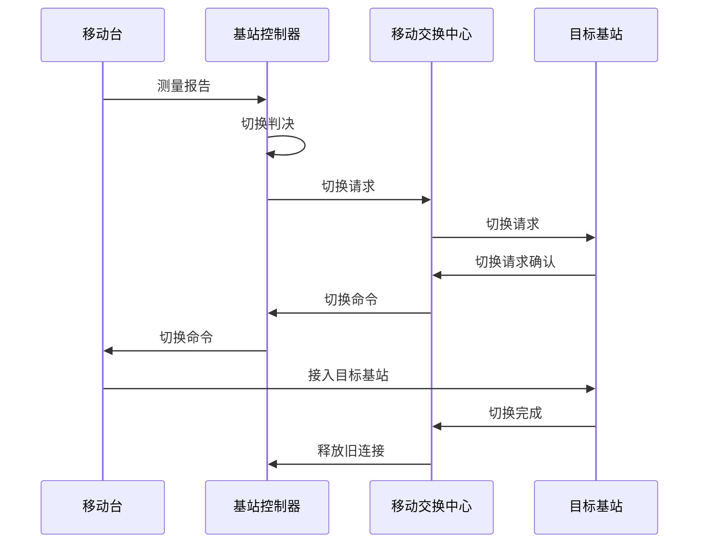

---

## 移动IP原理

### 移动IP基本机制

> **移动IP**
> 
> 允许移动节点在保持其IP地址不变的情况下在不同网络间移动的网络层移动性支持协议。

#### 核心概念

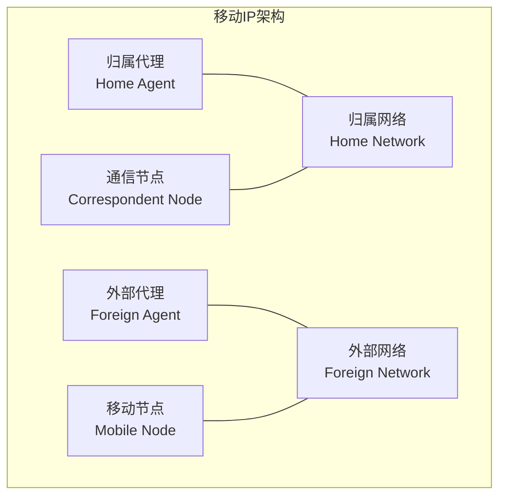

**地址概念**：
- **归属地址**：移动节点的永久IP地址
- **转交地址**：移动节点在外部网络的临时地址
- **归属代理**：归属网络中的代理路由器
- **外部代理**：外部网络中的代理路由器

### 移动IP工作流程

#### 注册过程

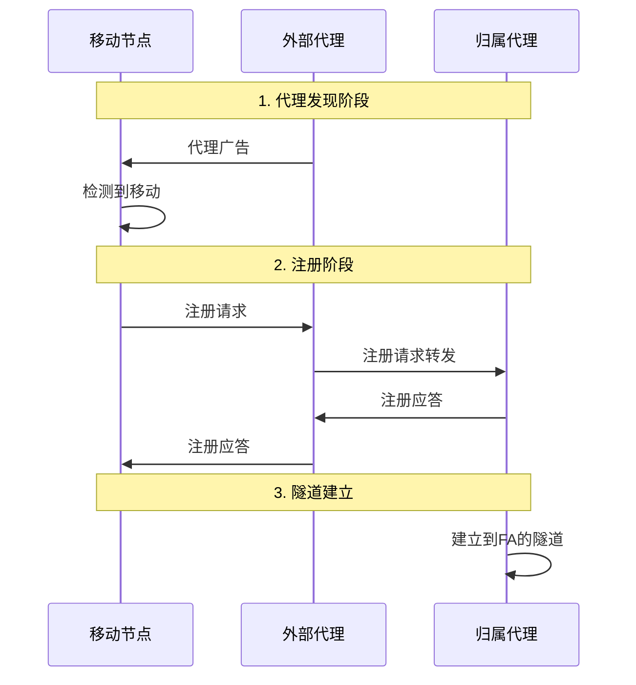

#### 数据传输过程

**正向路径（CN到MN）**：
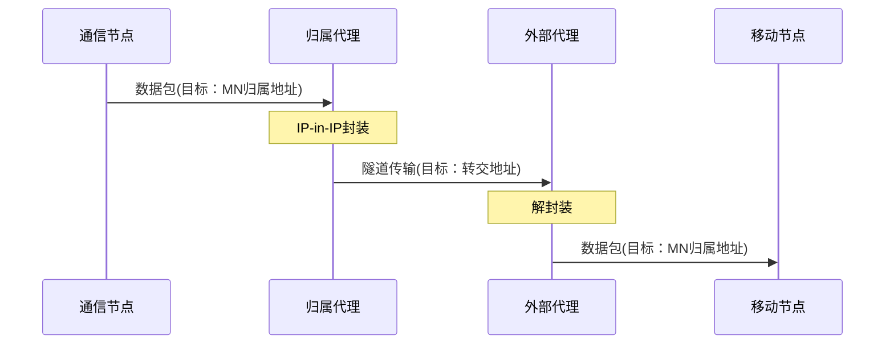

**反向路径（MN到CN）**：
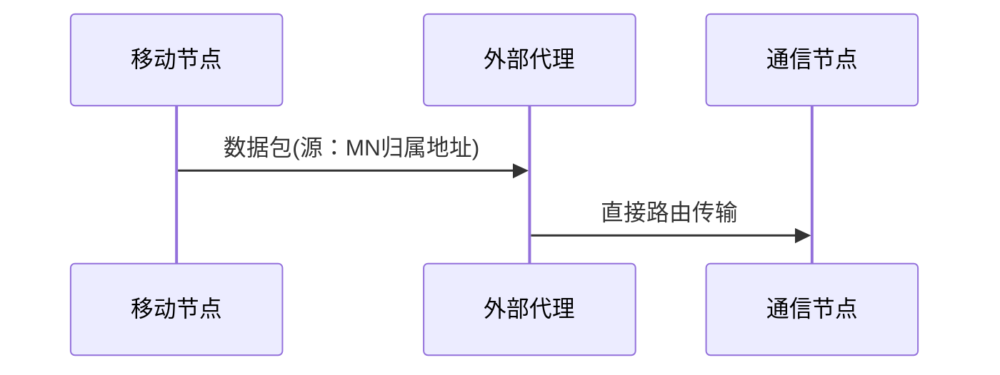

### 三角路由问题

#### 问题描述

> **三角路由**
> 
> 从通信节点到移动节点的数据包必须经过归属代理，形成非最优路径的问题。

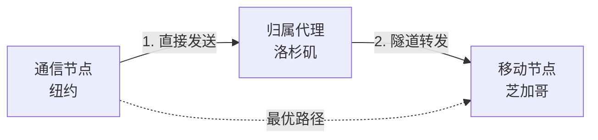

#### 路由优化

**路由优化机制**：

1. **绑定缓存（Binding Cache）**：
   - 通信节点维护移动节点的转交地址映射表
   - 包含归属地址→转交地址的绑定信息
   - 每个绑定项有生存时间限制

2. **绑定更新过程**：
   - 移动节点发送绑定更新消息给通信节点
   - 包含归属地址和当前转交地址
   - 使用移动节点的私钥进行数字签名认证

3. **直接路由传输**：
   - 通信节点查找绑定缓存表
   - 直接向转交地址发送数据包
   - 使用类型2路由头部（IPv6移动IP）

4. **安全考虑**：
   - 防止虚假绑定更新攻击
   - 使用返回可达性测试验证移动节点位置

### 移动IP性能计算

#### 三角路由开销分析

> **路由开销**
> 
> 三角路由导致的额外路径长度 = 实际路径 - 最优路径

**开销模型**：
$$\text{Overhead} = d(CN, HA) + d(HA, FA) - d(CN, FA)$$

#### 移动IP计算例题

**例题1：三角路由延迟分析**

某移动IP场景：
- 通信节点CN在纽约（NY）
- 归属代理HA在洛杉矶（LA）
- 移动节点MN当前在芝加哥（Chicago），外部代理FA也在芝加哥

距离：NY-LA: 4000km，LA-Chicago: 2800km，NY-Chicago: 1200km
传播速度：光纤中光速 $2 \times 10^8$ m/s，忽略处理延迟。

求：(1) 三角路由传播延迟；(2) 直接路由传播延迟；(3) 额外延迟比例。

**解答**：

步骤1：三角路由传播延迟
$$d_{triangle} = d(NY, LA) + d(LA, Chicago)$$
$$= 4000 + 2800 = 6800 \text{ km}$$

$$T_{triangle} = \frac{6800 \times 10^3}{2 \times 10^8} = 0.034 \text{ s} = 34 \text{ ms}$$

步骤2：直接路由传播延迟（最优）
$$d_{direct} = d(NY, Chicago) = 1200 \text{ km}$$

$$T_{direct} = \frac{1200 \times 10^3}{2 \times 10^8} = 0.006 \text{ s} = 6 \text{ ms}$$

步骤3：额外延迟
$$\Delta T = 34 - 6 = 28 \text{ ms}$$

$$\text{比例} = \frac{28}{6} = 467\%$$

**答案**：三角路由延迟34ms，直接路由6ms，额外延迟28ms（467%），需要路由优化减少延迟。

---

**例题2：移动IP隧道开销**

IPv4移动IP使用IP-in-IP封装。原始数据包：IP头20字节，TCP头20字节，数据1000字节。求：(1) 隧道传输总开销；(2) 相对开销比例；(3) MTU为1500时是否需要分片？

**解答**：

步骤1：原始数据包大小
$$L_{original} = 20 + 20 + 1000 = 1040 \text{ 字节}$$

步骤2：IP-in-IP封装后大小
外层IP头：20字节
$$L_{tunnel} = 20 + 1040 = 1060 \text{ 字节}$$

步骤3：隧道开销
$$\text{Overhead} = \frac{20}{1040} = 1.92\%$$

步骤4：MTU检查
$1060 < 1500$ ，不需要分片

若使用IPv6（头部40字节）：
$$L_{IPv6-tunnel} = 40 + 1040 = 1080 \text{ 字节}$$
$$\text{Overhead} = \frac{40}{1040} = 3.85\%$$

**答案**：IPv4隧道开销20字节（1.92%），不需要分片；IPv6隧道开销40字节（3.85%）。

---

**例题3：移动IP注册开销**

移动节点在外部网络，每次移动到新子网需要进行注册。假设：
- 注册消息大小：100字节（请求+应答）
- 平均子网驻留时间：T=10分钟
- 正常数据流量：平均R=10kbps

求：(1) 注册信令开销占比；(2) 若采用区域注册（5个子网共享一个区域），开销如何变化？

**解答**：

步骤1：单次注册开销
$$C_{reg} = 100 \times 8 = 800 \text{ 比特}$$

步骤2：单位时间注册频率
$$f = \frac{1}{T} = \frac{1}{10 \times 60} = \frac{1}{600} \text{ 次/秒}$$

步骤3：注册信令速率
$$R_{sig} = f \times C_{reg} = \frac{800}{600} = 1.33 \text{ bps}$$

步骤4：信令开销占比
$$\text{Overhead} = \frac{R_{sig}}{R_{total}} = \frac{1.33}{10000} = 0.0133\%$$

步骤5：区域注册开销
子网驻留时间10分钟，5个子网的区域，区域驻留时间约：
$$T_{region} = 5 \times 10 = 50 \text{ 分钟}$$

$$R_{sig,region} = \frac{800}{50 \times 60} = 0.267 \text{ bps}$$

$$\text{开销降低} = \frac{1.33 - 0.267}{1.33} = 80\%$$

**答案**：基本移动IP注册开销0.0133%，几乎可忽略；采用区域注册可将信令开销降低80%。

---

## 移动性能优化

### 快速切换技术

#### IEEE 802.11r快速BSS转换

> **Fast BSS Transition (FT)**
> 
> 减少WiFi网络中切换延迟的技术，实现快速安全的AP间切换。

**FT关键特性**：
- **预认证**：在切换前完成目标AP认证
- **密钥缓存**：复用已建立的安全关联
- **Over-the-Air**：通过空口直接切换
- **Over-the-DS**：通过分布式系统切换

#### 移动IPv6快速切换

**快速移动IPv6（FMIPv6）**：
- **预配置**：预先在新网络获取地址
- **隧道建立**：新旧接入路由器间建立隧道
- **无缝切换**：减少切换中断时间

### 上下文传输

> **上下文传输**
> 
> 在切换过程中将移动节点的状态信息从旧接入点传输到新接入点的技术。

**传输内容**：
- **安全上下文**：认证状态、密钥信息
- **QoS上下文**：服务质量参数、资源预留
- **头压缩上下文**：协议头压缩状态
- **缓存数据**：未传输完成的数据包

### 预测性移动管理

#### 移动性预测算法

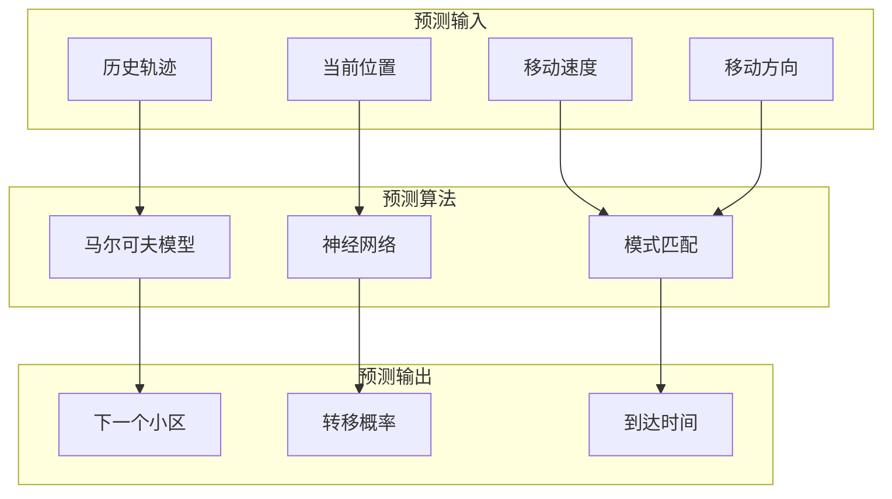

**预测应用**：
- **资源预留**：提前在目标小区预留资源
- **预认证**：提前完成安全认证过程
- **负载均衡**：引导移动节点到负载较轻的小区

---
 