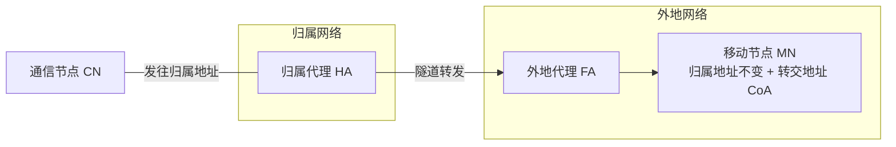
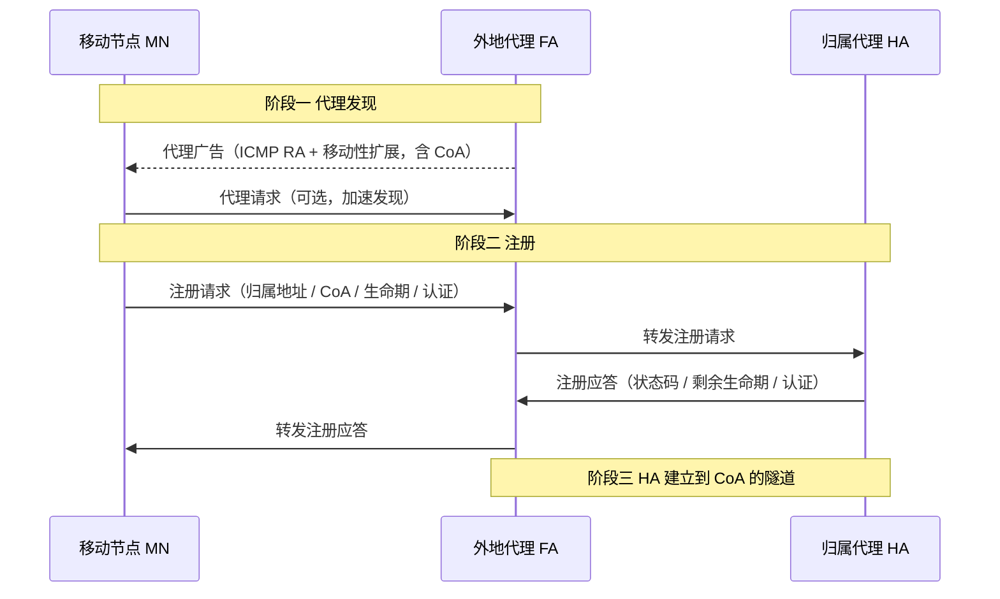
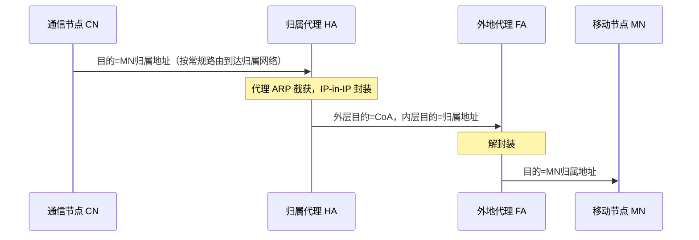
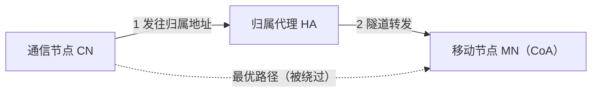
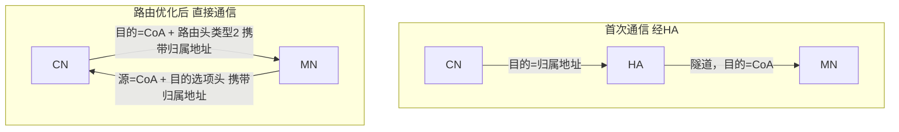
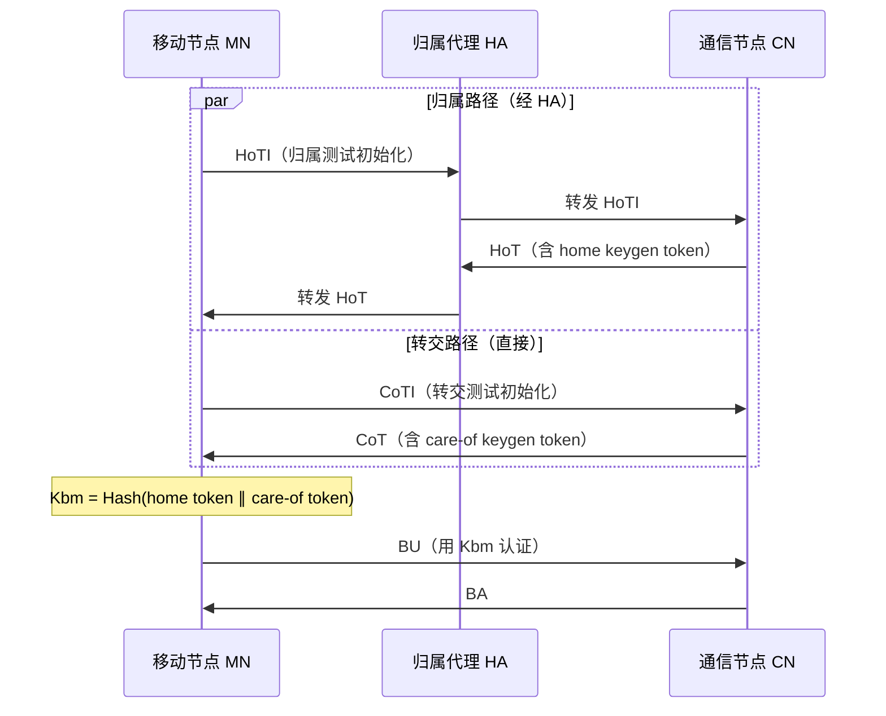

# 7.6 无线网络：移动IP

> 本文承接 [7.5 移动性管理](7.5无线网络：移动性管理.md)。7.5 给出了移动性管理的通用原理（间接路由/直接路由、归属/外地代理、三角路由），本文聚焦其在 IP 层的具体实现：移动 IPv4（RFC 5944）与移动 IPv6（RFC 6275）的代理发现、注册、隧道与路由优化。

## 目录

1. [移动IP基本概念](#移动ip基本概念)
2. [移动IPv4工作原理](#移动ipv4工作原理)
3. [移动IPv6](#移动ipv6)
4. [移动IP性能分析](#移动ip性能分析)
5. [移动IP计算例题](#移动ip计算例题)
6. [移动IP安全性](#移动ip安全性)
7. [改进协议](#改进协议)
8. [移动IPv4与IPv6对比](#移动ipv4与ipv6对比)

---

## 移动IP基本概念

### 为什么需要移动IP

IP 地址同时承担两个角色：既标识主机身份，又标识其网络位置（地址前缀对应一个子网）。当移动节点离开归属网络接入外地网络时：

- 若沿用归属地址，外地网络的路由器无法把发往该前缀的分组送达；
- 若改用外地网络的新地址，则正在进行的 TCP 连接（以四元组标识）会中断，上层应用感知到地址变化。

移动 IP 的目标是让移动节点保持归属地址不变，对上层透明地维持通信，同时与现有 IP 基础设施兼容。

### 移动IP核心概念

> **移动IP**：允许移动节点在改变接入点时保持永久 IP 地址、并维持正在进行的通信的网络层协议。

**关键实体**：



- **移动节点（Mobile Node, MN）**：会改变接入点的主机，拥有永久归属地址，离家后获得转交地址。
- **归属代理（Home Agent, HA）**：归属网络中的路由器，登记 MN 当前位置，截获发往 MN 归属地址的分组并隧道转发。
- **外地代理（Foreign Agent, FA）**：外地网络中的路由器，为来访 MN 提供转交地址与隧道端点。移动 IPv6 中可由 MN 自行获取转交地址，不再需要 FA。
- **通信节点（Correspondent Node, CN）**：与 MN 通信的对端，可以是固定或移动节点。

注：本文沿用 7.5 的译名，外地网络中的代理记作 FA（部分教材译为"外部代理"）。

**关键地址**：

| 地址 | 说明 | 特点 |
|---|---|---|
| 归属地址（Home Address） | MN 的永久地址 | 标识身份，前缀属于归属网络 |
| 转交地址（Care-of Address, CoA） | MN 在外地网络的临时地址 | 标识当前位置，隧道的终点 |
| 归属网络（Home Network） | MN 的永久网络 | 由归属地址前缀确定 |
| 外地网络（Foreign Network） | MN 当前接入的网络 | 归属网络之外的任意网络 |

> 易混：转交地址 CoA 有两种形式。
> - **外地代理转交地址（FA-CoA）**：CoA 是 FA 的地址，一个 FA 可被同子网多个 MN 共用；隧道终点是 FA，由 FA 解封装后转交 MN。
> - **共址转交地址（Co-located CoA）**：CoA 由 MN 自行获取（如 DHCP 或 IPv6 地址自动配置），隧道终点就是 MN 自己，无需 FA。

## 移动IPv4工作原理

移动 IPv4 包含三个阶段：代理发现 → 注册 → 隧道转发。



### 代理发现（Agent Discovery）

MN 通过两种方式发现可用的 HA/FA，并判断自己当前在归属网络还是外地网络：

- **代理广告**：HA/FA 周期性广播 ICMP 路由器通告（Router Advertisement），附加移动性扩展字段（携带可用 CoA、注册生命期等）。MN 被动监听。
- **代理请求**：MN 主动发送 ICMP 路由器请求（Router Solicitation），触发代理立即应答，加快发现。

### 注册（Registration）

MN 向 HA 登记当前 CoA，使 HA 知道把分组隧道转发到何处。使用 FA-CoA 时经 FA 中转，使用共址 CoA 时 MN 可直接与 HA 交互。

- 注册请求：归属地址、CoA、注册生命期、认证信息（含 MN-HA 认证扩展）。
- 注册应答：接受/拒绝状态码、HA 批准的剩余生命期、认证信息。

注：注册带生命期，MN 需在到期前重新注册以维持绑定，这也是周期性信令开销的来源（见[计算例题](#移动ip计算例题)）。

### 隧道转发（Tunneling）

注册完成后，HA 与 CoA 之间建立隧道。

**CN → MN（间接路由）**：



**MN → CN**：

- **标准路由**：MN → FA → 常规路由 → CN，源地址用归属地址。
- **反向隧道（Reverse Tunneling）**：MN → FA → HA → CN。当外地网络对源地址做入口过滤（ingress filtering，丢弃源前缀不属于本网的分组）时，归属地址作源会被丢，需先隧道回 HA 再转发。

### 移动IPv4隧道技术

隧道（tunneling）把原始 IP 分组当作载荷，外加一个新 IP 头封装后传输；隧道两端（HA 与 CoA）负责封装/解封装。与 [4.6 IPsec](4.6网络层：IPsec与VPN.md) 隧道模式同理，区别在于移动 IP 的隧道用于位置重定向而非加密保护。

**IP-in-IP 封装**（RFC 2003，移动 IPv4 默认）：

```
+----------------+----------------+----------------+--------------+
| 外层 IP 头      | 内层 IP 头      | TCP/UDP 头      | 应用数据      |
| 源=HA           | 源=CN           |                |              |
| 目的=CoA        | 目的=归属地址    |                |              |
| 协议=4(IP-in-IP)| 协议=6/17       |                |              |
+----------------+----------------+----------------+--------------+
   20 字节            20 字节
```

外层头由 HA 在封装时添加、FA 在解封装时剥除；内层头即 CN 发出的原始分组，保持不变。

封装方式有三种，开销递减/递增不同：

| 方式 | 额外开销 | 说明 |
|---|---|---|
| IP-in-IP | 20 字节 | 完整外层 IP 头，默认方式 |
| 最小封装（Minimal Encapsulation, RFC 2004） | 8~12 字节 | 复用内层头的部分字段，省去重复信息 |
| GRE（Generic Routing Encapsulation） | ≥ 4 字节（外加 IP 头） | 通用封装，可承载多种网络层协议 |

### 三角路由问题

> **三角路由（triangle routing）**：CN 发往 MN 的分组必须先到 HA，再隧道转发到 CoA，即使 CN 与 MN 相邻也要绕道 HA，路径非最优。



注意三角路由只发生在 CN→MN 方向；MN→CN 方向走标准路由，本就最优（这也是"三角"而非"绕环"的由来）。

**影响**：增加端到端时延、放大网络负载、HA 易成瓶颈。

**路由优化（Route Optimization）**：让 CN 直接把分组发往 CoA，绕过 HA。

- **绑定更新（Binding Update）**：MN 把"归属地址 → 当前 CoA"的绑定通知 CN。
- **绑定缓存（Binding Cache）**：CN 缓存该绑定（带生命期），后续分组直接发往 CoA。

优化后，CN 把分组发往 CoA，并通过路由头携带 MN 归属地址，使上层仍以归属地址识别连接；MN→CN 方向不变。移动 IPv4 的路由优化是可选扩展，移动 IPv6 则将其内置（见下文）。

## 移动IPv6

移动 IPv6 在协议设计阶段就把移动性内置，相比移动 IPv4 更简洁：取消 FA，路由优化为标配。

### 移动IPv6工作机制

**1. 转交地址获取**

MN 无需 FA，直接用 IPv6 地址自动配置生成共址 CoA：

1. 接收外地网络的路由器通告（RA），获得网络前缀；
2. 无状态地址自动配置（SLAAC）：CoA = 网络前缀 + 接口标识符；
3. 重复地址检测（DAD）确保 CoA 唯一。

**2. 绑定更新过程**

MN 用绑定更新（Binding Update, BU）报文同时向 HA 和 CN 登记 CoA：

| 方向 | 报文 | 主要字段 |
|---|---|---|
| MN → HA（归属注册） | BU（置 H 标志） | 归属地址、CoA、生命期、序列号 |
| HA → MN | 绑定确认 BA | 状态码、序列号、剩余生命期 |
| MN → CN（路由优化） | BU | 归属地址、CoA、生命期、序列号 |
| CN → MN | 绑定确认 BA | 状态码、绑定刷新建议时间 |

序列号用于排序与抗重放；向 CN 注册前还需返回可达性测试（见[安全性](#移动ip安全性)）。

**3. 数据包交换**

移动 IPv6 用扩展头代替隧道封装，因此不再有内外两层 IP 头：



- **CN → MN**：分组目的地址写 CoA（直达），用**路由头类型2**携带归属地址，MN 收到后据此还原为归属地址交给上层。
- **MN → CN**：分组源地址用 CoA（通过外地网络的入口过滤），用**目的选项头中的归属地址选项**告知 CN 真实身份。

### 移动IPv6扩展头

| 扩展头 | 作用 | 关键字段 |
|---|---|---|
| 路由头类型2（Routing Header Type 2） | CN→MN 方向携带 MN 归属地址 | 路由类型=2、剩余段数=1、归属地址（128 位） |
| 目的选项头（含归属地址选项） | MN→CN 方向声明 MN 归属地址 | 选项类型=201（0xC9）、归属地址（128 位） |

注：路由头类型2 固定只含一个地址（剩余段数=1），不同于通用的类型0 源路由（已因安全问题废弃），因此不能被滥用于源路由攻击。

## 移动IP性能分析

### 封装/头部开销

移动 IPv4 靠隧道封装新增外层头；移动 IPv6 靠扩展头，不分内外两层。

| 方式 | 额外头部 | 对 1460 字节载荷的带宽效率 |
|---|---|---|
| IPv4 IP-in-IP | 20 字节 | $\frac{1460}{1460+20}=98.6\%$ |
| IPv4 最小封装 | 8~12 字节 | 约 $99.2\%$ |
| IPv6 路由头类型2 | 24 字节（8 字节头 + 16 字节地址） | $\frac{1460}{1460+24}=98.4\%$ |

$$\text{带宽效率} = \frac{\text{有效载荷}}{\text{有效载荷} + \text{额外头部}}$$

注：IPv6 路由优化不使用隧道，开销来自路由头类型2，而非额外一层 IP 头。

### 时延：三角路由 vs 路由优化

间接路由（三角）经 HA 中转，路由优化后 CN 直达 CoA：

$$T_{\text{三角}} = T_{CN \to HA} + T_{HA \to FA} + T_{FA \to MN}$$

$$T_{\text{优化}} = T_{CN \to FA} + T_{FA \to MN}, \qquad \Delta T = T_{\text{三角}} - T_{\text{优化}}$$

### 注册开销

注册带生命期，MN 须周期性重注册，单位时间信令开销为：

$$\text{注册次数/小时} = \frac{3600}{\text{注册生命期（秒）}}, \qquad \text{带宽开销} = \frac{\text{单次注册字节数} \times \text{注册次数}}{\text{时间}}$$

生命期越短、移动越频繁，信令开销越大；分层移动管理（见[改进协议](#改进协议)）正是用本地锚点减少向 HA 的注册次数。

## 移动IP计算例题

### 例题1：隧道开销计算

> **例题**：移动节点用移动 IPv4 通信，原始 IP 分组 1500 字节（20 字节 IP 头 + 20 字节 TCP 头 + 1460 字节数据）。求 IP-in-IP 隧道后的额外开销与带宽利用率。

1. 原始分组：$20 + 20 + 1460 = 1500$ 字节。
2. 隧道封装后增加 20 字节外层 IP 头：$1500 + 20 = 1520$ 字节。
3. 相对增加：$\frac{20}{1500} = 1.33\%$。
4. 带宽利用率（有效数据/封装后总长）：$\frac{1460}{1520} = 96.05\%$。

**答案**：增加 20 字节，封装后 1520 字节，带宽利用率 96.05%。

注：原始分组已达常见以太网 MTU（1500 字节），封装后 1520 字节超出 MTU，实际会触发分片或 PMTUD 调整。本题只算开销，未计分片影响。

### 例题2：三角路由延迟计算

> **例题**：移动节点从归属网络移动到外部网络，与通信节点CN通信。已知：
> - CN到HA的RTT：40ms
> - HA到FA的RTT：30ms
> - CN到FA的RTT：15ms
> - FA到MN的延迟：2ms
> 
> 计算三角路由和路由优化的单向延迟，并分析性能改善。

**解题步骤**：

1. **三角路由单向延迟**：
   $$T_{\text{三角}} = \frac{\text{RTT}_{CN \to HA}}{2} + \frac{\text{RTT}_{HA \to FA}}{2} + T_{FA \to MN}$$
   $$T_{\text{三角}} = \frac{40}{2} + \frac{30}{2} + 2 = 20 + 15 + 2 = 37\text{ms}$$

2. **路由优化单向延迟**：
   $$T_{\text{优化}} = \frac{\text{RTT}_{CN \to FA}}{2} + T_{FA \to MN}$$
   $$T_{\text{优化}} = \frac{15}{2} + 2 = 7.5 + 2 = 9.5\text{ms}$$

3. **性能改善**：
   $$\Delta T = 37 - 9.5 = 27.5\text{ms}$$
   $$\text{改善百分比} = \frac{27.5}{37} \times 100\% = 74.3\%$$

**答案**：
- 三角路由延迟：37ms
- 路由优化延迟：9.5ms
- 延迟减少：27.5ms（74.3%改善）

### 例题3：注册开销分析

> **例题**：移动节点使用移动IPv6，注册生命期为60秒，每次绑定更新消息100字节（含IPv6头），绑定确认80字节。移动节点同时向1个HA和3个CN注册。计算每小时的注册带宽开销。

**解题步骤**：

1. **注册频率**：
   $$\text{每小时注册次数} = \frac{3600}{60} = 60\text{次}$$

2. **单次注册开销**：
   - 向HA：BU(100) + BA(80) = 180字节
   - 向3个CN：3 × [BU(100) + BA(80)] = 3 × 180 = 540字节
   - **单次总开销**：180 + 540 = 720字节

3. **每小时总开销**：
   $$\text{总开销} = 720 \times 60 = 43,200\text{字节} = 43.2\text{KB}$$

4. **平均带宽消耗**：
   $$\text{平均带宽} = \frac{43,200 \times 8}{3600} = 96\text{bps}$$

**答案**：每小时注册开销为43.2KB，平均带宽消耗为96bps。

### 例题4：移动场景综合分析

> **例题**：移动用户以 120 km/h 移动，基站覆盖半径 5 km，移动 IPv4 IP-in-IP 隧道开销 20 字节，观看码率 2 Mbps 的视频。求：(1) 平均切换频率；(2) 隧道引入的额外带宽。

1. 切换频率（沿直径穿越，直径 $2\times5=10$ km）：
   $$f = \frac{120}{10} = 12 \text{ 次/小时}$$，即平均每 5 分钟一次。
2. 隧道额外带宽：每包载荷约 1460 字节，则
   $$\frac{2\times10^6}{1460\times8} \approx 171 \text{ 包/秒}$$
   每包 20 字节开销，额外带宽 $171\times20\times8 \approx 27 \text{ Kbps}$，占比 $\frac{27}{2000}=1.35\%$。

**答案**：每 5 分钟切换一次（12 次/小时）；隧道额外约 27 Kbps（1.35%）。

## 移动IP安全性

核心威胁源于**伪造绑定更新**：攻击者若能向 HA 或 CN 注册一个假 CoA，就能把受害者的流量重定向到自己（劫持/窃听）或某第三方（放大型 DoS）。重放旧绑定、篡改注册消息属于同类问题。防御的关键是认证绑定来源并验证 CoA 确实可达。

### 移动IPv4安全

注册消息用 **MN–HA 认证扩展**保护（必需），MN–FA、FA–HA 认证可选：

- 基于共享密钥，对消息计算摘要（默认 HMAC-MD5）；
- 认证扩展含 SPI（安全参数索引）与认证数据；
- 注册请求带标识字段（时间戳或随机数）抗重放。

### 移动IPv6安全

- **MN–HA**：归属注册的 BU/BA 由 **IPsec ESP** 强制保护（机密性 + 完整性），与 [4.6 IPsec](4.6网络层：IPsec与VPN.md) 一脉相承。
- **MN–CN**：CN 与 MN 之间无预共享密钥，改用**返回可达性测试（Return Routability Test）**确认 MN 同时在归属地址和 CoA 处可达，再据此派生绑定管理密钥保护 BU。



注：两条路径分别验证归属地址与 CoA 的可达性——只有同时持有两个 token 才能算出 $K_{bm}$，攻击者无法仅凭伪造一处地址通过验证。

## 改进协议

基本移动 IP 有两个痛点：切换时延（重新配置 CoA + 注册）和向 HA 的频繁注册信令。以下扩展分别针对这两点，并降低对终端的要求。

| 协议 | 思路 | 解决的问题 |
|---|---|---|
| 快速移动 IPv6（FMIPv6） | 切换前在新接入路由器预配置 CoA、新旧路由器间预建隧道 | 缩短切换中断时间 |
| 分层移动 IPv6（HMIPv6） | 引入本地移动锚点 MAP，本地移动只更新 MAP、不通知 HA | 减少跨域注册信令 |
| 代理移动 IPv6（PMIPv6） | 移动性由网络侧（LMA + MAG）实现 | 终端无需改动协议栈，简化部署 |

注：PMIPv6 把移动性管理从主机移到网络，因此终端不感知 CoA，也不参与绑定更新；代价是不支持端到端的路由优化。

## 移动IPv4与IPv6对比

| 维度 | 移动 IPv4 | 移动 IPv6 |
|---|---|---|
| 外地代理 FA | 需要（FA-CoA 时） | 不需要（共址 CoA） |
| 转交地址获取 | FA 提供或 DHCP | IPv6 地址自动配置（SLAAC） |
| 路由优化 | 可选扩展 | 内置 |
| 重定向方式 | IP-in-IP 隧道 | 路由头类型2 + 目的选项头 |
| MN–HA 安全 | MN–HA 认证扩展（必需） | 强制 IPsec ESP |
| MN–CN 安全 | （路由优化扩展自带） | 返回可达性测试 |

---

**上一节**：[7.5 无线网络：移动性管理](7.5无线网络：移动性管理.md)
**下一节**：[7.7 蜂窝网络中的移动性](7.7无线网络：蜂窝移动性.md)

