# 7.7 蜂窝网络中的移动性管理

## 目录

1. [蜂窝网络移动性概述](#蜂窝网络移动性概述)
2. [GSM网络移动性管理](#gsm网络移动性管理)
3. [LTE网络移动性管理](#lte网络移动性管理)
4. [5G网络移动性管理](#5g网络移动性管理)
5. [移动性管理性能计算](#移动性管理性能计算)
6. [移动性管理优化策略](#移动性管理优化策略)
7. [跨代网络移动性](#跨代网络移动性)
 
---

## 蜂窝网络移动性概述

### 蜂窝网络的移动性特点

> **蜂窝网络移动性**：蜂窝网络是专门为移动用户设计的无线网络，具有完善的移动性管理机制。

**与移动IP的区别**：

| 特性 | 移动IP | 蜂窝网络移动性 |
|-----|-------|--------------|
| 设计目标 | IP层移动性 | 链路层和网络层移动性 |
| 移动单位 | IP地址 | 小区（Cell） |
| 管理实体 | HA/FA | MSC/MME/AMF |
| 切换速度 | 较慢（秒级） | 快速（毫秒级） |
| 位置精度 | 网络级 | 小区级 |
| 标准化 | IETF | 3GPP |

**蜂窝网络移动性管理目标**：
1. **连续性**：移动中保持通信不中断
2. **透明性**：用户感知不到切换过程
3. **高效性**：最小化信令开销
4. **可靠性**：保证切换成功率

### 移动性管理架构

**分层管理**：

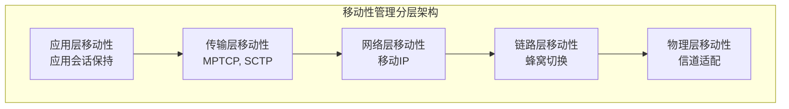

**蜂窝网络移动性管理组件**：

1. **位置管理（Location Management）**
   - 跟踪移动用户位置
   - 位置注册和更新
   - 寻呼（Paging）

2. **切换管理（Handover Management）**
   - 小区间移动
   - 连接转移
   - 资源分配

## GSM网络移动性管理

### GSM网络架构

**核心网元**：

| 网元 | 全称 | 功能 |
|-----|------|------|
| HLR | Home Location Register | 归属位置寄存器，存储用户永久信息 |
| VLR | Visitor Location Register | 访问位置寄存器，存储用户临时信息 |
| MSC | Mobile Switching Center | 移动交换中心，控制呼叫和切换 |
| BSC | Base Station Controller | 基站控制器，管理基站 |
| BTS | Base Transceiver Station | 基站，无线收发 |

**位置层次结构**：

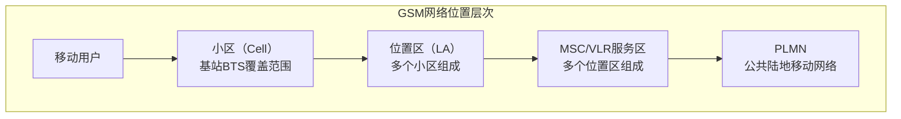

### GSM位置管理

**1. 位置区（Location Area）**

> **定义**：位置区是一组小区的集合，是位置管理的基本单位。

**位置区标识**：
- LAI（Location Area Identity）= MCC + MNC + LAC
  - MCC：移动国家代码（3位）
  - MNC：移动网络代码（2-3位）
  - LAC：位置区码（16位）

**2. 位置注册（Location Registration）**

**注册类型**：

| 注册类型 | 触发条件 | 频率 |
|---------|---------|------|
| 开机注册 | 移动台开机 | 一次 |
| 位置区更新 | 进入新位置区 | 高 |
| 周期性注册 | 定时器超时 | 中 |
| IMSI附着 | 首次接入网络 | 一次 |
| IMSI分离 | 关机或脱离网络 | 一次 |

**位置更新流程**：

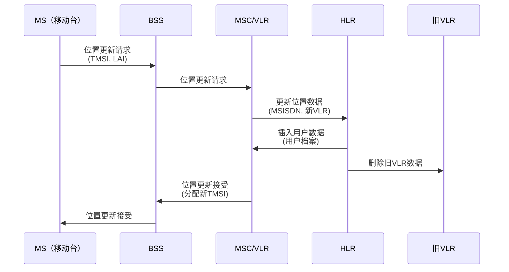

**3. 寻呼（Paging）**

> **寻呼**：当有呼叫到达时，网络需要在位置区内广播寻找移动用户。

**寻呼流程**：

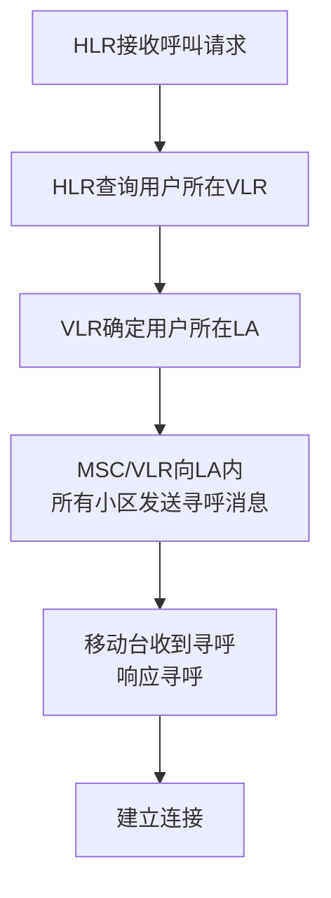

**寻呼策略**：

| 策略 | 描述 | 优缺点 |
|-----|------|-------|
| 全区寻呼 | 向整个LA寻呼 | 可靠但信令开销大 |
| 顺序寻呼 | 按小区顺序逐步扩大范围 | 降低开销但增加延迟 |
| 基于位置预测 | 根据移动模式预测 | 智能但复杂 |

### GSM切换管理

**1. 切换类型**

| 切换类型 | 描述 | 复杂度 |
|---------|------|-------|
| 小区内切换 | 同小区内信道切换 | 低 |
| BSC内切换 | 同BSC不同BTS | 中 |
| MSC内切换 | 同MSC不同BSC | 中 |
| MSC间切换 | 不同MSC | 高 |

**2. 切换触发条件**

**基于测量的切换**：
- 服务小区信号强度 < 门限
- 目标小区信号强度 > 服务小区 + 滞后
- 误码率（BER）过高
- 距离过远（定时提前量 > 门限）

**基于业务的切换**：
- 负载均衡
- 业务质量要求
- 用户优先级

**3. GSM切换流程（MSC内切换）**

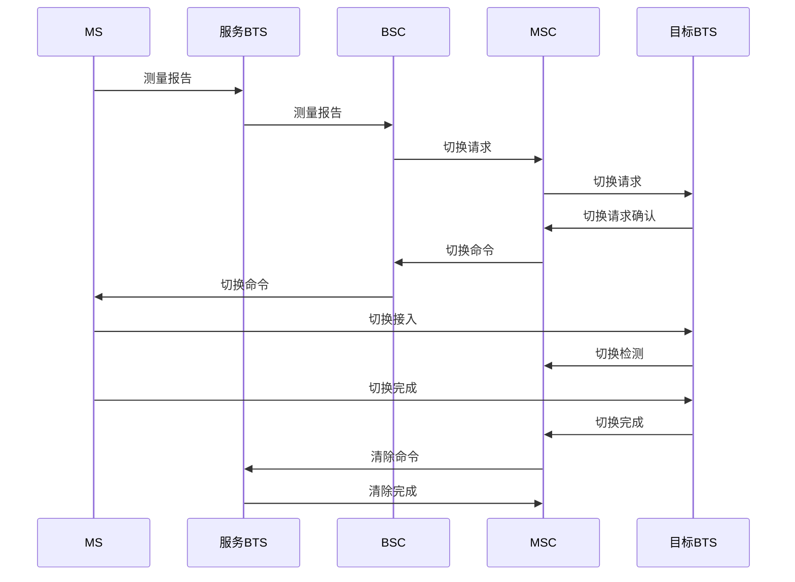

**切换时延组成**：
- 测量和判决：100-200ms
- 信令交互：50-100ms
- 信道建立：50-100ms
- **总切换时延**：200-400ms

## LTE网络移动性管理

### LTE网络架构

**核心网元（EPC）**：

| 网元 | 全称 | 功能 |
|-----|------|------|
| MME | Mobility Management Entity | 移动性管理实体 |
| HSS | Home Subscriber Server | 归属用户服务器（类似HLR） |
| S-GW | Serving Gateway | 服务网关 |
| P-GW | PDN Gateway | 分组数据网关 |

**无线接入网（E-UTRAN）**：
- eNodeB（演进型基站）：集成了GSM中BTS和BSC功能

**位置层次结构**：

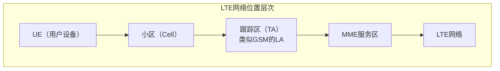

### LTE位置管理

**1. 跟踪区（Tracking Area）**

> **跟踪区**：LTE中的位置管理单元，一个或多个小区组成一个TA。

**跟踪区标识**：
- TAI（Tracking Area Identity）= PLMN ID + TAC
  - PLMN ID：移动网络标识
  - TAC：跟踪区码（16位）

**跟踪区列表（TA List）**：
- UE可以注册到多个TA
- 在TA列表内移动无需位置更新
- 减少信令开销

**2. LTE位置更新流程**

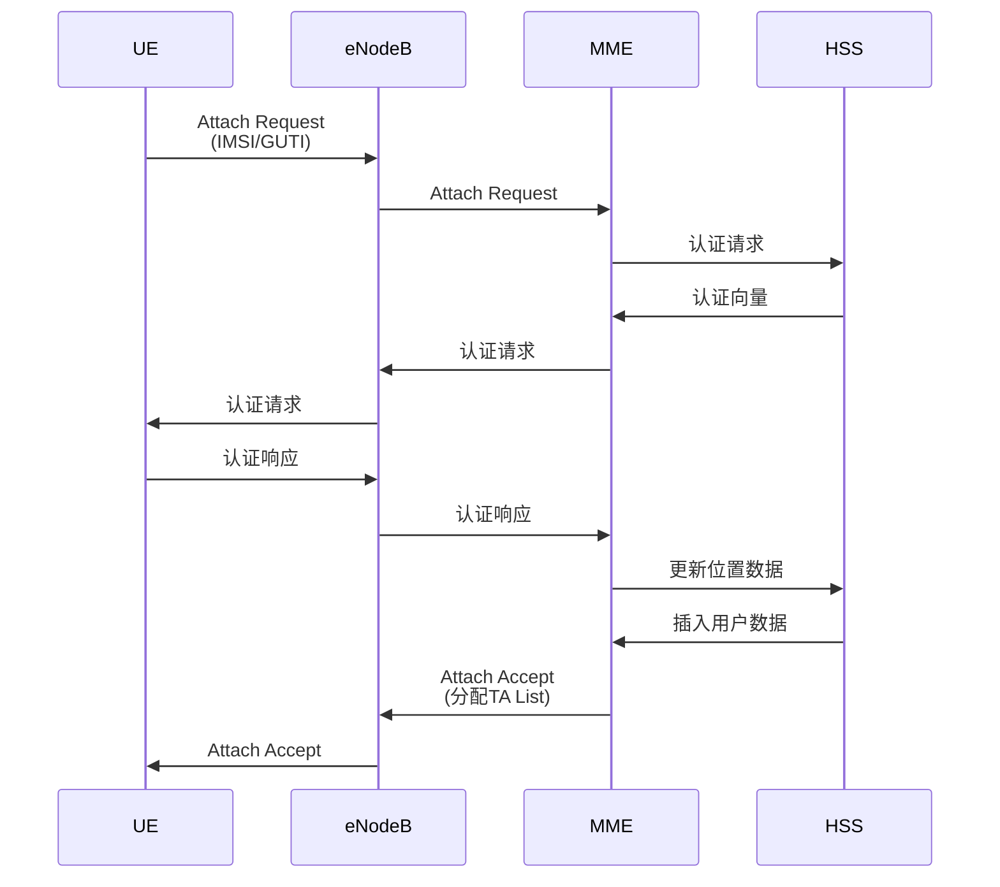

**3. LTE寻呼机制**

**寻呼优化**：

| 特性 | GSM | LTE |
|-----|-----|-----|
| 寻呼单位 | LA | TA |
| 寻呼范围 | 单个LA | TA List |
| DRX（非连续接收） | 基本支持 | 增强DRX |
| 寻呼时机 | 固定 | 可配置PO（Paging Occasion） |

**寻呼DRX周期**：
- UE只在特定时刻监听寻呼
- 其他时间进入休眠节省功耗
- DRX周期：32、64、128、256帧

**寻呼开销计算**：

$$\text{寻呼成本} = N_{\text{小区}} \times P_{\text{寻呼}} \times \lambda_{\text{呼叫}}$$

其中：
- $N_{\text{小区}}$：TA内小区数量
- $P_{\text{寻呼}}$：单次寻呼开销
- $\lambda_{\text{呼叫}}$：呼叫到达率

### LTE切换管理

**1. LTE切换类型**

| 切换类型 | 场景 | X2接口 | S1接口 |
|---------|------|--------|--------|
| X2切换 | eNodeB间切换（同MME） | ✓ | × |
| S1切换 | eNodeB间切换（不同MME） | × | ✓ |
| 系统间切换 | LTE ↔ 3G/2G | 不适用 | ✓ |

**2. 基于X2的切换流程**

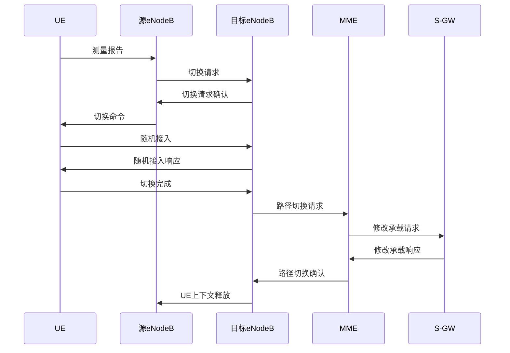

**3. 切换性能指标**

| 指标 | GSM | LTE | 5G NR |
|-----|-----|-----|-------|
| 切换中断时间 | 200-400ms | 30-50ms | <10ms |
| 切换准备时间 | 100-200ms | 20-30ms | <5ms |
| 切换执行时间 | 100-200ms | 10-20ms | <5ms |
| 切换成功率 | >95% | >98% | >99% |

**LTE切换优化技术**：

1. **预切换（Pre-handover）**
   - 提前准备目标小区资源
   - 减少切换中断时间

2. **测量配置优化**
   - A3事件（邻小区优于服务小区）
   - A5事件（服务小区劣于门限且邻小区优于门限）
   - 滞后（Hysteresis）和触发时间（TTT）

3. **负载均衡切换**
   - MLB（Mobility Load Balancing）
   - 考虑小区负载和用户分布

## 5G网络移动性管理

### 5G移动性管理架构

**5G核心网（5GC）网元**：

| 网元 | 功能 |
|-----|------|
| AMF | 接入和移动性管理功能（类似LTE MME） |
| SMF | 会话管理功能 |
| UPF | 用户平面功能 |
| UDM | 统一数据管理（类似LTE HSS） |

**注册区（Registration Area）**：
- 5G中的位置管理单元
- 由一个或多个TA组成
- 支持更灵活的配置

### 5G移动性增强

**1. 双连接（Dual Connectivity）**

> **双连接**：UE同时连接到多个基站，实现零中断切换。

**EN-DC（E-UTRA-NR Dual Connectivity）**：
- 主基站：LTE eNodeB
- 辅基站：5G gNodeB
- 数据分流和聚合

**2. 条件切换（Conditional Handover）**

**传统切换问题**：
- 测量报告→切换决策→切换执行
- 时延较大，可能错过最佳切换时机

**条件切换改进**：

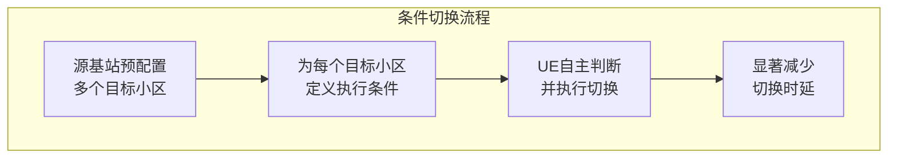

**3. 多射波束管理**

**毫米波移动性挑战**：
- 波束窄，切换频繁
- 信号易被遮挡

**波束管理流程**：

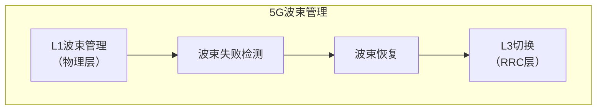

## 移动性管理性能计算

### 例题1：位置更新开销计算

> **例题**：某GSM网络位置区由30个小区组成，平均每小区覆盖半径1km。用户平均移动速度30km/h，呼叫到达率0.5次/小时。位置更新开销为100个信令单位，寻呼开销为每小区10个信令单位。计算：
> 1. 用户平均每小时位置更新次数
> 2. 每小时总信令开销

**解题步骤**：

**1. 位置更新次数**：

假设小区为正六边形，边长 $r = 1$ km：
- 小区面积：$A_{\text{cell}} = \frac{3\sqrt{3}}{2}r^2 = 2.6$ km²
- LA面积：$A_{\text{LA}} = 30 \times 2.6 = 78$ km²
- LA等效半径：$R = \sqrt{\frac{A_{\text{LA}}}{\pi}} = \sqrt{\frac{78}{3.14}} = 5$ km

使用简化模型，穿越LA边界的速率：
$$\lambda_{\text{更新}} = \frac{v \times L}{A}$$

其中 $L$ 为边界长度，$A$ 为面积。对于圆形近似：
$$\lambda_{\text{更新}} = \frac{v \times 2\pi R}{\pi R^2} = \frac{2v}{R} = \frac{2 \times 30}{5} = 12\text{次/小时}$$

**2. 总信令开销**：

位置更新开销：
$$C_{\text{更新}} = 12 \times 100 = 1200\text{个单位/小时}$$

寻呼开销：
$$C_{\text{寻呼}} = 0.5 \times 30 \times 10 = 150\text{个单位/小时}$$

总开销：
$$C_{\text{总}} = 1200 + 150 = 1350\text{个单位/小时}$$

**答案**：
1. 平均每小时位置更新12次
2. 总信令开销1350个单位/小时（位置更新占89%，寻呼占11%）

### 例题2：最优位置区大小

> **例题**：继续上题场景，假设位置区由 $N$ 个小区组成，每小区面积2.6 km²。求使总信令开销最小的最优小区数量 $N^*$。

**解题步骤**：

**1. 建立成本模型**：

位置区面积：$A = N \times 2.6$ km²

等效半径：$R = \sqrt{\frac{A}{\pi}} = \sqrt{\frac{2.6N}{\pi}} = 0.91\sqrt{N}$ km

位置更新率：
$$\lambda_u = \frac{2v}{R} = \frac{2 \times 30}{0.91\sqrt{N}} = \frac{66}{\sqrt{N}}\text{次/小时}$$

位置更新成本：
$$C_u = \lambda_u \times C_u^0 = \frac{66}{\sqrt{N}} \times 100 = \frac{6600}{\sqrt{N}}$$

寻呼成本：
$$C_p = \lambda_c \times N \times C_p^0 = 0.5 \times N \times 10 = 5N$$

总成本：
$$C_{\text{total}} = \frac{6600}{\sqrt{N}} + 5N$$

**2. 求最优值**：

对 $N$ 求导：
$$\frac{dC}{dN} = -\frac{6600}{2N^{3/2}} + 5 = -\frac{3300}{N^{3/2}} + 5$$

令导数为0：
$$\frac{3300}{N^{3/2}} = 5$$
$$N^{3/2} = 660$$
$$N = 660^{2/3} = 72.8$$

取 $N^* \approx 73$ 个小区

**3. 验证**：

- 当 $N = 73$：$C = \frac{6600}{\sqrt{73}} + 5 \times 73 = 772 + 365 = 1137$
- 当 $N = 30$（原始）：$C = \frac{6600}{\sqrt{30}} + 5 \times 30 = 1205 + 150 = 1355$

优化后降低了16%的信令开销。

**答案**：最优位置区大小约为73个小区，此时总信令开销最小（1137单位/小时）。

### 例题3：LTE切换性能分析

> **例题**：LTE网络中，小区半径500m，用户以60km/h速度直线移动。X2切换中断时间40ms，切换准备时间25ms。假设VoIP应用，每20ms生成一个语音包。计算：
> 1. 用户平均每分钟切换次数
> 2. 每次切换丢失的语音包数量
> 3. 切换对语音质量的影响

**解题步骤**：

**1. 切换频率**：

小区直径：$D = 2 \times 500 = 1000\text{m} = 1\text{km}$

移动速度：$v = 60\text{km/h} = 1\text{km/min}$

切换频率：
$$f = \frac{v}{D} = \frac{1}{1} = 1\text{次/分钟}$$

**2. 丢包数量**：

切换中断时间：40ms

语音包间隔：20ms

丢失包数：
$$N_{\text{lost}} = \lceil \frac{40}{20} \rceil = 2\text{个包}$$

考虑切换准备阶段可能的信号质量下降，实际可能丢失：
$$N_{\text{total}} = \frac{40 + 25}{20} \approx 3\text{个包}$$

**3. 语音质量影响**：

每分钟总包数：
$$N_{\text{total/min}} = \frac{60 \times 1000}{20} = 3000\text{个包}$$

每分钟切换丢包：
$$N_{\text{lost/min}} = 1 \times 3 = 3\text{个包}$$

丢包率：
$$PLR = \frac{3}{3000} = 0.1\%$$

**语音质量评估**：
- VoIP可接受丢包率：< 1%
- 实际丢包率：0.1%
- 结论：对语音质量影响较小

**答案**：
1. 每分钟切换1次
2. 每次切换丢失约3个语音包
3. 丢包率0.1%，对语音质量影响小，满足VoIP要求

### 例题4：TA List优化

> **例题**：LTE网络中，某区域有4个TA，每个TA包含20个小区。用户移动模式分析显示：
> - 在TA1的用户，60%时间停留在TA1，20%移动到TA2，15%到TA3，5%到TA4
> - 位置更新开销：200信令单位
> - 寻呼开销：每小区5信令单位
> - 用户平均移动速度：使得每小时穿越TA边界2次
> - 呼叫到达率：1次/小时
> 
> 设计TA List分配方案并计算信令开销。

**解题步骤**：

**方案1：单个TA（TA List = {TA1}）**

位置更新次数：
- 用户40%时间在TA1外，平均每小时穿越2次
- 每次进出TA1都需要更新
- 更新次数：$2 \times 0.4 = 0.8$次/小时

位置更新成本：$C_u = 0.8 \times 200 = 160$

寻呼成本：$C_p = 1 \times 20 \times 5 = 100$

总成本：$C_1 = 160 + 100 = 260$

**方案2：两个TA（TA List = {TA1, TA2}）**

位置更新次数：
- 用户80%时间在TA1或TA2（覆盖60%+20%）
- 需要更新的比例：20%
- 更新次数：$2 \times 0.2 = 0.4$次/小时

位置更新成本：$C_u = 0.4 \times 200 = 80$

寻呼成本：$C_p = 1 \times 40 \times 5 = 200$

总成本：$C_2 = 80 + 200 = 280$

**方案3：三个TA（TA List = {TA1, TA2, TA3}）**

位置更新次数：
- 覆盖95%（60%+20%+15%）
- 更新次数：$2 \times 0.05 = 0.1$次/小时

位置更新成本：$C_u = 0.1 \times 200 = 20$

寻呼成本：$C_p = 1 \times 60 \times 5 = 300$

总成本：$C_3 = 20 + 300 = 320$

**答案**：
- 最优方案：TA List = {TA1}，总开销260信令单位/小时
- 方案1的位置更新成本高但寻呼成本低
- 方案3的寻呼成本高但位置更新成本低
- 由于呼叫到达率较低，应选择较小的TA List

### 例题5：5G切换时延分析

> **例题**：5G网络中，传统切换时延30ms，条件切换时延10ms。高铁场景下，速度300km/h，小区半径2km，基站间重叠区域200m。计算：
> 1. 传统切换方式下重叠区域停留时间
> 2. 是否有足够时间完成切换
> 3. 条件切换的优势

**解题步骤**：

**1. 重叠区域停留时间**：

速度：$v = 300\text{km/h} = 83.33\text{m/s}$

重叠区域长度：$L = 200\text{m}$

停留时间：
$$T_{\text{overlap}} = \frac{L}{v} = \frac{200}{83.33} = 2.4\text{s} = 2400\text{ms}$$

**2. 传统切换评估**：

切换时延：30ms

重叠区域停留时间：2400ms

切换成功的时间窗口：
$$T_{\text{window}} = 2400 - 30 = 2370\text{ms}$$

结论：有足够时间完成切换，但需要及时触发。

**3. 切换裕度分析**：

传统切换裕度：
$$M_{\text{传统}} = \frac{2400 - 30}{2400} \times 100\% = 98.75\%$$

条件切换裕度：
$$M_{\text{条件}} = \frac{2400 - 10}{2400} \times 100\% = 99.58\%$$

**4. 极端场景**：

如果重叠区域只有100m：
$$T_{\text{overlap}} = \frac{100}{83.33} = 1200\text{ms}$$

传统切换：仍然足够（1200ms > 30ms）

条件切换：更加可靠

**答案**：
1. 重叠区域停留时间2400ms
2. 传统切换有足够时间（98.75%裕度），但条件切换更优
3. 条件切换时延减少67%，提高切换可靠性和成功率

## 移动性管理优化策略

### 位置管理优化

**1. 动态位置区配置**
- 根据用户移动模式调整LA/TA大小
- 高移动性区域：大LA/TA
- 低移动性区域：小LA/TA

**2. 位置预测**
- 基于历史移动轨迹
- 机器学习预测模型
- 预先在可能位置寻呼

**3. 寻呼优化**
- 顺序寻呼：优先最可能位置
- 智能寻呼：基于用户档案
- 分组寻呼：减少寻呼风暴

### 切换管理优化

**1. 测量参数优化**

| 参数 | 说明 | 调整策略 |
|-----|------|---------|
| Hysteresis | 滞后值 | 3-5dB，防止乒乓切换 |
| TTT | 触发时间 | 40-480ms，平衡响应速度和稳定性 |
| A3 Offset | 邻小区优于服务小区的偏移 | 1-3dB |
| 测量周期 | 测量报告间隔 | 200-480ms |

**2. 负载均衡**
- 考虑小区负载触发切换
- 避免过载小区
- 提高资源利用率

**3. 移动性状态估计（Mobility State Estimation）**
- 检测用户移动速度
- 高速用户：增大滞后值，减少切换
- 低速用户：减小滞后值，提高性能

### 移动性鲁棒性优化（MRO）

**1. 切换失败检测**

切换失败类型：
- 过早切换（Too Early HO）
- 过晚切换（Too Late HO）
- 错误目标小区（HO to Wrong Cell）

**2. 无线链路失败（RLF）分析**

RLF原因：
- 覆盖不足
- 干扰过大
- 切换参数配置不当

**3. 自优化机制**

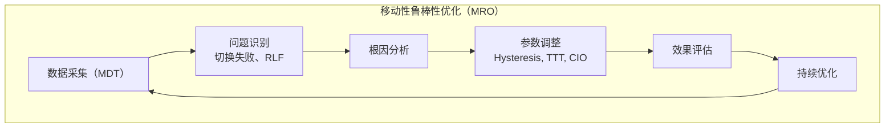

## 跨代网络移动性

### 2G/3G/4G互操作

**系统间切换（Inter-RAT Handover）**：

| 切换方向 | 触发场景 | 挑战 |
|---------|---------|------|
| 4G → 3G | LTE覆盖边缘、语音回落（CSFB） | 切换时延长 |
| 3G → 4G | 进入LTE覆盖区 | 测量和判决复杂 |
| 4G → 2G | 极端覆盖边缘 | 性能落差大 |

**语音回落（CSFB）**：

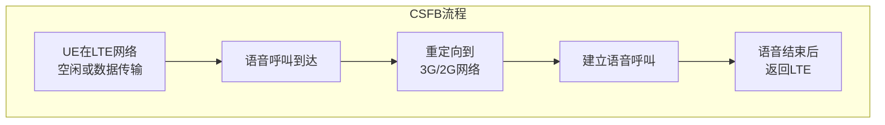

### 4G/5G互操作

**EN-DC（E-UTRA-NR Dual Connectivity）**：
- LTE作为锚点（主基站）
- 5G NR作为辅助（辅基站）
- 平滑过渡，无中断

**5G SA切换**：
- 独立组网，直接切换
- 切换流程类似LTE
- 更快的切换速度

---

**下一节**：[7.8 无线和移动性对高层协议的影响](7.8无线网络：协议影响.md)  
