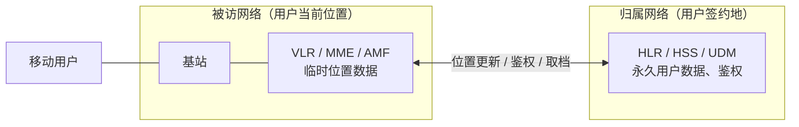
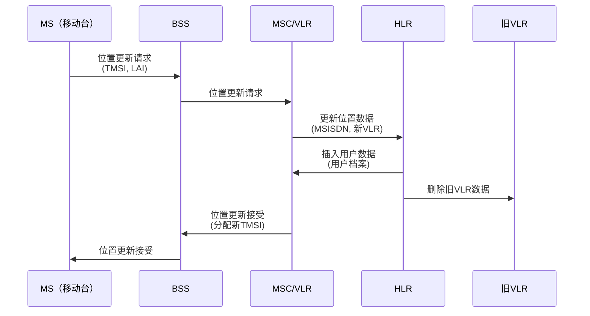
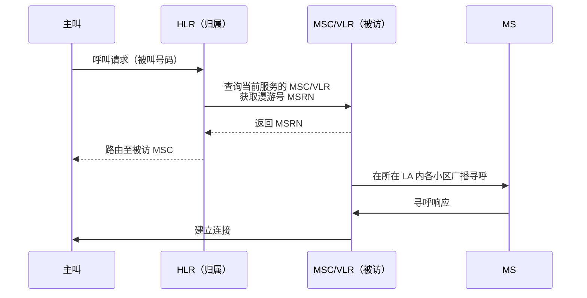
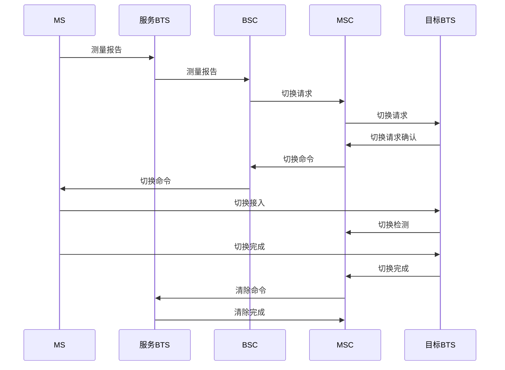
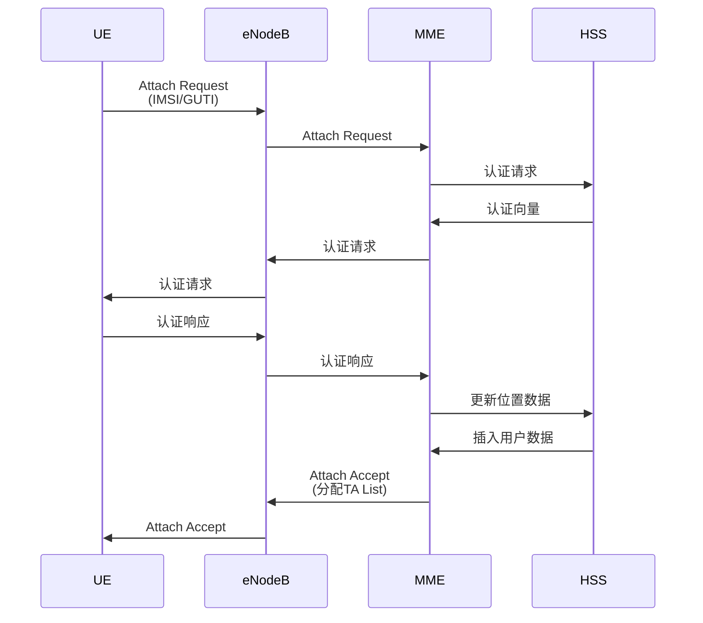
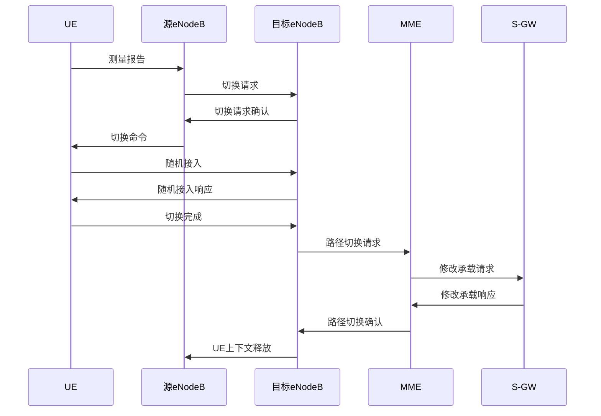
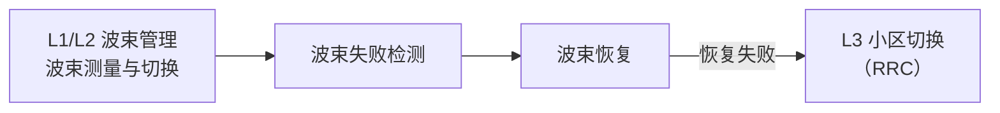
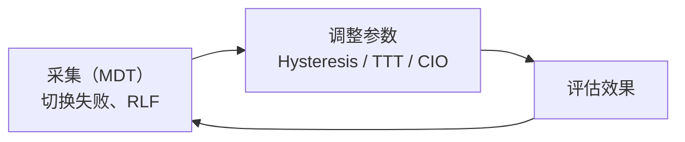

# 7.7 蜂窝网络中的移动性管理

## 目录

1. [蜂窝网络移动性概述](#蜂窝网络移动性概述)
2. [GSM网络移动性管理](#gsm网络移动性管理)
3. [LTE网络移动性管理](#lte网络移动性管理)
4. [5G网络移动性管理](#5g网络移动性管理)
5. [移动性管理性能计算](#移动性管理性能计算)
6. [移动性管理优化策略](#移动性管理优化策略)
7. [跨代网络移动性](#跨代网络移动性)

---

## 蜂窝网络移动性概述

[7.5 移动性管理](7.5无线网络：移动性管理.md) 给出了位置管理、切换、移动 IP 的通用原理（归属/被访位置寄存器、寻呼、硬/软切换、三角路由等）。本节聚焦这些原理在 GSM、LTE、5G 实际网络中的具体实现，不重复通用部分。

### 蜂窝移动性与移动 IP 的分工

蜂窝网络自身在链路层和网络层就提供移动性支持，与 IETF 的移动 IP 是两套独立机制。

| 特性 | 移动 IP | 蜂窝网络移动性 |
|-----|-------|--------------|
| 层次 | 网络层（IP） | 链路层 + 核心网 |
| 移动单位 | 子网 | 小区 / 位置区 |
| 管理实体 | HA / FA | MSC、MME、AMF |
| 切换中断 | 秒级 | 毫秒级 |
| 位置粒度 | 子网级 | 小区级 |
| 标准组织 | IETF | 3GPP |

> 易混：蜂窝切换 vs 移动 IP。蜂窝切换是同一运营商网络内基站间的链路层/核心网过程，目标是会话不中断；移动 IP 解决的是跨 IP 子网保持 IP 地址不变的问题。日常手机上网主要依赖蜂窝切换，移动 IP 仅在特定跨网络场景使用。

### 归属网络与被访网络

蜂窝移动性管理的核心是一套两级位置数据库：用户的永久信息存放在**归属网络**，移动到外地后由**被访网络**临时登记其位置，二者通过信令交互完成定位和呼叫路由。

各代网络的对应网元：

| 角色 | GSM | LTE | 5G |
|-----|-----|-----|-----|
| 归属数据库 | HLR | HSS | UDM |
| 被访/服务实体 | VLR + MSC | MME | AMF |
| 位置单元 | 位置区 LA | 跟踪区 TA | 注册区 RA |

### 移动性管理的两大任务

蜂窝移动性管理分为两类，分别对应空闲态和连接态：

1. **位置管理**：用户空闲时跟踪其大致位置（精确到位置区/跟踪区），包括位置注册、位置更新、寻呼。
2. **切换管理**：用户通话或数据传输中跨小区移动时转移连接，保证会话连续。

## GSM网络移动性管理

### GSM网络架构

**核心网元**：

| 网元 | 全称 | 功能 |
|-----|------|------|
| HLR | Home Location Register | 归属位置寄存器，存储用户永久信息 |
| VLR | Visitor Location Register | 访问位置寄存器，存储用户临时信息 |
| MSC | Mobile Switching Center | 移动交换中心，控制呼叫和切换 |
| BSC | Base Station Controller | 基站控制器，管理多个 BTS、负责切换判决 |
| BTS | Base Transceiver Station | 基站收发台，提供无线收发 |

注：VLR 通常与 MSC 合设，二者一起构成被访网络中负责该用户的服务实体。

**位置层次结构**（由小到大）：

### GSM位置管理

**1. 位置区（Location Area）**

> **位置区（LA）**：一组小区的集合，是空闲态位置管理的基本单位。用户在同一 LA 内移动不必上报；跨 LA 时触发位置更新。LA 越大，位置更新越少但寻呼范围越广，二者需折中（见[性能计算](#移动性管理性能计算)）。

**位置区标识**：
- LAI（Location Area Identity）= MCC + MNC + LAC
  - MCC：移动国家代码（3 位十进制）
  - MNC：移动网络代码（2~3 位十进制）
  - LAC：位置区码（16 比特）

**2. 位置注册（Location Registration）**

**注册类型**：

| 注册类型 | 触发条件 | 频率 |
|---------|---------|------|
| 开机注册 | 移动台开机 | 一次 |
| 位置区更新 | 进入新位置区 | 高 |
| 周期性注册 | 定时器超时 | 中 |
| IMSI附着 | 首次接入网络 | 一次 |
| IMSI分离 | 关机或脱离网络 | 一次 |

**位置更新流程**：

**3. 寻呼（Paging）**

> **寻呼**：有呼叫到达时，网络只知道用户所在的 LA，需在该 LA 的所有小区广播寻找用户。寻呼是位置管理的"反向"操作：位置粒度越粗（LA 越大），寻呼代价越高。

呼叫到达时，归属网络（HLR）先定位用户当前所在的被访 MSC/VLR，再由该 MSC/VLR 在用户所在 LA 内寻呼：

**寻呼策略**：

| 策略 | 描述 | 权衡 |
|-----|------|-------|
| 全区寻呼 | 一次向整个 LA 所有小区寻呼 | 时延小、信令开销大 |
| 顺序寻呼 | 按概率从高到低分批寻呼 | 开销小、平均时延增大 |

### GSM切换管理

GSM 采用**硬切换**（先断后连）：与旧 BTS 断开后才接入新 BTS，存在短暂中断。这与 CDMA 系统的软切换不同。

> 易混：硬切换 vs 软切换。硬切换同一时刻只连一个基站，切换时有中断，实现简单（GSM、WiFi、LTE 同频切换）；软切换同时连接多个基站、择优合并，切换无中断但占用更多资源，依赖 CDMA 的同频复用特性（IS-95、UMTS）。GSM 各小区频率不同，无法软切换。详细对比见 [7.5 切换管理技术](7.5无线网络：移动性管理.md#切换管理技术)。

**1. 切换类型**（按涉及网元范围）

| 切换类型 | 范围 | 谁来控制 |
|---------|------|---------|
| 小区内切换 | 同 BTS 内换信道 | BSC |
| BSC 内切换 | 同 BSC、不同 BTS | BSC |
| MSC 内切换 | 同 MSC、不同 BSC | MSC |
| MSC 间切换 | 跨 MSC | 锚 MSC 协调 |

范围越大，涉及的信令交互越多、切换越复杂。

**2. 切换触发条件**

主要基于移动台上报的测量报告：
- 服务小区信号强度低于门限；
- 目标小区信号强度高于服务小区且超过滞后余量 $H$（防乒乓切换）；
- 误码率（BER）过高，或定时提前量过大（距离过远）。

此外可基于负载均衡、业务质量等触发。

**3. GSM切换流程（MSC内切换）**

**切换时延组成**（量级参考）：

| 阶段 | 典型时延 |
|-----|---------|
| 测量与判决 | 100~200 ms |
| 信令交互 | 50~100 ms |
| 信道建立 | 50~100 ms |
| 合计 | 约 200~400 ms |

## LTE网络移动性管理

### LTE网络架构

**核心网元（EPC）**：

| 网元 | 全称 | 功能 |
|-----|------|------|
| MME | Mobility Management Entity | 移动性管理实体 |
| HSS | Home Subscriber Server | 归属用户服务器（类似HLR） |
| S-GW | Serving Gateway | 服务网关 |
| P-GW | PDN Gateway | 分组数据网关 |

**无线接入网（E-UTRAN）**：
- eNodeB（演进型基站）：将基站收发与基站控制功能合一，直接接入核心网，取消了 GSM 中独立的 BSC，使接入网更扁平、切换时延更低。

**位置层次结构**（由小到大）：

### LTE位置管理

**1. 跟踪区（Tracking Area）**

> **跟踪区（TA）**：LTE 的空闲态位置管理单元，由一个或多个小区组成，作用与 GSM 的 LA 相同。

**跟踪区标识**：
- TAI（Tracking Area Identity）= PLMN ID + TAC
  - PLMN ID = MCC + MNC，标识运营商网络
  - TAC：跟踪区码（LTE 为 16 比特）

**跟踪区列表（TA List）**：
- UE可以注册到多个TA
- 在TA列表内移动无需位置更新
- 减少信令开销

**2. LTE位置更新流程**

**3. LTE寻呼机制**

LTE 与 GSM 寻呼的差异：

| 特性 | GSM | LTE |
|-----|-----|-----|
| 寻呼范围 | 单个 LA | 整个 TA List |
| 节电机制 | 基本 DRX | 增强 DRX（eDRX） |
| 寻呼时机 | 固定 | 可配置寻呼时机（PO） |

DRX（非连续接收）让 UE 只在约定时刻醒来监听寻呼，其余时间休眠省电。寻呼总开销随被寻呼小区数线性增长：

$$C_{\text{寻呼}} = N_{\text{cell}} \times C_0 \times \lambda_{\text{呼叫}}$$

其中 $N_{\text{cell}}$ 为 TA List 覆盖的小区总数，$C_0$ 为单次寻呼开销，$\lambda_{\text{呼叫}}$ 为呼叫到达率。这与[例题 4](#例题4ta-list优化)中 TA List 越大寻呼成本越高的结论一致。

### LTE切换管理

LTE 也是硬切换，但由于接入网扁平、源/目标 eNodeB 可直连，中断时间降到数十毫秒。

**1. LTE切换类型**

| 切换类型 | 触发条件 | 路径 |
|---------|---------|------|
| X2 切换 | 源/目标 eNodeB 间存在 X2 接口（同一 MME） | 经 X2 直接转发数据，最快 |
| S1 切换 | 无 X2 接口（或需更换 MME） | 经 MME 中转，信令更多 |
| 系统间切换 | LTE 与 3G/2G 之间 | 经核心网，需跨制式转换 |

注：常见简化说法"X2=同 MME、S1=不同 MME"并不严谨——X2 切换确实要求 MME 不变，但 S1 切换既可能换 MME 也可能不换，关键区别在于源/目标基站之间是否有可用的 X2 接口。

**2. 基于X2的切换流程**

**3. 切换性能指标**

| 指标 | GSM | LTE | 5G NR |
|-----|-----|-----|-------|
| 切换中断时间 | 200-400ms | 30-50ms | <10ms |
| 切换准备时间 | 100-200ms | 20-30ms | <5ms |
| 切换执行时间 | 100-200ms | 10-20ms | <5ms |
| 切换成功率 | >95% | >98% | >99% |

切换由测量事件触发，常用：
- **A3 事件**：邻小区比服务小区好出一个偏移（最常用，触发普通切换）；
- **A5 事件**：服务小区低于门限 1 且邻小区高于门限 2（用于覆盖边缘）。

具体参数（Hysteresis、TTT、CIO）的调优见[切换参数调优](#切换参数调优)。

## 5G网络移动性管理

### 5G移动性管理架构

**5G核心网（5GC）网元**：

| 网元 | 功能 |
|-----|------|
| AMF | 接入和移动性管理功能（类似LTE MME） |
| SMF | 会话管理功能 |
| UPF | 用户平面功能 |
| UDM | 统一数据管理（类似LTE HSS） |

**注册区（RA，Registration Area）**：5G 的空闲态位置管理单元，由一个或多个 TA 组成（类似 LTE 的 TA List）。UE 在注册区内移动无需更新，跨注册区才触发，思路与 LTE TA List 一致。注：5G NR 的 TAC 扩展为 24 比特（LTE 为 16 比特），可标识更多跟踪区。

### 5G移动性增强

**1. 双连接（Dual Connectivity）**

> **双连接**：UE 同时连接主、辅两个基站，由两条链路分流/聚合数据。在切换场景下可先建立到目标基站的链路再释放源链路，逼近无中断。

**EN-DC（E-UTRA-NR Dual Connectivity）**：5G 非独立组网（NSA）的核心形态。
- 主基站（锚点）：LTE eNodeB，承载控制面；
- 辅基站：5G gNodeB，提供高速数据面。

**2. 条件切换（CHO，Conditional Handover）**

传统切换的判决和执行紧耦合：UE 上报测量后由源基站下发切换命令再执行，高速移动下命令可能因信号已劣化而下发失败。条件切换将"准备"与"执行"解耦：

源基站提前完成目标小区资源准备，UE 在最佳时机自主触发，避免错过切换窗口，对高铁等高速场景尤其有效。

**3. 波束管理**

毫米波波束窄、方向性强，易被遮挡，移动中需频繁调整波束。5G 在切换之外增加了波束级（L1/L2）的维护机制，仅当波束级恢复失败时才上升到小区级（L3）切换：

## 移动性管理性能计算

### 例题1：位置更新开销计算

> **例题**：某GSM网络位置区由30个小区组成，平均每小区覆盖半径1km。用户平均移动速度30km/h，呼叫到达率0.5次/小时。位置更新开销为100个信令单位，寻呼开销为每小区10个信令单位。计算：
> 1. 用户平均每小时位置更新次数
> 2. 每小时总信令开销

**解题步骤**：

**1. 位置更新次数**：

假设小区为正六边形，边长 $r = 1$ km：
- 小区面积：$A_{\text{cell}} = \frac{3\sqrt{3}}{2}r^2 = 2.6$ km²
- LA面积：$A_{\text{LA}} = 30 \times 2.6 = 78$ km²
- LA等效半径：$R = \sqrt{\frac{A_{\text{LA}}}{\pi}} = \sqrt{\frac{78}{3.14}} = 5$ km

使用简化模型，穿越LA边界的速率：
$$\lambda_{\text{更新}} = \frac{v \times L}{A}$$

其中 $L$ 为边界长度，$A$ 为面积。对于圆形近似：
$$\lambda_{\text{更新}} = \frac{v \times 2\pi R}{\pi R^2} = \frac{2v}{R} = \frac{2 \times 30}{5} = 12\text{次/小时}$$

**2. 总信令开销**：

位置更新开销：
$$C_{\text{更新}} = 12 \times 100 = 1200\text{个单位/小时}$$

寻呼开销：
$$C_{\text{寻呼}} = 0.5 \times 30 \times 10 = 150\text{个单位/小时}$$

总开销：
$$C_{\text{总}} = 1200 + 150 = 1350\text{个单位/小时}$$

**答案**：
1. 平均每小时位置更新12次
2. 总信令开销1350个单位/小时（位置更新占89%，寻呼占11%）

### 例题2：最优位置区大小

> **例题**：继续上题场景，假设位置区由 $N$ 个小区组成，每小区面积2.6 km²。求使总信令开销最小的最优小区数量 $N^*$。

**解题步骤**：

**1. 建立成本模型**：

位置区面积：$A = N \times 2.6$ km²

等效半径：$R = \sqrt{\frac{A}{\pi}} = \sqrt{\frac{2.6N}{\pi}} = 0.91\sqrt{N}$ km

位置更新率：
$$\lambda_u = \frac{2v}{R} = \frac{2 \times 30}{0.91\sqrt{N}} = \frac{66}{\sqrt{N}}\text{次/小时}$$

位置更新成本：
$$C_u = \lambda_u \times C_u^0 = \frac{66}{\sqrt{N}} \times 100 = \frac{6600}{\sqrt{N}}$$

寻呼成本：
$$C_p = \lambda_c \times N \times C_p^0 = 0.5 \times N \times 10 = 5N$$

总成本：
$$C_{\text{total}} = \frac{6600}{\sqrt{N}} + 5N$$

**2. 求最优值**：

对 $N$ 求导：
$$\frac{dC}{dN} = -\frac{6600}{2N^{3/2}} + 5 = -\frac{3300}{N^{3/2}} + 5$$

令导数为0：
$$\frac{3300}{N^{3/2}} = 5$$
$$N^{3/2} = 660$$
$$N = 660^{2/3} \approx 75.8$$

取 $N^* \approx 76$ 个小区。

**3. 验证**：

- 当 $N = 76$：$C = \frac{6600}{\sqrt{76}} + 5 \times 76 = 757 + 380 = 1137$
- 当 $N = 30$（原始）：$C = \frac{6600}{\sqrt{30}} + 5 \times 30 = 1205 + 150 = 1355$

优化后信令开销降低约 16%。

**答案**：最优位置区约为 76 个小区，总信令开销最小（约 1137 单位/小时）。

### 例题3：LTE切换性能分析

> **例题**：LTE网络中，小区半径500m，用户以60km/h速度直线移动。X2切换中断时间40ms，切换准备时间25ms。假设VoIP应用，每20ms生成一个语音包。计算：
> 1. 用户平均每分钟切换次数
> 2. 每次切换丢失的语音包数量
> 3. 切换对语音质量的影响

**解题步骤**：

**1. 切换频率**：

小区直径：$D = 2 \times 500 = 1000\text{m} = 1\text{km}$

移动速度：$v = 60\text{km/h} = 1\text{km/min}$

切换频率：
$$f = \frac{v}{D} = \frac{1}{1} = 1\text{次/分钟}$$

**2. 丢包数量**：

切换中断时间：40ms

语音包间隔：20ms

丢失包数：
$$N_{\text{lost}} = \lceil \frac{40}{20} \rceil = 2\text{个包}$$

考虑切换准备阶段可能的信号质量下降，实际可能丢失：
$$N_{\text{total}} = \frac{40 + 25}{20} \approx 3\text{个包}$$

**3. 语音质量影响**：

每分钟总包数：
$$N_{\text{total/min}} = \frac{60 \times 1000}{20} = 3000\text{个包}$$

每分钟切换丢包：
$$N_{\text{lost/min}} = 1 \times 3 = 3\text{个包}$$

丢包率：
$$PLR = \frac{3}{3000} = 0.1\%$$

**语音质量评估**：
- VoIP可接受丢包率：< 1%
- 实际丢包率：0.1%
- 结论：对语音质量影响较小

**答案**：
1. 每分钟切换1次
2. 每次切换丢失约3个语音包
3. 丢包率0.1%，对语音质量影响小，满足VoIP要求

### 例题4：TA List优化

> **例题**：LTE网络中，某区域有4个TA，每个TA包含20个小区。用户移动模式分析显示：
> - 在TA1的用户，60%时间停留在TA1，20%移动到TA2，15%到TA3，5%到TA4
> - 位置更新开销：200信令单位
> - 寻呼开销：每小区5信令单位
> - 用户平均移动速度：使得每小时穿越TA边界2次
> - 呼叫到达率：1次/小时
> 
> 设计TA List分配方案并计算信令开销。

**解题步骤**：

**方案1：单个TA（TA List = {TA1}）**

位置更新次数：
- 用户40%时间在TA1外，平均每小时穿越2次
- 每次进出TA1都需要更新
- 更新次数：$2 \times 0.4 = 0.8$次/小时

位置更新成本：$C_u = 0.8 \times 200 = 160$

寻呼成本：$C_p = 1 \times 20 \times 5 = 100$

总成本：$C_1 = 160 + 100 = 260$

**方案2：两个TA（TA List = {TA1, TA2}）**

位置更新次数：
- 用户80%时间在TA1或TA2（覆盖60%+20%）
- 需要更新的比例：20%
- 更新次数：$2 \times 0.2 = 0.4$次/小时

位置更新成本：$C_u = 0.4 \times 200 = 80$

寻呼成本：$C_p = 1 \times 40 \times 5 = 200$

总成本：$C_2 = 80 + 200 = 280$

**方案3：三个TA（TA List = {TA1, TA2, TA3}）**

位置更新次数：
- 覆盖95%（60%+20%+15%）
- 更新次数：$2 \times 0.05 = 0.1$次/小时

位置更新成本：$C_u = 0.1 \times 200 = 20$

寻呼成本：$C_p = 1 \times 60 \times 5 = 300$

总成本：$C_3 = 20 + 300 = 320$

**答案**：
- 最优方案：TA List = {TA1}，总开销260信令单位/小时
- 方案1的位置更新成本高但寻呼成本低
- 方案3的寻呼成本高但位置更新成本低
- 由于呼叫到达率较低，应选择较小的TA List

### 例题5：5G切换时延分析

> **例题**：5G网络中，传统切换时延30ms，条件切换时延10ms。高铁场景下，速度300km/h，小区半径2km，基站间重叠区域200m。计算：
> 1. 传统切换方式下重叠区域停留时间
> 2. 是否有足够时间完成切换
> 3. 条件切换的优势

**解题步骤**：

**1. 重叠区域停留时间**：

速度：$v = 300\text{km/h} = 83.33\text{m/s}$

重叠区域长度：$L = 200\text{m}$

停留时间：
$$T_{\text{overlap}} = \frac{L}{v} = \frac{200}{83.33} = 2.4\text{s} = 2400\text{ms}$$

**2. 传统切换评估**：

切换时延：30ms

重叠区域停留时间：2400ms

切换成功的时间窗口：
$$T_{\text{window}} = 2400 - 30 = 2370\text{ms}$$

结论：有足够时间完成切换，但需要及时触发。

**3. 切换裕度分析**：

传统切换裕度：
$$M_{\text{传统}} = \frac{2400 - 30}{2400} \times 100\% = 98.75\%$$

条件切换裕度：
$$M_{\text{条件}} = \frac{2400 - 10}{2400} \times 100\% = 99.58\%$$

**4. 极端场景**：

如果重叠区域只有100m：
$$T_{\text{overlap}} = \frac{100}{83.33} = 1200\text{ms}$$

传统切换：仍然足够（1200ms > 30ms）

条件切换：更加可靠

**答案**：
1. 重叠区域停留时间2400ms
2. 传统切换有足够时间（98.75%裕度），但条件切换更优
3. 条件切换时延减少67%，提高切换可靠性和成功率

## 移动性管理优化策略

位置管理优化（动态 LA/TA 大小、位置预测、寻呼策略）的通用原理见 [7.5 移动性能优化](7.5无线网络：移动性管理.md#移动性能优化)，本节只补充蜂窝切换的参数调优与自优化。

### 切换参数调优

LTE/5G 通过测量事件触发切换，关键参数直接影响切换的及时性与稳定性：

| 参数 | 含义 | 典型取值 | 作用 |
|-----|------|---------|------|
| Hysteresis | 滞后余量 | 3~5 dB | 防止乒乓切换 |
| TTT（Time-to-Trigger） | 触发延迟 | 40~480 ms | 过滤瞬时波动 |
| A3 Offset | 邻区优于服务区的门限 | 1~3 dB | 控制切换早晚 |
| CIO（Cell Individual Offset） | 小区个性化偏置 | 按需 | 引导负载/边界 |

注：滞后值与移动速度需配合——高速用户增大滞后、减少不必要切换（移动性状态估计 MSE）；负载均衡则可通过 CIO 把用户引导至空闲小区。

### 移动性鲁棒性优化（MRO）

参数配置不当会导致三类切换失败：

- **过早切换（Too Early HO）**：刚切换就因目标小区信号不足而失败；
- **过晚切换（Too Late HO）**：切换前源小区已发生无线链路失败（RLF）；
- **切换到错误小区（HO to Wrong Cell）**：切到了非最优邻区。

MRO 通过采集失败统计（MDT），反向调整 Hysteresis、TTT、CIO，形成自优化闭环：

## 跨代网络移动性

### 2G/3G/4G互操作

**系统间切换（Inter-RAT Handover）**：

| 切换方向 | 触发场景 | 挑战 |
|---------|---------|------|
| 4G → 3G | LTE覆盖边缘、语音回落（CSFB） | 切换时延长 |
| 3G → 4G | 进入LTE覆盖区 | 测量和判决复杂 |
| 4G → 2G | 极端覆盖边缘 | 性能落差大 |

**语音回落（CSFB，CS Fallback）**：早期 LTE 只有分组域，没有电路域语音。当 LTE 网络未部署 VoLTE 时，来电会把 UE 临时回落到 2G/3G 电路域接听，通话结束再返回 LTE：

注：CSFB 会增加接通时延，已被 VoLTE（在 LTE 分组域直接承载语音）取代。

### 4G/5G互操作

5G 部署分两种组网方式，移动性处理不同：

- **NSA（非独立组网）**：通过 EN-DC 与 LTE 共存，LTE 作锚点承载控制面、5G 提供数据面，平滑过渡。
- **SA（独立组网）**：5G 核心网（5GC）独立运行，gNodeB 间直接切换，流程类似 LTE 但接入网时延更低。

---

**下一节**：[7.8 无线和移动性对高层协议的影响](7.8无线网络：协议影响.md)
