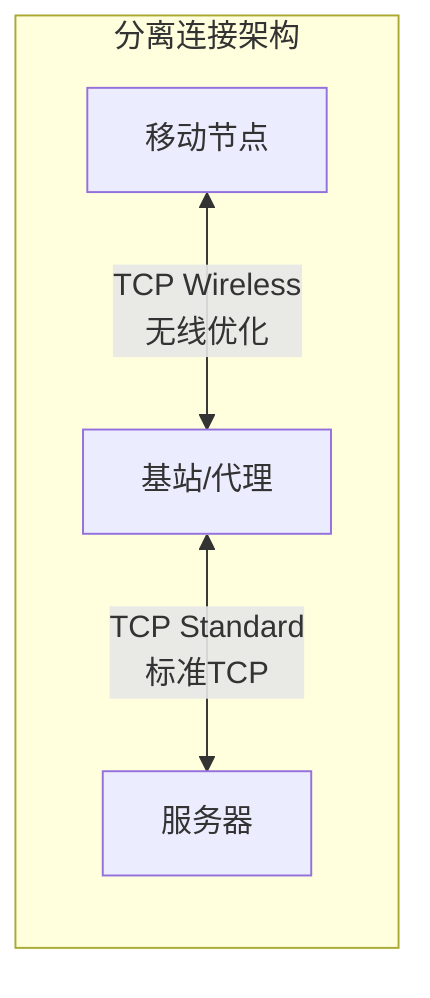
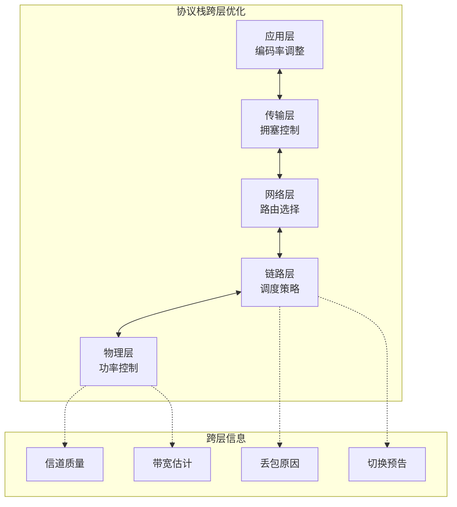
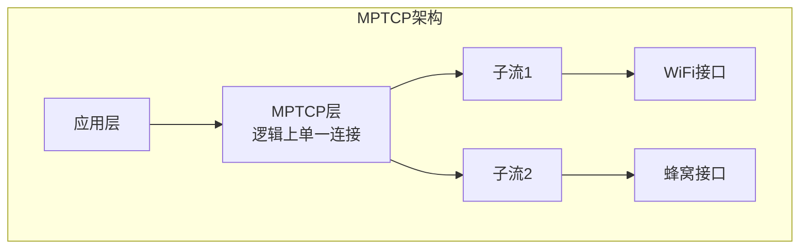

# 7.8 无线和移动性对高层协议的影响

## 目录

1. [无线环境的特殊性](#无线环境的特殊性)
2. [TCP在无线网络中的性能问题](#tcp在无线网络中的性能问题)
3. [TCP性能优化方案](#tcp性能优化方案)
4. [TCP性能计算例题](#tcp性能计算例题)
5. [应用层适配策略](#应用层适配策略)
6. [新兴传输协议](#新兴传输协议)
7. [性能对比总结](#性能对比总结)

---

## 无线环境的特殊性

### 无线链路特征回顾

无线链路与有线链路在误码率、延迟、带宽、连接稳定性上有本质差异，这些差异会向上传导，影响传输层和应用层协议的性能。

**无线链路特点**：

| 特征 | 有线网络 | 无线网络 | 影响 |
|-----|---------|---------|------|
| 误码率（BER） | 10⁻⁹ | 10⁻⁵ ~ 10⁻³ | 丢包率高 |
| 延迟变化 | 稳定 | 波动大 | RTT不稳定 |
| 带宽 | 稳定 | 动态变化 | 吞吐量波动 |
| 连接中断 | 罕见 | 频繁（切换） | 连接中断 |
| 非对称性 | 通常对称 | 上下行差异大 | ACK传输受限 |

**丢包原因对比**：

有线网络中丢包几乎全部来自路由器队列溢出（拥塞）；无线网络中，链路误码和切换中断成为主要丢包来源，拥塞反而退居其次。

```
有线网络丢包来源        无线网络丢包来源
┌──────────────┐       ┌──────────────┐
│ 拥塞      ████│       │ 拥塞      ██  │
│ 传输错误      │       │ 链路误码  ████│
│              │       │ 切换中断  ██  │
└──────────────┘       └──────────────┘
   以拥塞为主              误码/切换占很大比例
```

> 注：无线丢包 ≠ 拥塞丢包。TCP 把所有丢包都当成拥塞信号去降速，是它在无线环境性能差的根本原因（详见下节）。

### 移动性影响因素

**1. 切换影响**

| 切换阶段 | 持续时间 | 对协议的影响 |
|---------|---------|------------|
| 测量和判决 | 100-500ms | 信号质量下降，误码率上升 |
| 切换执行 | 30-200ms | 连接中断，数据包丢失 |
| 路由更新 | 50-100ms | 三角路由，延迟增加 |

**2. 路径变化**

移动导致的路径特性变化：
- RTT变化（跨地域移动）
- 带宽变化（不同接入技术）
- 丢包率变化（信号强度）

**3. 多路径问题**

```
原始路径：移动节点 → AP1 → 路由器 → 服务器
切换后路径：移动节点 → AP2 → 路由器 → 服务器
```

可能导致：
- 包乱序
- 重复确认
- RTT突变

## TCP在无线网络中的性能问题

### TCP的基本假设与无线环境的冲突

TCP 的拥塞控制基于有线网络设计，隐含若干假设，而这些假设在无线环境中大多不成立。

**假设与现实的对比**：

| TCP假设 | 有线网络 | 无线网络 | 冲突点 |
|---------|---------|---------|-------|
| 丢包即拥塞 | 成立 | 不成立 | 链路误码也会丢包 |
| RTT 稳定 | 成立 | 不成立 | 信道质量波动 |
| 路径不变 | 成立 | 不成立 | 移动导致路径变化 |
| 带宽稳定 | 成立 | 不成立 | 自适应调制编码 |
| 链路对称 | 多数成立 | 不成立 | 上下行差异大 |

其中**「丢包即拥塞」**这一假设的破裂影响最大：无线链路的随机误码丢包被 TCP 误判为拥塞，触发拥塞窗口减半，导致吞吐量在并未真正拥塞的情况下大幅下降。

### TCP性能问题分析

**1. 无线误码导致的性能下降**

这是无线下 TCP 性能问题的核心。误码丢包本与拥塞无关，但 TCP 无法区分，统一按拥塞处理：


**吞吐量模型**：

稳态下，基于丢包率的 TCP 平均吞吐量近似为：

$$\text{Throughput} \approx \frac{MSS}{RTT} \times \frac{C}{\sqrt{p}}, \quad C = \sqrt{\frac{3}{2}} \approx 1.22$$

其中 $MSS$ 为最大报文段长度，$RTT$ 为往返时延，$p$ 为丢包率。吞吐量与 $\sqrt{p}$ 成反比，因此丢包率的小幅上升就会带来明显的吞吐量损失。

**示例计算**：
- MSS = 1460字节
- RTT = 100ms = 0.1s
- 有线网络丢包率：$p_1 = 0.1\%$
- 无线网络丢包率：$p_2 = 1\%$

有线网络吞吐量：
$$T_1 = \frac{1460}{0.1} \times \frac{1.22}{\sqrt{0.001}} = 14600 \times 38.6 = 563,560\text{ bytes/s} \approx 4.5\text{ Mbps}$$

无线网络吞吐量：
$$T_2 = \frac{1460}{0.1} \times \frac{1.22}{\sqrt{0.01}} = 14600 \times 12.2 = 178,120\text{ bytes/s} \approx 1.4\text{ Mbps}$$

丢包率从 0.1% 升到 1%，吞吐量降至原来的 $\frac{1.4}{4.5} \approx 31\%$。

**2. 切换导致的中断**

切换过程中链路短暂中断，TCP 会因此超时、重置拥塞窗口，进入慢启动恢复：


**时间线分析**：

| 阶段 | 时间 | cwnd变化 | 吞吐量 |
|-----|------|---------|--------|
| 正常传输 | t₀ | 正常（如50） | 100% |
| 信号下降 | t₀+100ms | 开始减小 | 80% |
| 切换中断 | t₀+150ms | 急剧减小 | 0% |
| 重传超时 | t₀+350ms | 降至1 | 0% |
| 慢启动 | t₀+400ms | 指数增长 | 逐渐恢复 |
| 完全恢复 | t₀+2s | 恢复正常 | 100% |

**3. 链路非对称性问题**

**上下行带宽差异**：

典型无线网络：
- 下行：10 Mbps
- 上行：2 Mbps
- 比例：5:1

下行高速传输需要大量 ACK 经上行链路返回，而上行带宽不足时 ACK 会排队、延迟甚至丢失，反过来拖累下行：


**ACK压缩（ACK Compression）**：
- 多个ACK在上行链路排队
- 突发到达发送端
- 导致窗口突然增大
- 引起数据包突发

**4. 虚假超时（Spurious Timeout）**

切换或信道波动使 RTT 突增，原本正常的数据包因 RTO 未及时更新而被判为丢失，触发不必要的重传与降速：


**RTT波动示例**：正常 RTT 为 50ms、RTO 约 200ms；切换期间 RTT 突增到 500ms，超过 RTO，触发虚假超时——其实数据包并未丢失，只是延迟到达。

## TCP性能优化方案

针对「误码丢包被误判为拥塞」这一核心问题，优化思路分布在不同层次：

- **端到端（改 TCP 本身）**：让 TCP 自己学会区分丢包原因（Westwood 按带宽估算、Vegas 按 RTT 探测、SACK/Eifel 改进重传与恢复）。
- **链路层（对 TCP 透明）**：在无线链路本地用 ARQ 重传或 FEC 纠错，把误码隐藏在 TCP 视野之外。
- **分割连接（插入代理）**：把无线段单独拆出来优化，与有线段独立做拥塞控制。
- **跨层（信息共享）**：由下层把丢包原因显式告知 TCP（ELN），从根上消除误判。

### 端到端解决方案

**1. TCP Westwood**

> **核心思想**：根据ACK速率估算可用带宽，而不是简单地在丢包时减半拥塞窗口。

**带宽估算**：

$$BWE = \frac{\sum \text{已确认字节数}}{\Delta t}$$

**拥塞控制调整**：
```
检测到丢包时：
  if (3个重复ACK):
    ssthresh = max(BWE × RTTmin, 2)
    cwnd = ssthresh
  else if (超时):
    ssthresh = max(BWE × RTTmin, 2)
    cwnd = 1
```

**优势**：
- 区分拥塞丢包和无线丢包
- 在无线环境中保持较高吞吐量
- 对移动性更加友好

**2. TCP-SACK（选择确认）**

> **改进**：允许接收端选择性确认已收到的不连续数据块，避免不必要的重传。

**SACK选项格式**：
```
┌─────────────────────────────────────────────────────────┐
  TCP SACK选项
├─────────────────────────────────────────────────────────┤
  Kind (8位) - 值为5，表示SACK选项
├─────────────────────────────────────────────────────────┤
  Length (8位) - 选项总长度（8N+2字节）
├─────────────────────────────────────────────────────────┤
  Left Edge 1 (32位) - 第1个块的起始序号
├─────────────────────────────────────────────────────────┤
  Right Edge 1 (32位) - 第1个块的结束序号
├─────────────────────────────────────────────────────────┤
  ... (可包含最多3个SACK块)
└─────────────────────────────────────────────────────────┘
```

**示例**：
```
发送：Seq 1000-4000（4个段，每段1000字节）
接收：收到1000-2000, 3000-4000，丢失2000-3000

传统TCP：ACK 2000（只能确认连续数据）
TCP-SACK：ACK 2000 + SACK{3000-4000}（明确告知收到3000-4000）

结果：
- 传统TCP：重传2000-4000（2个段）
- TCP-SACK：只重传2000-3000（1个段）
- 节省50%带宽
```

**3. Eifel算法**

> **目标**：检测和响应虚假超时和虚假快速重传。

**检测机制**：
- 使用TCP时间戳选项
- 记录每个数据包的发送时间
- 对比重传包和原始包的时间戳
- 判断是否为虚假重传

**响应策略**：
```
if (检测到虚假超时):
    恢复拥塞窗口（不进入慢启动）
    恢复ssthresh
    继续正常传输
```

**性能改善**：
- 避免不必要的拥塞控制
- 快速恢复传输速率
- 特别适合移动场景

### 分离连接方案（Split Connection）

> **核心思想**：在无线链路和有线链路之间插入代理，分别优化两段连接。

**架构**：



**工作原理**：

1. **TCP连接分离**：
   - 移动节点到基站：使用无线优化的TCP
   - 基站到服务器：使用标准TCP

2. **代理功能**：
   - 协议转换
   - 本地重传
   - 缓存管理
   - ACK欺骗

**优势**：
- 无线链路优化：快速本地重传，减少端到端延迟
- 独立拥塞控制：两段连接独立调整
- 透明部署：终端无需修改

**劣势**：
- 破坏端到端语义
- 代理复杂度高
- 可能影响安全性（如TLS）

### 链路层解决方案

**1. 链路层重传（ARQ）**

> **思想**：在链路层检测和重传错误数据帧，对TCP透明。

**ARQ类型**：

| ARQ类型 | 效率 | 延迟 | 复杂度 |
|---------|-----|------|--------|
| Stop-and-Wait | 低 | 高 | 低 |
| Go-Back-N | 中 | 中 | 中 |
| Selective Repeat | 高 | 低 | 高 |

**优势**：
- 隐藏无线错误
- TCP无需修改
- 快速本地恢复

**挑战**：
- 需要跨层设计
- 可能与TCP重传冲突
- 增加链路层开销

**2. 前向纠错（FEC）**

**工作原理**：
```
数据包 + 冗余信息 → 接收端恢复错误
```

**FEC编码示例**：

Reed-Solomon码：
- 数据块：k个符号
- 编码后：n个符号
- 纠错能力：可纠正 $(n-k)/2$ 个错误

**示例**：
- 原始数据：10个包
- FEC编码：增加2个冗余包（20%开销）
- 结果：任意丢失2个包可恢复

**适用场景**：
- 实时应用（VoIP、视频）
- 高丢包率环境
- 不能容忍重传延迟

### 跨层优化

> **跨层设计**：打破OSI分层的严格界限，允许不同层之间信息交换和协同优化。

**跨层信息交换**：



**典型跨层优化**：

1. **链路层向传输层提供信息**：
   - 信号强度（RSSI）
   - 误码率（BER）
   - 链路容量估计
   - 切换预通知

2. **传输层利用信息调整**：
   - 区分拥塞丢包和无线丢包
   - 切换期间暂停发送或降速
   - 根据链路质量调整发送速率

**显式丢包通知（ELN）**：

```
无线基站检测到丢包原因：
  if (链路错误):
    在ACK中设置ELN标志
    TCP发送端收到ELN标志的ACK:
      重传丢失的包
      不减小拥塞窗口
  else if (拥塞):
    正常ACK
    TCP正常拥塞控制
```

## TCP性能计算例题

### 例题1：无线丢包率对吞吐量的影响

> **例题**：某无线网络，RTT=50ms，MSS=1500字节。分别计算丢包率为0.1%、1%、5%时的TCP吞吐量。分析丢包率增加10倍对吞吐量的影响。

**解题步骤**：

使用TCP吞吐量公式：
$$T = \frac{MSS}{RTT} \times \frac{1.22}{\sqrt{p}}$$

**情况1：p = 0.1% = 0.001**

$$T_1 = \frac{1500}{0.05} \times \frac{1.22}{\sqrt{0.001}} = 30000 \times 38.6 = 1,158,000\text{ bytes/s} = 9.26\text{ Mbps}$$

**情况2：p = 1% = 0.01**

$$T_2 = \frac{1500}{0.05} \times \frac{1.22}{\sqrt{0.01}} = 30000 \times 12.2 = 366,000\text{ bytes/s} = 2.93\text{ Mbps}$$

**情况3：p = 5% = 0.05**

$$T_3 = \frac{1500}{0.05} \times \frac{1.22}{\sqrt{0.05}} = 30000 \times 5.45 = 163,500\text{ bytes/s} = 1.31\text{ Mbps}$$

**影响分析**：

丢包率从0.1%到1%（增加10倍）：
$$\frac{T_2}{T_1} = \frac{2.93}{9.26} = 31.6\%$$
吞吐量降至原来的31.6%，下降68.4%

丢包率从1%到5%（增加5倍）：
$$\frac{T_3}{T_2} = \frac{1.31}{2.93} = 44.7\%$$
吞吐量降至原来的44.7%，下降55.3%

**关键结论**：
吞吐量与丢包率的平方根成反比，丢包率增加 $n$ 倍，吞吐量降至 $\frac{1}{\sqrt{n}}$

**答案**：
- 0.1%丢包率：9.26 Mbps
- 1%丢包率：2.93 Mbps（下降68%）
- 5%丢包率：1.31 Mbps（相比1%再下降55%）

### 例题2：切换对TCP传输的影响

> **例题**：TCP连接传输大文件，拥塞窗口已达到稳态值cwnd=64个MSS（MSS=1500字节），RTT=40ms。发生切换，中断时间200ms，导致超时重传。计算：
> 1. 切换前的吞吐量
> 2. 切换期间的吞吐量
> 3. 恢复到切换前吞吐量的时间

**解题步骤**：

**1. 切换前吞吐量**：

每RTT发送数据量：
$$\text{Data per RTT} = cwnd \times MSS = 64 \times 1500 = 96,000\text{ bytes}$$

吞吐量：
$$T_1 = \frac{96,000}{0.04} = 2,400,000\text{ bytes/s} = 19.2\text{ Mbps}$$

**2. 切换期间吞吐量**：

中断时间200ms，无数据传输：
$$T_2 = 0\text{ Mbps}$$

**3. 恢复时间分析**：

超时后：
- cwnd重置为1
- ssthresh = cwnd/2 = 64/2 = 32

恢复过程：

```
慢启动阶段（cwnd从1到32）：
RTT 1: cwnd = 1
RTT 2: cwnd = 2
RTT 3: cwnd = 4
...
RTT n: cwnd = 2^(n-1)

当cwnd达到32时，需要：2^(n-1) = 32，n = 6
慢启动时间：6 × 40ms = 240ms

拥塞避免阶段（cwnd从32到64）：
每RTT增加1，需要32个RTT
拥塞避免时间：32 × 40ms = 1280ms

总恢复时间：240 + 1280 = 1520ms ≈ 1.5s
```

**平均吞吐量（考虑恢复期）**：

恢复期间平均窗口：
- 慢启动：平均cwnd ≈ 16
- 拥塞避免：平均cwnd ≈ 48

加权平均：
$$\text{平均cwnd} = \frac{16 \times 240 + 48 \times 1280}{1520} = \frac{3840 + 61440}{1520} = 42.95$$

恢复期平均吞吐量：
$$T_{\text{avg}} = \frac{42.95 \times 1500}{0.04} = 1,610,625\text{ bytes/s} = 12.9\text{ Mbps}$$

**答案**：
1. 切换前吞吐量：19.2 Mbps
2. 切换期间（200ms）：0 Mbps
3. 完全恢复时间：约1.5秒，恢复期平均吞吐量12.9 Mbps

### 例题3：SACK性能分析

> **例题**：TCP连接，cwnd=16个MSS，RTT=80ms，MSS=1500字节。在一个RTT内，16个数据包中有3个随机丢失（丢包率18.75%）。比较传统TCP和TCP-SACK的重传开销和恢复时间。

**解题步骤**：

**场景**：发送包序号1-16，其中包3、7、12丢失

**传统TCP（累积确认）**：

接收端收到：1, 2, 4, 5, 6, 8, 9, 10, 11, 13, 14, 15, 16

发送ACK：
- ACK 3（收到1,2）
- 继续发送重复ACK 3（触发快速重传）

快速重传后：
- 重传包3
- 但接收端仍然ACK 7（因为4,5,6已收到）
- 需要再次快速重传包7
- 然后ACK 12，重传包12

总重传：3个包
重传开销：3 × 1500 = 4500字节

恢复时间：
- 第1个RTT：发现丢包，重传包3
- 第2个RTT：发现包7丢失，重传包7
- 第3个RTT：发现包12丢失，重传包12
- **总时间**：3 × 80ms = 240ms

**TCP-SACK**：

接收端发送：
```
ACK 3, SACK{4-7, 8-12, 13-17}
```

发送端知道：
- 丢失：3, 7, 12
- 已收到：4-6, 8-11, 13-16

在一个RTT内同时重传所有3个包

总重传：3个包（相同）
重传开销：3 × 1500 = 4500字节（相同）

恢复时间：
- 第1个RTT：同时重传包3, 7, 12
- **总时间**：1 × 80ms = 80ms

**性能对比**：

| 指标 | 传统TCP | TCP-SACK | 改善 |
|-----|---------|----------|------|
| 重传包数 | 3个 | 3个 | 相同 |
| 重传带宽 | 4500字节 | 4500字节 | 相同 |
| 恢复时间 | 240ms | 80ms | 66.7% |

**答案**：
- 传统TCP：3个RTT（240ms）恢复
- TCP-SACK：1个RTT（80ms）恢复
- SACK减少67%恢复时间，在多包丢失场景下优势显著

### 例题4：分离连接性能分析

> **例题**：移动节点通过基站代理访问服务器。无线段：带宽5Mbps，RTT=20ms，丢包率2%；有线段：带宽100Mbps，RTT=60ms，丢包率0.1%。MSS=1500字节。比较端到端TCP和分离连接的性能。

**解题步骤**：

**端到端TCP**：

总RTT：$RTT_{\text{total}} = 20 + 60 = 80\text{ms}$

有效丢包率（近似）：
$$p_{\text{total}} \approx p_1 + p_2 = 0.02 + 0.001 = 0.021 = 2.1\%$$

吞吐量受限于丢包率最高的链路（无线段）：
$$T_{\text{e2e}} = \frac{1500}{0.08} \times \frac{1.22}{\sqrt{0.021}} = 18750 \times 8.42 = 157,875\text{ bytes/s} = 1.26\text{ Mbps}$$

**分离连接**：

无线段吞吐量：
$$T_1 = \frac{1500}{0.02} \times \frac{1.22}{\sqrt{0.02}} = 75000 \times 8.63 = 647,250\text{ bytes/s} = 5.18\text{ Mbps}$$

但受限于无线带宽5Mbps，实际：$T_1 = 5\text{ Mbps}$

有线段吞吐量：
$$T_2 = \frac{1500}{0.06} \times \frac{1.22}{\sqrt{0.001}} = 25000 \times 38.6 = 965,000\text{ bytes/s} = 7.72\text{ Mbps}$$

总吞吐量受限于瓶颈（无线段）：
$$T_{\text{split}} = \min(5, 7.72) = 5\text{ Mbps}$$

**性能对比**：

| 指标 | 端到端TCP | 分离连接 | 改善 |
|-----|----------|----------|------|
| 吞吐量 | 1.26 Mbps | 5 Mbps | 297% |
| 带宽利用率 | 25.2% | 100% | 4倍 |
| 延迟 | 80ms RTT | 20ms+60ms | 相近 |

**答案**：
- 端到端TCP：1.26 Mbps（仅利用25%无线带宽）
- 分离连接：5 Mbps（充分利用无线带宽）
- 分离连接性能提升约297%

### 例题5：跨层优化效果分析

> **例题**：移动视频流应用，需要恒定2Mbps码率。网络环境：平均带宽5Mbps，每5分钟发生一次切换，切换中断150ms，切换后1秒恢复到正常速率。计算：
> 1. 无优化情况下的视频卡顿率
> 2. 使用切换预通知（提前100ms通知），允许预缓存的效果

**解题步骤**：

**1. 无优化情况**：

5分钟 = 300秒的数据传输量：
$$\text{总数据} = 2\text{ Mbps} \times 300\text{s} = 600\text{ Mb} = 75,000\text{ KB}$$

切换影响：
- 中断期间（150ms）：完全无数据
- 恢复期间（1s）：平均带宽约 2.5 Mbps（从 0 线性恢复到 5 Mbps）

中断期间播放缓冲被掏空的数据量（按 2 Mbps 码率计）：
$$\Delta = 2\text{ Mbps} \times 0.15\text{s} = 0.3\text{ Mb} = 37.5\text{ KB}$$

恢复期间平均带宽（2.5 Mbps）已高于码率需求（2 Mbps），有盈余，可逐渐回填缓冲。但若中断发生时缓冲恰好见底，这 37.5 KB 缺口会在切换瞬间造成卡顿。

按时间占比看卡顿很短：
$$\frac{150\text{ms}}{300\text{s}} = 0.05\%$$

但从用户体验看，每 5 分钟仍会感知到一次卡顿。

**2. 切换预通知优化**：

提前100ms通知，可以预缓存：
$$\text{预缓存} = (5 - 2)\text{ Mbps} \times 0.1\text{s} = 0.3\text{ Mb} = 37.5\text{ KB}$$

恰好补偿切换期间的缺失37.5KB。

卡顿率：0%

**优化效果**：

| 指标 | 无优化 | 跨层优化 | 改善 |
|-----|-------|---------|------|
| 卡顿次数 | 1次/5分钟 | 0次 | 100% |
| 卡顿时间 | 150ms/5分钟 | 0ms | 100% |
| 用户体验 | 可感知卡顿 | 无感知 | 显著 |

**答案**：
1. 无优化：每5分钟卡顿1次，持续150ms
2. 跨层优化：完全消除卡顿，提前预缓存的37.5KB数据正好补偿切换中断

## 应用层适配策略

### 实时应用优化

**1. 语音通信（VoIP）**

**挑战**：
- 低延迟要求（<150ms）
- 丢包容忍度有限（<3%）
- 带宽受限

**适配策略**：

| 策略 | 实现 | 效果 |
|-----|------|------|
| 自适应编码 | 根据带宽调整编码速率（8-64kbps） | 保持通话连续性 |
| 抖动缓冲 | 50-200ms播放缓冲 | 平滑延迟抖动 |
| FEC | 添加冗余数据（10-20%） | 恢复丢失包 |
| PLC | 包丢失隐藏（插值） | 改善音质 |
| 沉默抑制 | 静音期不发送数据 | 节省带宽 |

**自适应编码示例**：

```
带宽充足（>100kbps）→ G.711（64kbps，高质量）
带宽中等（50-100kbps）→ G.729（8kbps，中质量）
带宽受限（<50kbps）→ AMR-NB（4.75-12.2kbps，可变速率）
```

**2. 视频流**

**自适应比特率流（ABR）**：


**DASH（Dynamic Adaptive Streaming over HTTP）**：

质量级别示例：
```
级别1：360p，500kbps
级别2：480p，1Mbps
级别3：720p，2.5Mbps
级别4：1080p，5Mbps
```

切换策略：
- 缓冲区高（>30s）且带宽充足 → 提升质量
- 缓冲区低（<10s）或带宽不足 → 降低质量
- 切换检测 → 提前降低质量或增加缓冲

### 非实时应用优化

**1. 文件传输**

**分块传输**：
```
大文件 → 分割为小块
    ↓
独立传输每个块
    ↓
支持断点续传
    ↓
并行传输多个块
```

**优势**：
- 移动或切换时仅重传部分数据
- 提高传输效率
- 改善用户体验

**2. Web浏览**

**预加载和缓存**：
```
预测用户行为 → 提前加载内容
    ↓
本地缓存常用资源
    ↓
离线可用性
```

**压缩**：
- 文本压缩（gzip）：减少70-90%
- 图片压缩（WebP）：相比JPEG减少25-35%
- 视频压缩（H.265）：相比H.264减少50%

### 移动感知应用设计原则

**1. 带宽适配**
- 检测可用带宽
- 动态调整数据传输速率
- 区分WiFi和蜂窝网络

**2. 延迟容忍**
- 异步操作
- 后台同步
- 用户界面解耦

**3. 能耗优化**
- 批量传输（减少无线模块唤醒次数）
- 利用空闲时段
- 快速休眠（Fast Dormancy）

**4. 连接管理**
- 心跳优化（动态调整心跳间隔）
- 连接池复用
- 快速重连机制

**应用层协议选择**：

| 场景 | 推荐协议 | 理由 |
|-----|---------|------|
| 实时通信 | UDP + RTP | 低延迟，容忍丢包 |
| 文件传输 | TCP + HTTP | 可靠性，兼容性 |
| 流媒体 | TCP + HTTP（DASH） | 自适应，防火墙友好 |
| IoT | MQTT, CoAP | 轻量级，节能 |
| Web | HTTP/2, HTTP/3(QUIC) | 多路复用，移动优化 |

## 新兴传输协议

### MPTCP（多路径TCP）

> **核心思想**：同时使用多个网络接口（WiFi + 蜂窝），聚合带宽和提高可靠性。

**架构**：



**优势**：
- 带宽聚合：$BW_{\text{total}} = BW_{\text{WiFi}} + BW_{\text{cellular}}$
- 无缝切换：一个接口失败时自动切换到另一个
- 提高可靠性

**移动场景**：
```
在家（WiFi）→ 出门（WiFi信号减弱）→ MPTCP自动增加蜂窝流量
    → 上车（WiFi断开）→ 完全使用蜂窝 → 到达目的地（重新连接WiFi）
整个过程TCP连接不中断
```

### QUIC（Quick UDP Internet Connections）

> **HTTP/3的基础**：基于UDP的传输协议，内置加密和多路复用，专为移动互联网优化。

**关键特性**：

| 特性 | TCP + TLS | QUIC | 优势 |
|-----|----------|------|------|
| 握手延迟 | 2-3 RTT | 0-1 RTT | 减少50-100ms |
| 队头阻塞 | 有 | 无 | 提高并发性能 |
| 连接迁移 | 不支持 | 支持 | IP地址变化时保持连接 |
| 丢包恢复 | 慢 | 快 | 更适合无线环境 |

**连接迁移示例**：

```
客户端连接ID：X（固定）

WiFi网络：IP1:Port1 ←→ 服务器
    ↓ （切换到蜂窝网络）
蜂窝网络：IP2:Port2 ←→ 服务器

QUIC使用连接ID（而非IP+端口）标识连接
IP地址变化不影响连接
```

**0-RTT连接恢复**：
```
首次连接：客户端保存服务器配置
    ↓
后续连接：直接发送应用数据（0-RTT）
    ↓
无需等待握手完成
```

## 性能对比总结

### TCP变种性能对比

| TCP变种 | 无线性能 | 关键机制 | 部署情况 |
|---------|---------|---------|---------|
| TCP Reno / NewReno | 差 | 丢包即降窗，无法区分误码 | 已广泛部署 |
| TCP-SACK | 较好 | 选择确认，多包丢失下恢复更快 | 已广泛部署 |
| TCP Westwood | 好 | 按 ACK 速率估带宽，避免盲目减半 | 部分支持 |
| TCP Vegas | 较好 | 按 RTT 变化探测拥塞，对误码不敏感 | 少量部署 |
| Split-TCP | 很好 | 分段优化无线链路 | 需代理，破坏端到端语义 |

### 应用层协议性能

| 协议 | 握手延迟 | 移动适应性 | 多路复用 | 安全性 | 部署状态 |
|-----|---------|----------|---------|-------|---------|
| HTTP/1.1 | 2-3 RTT | 差 | 无 | TLS可选 | 广泛 |
| HTTP/2 | 2-3 RTT | 中 | 有（TCP队头阻塞） | TLS强制 | 普及中 |
| HTTP/3(QUIC) | 0-1 RTT | 优 | 有（无队头阻塞） | 内置加密 | 快速增长 |
| MPTCP | 与TCP相同 | 优 | 路径级 | 与TCP相同 | 有限支持 |

---

> 本节是第 7 章的收尾。核心结论：无线丢包 ≠ 拥塞丢包，TCP 把二者混为一谈是其在无线下性能差的根因；各类优化（端到端、链路层、分割连接、跨层、QUIC/MPTCP 等新协议）本质上都在围绕「正确识别丢包原因」和「应对移动带来的路径变化」展开。

**返回目录**：[第7章 无线网络和移动网络](7.0 无线网络和移动网络.md)

