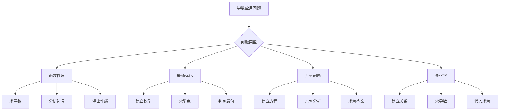
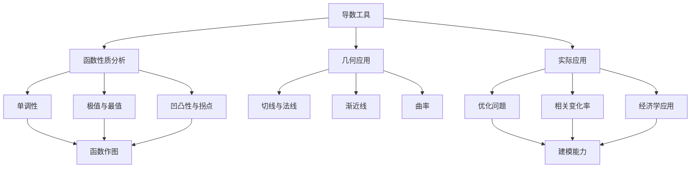

# 3.3 导数的应用与函数性质研究

> **考研数学一专用复习资料**
> 
> 本章深入阐述导数在函数性质研究中的重要应用，包括单调性判定、极值分析、凹凸性研究、渐近线求解、函数作图等核心内容，为优化问题和实际应用奠定坚实基础。

---

## 章节概览

### 学习目标
1. **函数性质分析**：运用导数研究函数的单调性、极值、凹凸性等性质
2. **图形描绘能力**：掌握函数作图的系统方法，准确描绘函数图像
3. **优化问题求解**：解决实际中的最值问题和优化问题
4. **几何应用掌握**：理解曲率、渐近线等几何概念及其计算
5. **综合应用能力**：灵活运用导数解决复杂的实际问题

### 重点难点

> **重点内容**
> - 函数单调性与极值的判定方法
> - 函数凹凸性与拐点的分析
> - 渐近线的求法（垂直、水平、斜渐近线）
> - 最值问题的求解策略
> - 函数图像的描绘步骤

> **难点内容**
> - 含参数函数的性质讨论
> - 隐函数和参数方程确定的曲线性质
> - 条件极值与Lagrange乘数法
> - 相关变化率问题
> - Newton迭代法的应用

### 知识架构

```
导数应用体系
├── 函数性质研究
│   ├── 单调性
│   │   ├── 判定定理
│   │   ├── 单调区间
│   │   └── 应用（不等式、方程根）
│   ├── 极值理论
│   │   ├── 必要条件（Fermat）
│   │   ├── 充分条件（一阶、二阶、高阶）
│   │   └── 最值问题
│   └── 凹凸性与拐点
│       ├── 二阶导数判定
│       ├── Jensen不等式
│       └── 拐点求解
├── 几何应用
│   ├── 渐近线
│   │   ├── 垂直渐近线
│   │   ├── 水平渐近线
│   │   └── 斜渐近线
│   ├── 曲率
│   │   ├── 曲率公式
│   │   └── 曲率半径
│   └── 函数作图
│       ├── 系统步骤
│       └── 综合分析
├── 优化应用
│   ├── 无约束优化
│   ├── 约束优化（Lagrange）
│   └── 实际问题建模
└── 特殊应用
    ├── 相关变化率
    ├── Newton迭代法
    └── 经济学应用
```

### 应用流程图



### 学习建议

1. **概念理解优先**：深刻理解各种性质的几何和实际意义
2. **方法系统掌握**：形成标准的分析流程和解题模式
3. **计算准确训练**：导数应用中计算量大，需要仔细
4. **图形直观结合**：培养数形结合的思维习惯
5. **实际应用重视**：多练习建模和优化问题

---

## 目录

1. [函数单调性的深度分析](#1-函数单调性的深度分析)
2. [函数极值理论与应用](#2-函数极值理论与应用)
3. [函数凹凸性与拐点研究](#3-函数凹凸性与拐点研究)
4. [渐近线理论与计算](#4-渐近线理论与计算)
5. [函数作图的系统方法](#5-函数作图的系统方法)
6. [最值问题与优化应用](#6-最值问题与优化应用)
7. [曲率与曲率半径](#7-曲率与曲率半径)
8. [相关变化率问题](#8-相关变化率问题)
9. [Newton迭代法](#9-Newton迭代法)
10. [本章知识点总结](#10-本章知识点总结)
11. [例题解析](#11-例题解析)

---

## 1. 函数单调性的深度分析

### 1.1 单调性的严格定义与判定

> **定义1.1（函数的单调性）**
> 
> 设函数 $f(x)$ 在区间 $I$ 上有定义，则：
> - 若对任意 $x_1, x_2 \in I$ 且 $x_1 < x_2$，都有 $f(x_1) < f(x_2)$，则称 $f(x)$ 在 $I$ 上**严格单调递增**
> - 若对任意 $x_1, x_2 \in I$ 且 $x_1 < x_2$，都有 $f(x_1) \leq f(x_2)$，则称 $f(x)$ 在 $I$ 上**单调递增**
> - 类似地可定义**严格单调递减**和**单调递减**

> **定理1.1（单调性的导数判定法）**
> 
> 设函数 $f(x)$ 在区间 $[a, b]$ 上连续，在 $(a, b)$ 内可导，则：
> 1. 若 $f'(x) > 0$ 在 $(a, b)$ 内恒成立，则 $f(x)$ 在 $[a, b]$ 上严格单调递增
> 2. 若 $f'(x) \geq 0$ 在 $(a, b)$ 内恒成立，且等号仅在有限个孤立点处成立，则 $f(x)$ 在 $[a, b]$ 上严格单调递增
> 3. 若 $f'(x) < 0$ 在 $(a, b)$ 内恒成立，则 $f(x)$ 在 $[a, b]$ 上严格单调递减
> 4. 若 $f'(x) \geq 0$ 在 $(a, b)$ 内恒成立，则 $f(x)$ 在 $[a, b]$ 上单调递增（非严格）

**证明要点**：利用Lagrange中值定理，对任意 $x_1 < x_2$，存在 $ξ \in (x_1, x_2)$ 使得：
$$f(x_2) - f(x_1) = f'(ξ)(x_2 - x_1)$$

由 $f'(ξ)$ 的符号即可确定 $f(x_2) - f(x_1)$ 的符号。

### 1.2 单调性判定的快速决策树

```
单调性判定流程
├── Step 1: 确定定义域
├── Step 2: 求导 f'(x)
├── Step 3: 分析 f'(x) 的符号
│   ├── f'(x) = 0 的解 → 驻点
│   ├── f'(x) 不存在的点 → 不可导点
│   └── 将定义域按这些点分割
├── Step 4: 判定各区间单调性
│   ├── f'(x) > 0 → 严格递增
│   ├── f'(x) < 0 → 严格递减
│   └── f'(x) ≥ 0 → 递增（需检查是否严格）
└── Step 5: 写出结论
```

### 1.3 常见错误警示

> **错误1：忽略定义域**
> - 错误：直接求导，不考虑定义域限制
> - 正确：先确定定义域，单调区间必须是定义域的子集

> **错误2：端点处理不当**
> - 错误：单调区间写成开区间 $(a, b)$
> - 正确：若函数在端点连续，单调区间应包含端点 $[a, b]$

> **错误3：孤立点的影响**
> - 错误：$f'(x) \geq 0$ 就断定严格递增
> - 正确：需要检查 $f'(x) = 0$ 的点是否为孤立点

> **错误4：不可导点忽略**
> - 错误：只考虑 $f'(x) = 0$ 的点
> - 正确：不可导点也可能是单调性的分界点

### 1.4 单调区间的求解方法

#### **标准步骤**

1. **求定义域**：确定函数的定义域
2. **求导数**：计算 $f'(x)$
3. **求驻点**：解方程 $f'(x) = 0$，得到驻点
4. **求不可导点**：找出 $f'(x)$ 不存在的点
5. **列表分析**：用驻点和不可导点将定义域分割，分析各区间内 $f'(x)$ 的符号
6. **得出结论**：确定单调区间

> **例题1.1**：求函数 $f(x) = x^3 - 3x^2 + 2$ 的单调区间。

**解答**：
1. **定义域**：$(-∞, +∞)$
2. **求导**：$f'(x) = 3x^2 - 6x = 3x(x - 2)$
3. **驻点**：$f'(x) = 0$ ⟹ $x = 0$ 或 $x = 2$
4. **列表分析**：

| 区间 | $(-∞, 0)$ | $(0, 2)$ | $(2, +∞)$ |
|------|-----------|----------|-----------|
| $x$ 的符号 | $-$ | $+$ | $+$ |
| $x-2$ 的符号 | $-$ | $-$ | $+$ |
| $f'(x)$ 的符号 | $+$ | $-$ | $+$ |
| $f(x)$ 的单调性 | ↗ | ↘ | ↗ |

5. **结论**：
   - 单调递增区间：$(-∞, 0]$ 和 $[2, +∞)$
   - 单调递减区间：$[0, 2]$

### 1.3 复杂函数的单调性分析

#### **含参数的单调性问题**

> **例题1.2**：讨论函数 $f(x) = x^3 + ax^2 + bx + c$ 的单调性。

**解答**：
$f'(x) = 3x^2 + 2ax + b$

判别式：$\Delta = 4a^2 - 12b$

**情况1**：$\Delta < 0$ ⟺ $a^2 < 3b$
此时 $f'(x) = 3x^2 + 2ax + b > 0$ 恒成立 ， $f(x)$ 在 $\mathbb{R}$ 上严格单调递增。

**情况2**：$\Delta = 0$ ⟺ $a^2 = 3b$
此时 $f'(x) = 3(x + \frac{a}{3})^2 \geq 0$ ， $f(x)$ 在 $\mathbb{R}$ 上单调递增。

**情况3**：$\Delta > 0$ ⟺ $a^2 > 3b$
此时 $f'(x) = 0$ 有两个不等实根：
$$x_1 = \frac{-a - \sqrt{a^2 - 3b}}{3}, \quad x_2 = \frac{-a + \sqrt{a^2 - 3b}}{3}$$

且 $x_1 < x_2$，函数在 $(-∞, x_1]$ 和 $[x_2, +∞)$ 上单调递增，在 $[x_1, x_2]$ 上单调递减。

#### **隐函数的单调性**

> **例题1.3**：设 $y = y(x)$ 由方程 $x^3 + y^3 = 3xy$ 确定，求 $y = y(x)$ 的单调区间。

**解答**：
对方程两边关于 $x$ 求导：
$$3x^2 + 3y^2 \frac{dy}{dx} = 3y + 3x \frac{dy}{dx}$$

整理得：
$$(3y^2 - 3x) \frac{dy}{dx} = 3y - 3x^2$$
$$\frac{dy}{dx} = \frac{3y - 3x^2}{3y^2 - 3x} = \frac{y - x^2}{y^2 - x}$$

**单调性分析**：
- 当 $\frac{dy}{dx} > 0$ 时，即 $\frac{y - x^2}{y^2 - x} > 0$ 时，函数单调递增
- 当 $\frac{dy}{dx} < 0$ 时，即 $\frac{y - x^2}{y^2 - x} < 0$ 时，函数单调递减

需要分析 $(y - x^2)(y^2 - x)$ 的符号，这需要结合原方程 $x^3 + y^3 = 3xy$ 进行讨论。

### 1.4 单调性的应用

#### **应用1：证明不等式**

> **例题1.4**：证明当 $x > 0$ 时 ， $\ln(1 + x) < x$。

**解答**：
设 $f(x) = x - \ln(1 + x)$ ， $x > 0$。

$f'(x) = 1 - \frac{1}{1 + x} = \frac{x}{1 + x} > 0$（当 $x > 0$ 时）

所以 $f(x)$ 在 $(0, +∞)$ 上严格单调递增。

又 $f(0) = 0 - \ln(1) = 0$，所以当 $x > 0$ 时 ， $f(x) > f(0) = 0$。

即 $x - \ln(1 + x) > 0$ ， $\ln(1 + x) < x$。

#### **应用2：方程根的个数**

> **例题1.5**：讨论方程 $x^3 - 3x + a = 0$ 的实根个数。

**解答**：
设 $f(x) = x^3 - 3x + a$ ， $f'(x) = 3x^2 - 3 = 3(x^2 - 1) = 3(x - 1)(x + 1)$

**单调性分析**：
- $x \in (-∞, -1)$：$f'(x) > 0$ ， $f(x)$ 递增
- $x \in (-1, 1)$：$f'(x) < 0$ ， $f(x)$ 递减  
- $x \in (1, +∞)$：$f'(x) > 0$ ， $f(x)$ 递增

**极值**：
- $f(-1) = -1 + 3 + a = 2 + a$（极大值）
- $f(1) = 1 - 3 + a = a - 2$（极小值）

**根的个数讨论**：
- 当 $a - 2 > 0$，即 $a > 2$ 时：$f(1) > 0$ ， $f(-1) > 0$，方程有1个实根
- 当 $a - 2 = 0$，即 $a = 2$ 时：$f(1) = 0$，方程有2个实根（其中 $x = 1$ 是重根）
- 当 $2 + a < 0$，即 $a < -2$ 时：$f(-1) < 0$ ， $f(1) < 0$，方程有1个实根
- 当 $a = -2$ 时：$f(-1) = 0$，方程有2个实根（其中 $x = -1$ 是重根）
- 当 $-2 < a < 2$ 时：$f(-1) > 0$ ， $f(1) < 0$，方程有3个实根

---

## 2. 函数极值理论与应用

### 2.1 极值的定义与判定

> **定义2.1（函数的极值）**
> 
> 设函数 $f(x)$ 在点 $x_0$ 的某个邻域内有定义，若存在 $δ > 0$，使得：
> - 对所有 $x \in (x_0 - δ, x_0 + δ)$，都有 $f(x) \leq f(x_0)$，则称 $f(x_0)$ 为 $f(x)$ 的一个**极大值**
> - 对所有 $x \in (x_0 - δ, x_0 + δ)$，都有 $f(x) \geq f(x_0)$，则称 $f(x_0)$ 为 $f(x)$ 的一个**极小值**

> **定理2.1（Fermat定理）**
> 
> 若函数 $f(x)$ 在点 $x_0$ 可导，且 $x_0$ 是 $f(x)$ 的极值点，则 $f'(x_0) = 0$。

**注意**：Fermat定理给出了极值的必要条件，但不是充分条件。

### 2.2 极值的判定方法

#### **第一充分条件**

> **定理2.2（极值的第一充分条件）**
> 
> 设函数 $f(x)$ 在点 $x_0$ 连续，在 $x_0$ 的某去心邻域内可导，且 $f'(x_0) = 0$，则：
> - 若在 $x_0$ 左侧 $f'(x) > 0$，右侧 $f'(x) < 0$，则 $f(x_0)$ 是极大值
> - 若在 $x_0$ 左侧 $f'(x) < 0$，右侧 $f'(x) > 0$，则 $f(x_0)$ 是极小值
> - 若在 $x_0$ 左右两侧 $f'(x)$ 符号相同，则 $f(x_0)$ 不是极值

#### **第二充分条件**

> **定理2.3（极值的第二充分条件）**
> 
> 设函数 $f(x)$ 在点 $x_0$ 二阶可导，且 $f'(x_0) = 0$ ， $f''(x_0) \neq 0$，则：
> - 若 $f''(x_0) < 0$，则 $f(x_0)$ 是极大值
> - 若 $f''(x_0) > 0$，则 $f(x_0)$ 是极小值

**证明要点**：利用Taylor公式：
$$f(x) = f(x_0) + f'(x_0)(x - x_0) + \frac{f''(x_0)}{2}(x - x_0)^2 + o((x - x_0)^2)$$

由于 $f'(x_0) = 0$，当 $|x - x_0|$ 足够小时 ， $f(x) - f(x_0)$ 的符号由 $f''(x_0)$ 决定。

#### **高阶判定法**

> **定理2.4（高阶极值判定法）**
> 
> 设函数 $f(x)$ 在点 $x_0$ 处 $n$ 阶可导，且：
> $$f'(x_0) = f''(x_0) = \cdots = f^{(n-1)}(x_0) = 0, \quad f^{(n)}(x_0) \neq 0$$
> 
> 则：
> - 若 $n$ 为偶数且 $f^{(n)}(x_0) > 0$，则 $f(x_0)$ 是极小值
> - 若 $n$ 为偶数且 $f^{(n)}(x_0) < 0$，则 $f(x_0)$ 是极大值
> - 若 $n$ 为奇数，则 $f(x_0)$ 不是极值

#### **极值判定的综合决策树**

```
极值判定流程
├── Step 1: 求候选点
│   ├── 求解 f'(x) = 0 → 驻点
│   ├── 找出 f'(x) 不存在的点 → 不可导点
│   └── 考虑定义域的端点 → 端点
├── Step 2: 判定每个候选点
│   ├── 驻点的判定
│   │   ├── 优先尝试：二阶导数判定
│   │   │   ├── f''(x₀) > 0 → 极小值
│   │   │   ├── f''(x₀) < 0 → 极大值
│   │   │   └── f''(x₀) = 0 → 使用其他方法
│   │   ├── 次选方法：第一充分条件
│   │   │   └── 检查 f'(x) 在 x₀ 两侧符号变化
│   │   └── 最后选择：高阶导数判定
│   ├── 不可导点的判定
│   │   └── 只能用第一充分条件（检查导数符号变化）
│   └── 端点的判定
│       └── 直接比较函数值
└── Step 3: 综合比较得出结论
```

#### **常见陷阱与注意事项**

> **陷阱1：误用二阶导数判定法**
> - 错误：$f''(x_0) = 0$ 时仍使用二阶导数判定
> - 正确：当 $f''(x_0) = 0$ 时，二阶导数判定法失效，需要用其他方法

> **陷阱2：忽略不可导点**
> - 错误：只考虑 $f'(x) = 0$ 的点
> - 正确：不可导点也可能是极值点，如 $f(x) = |x|$ 在 $x = 0$

> **陷阱3：混淆极值与最值**
> - 错误：认为极值点一定是最值点
> - 正确：最值可能在极值点、不可导点或端点取得

> **陷阱4：忽略定义域限制**
> - 错误：在定义域外寻找极值
> - 正确：极值点必须在定义域内

> **陷阱5：高阶导数判定的误用**
> - 错误：$n$ 为奇数时仍判定为极值
> - 正确：$n$ 为奇数时不是极值（如 $f(x) = x^3$ 在 $x = 0$）

#### **记忆技巧**
1. **二阶导数判定**："凹小凸大"（凹函数取极小值，凸函数取极大值）
2. **第一充分条件**："左正右负极大，左负右正极小"
3. **高阶判定**："偶极奇非"（偶数阶是极值，奇数阶非极值）

> **例题2.1**：求函数 $f(x) = x^4 - 4x^3 + 6x^2 - 4x + 1$ 的极值。

**解答**：
$f'(x) = 4x^3 - 12x^2 + 12x - 4 = 4(x^3 - 3x^2 + 3x - 1) = 4(x - 1)^3$

$f'(x) = 0$ ⟹ $x = 1$（三重根）

$f''(x) = 12x^2 - 24x + 12 = 12(x - 1)^2$
$f''(1) = 0$

$f'''(x) = 24x - 24 = 24(x - 1)$
$f'''(1) = 0$

$f^{(4)}(x) = 24$
$f^{(4)}(1) = 24 > 0$

由高阶判定法 ， $n = 4$ 为偶数且 $f^{(4)}(1) > 0$，所以 $f(1) = 0$ 是极小值。

### 2.3 条件极值与Lagrange乘数法

#### **约束优化问题**

对于约束优化问题：
$$\min f(x, y) \quad \text{s.t.} \quad g(x, y) = 0$$

> **定理2.5（Lagrange乘数法）**
> 
> 设函数 $f(x, y)$ 和 $g(x, y)$ 在约束条件 $g(x, y) = 0$ 确定的曲线上连续可微，若 $(x_0, y_0)$ 是约束极值点，且 $\nabla g(x_0, y_0) \neq 0$，则存在常数 $λ$，使得：
> $$\nabla f(x_0, y_0) = λ \nabla g(x_0, y_0)$$

即：
$$\begin{cases}
\frac{\partial f}{\partial x} = λ \frac{\partial g}{\partial x} \\
\frac{\partial f}{\partial y} = λ \frac{\partial g}{\partial y} \\
g(x, y) = 0
\end{cases}$$

> **例题2.2**：求椭圆 $\frac{x^2}{4} + \frac{y^2}{9} = 1$ 上的点到原点距离的最值。

**解答**：
目标函数：$f(x, y) = x^2 + y^2$
约束条件：$g(x, y) = \frac{x^2}{4} + \frac{y^2}{9} - 1 = 0$

建立Lagrange函数：
$$L(x, y, λ) = x^2 + y^2 - λ\left(\frac{x^2}{4} + \frac{y^2}{9} - 1\right)$$

求偏导数并令其为零：
$$\frac{\partial L}{\partial x} = 2x - λ \cdot \frac{x}{2} = 0 \Rightarrow x(2 - \frac{λ}{2}) = 0$$
$$\frac{\partial L}{\partial y} = 2y - λ \cdot \frac{2y}{9} = 0 \Rightarrow y(2 - \frac{2λ}{9}) = 0$$
$$\frac{\partial L}{\partial λ} = -\left(\frac{x^2}{4} + \frac{y^2}{9} - 1\right) = 0$$

**情况1**：$x = 0$
由约束条件：$\frac{y^2}{9} = 1$ ⟹ $y = ±3$
得到点 $(0, 3)$ 和 $(0, -3)$，距离为 $3$。

**情况2**：$y = 0$  
由约束条件：$\frac{x^2}{4} = 1$ ⟹ $x = ±2$
得到点 $(2, 0)$ 和 $(-2, 0)$，距离为 $2$。

**情况3**：$x \neq 0, y \neq 0$
由 $2 - \frac{λ}{2} = 0$ 得 $λ = 4$
由 $2 - \frac{2λ}{9} = 0$ 得 $λ = 9$
矛盾，此情况不存在。

因此，最大距离为 $3$，最小距离为 $2$。

### 2.4 极值的应用

#### **应用1：几何优化问题**

> **例题2.3**：在所有周长为 $l$ 的矩形中，求面积最大的矩形。

**解答**：
设矩形的长为 $x$，宽为 $y$，则：
- 约束条件：$2x + 2y = l$，即 $y = \frac{l}{2} - x$
- 目标函数：$S = xy = x\left(\frac{l}{2} - x\right) = \frac{l}{2}x - x^2$

其中 $0 < x < \frac{l}{2}$。

$\frac{dS}{dx} = \frac{l}{2} - 2x = 0$ ⟹ $x = \frac{l}{4}$

$\frac{d^2S}{dx^2} = -2 < 0$，所以 $x = \frac{l}{4}$ 是极大值点。

此时 $y = \frac{l}{2} - \frac{l}{4} = \frac{l}{4}$，即 $x = y$。

因此，在所有周长为 $l$ 的矩形中，正方形的面积最大，最大面积为 $\frac{l^2}{16}$。

#### **应用2：经济学中的边际分析**

> **例题2.4**：某商品的需求函数为 $p = 100 - 2q$，成本函数为 $C(q) = 10q + 500$，求利润最大时的产量和价格。

**解答**：
- 收益函数：$R(q) = pq = (100 - 2q)q = 100q - 2q^2$
- 利润函数：$P(q) = R(q) - C(q) = 100q - 2q^2 - (10q + 500) = 90q - 2q^2 - 500$

$P'(q) = 90 - 4q = 0$ ⟹ $q = 22.5$

$P''(q) = -4 < 0$，所以 $q = 22.5$ 是极大值点。

此时价格 $p = 100 - 2 \times 22.5 = 55$，最大利润 $P(22.5) = 90 \times 22.5 - 2 \times (22.5)^2 - 500 = 512.5$ 元。

---

## 3. 函数凹凸性与拐点研究

### 3.1 凹凸性的定义与几何意义

> **定义3.1（函数的凹凸性）**
> 
> 设函数 $f(x)$ 在区间 $I$ 上连续，若对 $I$ 内任意两点 $x_1, x_2$ 和任意 $λ \in (0, 1)$，都有：
> - $f[λx_1 + (1-λ)x_2] < λf(x_1) + (1-λ)f(x_2)$，则称 $f(x)$ 在 $I$ 上是**凹函数**（或**下凸函数**）
> - $f[λx_1 + (1-λ)x_2] > λf(x_1) + (1-λ)f(x_2)$，则称 $f(x)$ 在 $I$ 上是**凸函数**（或**上凸函数**）

**几何意义**：
- **凹函数**：函数图像位于任意两点连线的下方
- **凸函数**：函数图像位于任意两点连线的上方

### 3.2 凹凸性的判定方法

> **定理3.1（凹凸性的二阶导数判定法）**
> 
> 设函数 $f(x)$ 在区间 $I$ 上二阶可导，则：
> - 若 $f''(x) > 0$ 在 $I$ 上恒成立，则 $f(x)$ 在 $I$ 上是凹函数
> - 若 $f''(x) < 0$ 在 $I$ 上恒成立，则 $f(x)$ 在 $I$ 上是凸函数

**证明要点**：利用Taylor公式，对于 $x_0 \in I$ 和 $h$ 足够小：
$$f(x_0 + h) = f(x_0) + f'(x_0)h + \frac{f''(ξ)}{2}h^2$$

其中 $ξ$ 在 $x_0$ 和 $x_0 + h$ 之间。$f''(ξ)$ 的符号决定了函数的凹凸性。

> **例题3.1**：判断函数 $f(x) = x^3 - 6x^2 + 9x + 1$ 的凹凸性。

**解答**：
$f'(x) = 3x^2 - 12x + 9$
$f''(x) = 6x - 12 = 6(x - 2)$

- 当 $x < 2$ 时 ， $f''(x) < 0$ ， $f(x)$ 是凸函数
- 当 $x > 2$ 时 ， $f''(x) > 0$ ， $f(x)$ 是凹函数
- $x = 2$ 是凹凸性的分界点

### 3.3 拐点的定义与求法

> **定义3.2（拐点）**
> 
> 若函数 $f(x)$ 在点 $x_0$ 连续，且在该点左右两侧的凹凸性相反，则称点 $(x_0, f(x_0))$ 为函数图像的**拐点**。

#### **拐点的求解步骤**

1. **求二阶导数**：计算 $f''(x)$
2. **求候选点**：解方程 $f''(x) = 0$ 和找出 $f''(x)$ 不存在的点
3. **判断凹凸性变化**：检查候选点左右两侧 $f''(x)$ 的符号是否改变
4. **确定拐点**：凹凸性改变的点即为拐点

#### **拐点判定的系统决策树**

```
拐点判定流程
├── Step 1: 求二阶导数 f''(x)
├── Step 2: 找候选点
│   ├── 解方程 f''(x) = 0 → 二阶导数零点
│   └── 找出 f''(x) 不存在的点 → 二阶不可导点
├── Step 3: 判定每个候选点
│   ├── 方法1：符号判定法
│   │   ├── 检查 f''(x) 在候选点两侧符号
│   │   ├── 符号相反 → 是拐点
│   │   └── 符号相同 → 不是拐点
│   └── 方法2：高阶导数法（当 f'''(x₀) 存在时）
│       ├── f''(x₀) = 0 且 f'''(x₀) ≠ 0 → 是拐点
│       └── f''(x₀) = 0 且 f'''(x₀) = 0 → 需进一步判定
└── Step 4: 写出所有拐点坐标 (x₀, f(x₀))
```

#### **拐点的图形直观**

```
凹凸性变化示意图：

凹函数段 (f'' > 0)          拐点           凸函数段 (f'' < 0)
     ╱                      ●                    ╲
    ╱                    (x₀,f(x₀))               ╲
   ╱                         |                      ╲
  ╱                          |                       ╲
 ╱                           |                        ╲
────────────────────────────┼──────────────────────────
                            x₀

在拐点处：
- 曲线从"开口向上"变为"开口向下"（或相反）
- 切线穿过曲线
- 二阶导数改变符号
```

#### **常见误区提醒**

> **误区1：认为 f''(x₀) = 0 必是拐点**
> - 反例：$f(x) = x^4$ ， $f''(0) = 0$ 但 $(0,0)$ 不是拐点
> - 正确：需要检查二阶导数是否改变符号

> **误区2：忽略二阶不可导点**
> - 例子：$f(x) = x^{4/3}$，在 $x = 0$ 处二阶导数不存在但是拐点
> - 正确：二阶不可导点也可能是拐点

> **误区3：拐点与极值点混淆**
> - 拐点：二阶导数为0，凹凸性改变
> - 极值点：一阶导数为0，单调性改变
> - 注意：两者是完全不同的概念

#### **高阶导数判定法**

> **定理3.3（拐点的高阶判定）**
> 
> 设 $f(x)$ 在 $x_0$ 处 $n$ 阶可导，且
> $$f''(x_0) = f'''(x_0) = \cdots = f^{(n-1)}(x_0) = 0, \quad f^{(n)}(x_0) \neq 0$$
> 
> 则：
> - 若 $n$ 为奇数，则 $(x_0, f(x_0))$ 是拐点
> - 若 $n$ 为偶数，则 $(x_0, f(x_0))$ 不是拐点

> **例题3.2**：求函数 $f(x) = x^4 - 6x^2 + 3$ 的拐点。

**解答**：
$f'(x) = 4x^3 - 12x$
$f''(x) = 12x^2 - 12 = 12(x^2 - 1) = 12(x - 1)(x + 1)$

$f''(x) = 0$ ⟹ $x = ±1$

**凹凸性分析**：

| 区间 | $(-∞, -1)$ | $(-1, 1)$ | $(1, +∞)$ |
|------|------------|-----------|-----------|
| $f''(x)$ | $+$ | $-$ | $+$ |
| 凹凸性 | 凹 | 凸 | 凹 |

在 $x = -1$ 和 $x = 1$ 处凹凸性都发生变化，所以拐点为：
- $(-1, f(-1)) = (-1, -2)$
- $(1, f(1)) = (1, -2)$

### 3.4 凹凸性的应用

#### **应用1：Jensen不等式**

> **定理3.2（Jensen不等式）**
> 
> 设 $f(x)$ 在区间 $I$ 上是凹函数 ， $x_1, x_2, \ldots, x_n \in I$ ， $λ_1, λ_2, \ldots, λ_n > 0$ 且 $\sum_{i=1}^n λ_i = 1$，则：
> $$f\left(\sum_{i=1}^n λ_i x_i\right) \leq \sum_{i=1}^n λ_i f(x_i)$$

**特殊情况**（$λ_i = \frac{1}{n}$）：
$$f\left(\frac{x_1 + x_2 + \cdots + x_n}{n}\right) \leq \frac{f(x_1) + f(x_2) + \cdots + f(x_n)}{n}$$

> **例题3.3**：利用凹凸性证明算术-几何平均不等式：$\frac{a_1 + a_2 + \cdots + a_n}{n} \geq \sqrt[n]{a_1 a_2 \cdots a_n}$（$a_i > 0$）。

**解答**：
考虑函数 $f(x) = \ln x$ ， $x > 0$。

$f''(x) = -\frac{1}{x^2} < 0$，所以 $f(x) = \ln x$ 是凸函数。

由Jensen不等式：
$$\ln\left(\frac{a_1 + a_2 + \cdots + a_n}{n}\right) \geq \frac{\ln a_1 + \ln a_2 + \cdots + \ln a_n}{n} = \ln\sqrt[n]{a_1 a_2 \cdots a_n}$$

由于 $\ln x$ 是递增函数，所以：
$$\frac{a_1 + a_2 + \cdots + a_n}{n} \geq \sqrt[n]{a_1 a_2 \cdots a_n}$$

#### **应用2：函数方程的解的唯一性**

> **例题3.4**：证明方程 $e^x = 2x$ 有且仅有两个实根。

**解答**：
设 $f(x) = e^x - 2x$，则：
$f'(x) = e^x - 2$
$f''(x) = e^x > 0$

所以 $f(x)$ 是凹函数。

$f'(x) = 0$ ⟹ $e^x = 2$ ⟹ $x = \ln 2$

在 $x = \ln 2$ 处 ， $f(x)$ 取得最小值：
$f(\ln 2) = e^{\ln 2} - 2\ln 2 = 2 - 2\ln 2 = 2(1 - \ln 2) < 0$

由于 $f(x)$ 是凹函数且在 $x = \ln 2$ 处取得最小值，而 $f(\ln 2) < 0$，所以：
- 当 $x \to -∞$ 时 ， $f(x) \to +∞$
- 当 $x \to +∞$ 时 ， $f(x) \to +∞$

因此方程 $f(x) = 0$ 在 $(-∞, \ln 2)$ 和 $(\ln 2, +∞)$ 内各有一个根，共有两个实根。

---

## 4. 渐近线理论与计算

### 4.1 渐近线的定义与分类

> **定义4.1（渐近线）**
> 
> 设曲线 $y = f(x)$ 和直线 $L$ 的距离当 $x \to ∞$（或 $x \to x_0$）时趋于零，则称直线 $L$ 为曲线的**渐近线**。

**渐近线的分类**：
1. **垂直渐近线**（竖直渐近线）
2. **水平渐近线**
3. **斜渐近线**

### 4.2 垂直渐近线

> **定义4.2（垂直渐近线）**
> 
> 若 $\lim_{x \to x_0^+} f(x) = ∞$ 或 $\lim_{x \to x_0^-} f(x) = ∞$，则直线 $x = x_0$ 是曲线 $y = f(x)$ 的**垂直渐近线**。

#### **求垂直渐近线的方法**

1. **找间断点**：找出函数的间断点
2. **计算极限**：计算函数在间断点处的左右极限
3. **判断**：若极限为无穷大，则该点对应的垂直线是垂直渐近线

> **例题4.1**：求函数 $f(x) = \frac{x^2 - 1}{x^2 - 4}$ 的垂直渐近线。

**解答**：
函数的间断点为 $x = ±2$（分母为零的点）。

**在 $x = 2$ 处**：
$$\lim_{x \to 2^+} \frac{x^2 - 1}{x^2 - 4} = \lim_{x \to 2^+} \frac{3}{(x-2)(x+2)} = \lim_{x \to 2^+} \frac{3}{4(x-2)} = +∞$$
$$\lim_{x \to 2^-} \frac{x^2 - 1}{x^2 - 4} = \lim_{x \to 2^-} \frac{3}{4(x-2)} = -∞$$

所以 $x = 2$ 是垂直渐近线。

**在 $x = -2$ 处**：
$$\lim_{x \to (-2)^+} \frac{x^2 - 1}{x^2 - 4} = \lim_{x \to (-2)^+} \frac{3}{(x-2)(x+2)} = \lim_{x \to (-2)^+} \frac{3}{-4(x+2)} = -∞$$
$$\lim_{x \to (-2)^-} \frac{x^2 - 1}{x^2 - 4} = \lim_{x \to (-2)^-} \frac{3}{-4(x+2)} = +∞$$

所以 $x = -2$ 也是垂直渐近线。

### 4.3 水平渐近线

> **定义4.3（水平渐近线）**
> 
> 若 $\lim_{x \to +∞} f(x) = A$ 或 $\lim_{x \to -∞} f(x) = B$，则直线 $y = A$ 或 $y = B$ 是曲线 $y = f(x)$ 的**水平渐近线**。

> **例题4.2**：求函数 $f(x) = \frac{2x^2 + 3x + 1}{x^2 + 1}$ 的水平渐近线。

**解答**：
$$\lim_{x \to +∞} \frac{2x^2 + 3x + 1}{x^2 + 1} = \lim_{x \to +∞} \frac{2 + \frac{3}{x} + \frac{1}{x^2}}{1 + \frac{1}{x^2}} = \frac{2 + 0 + 0}{1 + 0} = 2$$

$$\lim_{x \to -∞} \frac{2x^2 + 3x + 1}{x^2 + 1} = 2$$

所以 $y = 2$ 是水平渐近线。

### 4.4 斜渐近线

> **定义4.4（斜渐近线）**
> 
> 若存在常数 $k \neq 0$ 和 $b$，使得 $\lim_{x \to ∞} [f(x) - (kx + b)] = 0$，则直线 $y = kx + b$ 是曲线 $y = f(x)$ 的**斜渐近线**。

#### **求斜渐近线的方法**

若斜渐近线存在，则：
$$k = \lim_{x \to ∞} \frac{f(x)}{x}$$
$$b = \lim_{x \to ∞} [f(x) - kx]$$

**注意**：需要分别考虑 $x \to +∞$ 和 $x \to -∞$ 的情况。

> **例题4.3**：求函数 $f(x) = \frac{x^3 + x^2 + 1}{x^2 + 1}$ 的斜渐近线。

**解答**：
首先进行多项式长除法：
$$f(x) = \frac{x^3 + x^2 + 1}{x^2 + 1} = x + 1 + \frac{-x}{x^2 + 1}$$

**当 $x \to +∞$ 时**：
$$k = \lim_{x \to +∞} \frac{f(x)}{x} = \lim_{x \to +∞} \frac{x^3 + x^2 + 1}{x(x^2 + 1)} = \lim_{x \to +∞} \frac{x^2 + x + \frac{1}{x}}{x^2 + 1} = 1$$

$$b = \lim_{x \to +∞} [f(x) - x] = \lim_{x \to +∞} \left[1 + \frac{-x}{x^2 + 1}\right] = 1 + 0 = 1$$

**当 $x \to -∞$ 时**：
同样可得 $k = 1$ ， $b = 1$。

因此 ， $y = x + 1$ 是斜渐近线。

### 4.5 渐近线的综合应用

> **例题4.4**：求函数 $f(x) = \frac{x^2}{x - 1}$ 的所有渐近线。

**解答**：

**1. 垂直渐近线**：
函数在 $x = 1$ 处不连续。
$$\lim_{x \to 1^+} \frac{x^2}{x - 1} = +∞, \quad \lim_{x \to 1^-} \frac{x^2}{x - 1} = -∞$$

所以 $x = 1$ 是垂直渐近线。

**2. 水平渐近线**：
$$\lim_{x \to ±∞} \frac{x^2}{x - 1} = ±∞$$

所以不存在水平渐近线。

**3. 斜渐近线**：
$$k = \lim_{x \to ∞} \frac{f(x)}{x} = \lim_{x \to ∞} \frac{x^2}{x(x - 1)} = \lim_{x \to ∞} \frac{x}{x - 1} = 1$$

$$b = \lim_{x \to ∞} [f(x) - x] = \lim_{x \to ∞} \left[\frac{x^2}{x - 1} - x\right] = \lim_{x \to ∞} \frac{x^2 - x(x - 1)}{x - 1} = \lim_{x \to ∞} \frac{x}{x - 1} = 1$$

所以 $y = x + 1$ 是斜渐近线。

**验证**：
$$\lim_{x \to ∞} \left[\frac{x^2}{x - 1} - (x + 1)\right] = \lim_{x \to ∞} \frac{x^2 - (x + 1)(x - 1)}{x - 1} = \lim_{x \to ∞} \frac{x^2 - x^2 + 1}{x - 1} = \lim_{x \to ∞} \frac{1}{x - 1} = 0$$

确认 $y = x + 1$ 是斜渐近线。

---

## 5. 函数作图的系统方法

### 5.1 函数作图的基本步骤

#### **标准流程**

1. **确定定义域**：找出函数的定义域和间断点
2. **求一阶导数**：计算 $f'(x)$，找出驻点和不可导点
3. **求二阶导数**：计算 $f''(x)$，找出拐点候选
4. **分析单调性**：确定函数的单调区间
5. **分析凹凸性**：确定函数的凹凸区间和拐点
6. **求极值**：确定极大值和极小值
7. **求渐近线**：找出所有渐近线
8. **求特殊点**：计算与坐标轴的交点
9. **描点作图**：综合以上信息绘制函数图像

### 5.2 典型函数作图实例

> **例题5.1**：作函数 $f(x) = \frac{x^2}{x^2 - 1}$ 的图像。

**解答**：

**1. 定义域**：$(-∞, -1) ∪ (-1, 1) ∪ (1, +∞)$

**2. 一阶导数**：
$$f'(x) = \frac{2x(x^2 - 1) - x^2 \cdot 2x}{(x^2 - 1)^2} = \frac{2x^3 - 2x - 2x^3}{(x^2 - 1)^2} = \frac{-2x}{(x^2 - 1)^2}$$

驻点：$f'(x) = 0$ ⟹ $x = 0$

**3. 二阶导数**：
$$f''(x) = \frac{d}{dx}\left[\frac{-2x}{(x^2 - 1)^2}\right] = \frac{-2(x^2 - 1)^2 - (-2x) \cdot 2(x^2 - 1) \cdot 2x}{(x^2 - 1)^4}$$
$$= \frac{-2(x^2 - 1)^2 + 8x^2(x^2 - 1)}{(x^2 - 1)^4} = \frac{-2(x^2 - 1) + 8x^2}{(x^2 - 1)^3} = \frac{6x^2 + 2}{(x^2 - 1)^3}$$

$f''(x) = 0$ 无实解。

**4. 单调性分析**：

| 区间 | $(-∞, -1)$ | $(-1, 0)$ | $(0, 1)$ | $(1, +∞)$ |
|------|------------|-----------|----------|-----------|
| $f'(x)$ | $+$ | $+$ | $-$ | $-$ |
| $f(x)$ | ↗ | ↗ | ↘ | ↘ |

**5. 凹凸性分析**：

| 区间 | $(-∞, -1)$ | $(-1, 1)$ | $(1, +∞)$ |
|------|------------|-----------|-----------|
| $f''(x)$ | $-$ | $+$ | $-$ |
| 凹凸性 | 凸 | 凹 | 凸 |

**6. 极值**：
$f(0) = 0$ 是极大值。

**7. 渐近线**：
- 垂直渐近线：$x = ±1$
- 水平渐近线：$\lim_{x \to ±∞} f(x) = 1$，所以 $y = 1$ 是水平渐近线

**8. 特殊点**：
- 与 $y$ 轴交点：$(0, 0)$
- 与 $x$ 轴交点：$(0, 0)$

**9. 函数图像特征**：
- 在 $(-∞, -1)$ 和 $(-1, 0]$ 上递增，在 $[0, 1)$ 和 $(1, +∞)$ 上递减
- 在 $x = 0$ 处取得极大值 $0$
- 在 $(-∞, -1)$ 和 $(1, +∞)$ 上是凸函数，在 $(-1, 1)$ 上是凹函数
- 有垂直渐近线 $x = ±1$ 和水平渐近线 $y = 1$

### 5.3 参数方程的作图

对于参数方程 $\begin{cases} x = \varphi(t) \\ y = \psi(t) \end{cases}$，作图步骤：

1. **确定参数范围**：找出参数 $t$ 的取值范围
2. **求导数**：$\frac{dy}{dx} = \frac{\psi'(t)}{\varphi'(t)}$
3. **分析单调性**：根据 $\frac{dy}{dx}$ 的符号确定曲线的升降
4. **求极值点**：$\frac{dy}{dx} = 0$ 或不存在的点
5. **求拐点**：$\frac{d^2y}{dx^2} = 0$ 的点
6. **描点作图**：选择关键参数值描点

> **例题5.2**：作参数方程 $\begin{cases} x = t^2 \\ y = t^3 - 3t \end{cases}$ 的图像。

**解答**：

**1. 参数范围**：$t \in \mathbb{R}$

**2. 求导数**：
$$\frac{dx}{dt} = 2t, \quad \frac{dy}{dt} = 3t^2 - 3$$
$$\frac{dy}{dx} = \frac{3t^2 - 3}{2t} = \frac{3(t^2 - 1)}{2t} = \frac{3(t - 1)(t + 1)}{2t}$$

**3. 关键点分析**：
- $\frac{dy}{dx} = 0$ ⟹ $t = ±1$
- $\frac{dy}{dx}$ 不存在 ⟹ $t = 0$

**4. 单调性分析**：

| 区间 | $(-∞, -1)$ | $(-1, 0)$ | $(0, 1)$ | $(1, +∞)$ |
|------|------------|-----------|----------|-----------|
| $\frac{dy}{dx}$ | $+$ | $-$ | $-$ | $+$ |

**5. 关键点坐标**：
- $t = -1$：$(1, 2)$
- $t = 0$：$(0, 0)$
- $t = 1$：$(1, -2)$

**6. 图像特征**：
- 曲线关于 $x$ 轴对称（因为 $x(-t) = x(t)$ ， $y(-t) = -y(t)$）
- 在点 $(1, 2)$ 和 $(1, -2)$ 处有水平切线
- 在原点处有垂直切线

### 5.4 极坐标方程的作图

对于极坐标方程 $r = f(θ)$，作图要点：

1. **确定定义域**：找出 $θ$ 的取值范围
2. **分析周期性**：确定函数的周期
3. **分析对称性**：检查关于极轴、极点、$θ = \frac{\pi}{2}$ 的对称性
4. **求特殊点**：$r = 0$、$r$ 的极值点等
5. **描点作图**：选择关键角度描点

> **例题5.3**：作极坐标方程 $r = 2(1 + \cos θ)$ 的图像（心形线）。

**解答**：

**1. 定义域**：$θ \in [0, 2π]$

**2. 对称性**：
$r(-θ) = 2(1 + \cos(-θ)) = 2(1 + \cos θ) = r(θ)$
所以图形关于极轴对称。

**3. 特殊点**：
- $θ = 0$：$r = 2(1 + 1) = 4$
- $θ = \frac{π}{2}$：$r = 2(1 + 0) = 2$
- $θ = π$：$r = 2(1 - 1) = 0$
- $θ = \frac{3π}{2}$：$r = 2(1 + 0) = 2$

**4. 图像特征**：
- 心形线，尖端在极点
- 关于极轴对称
- 最大距离为 $4$（在 $θ = 0$ 处）

---

## 6. 最值问题与优化应用

### 优化问题的建模策略

#### **建模的系统方法**

```
优化问题建模流程
├── Step 1: 理解问题
│   ├── 明确优化目标（最大/最小）
│   ├── 识别决策变量
│   └── 确定约束条件
├── Step 2: 建立数学模型
│   ├── 选择合适的变量
│   ├── 建立目标函数
│   ├── 表达约束条件
│   └── 确定定义域
├── Step 3: 模型简化
│   ├── 利用约束消元
│   ├── 化为单变量问题
│   └── 确定可行域
├── Step 4: 求解优化问题
│   ├── 无约束问题 → 导数法
│   ├── 约束问题 → Lagrange乘数法
│   └── 特殊问题 → 几何/物理直观
└── Step 5: 验证与解释
    ├── 检验充分条件
    ├── 考虑边界情况
    └── 给出实际意义
```

#### **常见优化问题分类**

| 问题类型 | 特点 | 常用方法 | 典型例子 |
|---------|------|----------|----------|
| **几何优化** | 涉及长度、面积、体积 | 建立几何关系，导数法 | 最大面积、最短路径 |
| **经济优化** | 成本、利润、收益 | 边际分析，弹性分析 | 利润最大化、成本最小化 |
| **物理优化** | 时间、能量、功率 | 物理定律约束 | 最短时间、最小能量 |
| **工程优化** | 材料、效率、安全 | 多目标权衡 | 材料最省、效率最高 |
| **生活优化** | 实际问题抽象 | 合理假设，简化模型 | 包装设计、路线规划 |

#### **建模注意事项**

> **要点1：变量选择**
> - 选择最直接反映问题本质的变量
> - 尽量减少变量个数
> - 注意变量的实际意义和取值范围

> **要点2：目标函数**
> - 准确表达优化目标
> - 考虑是否需要引入权重或优先级
> - 注意函数的可导性

> **要点3：约束处理**
> - 显式约束：直接给出的条件
> - 隐式约束：从问题背景推导
> - 自然约束：变量的物理限制

> **要点4：求解技巧**
> - 优先考虑消元简化
> - 注意定义域的影响
> - 别忘记检查边界点

### 6.1 最值问题的分类

#### **无约束最值问题**

对于函数 $f(x)$ 在区间 $[a, b]$ 上的最值：

1. **求驻点**：解 $f'(x) = 0$
2. **检查端点**：计算 $f(a)$ 和 $f(b)$
3. **检查不可导点**：计算 $f(x)$ 在不可导点的值
4. **比较大小**：在所有候选点中找出最大值和最小值

#### **约束最值问题**

使用Lagrange乘数法或消元法。

### 6.2 几何优化问题

> **例题6.1**：在半径为 $R$ 的圆内作一个内接矩形，使其面积最大。

**解答**：
设矩形的半长为 $x$，半宽为 $y$，则 $x^2 + y^2 = R^2$。

矩形面积：$S = 4xy$

由约束条件：$y = \sqrt{R^2 - x^2}$，其中 $0 \leq x \leq R$。

$$S(x) = 4x\sqrt{R^2 - x^2}$$

$$S'(x) = 4\sqrt{R^2 - x^2} + 4x \cdot \frac{-x}{\sqrt{R^2 - x^2}} = \frac{4(R^2 - x^2) - 4x^2}{\sqrt{R^2 - x^2}} = \frac{4(R^2 - 2x^2)}{\sqrt{R^2 - x^2}}$$

$S'(x) = 0$ ⟹ $R^2 - 2x^2 = 0$ ⟹ $x = \frac{R}{\sqrt{2}}$

此时 $y = \sqrt{R^2 - \frac{R^2}{2}} = \frac{R}{\sqrt{2}}$

所以内接矩形是正方形，最大面积为 $S = 4 \cdot \frac{R}{\sqrt{2}} \cdot \frac{R}{\sqrt{2}} = 2R^2$。

### 6.3 经济优化问题

> **例题6.2**：某工厂生产某产品，固定成本为 $1000$ 元，每件产品的变动成本为 $20$ 元，售价为 $p = 100 - 0.01q$ 元（$q$ 为产量）。求利润最大时的产量和价格。

**解答**：
- 总成本：$C(q) = 1000 + 20q$
- 总收益：$R(q) = pq = (100 - 0.01q)q = 100q - 0.01q^2$
- 利润：$P(q) = R(q) - C(q) = 100q - 0.01q^2 - 1000 - 20q = 80q - 0.01q^2 - 1000$

$P'(q) = 80 - 0.02q = 0$ ⟹ $q = 4000$

$P''(q) = -0.02 < 0$，所以 $q = 4000$ 是极大值点。

此时价格 $p = 100 - 0.01 \times 4000 = 60$ 元，最大利润 $P(4000) = 80 \times 4000 - 0.01 \times 4000^2 - 1000 = 159000$ 元。

### 6.4 物理优化问题

> **例题6.3**：光从介质1中的点 $A(0, a)$ 射向介质2中的点 $B(d, -b)$，两介质的折射率分别为 $n_1$ 和 $n_2$。根据Fermat原理，光走的路径使得传播时间最短。求光线在分界面上的入射点。

**解答**：
设入射点为 $P(x, 0)$，其中 $0 \leq x \leq d$。

光在介质1中的路径长度：$l_1 = \sqrt{x^2 + a^2}$
光在介质2中的路径长度：$l_2 = \sqrt{(d-x)^2 + b^2}$

总传播时间：
$$T(x) = \frac{n_1 \sqrt{x^2 + a^2}}{c} + \frac{n_2 \sqrt{(d-x)^2 + b^2}}{c}$$

其中 $c$ 是真空中的光速。

$$T'(x) = \frac{1}{c}\left[\frac{n_1 x}{\sqrt{x^2 + a^2}} - \frac{n_2 (d-x)}{\sqrt{(d-x)^2 + b^2}}\right]$$

令 $T'(x) = 0$：
$$\frac{n_1 x}{\sqrt{x^2 + a^2}} = \frac{n_2 (d-x)}{\sqrt{(d-x)^2 + b^2}}$$

即：$n_1 \sin θ_1 = n_2 \sin θ_2$

这正是Snell折射定律，其中 $θ_1$ 和 $θ_2$ 分别是入射角和折射角。

---

## 7. 曲率与曲率半径

### 7.1 曲率的定义与计算

> **定义7.1（曲率）**
> 
> 设曲线 $y = f(x)$ 在点 $(x, y)$ 处二阶可导，则该点处的**曲率**定义为：
> $$\kappa = \frac{|y''|}{(1 + y'^2)^{3/2}}$$

#### **几何意义**

曲率描述了曲线在某点处弯曲的程度。曲率越大，曲线弯曲得越厉害。

#### **曲率半径**

> **定义7.2（曲率半径）**
> 
> 曲率半径定义为曲率的倒数：
> $$R = \frac{1}{\kappa} = \frac{(1 + y'^2)^{3/2}}{|y''|}$$

> **例题7.1**：求抛物线 $y = x^2$ 在点 $(1, 1)$ 处的曲率和曲率半径。

**解答**：
$y' = 2x$ ， $y'' = 2$

在点 $(1, 1)$ 处：$y'(1) = 2$ ， $y''(1) = 2$

曲率：
$$\kappa = \frac{|2|}{(1 + 2^2)^{3/2}} = \frac{2}{(1 + 4)^{3/2}} = \frac{2}{5^{3/2}} = \frac{2}{5\sqrt{5}} = \frac{2\sqrt{5}}{25}$$

曲率半径：
$$R = \frac{1}{\kappa} = \frac{25}{2\sqrt{5}} = \frac{5\sqrt{5}}{2}$$

### 7.2 参数方程的曲率

> **定理7.1（参数方程的曲率公式）**
> 
> 设曲线由参数方程 $\begin{cases} x = \varphi(t) \\ y = \psi(t) \end{cases}$ 给出，则曲率为：
> $$\kappa = \frac{|x'y'' - y'x''|}{(x'^2 + y'^2)^{3/2}}$$

> **例题7.2**：求圆 $\begin{cases} x = r\cos t \\ y = r\sin t \end{cases}$ 的曲率。

**解答**：
$x' = -r\sin t$ ， $x'' = -r\cos t$
$y' = r\cos t$ ， $y'' = -r\sin t$

$$x'y'' - y'x'' = (-r\sin t)(-r\sin t) - (r\cos t)(-r\cos t) = r^2\sin^2 t + r^2\cos^2 t = r^2$$

$$x'^2 + y'^2 = r^2\sin^2 t + r^2\cos^2 t = r^2$$

因此：
$$\kappa = \frac{|r^2|}{(r^2)^{3/2}} = \frac{r^2}{r^3} = \frac{1}{r}$$

这说明圆的曲率处处相等，且等于半径的倒数。

### 7.3 曲率的应用

#### **应用1：曲率最大值问题**

> **例题7.3**：求椭圆 $\frac{x^2}{a^2} + \frac{y^2}{b^2} = 1$（$a > b > 0$）上曲率的最大值和最小值。

**解答**：
对椭圆方程求导：
$$\frac{2x}{a^2} + \frac{2y}{b^2} \cdot y' = 0$$
$$y' = -\frac{b^2 x}{a^2 y}$$

再次求导：
$$y'' = -\frac{b^2}{a^2} \cdot \frac{y - x \cdot y'}{y^2} = -\frac{b^2}{a^2} \cdot \frac{y + \frac{b^2 x^2}{a^2 y}}{y^2} = -\frac{b^2}{a^2 y^3}(a^2 y^2 + b^2 x^2)$$

利用椭圆方程 $b^2 x^2 = b^4(1 - \frac{y^2}{b^2}) = b^4 - b^2 y^2$：
$$y'' = -\frac{b^2(a^2 y^2 + b^4 - b^2 y^2)}{a^2 y^3} = -\frac{b^2(a^2 - b^2)y^2 + b^6}{a^2 y^3}$$

曲率公式较复杂，但可以证明：
- **最大曲率**在椭圆的短轴端点 $(0, ±b)$ 处 ， $\kappa_{\max} = \frac{a}{b^2}$
- **最小曲率**在椭圆的长轴端点 $(±a, 0)$ 处 ， $\kappa_{\min} = \frac{b}{a^2}$

---

## 8. 相关变化率问题

### 8.1 相关变化率的基本概念

> **定义8.1（相关变化率）**
> 
> 如果两个变量 $x$ 和 $y$ 都是时间 $t$ 的函数，且它们之间存在某种关系，则称 $\frac{dx}{dt}$ 和 $\frac{dy}{dt}$ 为**相关变化率**。

#### **解题步骤**

1. **建立关系式**：根据题意建立变量间的函数关系
2. **对时间求导**：对关系式两边关于时间 $t$ 求导
3. **代入已知条件**：将已知的变化率和瞬时值代入
4. **求解未知变化率**：解出所求的变化率

### 8.2 几何问题中的相关变化率

> **例题8.1**：一个半径为5米的球形气球正在充气，当半径为3米时，半径以每秒0.2米的速度增长。求此时气球体积的变化率。

**解答**：
设球的半径为 $r$，体积为 $V$，时间为 $t$。

**建立关系式**：$V = \frac{4}{3}\pi r^3$

**对时间求导**：$\frac{dV}{dt} = \frac{4}{3}\pi \cdot 3r^2 \cdot \frac{dr}{dt} = 4\pi r^2 \frac{dr}{dt}$

**代入已知条件**：当 $r = 3$ 米 ， $\frac{dr}{dt} = 0.2$ 米/秒时：
$$\frac{dV}{dt} = 4\pi \cdot 3^2 \cdot 0.2 = 4\pi \cdot 9 \cdot 0.2 = 7.2\pi \text{ 立方米/秒}$$

> **例题8.2**：一个长为10米的梯子靠在墙上，梯子底端以每秒2米的速度离开墙根滑动。当梯子底端距墙根6米时，梯子顶端下滑的速度是多少？

**解答**：
设梯子底端距墙根的距离为 $x$，梯子顶端距地面的高度为 $y$，梯子长度为 $l = 10$ 米。

**建立关系式**：$x^2 + y^2 = l^2 = 100$

**对时间求导**：$2x \frac{dx}{dt} + 2y \frac{dy}{dt} = 0$

即：$x \frac{dx}{dt} + y \frac{dy}{dt} = 0$

**求解当前高度**：当 $x = 6$ 时 ， $y = \sqrt{100 - 36} = 8$ 米

**代入已知条件**：$\frac{dx}{dt} = 2$ 米/秒 ， $x = 6$ ， $y = 8$：
$$6 \cdot 2 + 8 \cdot \frac{dy}{dt} = 0$$
$$\frac{dy}{dt} = -\frac{12}{8} = -1.5 \text{ 米/秒}$$

负号表示梯子顶端在下滑。

### 8.3 物理问题中的相关变化率

> **例题8.3**：一个圆锥形容器，顶点向下，顶角为60°，高为20厘米。水以每秒5立方厘米的速度注入容器。当水深为10厘米时，水面上升的速度是多少？

**解答**：
设水深为 $h$，水面半径为 $r$，水的体积为 $V$。

**建立几何关系**：由于顶角为60°，所以 $\tan 30° = \frac{r}{h} = \frac{\sqrt{3}}{3}$
因此：$r = \frac{\sqrt{3}}{3}h$

**体积关系式**：$V = \frac{1}{3}\pi r^2 h = \frac{1}{3}\pi \left(\frac{\sqrt{3}}{3}h\right)^2 h = \frac{1}{3}\pi \cdot \frac{h^2}{3} \cdot h = \frac{\pi h^3}{9}$

**对时间求导**：$\frac{dV}{dt} = \frac{\pi}{9} \cdot 3h^2 \cdot \frac{dh}{dt} = \frac{\pi h^2}{3} \frac{dh}{dt}$

**代入已知条件**：$\frac{dV}{dt} = 5$ 立方厘米/秒 ， $h = 10$ 厘米：
$$5 = \frac{\pi \cdot 100}{3} \cdot \frac{dh}{dt}$$
$$\frac{dh}{dt} = \frac{15}{100\pi} = \frac{3}{20\pi} \text{ 厘米/秒}$$

---

## 9. Newton迭代法

### 9.1 Newton迭代法的基本原理

> **定理9.1（Newton迭代公式）**
> 
> 设方程 $f(x) = 0$ 在根 $x^*$ 附近有连续的二阶导数，且 $f'(x^*) \neq 0$，则Newton迭代公式为：
> $$x_{n+1} = x_n - \frac{f(x_n)}{f'(x_n)}, \quad n = 0, 1, 2, \ldots$$

#### **几何意义**

Newton迭代法的几何意义是：用函数在当前点处的切线与 $x$ 轴的交点作为下一个近似值。

#### **收敛性**

> **定理9.2（Newton迭代法的收敛性）**
> 
> 若 $f(x)$ 在根 $x^*$ 的某个邻域内二阶连续可导 ， $f'(x^*) \neq 0$，且初值 $x_0$ 充分接近 $x^*$，则Newton迭代法二次收敛到 $x^*$。

### 9.2 Newton迭代法的应用

> **例题9.1**：用Newton迭代法求方程 $x^3 - 2x - 5 = 0$ 在 $x = 2$ 附近的根。

**解答**：
设 $f(x) = x^3 - 2x - 5$，则 $f'(x) = 3x^2 - 2$

Newton迭代公式：
$$x_{n+1} = x_n - \frac{x_n^3 - 2x_n - 5}{3x_n^2 - 2}$$

取初值 $x_0 = 2$：

**第1次迭代**：
$$x_1 = 2 - \frac{2^3 - 2 \cdot 2 - 5}{3 \cdot 2^2 - 2} = 2 - \frac{8 - 4 - 5}{12 - 2} = 2 - \frac{-1}{10} = 2.1$$

**第2次迭代**：
$$x_2 = 2.1 - \frac{(2.1)^3 - 2 \cdot 2.1 - 5}{3 \cdot (2.1)^2 - 2}$$
$$= 2.1 - \frac{9.261 - 4.2 - 5}{13.23 - 2} = 2.1 - \frac{0.061}{11.23} \approx 2.0946$$

**第3次迭代**：
$$x_3 \approx 2.0946 - \frac{(2.0946)^3 - 2 \cdot 2.0946 - 5}{3 \cdot (2.0946)^2 - 2} \approx 2.0946$$

因此根的近似值为 $x \approx 2.0946$。

> **例题9.2**：用Newton迭代法求 $\sqrt{2}$ 的近似值。

**解答**：
求 $\sqrt{2}$ 等价于求方程 $x^2 - 2 = 0$ 的正根。

设 $f(x) = x^2 - 2$，则 $f'(x) = 2x$

Newton迭代公式：
$$x_{n+1} = x_n - \frac{x_n^2 - 2}{2x_n} = \frac{x_n}{2} + \frac{1}{x_n}$$

取初值 $x_0 = 1$：

$$x_1 = \frac{1}{2} + \frac{1}{1} = 1.5$$

$$x_2 = \frac{1.5}{2} + \frac{1}{1.5} = 0.75 + 0.6667 = 1.4167$$

$$x_3 = \frac{1.4167}{2} + \frac{1}{1.4167} = 0.7083 + 0.7059 = 1.4142$$

因此 $\sqrt{2} \approx 1.4142$。

### 9.3 Newton迭代法的注意事项

1. **初值选择**：初值必须足够接近真实根
2. **导数为零**：当 $f'(x_n) = 0$ 时，迭代无法进行
3. **收敛性检验**：需要检验迭代序列是否收敛
4. **多重根**：对于多重根，收敛速度会降低

---

## 10. 本章知识点总结

### 10.1 核心概念梳理

1. **单调性**：导数符号决定函数的增减性
2. **极值**：Fermat定理、第一充分条件、第二充分条件
3. **凹凸性**：二阶导数符号决定函数的凹凸性
4. **拐点**：凹凸性改变的点
5. **渐近线**：垂直、水平、斜渐近线的求法
6. **函数作图**：综合运用各种性质
7. **最值问题**：无约束和约束优化
8. **曲率**：曲率的定义与计算
9. **曲率半径**：曲率半径的定义与计算
10. **相关变化率**：相关变化率的基本概念与应用
11. **Newton迭代法**：Newton迭代法的基本原理与应用

### 10.2 公式速查表

#### **单调性与极值公式**

| 性质 | 判定条件 | 结论 | 备注 |
|------|----------|------|------|
| **严格递增** | $f'(x) > 0$ | $x_1 < x_2 ⟹ f(x_1) < f(x_2)$ | 在区间内恒成立 |
| **严格递减** | $f'(x) < 0$ | $x_1 < x_2 ⟹ f(x_1) > f(x_2)$ | 在区间内恒成立 |
| **极大值** | $f'(x_0) = 0, f''(x_0) < 0$ | $f(x_0)$ 是极大值 | 二阶充分条件 |
| **极小值** | $f'(x_0) = 0, f''(x_0) > 0$ | $f(x_0)$ 是极小值 | 二阶充分条件 |

#### **凹凸性与拐点公式**

| 性质 | 判定条件 | 几何意义 | Jensen不等式 |
|------|----------|----------|--------------|
| **凹函数** | $f''(x) > 0$ | 曲线在切线上方 | $f(\frac{x_1+x_2}{2}) < \frac{f(x_1)+f(x_2)}{2}$ |
| **凸函数** | $f''(x) < 0$ | 曲线在切线下方 | $f(\frac{x_1+x_2}{2}) > \frac{f(x_1)+f(x_2)}{2}$ |
| **拐点** | $f''(x_0) = 0$ 且符号改变 | 凹凸性转折点 | $(x_0, f(x_0))$ |

#### **渐近线公式**

| 渐近线类型 | 存在条件 | 方程 | 求法 |
|-----------|----------|------|------|
| **垂直渐近线** | $\lim_{x→x_0} f(x) = ±∞$ | $x = x_0$ | 找使分母为0的点 |
| **水平渐近线** | $\lim_{x→±∞} f(x) = L$ | $y = L$ | 计算无穷远处极限 |
| **斜渐近线** | $\lim_{x→∞} \frac{f(x)}{x} = k ≠ 0$ | $y = kx + b$ | $k = \lim_{x→∞} \frac{f(x)}{x}$<br>$b = \lim_{x→∞} [f(x)-kx]$ |

#### **曲率与相关公式**

| 公式名称 | 表达式 | 适用情况 | 特殊情况 |
|---------|--------|----------|----------|
| **曲率（显式）** | $κ = \frac{|y''|}{(1+y'^2)^{3/2}}$ | $y = f(x)$ | 直线：$κ = 0$ |
| **曲率（参数）** | $κ = \frac{|x'y''-y'x''|}{(x'^2+y'^2)^{3/2}}$ | $x = x(t), y = y(t)$ | 圆：$κ = \frac{1}{r}$ |
| **曲率半径** | $R = \frac{1}{κ}$ | 所有曲线 | 直线：$R = ∞$ |
| **相关变化率** | $\frac{dF}{dt} = \frac{∂F}{∂x}\frac{dx}{dt} + \frac{∂F}{∂y}\frac{dy}{dt}$ | $F(x,y) = C$ | 链式法则应用 |

#### **优化问题公式**

| 方法 | 适用条件 | 关键公式 | 步骤 |
|------|----------|----------|------|
| **无约束优化** | 目标函数 $f(x)$ | $f'(x) = 0$ | 1.求驻点<br>2.验证极值<br>3.比较大小 |
| **Lagrange乘数法** | 约束 $g(x,y) = 0$ | $∇f = λ∇g$ | 1.构造Lagrange函数<br>2.求偏导<br>3.解方程组 |
| **Newton迭代** | 方程 $f(x) = 0$ | $x_{n+1} = x_n - \frac{f(x_n)}{f'(x_n)}$ | 1.选初值<br>2.迭代计算<br>3.收敛判断 |

### 10.3 重要定理汇总

| 定理名称 | 主要内容 | 应用场景 |
|---------|----------|----------|
| 单调性判定定理 | $f'(x) > 0$ ⟹ 递增 | 判断函数单调性 |
| Fermat定理 | 极值点处导数为零 | 寻找极值候选点 |
| 极值判定定理 | 一阶、二阶判定法 | 确定极值 |
| 凹凸性判定定理 | $f''(x) > 0$ ⟹ 凹函数 | 判断函数凹凸性 |
| Jensen不等式 | 凹函数的性质 | 证明不等式 |
| Lagrange乘数法 | 约束优化 | 条件极值问题 |
| 曲率公式 | 曲率的定义与计算 | 计算曲率 |
| 曲率半径公式 | 曲率半径的定义与计算 | 计算曲率半径 |
| 相关变化率公式 | 相关变化率的基本概念与应用 | 解决几何和物理问题 |
| Newton迭代公式 | Newton迭代法的基本原理与应用 | 求解方程 |

### 10.4 解题方法总结

1. **单调性问题**：
   - 求导数，分析符号
   - 注意定义域的分割
   - 含参数时需分类讨论

2. **极值问题**：
   - 先用必要条件找候选点
   - 再用充分条件判定
   - 注意边界点和不可导点

3. **凹凸性问题**：
   - 求二阶导数
   - 分析符号变化
   - 确定拐点

4. **渐近线问题**：
   - 按类型逐一检查
   - 垂直渐近线看间断点
   - 斜渐近线先求斜率再求截距

5. **函数作图**：
   - 按标准步骤系统分析
   - 利用对称性简化
   - 注意特殊点和渐近线

6. **最值优化**：
   - 建立数学模型
   - 区分约束和无约束问题
   - 检查边界条件

7. **曲率与曲率半径**：
   - 计算曲率
   - 计算曲率半径

8. **相关变化率**：
   - 建立关系式
   - 对时间求导
   - 代入已知条件
   - 求解未知变化率

9. **Newton迭代法**：
   - 选择初值
   - 迭代公式
   - 收敛性检验

### 10.5 常见错误与注意事项

1. **单调性判定**：忘记检查导数不存在的点
2. **极值判定**：混淆必要条件和充分条件
3. **凹凸性分析**：二阶导数符号判断错误
4. **渐近线求解**：遗漏某种类型的渐近线
5. **函数作图**：信息不全面，图像不准确
6. **最值问题**：忘记检查边界点或约束条件
7. **曲率计算**：公式使用错误
8. **曲率半径计算**：公式使用错误
9. **相关变化率**：关系式建立错误或求导错误
10. **Newton迭代法**：初值选择不当或收敛性检验不充分

### 10.6 考研重点提醒

#### **高频考点分级**（★表示重要程度）

> **必考知识点**（★★★★★）
> 1. **函数单调性与极值**
>    - 单调区间的求解
>    - 极值的判定（特别是二阶导数失效的情况）
>    - 含参数函数的单调性讨论
> 
> 2. **最值问题**
>    - 闭区间上的最值
>    - 实际优化问题的建模与求解
>    - Lagrange乘数法的应用
> 
> 3. **函数图像描绘**
>    - 渐近线的完整求解
>    - 函数性质的综合分析
>    - 参数方程和隐函数的图像

> **重要考点**（★★★★）
> 1. **凹凸性与拐点**
>    - 拐点的判定与求解
>    - Jensen不等式的应用
>    - 利用凹凸性证明不等式
> 
> 2. **导数的几何应用**
>    - 切线和法线方程
>    - 曲率的计算
>    - 相关变化率问题
> 
> 3. **中值定理的应用**
>    - 利用单调性证明方程根的唯一性
>    - 不等式的证明
>    - 函数性质的推导

> **常考题型**（★★★）
> 1. **综合应用题**
>    - 多个知识点的综合运用
>    - 抽象函数的性质分析
>    - 含参数的极值和最值问题
> 
> 2. **证明题**
>    - 利用导数证明不等式
>    - 函数性质的证明
>    - 存在性与唯一性证明

#### **考研命题趋势**

1. **计算与证明并重**：不仅要会计算，更要会严格证明
2. **抽象与具体结合**：既有具体函数，也有抽象函数
3. **理论与应用结合**：强调数学在实际问题中的应用
4. **综合性增强**：一道题往往涉及多个知识点

#### **备考策略建议**

> **基础阶段**（3-6月）
> - 扎实掌握基本概念和定理
> - 熟练掌握各类函数的求导
> - 大量练习基础题型

> **强化阶段**（7-9月）
> - 重点突破综合应用题
> - 加强证明题的训练
> - 总结解题方法和技巧

> **冲刺阶段**（10-12月）
> - 查漏补缺，巩固薄弱环节
> - 模拟真题训练
> - 整理错题和易错点

#### **易错警示**

1. **概念理解不清**
   - 极值与最值的区别
   - 拐点的准确定义
   - 渐近线的完整性

2. **计算错误高发**
   - 复合函数求导
   - 隐函数求导
   - 高阶导数计算

3. **逻辑推理不严密**
   - 充分必要条件混淆
   - 定理使用条件忽略
   - 特殊情况考虑不周

4. **解题不规范**
   - 定义域忘记说明
   - 极限过程不严格
   - 结论表述不准确

---

> **学习建议**：
> 
> 1. **基础要扎实**：导数计算和基本性质要熟练掌握
> 2. **方法要系统**：按步骤分析，形成固定的解题模式
> 3. **应用要广泛**：多练习各种类型的应用题
> 4. **计算要准确**：复杂函数的导数计算容易出错
> 5. **理解要深入**：不仅要会做题，更要理解几何和物理意义
> 
> **总结**：导数的应用是微分学的核心内容，涉及函数性质的各个方面。掌握好这部分内容，对于后续的积分学习和实际应用都有重要意义。 

---

## 章节回顾与展望

### 本章核心脉络



### 学习要点回顾

1. **从局部到整体**：通过导数（局部性质）研究函数的整体性态
2. **从定性到定量**：不仅判断性质，还要精确计算
3. **从理论到应用**：将抽象理论用于解决实际问题
4. **从单一到综合**：多种方法和性质的综合运用

### 与后续内容的联系

> **向前展望**
> 
> - **积分学**：导数的逆运算，面积、体积计算
> - **微分方程**：变化率的方程描述
> - **多元函数**：偏导数与方向导数
> - **最优化理论**：更复杂的优化问题

> **向后回顾**
> 
> - **极限理论**：导数定义的基础
> - **连续性**：可导的必要条件
> - **中值定理**：导数应用的理论支撑

### 学习检查清单

- [ ] 能否快速判断函数的单调性和极值？
- [ ] 能否完整分析函数的凹凸性和拐点？
- [ ] 能否求出所有类型的渐近线？
- [ ] 能否系统地描绘函数图像？
- [ ] 能否建立优化问题的数学模型？
- [ ] 能否解决相关变化率问题？
- [ ] 能否将导数应用于实际问题？

---

> **结语**：导数的应用是连接微分理论与实际问题的桥梁。通过本章的学习，我们不仅掌握了分析函数性质的有力工具，更培养了用数学方法解决实际问题的能力。这些知识和方法将在后续的学习中发挥重要作用。