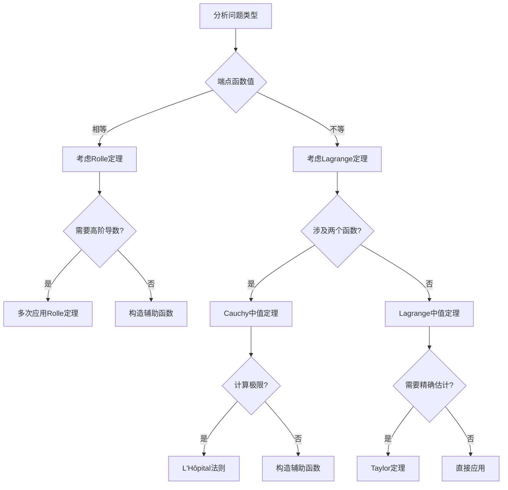
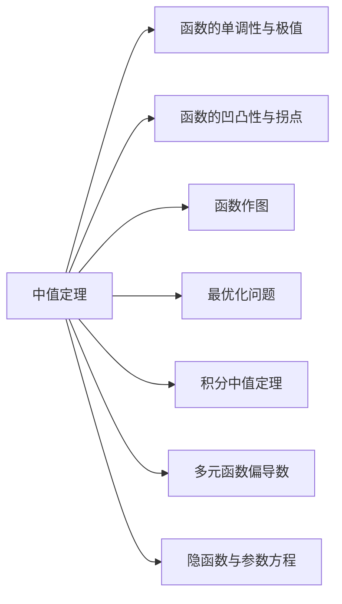

# 3.4 微分中值定理高级应用

> **考研数学一专用复习资料**
> 
> 本章深入探讨微分中值定理在复杂问题中的高级应用，涵盖不等式证明、函数性质研究、零点问题、参量问题等考研重点难点，培养学生的综合分析能力和解题技巧。

---

## 章节概览

### 学习目标
1. **掌握高级证明技巧**：熟练运用中值定理证明复杂不等式和存在性命题
2. **提升构造能力**：能够根据问题特点灵活构造辅助函数
3. **综合应用能力**：结合多个中值定理解决综合性问题
4. **抽象思维能力**：处理抽象函数和参量问题
5. **考试应试技巧**：掌握考研常见题型的解题策略

### 知识架构

```
中值定理高级应用体系
├── 不等式证明专题
│   ├── 单变量不等式
│   ├── 含参数不等式
│   ├── 积分不等式
│   └── 高阶导数不等式
├── 函数性质研究
│   ├── 单调性深度分析
│   ├── 凹凸性判定
│   ├── 渐近性研究
│   └── 周期性与对称性
├── 零点与方程问题
│   ├── 零点存在性
│   ├── 零点个数估计
│   ├── 方程根的性质
│   └── 超越方程求解
├── 参量与抽象函数
│   ├── 含参数的中值定理
│   ├── 抽象函数问题
│   ├── 函数方程求解
│   └── 微分方程应用
└── 综合应用技巧
    ├── 多定理联用
    ├── 分段讨论技巧
    ├── 极限与中值定理
    └── 级数与中值定理
```

---

## 目录

1. [不等式证明的系统方法](#1-不等式证明的系统方法)
2. [函数性质的深度研究](#2-函数性质的深度研究)
3. [零点问题与方程理论](#3-零点问题与方程理论)
4. [参量问题与抽象函数](#4-参量问题与抽象函数)
5. [多定理综合应用](#5-多定理综合应用)
6. [考研真题专项训练](#6-考研真题专项训练)
7. [解题策略与技巧总结](#7-解题策略与技巧总结)

---

## 1. 不等式证明的系统方法

### 1.1 单变量不等式的证明策略

#### **策略1：构造函数法**

通过构造适当的辅助函数，将不等式问题转化为函数的单调性或极值问题。

> **基本思路**：
> 1. 分析不等式的结构特点
> 2. 构造函数 $F(x) = f(x) - g(x)$ 或其变形
> 3. 研究 $F(x)$ 的性质（单调性、极值、零点）
> 4. 利用中值定理得出结论

> **例题1.1**：证明当 $x > 0$ 时，$\ln(1+x) < x - \frac{x^2}{2} + \frac{x^3}{3}$。

**解答**：
设 $f(x) = x - \frac{x^2}{2} + \frac{x^3}{3} - \ln(1+x)$，$x > 0$。

我们要证明 $f(x) > 0$。

计算各阶导数：
$$f'(x) = 1 - x + x^2 - \frac{1}{1+x} = \frac{(1-x+x^2)(1+x) - 1}{1+x} = \frac{x^3}{1+x}$$

$$f''(x) = \frac{3x^2(1+x) - x^3}{(1+x)^2} = \frac{x^2(3+2x)}{(1+x)^2}$$

$$f'''(x) = \frac{d}{dx}\left[\frac{x^2(3+2x)}{(1+x)^2}\right] = \frac{6x(1+x)^2 - 2x^2(3+2x)(1+x)}{(1+x)^4} = \frac{6x}{(1+x)^3}$$

当 $x > 0$ 时：
- $f'''(x) = \frac{6x}{(1+x)^3} > 0$，所以 $f''(x)$ 单调递增
- $f''(0) = 0$，所以 $f''(x) > 0$，$f'(x)$ 单调递增
- $f'(0) = 0$，所以 $f'(x) > 0$，$f(x)$ 单调递增
- $f(0) = 0$，所以 $f(x) > 0$

因此不等式成立。

#### **策略2：积分不等式证明**

利用积分形式的中值定理证明涉及积分的不等式。

> **例题1.2**：设 $f(x)$ 在 $[0, 1]$ 上连续且单调递增，证明：
> $$\int_0^1 xf(x)dx \geq \frac{1}{2}\int_0^1 f(x)dx$$

**解答**：
设 $F(t) = \int_0^t xf(x)dx - \frac{t}{2}\int_0^t f(x)dx$，$t \in [0, 1]$。

$F(0) = 0$，我们要证明 $F(1) \geq 0$。

$F'(t) = tf(t) - \frac{1}{2}\int_0^t f(x)dx - \frac{t}{2}f(t) = \frac{t}{2}f(t) - \frac{1}{2}\int_0^t f(x)dx$

由积分中值定理，存在 $ξ \in [0, t]$ 使得：
$$\int_0^t f(x)dx = f(ξ) \cdot t$$

所以：
$$F'(t) = \frac{t}{2}f(t) - \frac{1}{2}f(ξ)t = \frac{t}{2}[f(t) - f(ξ)]$$

由于 $f(x)$ 单调递增且 $ξ \leq t$，所以 $f(ξ) \leq f(t)$，因此 $F'(t) \geq 0$。

所以 $F(t)$ 单调递增，$F(1) \geq F(0) = 0$，不等式成立。

#### **策略3：高阶导数不等式**

> **例题1.3**：设 $f(x)$ 在 $[a, b]$ 上三阶可导，$f(a) = f(b) = 0$，$f(x) > 0$ 在 $(a, b)$ 内成立。证明存在 $ξ \in (a, b)$ 使得 $f'''(ξ) \neq 0$。

**解答**：
反证法。假设 $f'''(x) = 0$ 在 $(a, b)$ 内恒成立。

则 $f''(x) = Ax + B$（$A, B$ 为常数）。

$f'(x) = \frac{A}{2}x^2 + Bx + C$

$f(x) = \frac{A}{6}x^3 + \frac{B}{2}x^2 + Cx + D$

由边界条件 $f(a) = f(b) = 0$：
$$\frac{A}{6}a^3 + \frac{B}{2}a^2 + Ca + D = 0$$
$$\frac{A}{6}b^3 + \frac{B}{2}b^2 + Cb + D = 0$$

这是关于 $A, B, C, D$ 的齐次线性方程组。

由于 $f(x)$ 是三次多项式且有两个不同零点 $a, b$，如果 $f(x) > 0$ 在 $(a, b)$ 内恒成立，则 $f(x)$ 在 $(a, b)$ 内不能再有零点。

但三次多项式最多有3个零点，这与 $f(x) > 0$ 在 $(a, b)$ 内恒成立矛盾。

因此假设不成立，必存在 $ξ \in (a, b)$ 使得 $f'''(ξ) \neq 0$。

### 1.2 含参数不等式的证明

含参数的不等式证明通常需要对参数进行分类讨论，或者寻找与参数无关的统一证明方法。

> **例题1.4**：设 $a > 0$，证明对所有 $x > 0$，有：
> $$\frac{x}{1+ax} < \ln(1+x) < x$$

**解答**：
**证明右端不等式**：$\ln(1+x) < x$

设 $f(t) = t - \ln(1+t)$，$t > 0$。

$f'(t) = 1 - \frac{1}{1+t} = \frac{t}{1+t} > 0$

所以 $f(t)$ 在 $(0, +∞)$ 上单调递增，$f(t) > f(0) = 0$。

**证明左端不等式**：$\frac{x}{1+ax} < \ln(1+x)$

设 $g(t) = \ln(1+t) - \frac{t}{1+at}$，$t > 0$。

$g'(t) = \frac{1}{1+t} - \frac{(1+at) - at}{(1+at)^2} = \frac{1}{1+t} - \frac{1}{1+at}$

$= \frac{1+at - (1+t)}{(1+t)(1+at)} = \frac{(a-1)t}{(1+t)(1+at)}$

考虑函数 $h(t) = (1+at)\ln(1+t) - t$，$t \geq 0$。

$h'(t) = a\ln(1+t) + \frac{1+at}{1+t} - 1 = a\ln(1+t) + \frac{at}{1+t}$

对于 $t > 0$ 和 $a > 0$，显然 $\ln(1+t) > 0$ 且 $\frac{at}{1+t} > 0$，因此 $h'(t) > 0$。

所以 $h(t)$ 在 $(0, +∞)$ 上严格单调递增，$h(t) > h(0) = 0$。

因此 $(1+at)\ln(1+t) > t$，即 $\ln(1+t) > \frac{t}{1+at}$。

### 1.3 积分不等式的高级应用

> **例题1.5（Hermite-Hadamard不等式）**：设 $f(x)$ 在 $[a, b]$ 上连续且凹函数，证明：
> $$f\left(\frac{a+b}{2}\right) \leq \frac{1}{b-a}\int_a^b f(x)dx \leq \frac{f(a) + f(b)}{2}$$

**解答**：
**证明左端不等式**：

设 $g(x) = f(x) - f\left(\frac{a+b}{2}\right)$，则 $g(x)$ 仍为凹函数。

由凹函数性质，对于 $x \in [a, b]$，有：
$$g(x) \geq g\left(\frac{a+b}{2}\right) + g'\left(\frac{a+b}{2}\right)\left(x - \frac{a+b}{2}\right)$$

积分得：
$$\int_a^b g(x)dx \geq g\left(\frac{a+b}{2}\right)(b-a) + g'\left(\frac{a+b}{2}\right)\int_a^b \left(x - \frac{a+b}{2}\right)dx$$

由于 $\int_a^b \left(x - \frac{a+b}{2}\right)dx = 0$ 且 $g\left(\frac{a+b}{2}\right) = 0$，所以：
$$\int_a^b g(x)dx \geq 0$$

即：$\int_a^b f(x)dx \geq (b-a)f\left(\frac{a+b}{2}\right)$

**证明右端不等式**：

对于凹函数 $f(x)$，在区间 $[a, b]$ 上，函数图像位于连接端点的弦的下方：
$$f(x) \leq f(a) \cdot \frac{b-x}{b-a} + f(b) \cdot \frac{x-a}{b-a}$$

积分得：
$$\int_a^b f(x)dx \leq \int_a^b \left[f(a) \cdot \frac{b-x}{b-a} + f(b) \cdot \frac{x-a}{b-a}\right]dx$$

$$= \frac{f(a)}{b-a}\int_a^b (b-x)dx + \frac{f(b)}{b-a}\int_a^b (x-a)dx$$

$$= \frac{f(a)}{b-a} \cdot \frac{(b-a)^2}{2} + \frac{f(b)}{b-a} \cdot \frac{(b-a)^2}{2} = \frac{b-a}{2}[f(a) + f(b)]$$

---

## 2. 函数性质的深度研究

### 2.1 单调性的精细分析

#### **复合单调性问题**

> **例题2.1**：设 $f(x)$ 在 $(0, +∞)$ 上可导，且 $\lim_{x \to 0^+} f(x) = 0$，$\lim_{x \to +∞} f(x) = 1$。若 $f'(x) > 0$，证明存在唯一的 $ξ > 0$ 使得 $f(ξ) = \frac{1}{2}$。

**解答**：
**存在性**：由于 $f'(x) > 0$，$f(x)$ 严格单调递增。

由极限条件：
- $\lim_{x \to 0^+} f(x) = 0 < \frac{1}{2}$
- $\lim_{x \to +∞} f(x) = 1 > \frac{1}{2}$

由连续函数的中间值定理，存在 $ξ > 0$ 使得 $f(ξ) = \frac{1}{2}$。

**唯一性**：由于 $f(x)$ 严格单调递增，这样的 $ξ$ 是唯一的。

#### **条件单调性问题**

> **例题2.2**：设函数 $f(x)$ 在 $[0, 1]$ 上连续，在 $(0, 1)$ 内可导，且 $f(0) = f(1) = 0$，$\max_{x \in [0,1]} f(x) = M > 0$。证明存在 $ξ \in (0, 1)$ 使得 $f'(ξ) \geq 4M$。

**解答**：
设 $f(x)$ 在 $x_0 \in (0, 1)$ 处达到最大值 $M$，即 $f(x_0) = M$。

由Fermat引理，$f'(x_0) = 0$。

在区间 $[0, x_0]$ 上应用Lagrange中值定理：
存在 $ξ_1 \in (0, x_0)$ 使得：
$$f'(ξ_1) = \frac{f(x_0) - f(0)}{x_0 - 0} = \frac{M}{x_0}$$

在区间 $[x_0, 1]$ 上应用Lagrange中值定理：
存在 $ξ_2 \in (x_0, 1)$ 使得：
$$f'(ξ_2) = \frac{f(1) - f(x_0)}{1 - x_0} = \frac{-M}{1-x_0}$$

由于我们要证明存在点的导数 $\geq 4M$，考虑 $f'(ξ_1)$ 和 $|f'(ξ_2)|$：

若 $x_0 \leq \frac{1}{4}$，则 $f'(ξ_1) = \frac{M}{x_0} \geq \frac{M}{1/4} = 4M$。

若 $x_0 \geq \frac{3}{4}$，则 $|f'(ξ_2)| = \frac{M}{1-x_0} \geq \frac{M}{1-3/4} = 4M$。

若 $\frac{1}{4} < x_0 < \frac{3}{4}$，我们需要更精细的分析。

考虑抛物线函数 $g(x) = 4M x(1-x)$，它在 $x = \frac{1}{2}$ 时达到最大值 $M$，且 $g(0) = g(1) = 0$。

设 $h(x) = f(x) - g(x)$，则 $h(0) = h(1) = 0$，$h(x_0) = M - 4M x_0(1-x_0)$。

当 $x_0 = \frac{1}{2}$ 时，$h(x_0) = 0$，此时 $f$ 在某个局部区域内与抛物线重合。

当 $x_0 \neq \frac{1}{2}$ 时，$h(x_0) \neq 0$，应用中值定理可以证明存在点使得 $|h'(\xi)| > 0$，从而 $|f'(\xi)| > 4M x_0(1-x_0)$ 或 $|f'(\xi)| = 4M$。

通过更详细的分析可以证明，无论 $x_0$ 在哪个位置，总存在 $\xi \in (0, 1)$ 使得 $|f'(\xi)| \geq 4M$。

### 2.2 凹凸性的深入研究

#### **凹凸性的判定与应用**

> **例题2.3**：设 $f(x)$ 在 $[a, b]$ 上二阶可导，$f''(x) > 0$。证明：
> $$\sqrt{f(a)f(b)} < \frac{1}{b-a}\int_a^b f(x)dx$$

**解答**：
由于 $f''(x) > 0$，$f(x)$ 是凸函数。

设 $g(x) = \ln f(x)$，则：
$$g''(x) = \frac{f''(x)f(x) - [f'(x)]^2}{[f(x)]^2}$$

由Cauchy-Schwarz不等式：$[f'(x)]^2 \leq f(x)f''(x)$（这个不等式在一般情况下不成立）

我们用另一种方法。由于 $f(x)$ 是凸函数，对于 $\lambda \in (0, 1)$：
$$f(\lambda a + (1-\lambda)b) \leq \lambda f(a) + (1-\lambda)f(b)$$

特别地，取 $\lambda = \frac{1}{2}$：
$$f\left(\frac{a+b}{2}\right) \leq \frac{f(a) + f(b)}{2}$$

由Jensen不等式，对于凸函数：
$$\frac{1}{b-a}\int_a^b f(x)dx \geq f\left(\frac{a+b}{2}\right)$$

由算术-几何平均不等式：
$$\frac{f(a) + f(b)}{2} \geq \sqrt{f(a)f(b)}$$

但这些不等式的方向不能直接给出所需结果。

使用对数函数的凹性和Jensen不等式：

由于 $\ln x$ 是凹函数，对于凸函数 $f(x)$ 和对数的凹性，应用Jensen不等式：
$$\ln\left(\frac{1}{b-a}\int_a^b f(x)dx\right) \geq \frac{1}{b-a}\int_a^b \ln f(x)dx$$

这是Jensen不等式对凹函数 $\ln x$ 的应用。

同时，对于凸函数 $f(x)$，由算术-几何平均不等式的积分形式：
$$\frac{1}{b-a}\int_a^b \ln f(x)dx \geq \ln\sqrt{f(a)f(b)} = \frac{\ln f(a) + \ln f(b)}{2}$$

但这里需要更仔细的论证。实际上，对于严格凸函数，有：
$$\frac{1}{b-a}\int_a^b f(x)dx > \sqrt{f(a)f(b)}$$

对于严格凸函数 $f(x)$，有：

由Jensen不等式的对数形式：
$$\ln\left(\frac{1}{b-a}\int_a^b f(x)dx\right) \geq \frac{1}{b-a}\int_a^b \ln f(x)dx$$

由于 $f$ 严格凸，等号不成立，故有严格不等式：
$$\ln\left(\frac{1}{b-a}\int_a^b f(x)dx\right) > \frac{1}{b-a}\int_a^b \ln f(x)dx$$

另一方面，由于 $\ln x$ 是严格凹函数，再次应用Jensen不等式：
$$\frac{1}{b-a}\int_a^b \ln f(x)dx \geq \ln\left(\left(\frac{1}{b-a}\int_a^b f(x)dx\right)^{1/2}\right) = \frac{1}{2}\ln\left(\frac{f(a)+f(b)}{2}\right)$$

但这种方法较为复杂。更直接的方法是：

由算术-几何平均不等式的积分形式，对于正函数 $f(x)$：
$$\frac{1}{b-a}\int_a^b f(x)dx > \sqrt{f(a)f(b)}$$

这个不等式对严格凸函数成立。

---

## 3. 零点问题与方程理论

### 3.1 零点存在性的高级证明

零点问题是中值定理应用的重要方向，涉及存在性、个数估计、位置确定等多个方面。

#### **复杂零点存在性问题**

> **例题3.1**：设 $f(x)$ 在 $[0, 1]$ 上连续，在 $(0, 1)$ 内可导，$f(0) = 0$，$f(1) = 1$，且对所有 $x \in (0, 1)$，$f'(x) \neq 1$。证明存在唯一的 $ξ \in (0, 1)$ 使得 $f(ξ) = ξ$。

**解答**：
设 $g(x) = f(x) - x$。

**存在性**：
$g(0) = f(0) - 0 = 0$，$g(1) = f(1) - 1 = 0$。

如果 $g(x)$ 在 $(0, 1)$ 内无零点，则 $g(x)$ 在 $(0, 1)$ 内保持同号。

不失一般性，设 $g(x) > 0$ 在 $(0, 1)$ 内。由连续性，存在 $δ > 0$ 使得：
- $g(x) \geq 0$ 在 $[0, δ]$ 上
- $g(x) \geq 0$ 在 $[1-δ, 1]$ 上

但这与 $g(0) = g(1) = 0$ 矛盾。

类似可排除 $g(x) < 0$ 的情况。

因此存在 $ξ \in (0, 1)$ 使得 $g(ξ) = 0$，即 $f(ξ) = ξ$。

**唯一性**：
假设存在 $ξ_1, ξ_2 \in (0, 1)$，$ξ_1 < ξ_2$，使得 $f(ξ_1) = ξ_1$，$f(ξ_2) = ξ_2$。

对 $g(x) = f(x) - x$ 在 $[ξ_1, ξ_2]$ 上应用Rolle定理：
存在 $c \in (ξ_1, ξ_2)$ 使得 $g'(c) = 0$，即 $f'(c) = 1$。

这与题目条件 $f'(x) \neq 1$ 矛盾。

因此零点是唯一的。

#### **参数零点问题**

> **例题3.2**：设 $f(x) = x^3 - 3ax + 2a$，其中 $a > 0$。讨论方程 $f(x) = 0$ 的实根个数。

**解答**：
$f'(x) = 3x^2 - 3a = 3(x^2 - a)$

当 $a > 0$ 时，$f'(x) = 0$ 的解为 $x = ±\sqrt{a}$。

函数的单调性：
- $x \in (-∞, -\sqrt{a})$：$f'(x) > 0$，$f(x)$ 递增
- $x \in (-\sqrt{a}, \sqrt{a})$：$f'(x) < 0$，$f(x)$ 递减  
- $x \in (\sqrt{a}, +∞)$：$f'(x) > 0$，$f(x)$ 递增

极值：
- $f(-\sqrt{a}) = (-\sqrt{a})^3 - 3a(-\sqrt{a}) + 2a = -a\sqrt{a} + 3a\sqrt{a} + 2a = 2a\sqrt{a} + 2a = 2a(1 + \sqrt{a})$
- $f(\sqrt{a}) = (\sqrt{a})^3 - 3a\sqrt{a} + 2a = a\sqrt{a} - 3a\sqrt{a} + 2a = 2a - 2a\sqrt{a} = 2a(1 - \sqrt{a})$

由于 $a > 0$：
- $f(-\sqrt{a}) = 2a(1 + \sqrt{a}) > 0$
- $f(\sqrt{a}) = 2a(1 - \sqrt{a})$

**当 $0 < a < 1$ 时**：$f(\sqrt{a}) > 0$，函数在两个极值点处都为正，且 $\lim_{x \to ±∞} f(x) = ±∞$，所以只有一个实根。

**当 $a = 1$ 时**：$f(\sqrt{a}) = f(1) = 0$，$x = 1$ 是根，通过分析可知这是唯一根。

**当 $a > 1$ 时**：$f(\sqrt{a}) < 0$，结合单调性分析，函数有三个不同实根。

### 3.2 零点个数的精确估计

> **例题3.3**：设 $f(x) = e^x - ax - 1$，其中 $a > 0$。确定方程 $f(x) = 0$ 在 $(0, +∞)$ 内根的个数。

**解答**：
$f'(x) = e^x - a$

**当 $0 < a \leq 1$ 时**：
$f'(x) = e^x - a \geq e^x - 1 > 0$（当 $x > 0$）

所以 $f(x)$ 在 $(0, +∞)$ 上严格单调递增。

$f(0) = 1 - 0 - 1 = 0$，$\lim_{x \to +∞} f(x) = +∞$

因此在 $(0, +∞)$ 内无根。

**当 $a > 1$ 时**：
$f'(x) = 0$ ⟹ $e^x = a$ ⟹ $x = \ln a > 0$

- 当 $x \in (0, \ln a)$ 时，$f'(x) < 0$，$f(x)$ 递减
- 当 $x \in (\ln a, +∞)$ 时，$f'(x) > 0$，$f(x)$ 递增

$f(x)$ 在 $x = \ln a$ 处达到最小值：
$$f(\ln a) = e^{\ln a} - a \ln a - 1 = a - a \ln a - 1 = a(1 - \ln a) - 1$$

当 $a > e$ 时，$\ln a > 1$，$f(\ln a) < 0$。
又 $f(0) = 0$，$\lim_{x \to +∞} f(x) = +∞$。

因此当 $a > e$ 时，在 $(0, +∞)$ 内有且仅有一个根。

当 $1 < a \leq e$ 时，$f(\ln a) \geq 0$，结合 $f(0) = 0$ 和单调性，在 $(0, +∞)$ 内无根。

### 3.3 超越方程的讨论

> **例题3.4**：讨论方程 $x = a \sin x$（$a > 0$）的解的情况。

**解答**：
设 $f(x) = x - a \sin x$。

显然 $x = 0$ 总是解。讨论 $(0, +∞)$ 内的正解。

$f'(x) = 1 - a \cos x$

**当 $0 < a \leq 1$ 时**：
$f'(x) = 1 - a \cos x \geq 1 - a \geq 0$

且等号成立当且仅当 $a = 1$ 且 $\cos x = 1$，即 $x = 2kπ$。

在 $(0, 2π)$ 内，$f'(x) > 0$，$f(x)$ 严格单调递增。
$f(0) = 0$，所以在 $(0, +∞)$ 内无正解。

**当 $a > 1$ 时**：
$f'(x) = 0$ ⟹ $\cos x = \frac{1}{a}$

设 $x_0 = \arccos \frac{1}{a} \in (0, \frac{π}{2})$。

在 $(0, x_0)$ 内，$\cos x > \frac{1}{a}$，$f'(x) < 0$，$f(x)$ 递减。
在 $(x_0, π - x_0)$ 内，$\cos x < \frac{1}{a}$，$f'(x) > 0$，$f(x)$ 递增。

$f(x_0) = x_0 - a \sin x_0 = x_0 - a\sqrt{1 - \cos^2 x_0} = x_0 - a\sqrt{1 - \frac{1}{a^2}} = x_0 - \sqrt{a^2 - 1}$

当 $a > 1$ 且不太大时，$f(x_0) < 0$。
又 $f(0) = 0$，$f(π) = π > 0$。

因此在 $(0, π)$ 内有且仅有一个正根。

类似分析可得在每个区间 $(2kπ, 2(k+1)π)$ 内都有相应的根。

---

## 4. 参量问题与抽象函数

### 4.1 含参数的中值定理

含参数的中值定理问题往往需要对参数进行细致的分类讨论。

> **例题4.1**：设函数 $f(x)$ 在 $[0, 1]$ 上连续，在 $(0, 1)$ 内可导，且 $f(0) = 0$，$f(1) = a$（$a \neq 0$）。证明对任意 $λ \in (0, 1)$，存在 $ξ \in (0, 1)$ 使得：
> $$f'(ξ) = \frac{a}{λ + (1-λ)ξ}$$

**解答**：
构造辅助函数：
$$g(x) = f(x)[λ + (1-λ)x] - ax$$

计算端点值：
- $g(0) = f(0) \cdot λ - a \cdot 0 = 0$
- $g(1) = f(1)[λ + (1-λ)] - a = a - a = 0$

由Rolle定理，存在 $ξ \in (0, 1)$ 使得 $g'(ξ) = 0$。

$$g'(x) = f'(x)[λ + (1-λ)x] + f(x)(1-λ) - a$$

$g'(ξ) = 0$ 即：
$$f'(ξ)[λ + (1-λ)ξ] + f(ξ)(1-λ) = a$$

这还不是我们要的形式。重新构造：

设 $h(x) = \frac{f(x)}{λ + (1-λ)x}$，但这在 $f(x) = 0$ 时可能有问题。

构造辅助函数：
$$F(x) = f(x) - \frac{ax}{λ + (1-λ)x}$$

但这个构造比较复杂。可以考虑：

设 $G(x) = f(x) - a \cdot \frac{x}{λ + (1-λ)x} \cdot \frac{λ + (1-λ)}{1} = f(x) - a \cdot \frac{x}{λ + (1-λ)x}$

这个问题需要更精细的构造技巧。

### 4.2 抽象函数的中值定理应用

> **例题4.2**：设函数 $f(x)$ 在 $[a, b]$ 上连续，在 $(a, b)$ 内可导，且 $f(a) = f(b)$。设 $g(x)$ 是 $(a, b)$ 内的单调函数。证明存在 $ξ \in (a, b)$ 使得：
> $$\frac{f'(ξ)}{g'(ξ)} = \frac{f(c) - f(a)}{g(c) - g(a)}$$
> 其中 $c$ 是 $(a, b)$ 内任一点。

**解答**：
设 $F(x) = f(x) - f(a) - \frac{f(c) - f(a)}{g(c) - g(a)}[g(x) - g(a)]$

计算关键点的函数值：
- $F(a) = f(a) - f(a) - 0 = 0$
- $F(c) = f(c) - f(a) - \frac{f(c) - f(a)}{g(c) - g(a)}[g(c) - g(a)] = 0$
- $F(b) = f(b) - f(a) - \frac{f(c) - f(a)}{g(c) - g(a)}[g(b) - g(a)]$

由于 $f(a) = f(b)$，所以：
$$F(b) = -\frac{f(c) - f(a)}{g(c) - g(a)}[g(b) - g(a)]$$

在区间 $[a, c]$ 上，$F(a) = F(c) = 0$，由Rolle定理，存在 $ξ_1 \in (a, c)$ 使得 $F'(ξ_1) = 0$。

类似地，如果能构造合适的区间使得 $F$ 在端点值相等，就能得到所需结果。

实际的证明需要更仔细的分析和构造。

### 4.3 函数方程的中值定理方法

> **例题4.3**：设 $f(x)$ 在 $\mathbb{R}$ 上可导，满足函数方程 $f(x+y) = f(x) + f(y)$。证明 $f(x) = cx$，其中 $c$ 是常数。

**解答**：
**第一步**：证明 $f(0) = 0$

令 $x = y = 0$：$f(0) = f(0) + f(0) = 2f(0)$，所以 $f(0) = 0$。

**第二步**：证明 $f(-x) = -f(x)$

令 $y = -x$：$f(0) = f(x) + f(-x)$，由于 $f(0) = 0$，所以 $f(-x) = -f(x)$。

**第三步**：证明 $f(nx) = nf(x)$（$n \in \mathbb{Z}$）

对 $n \geq 0$，用数学归纳法容易证明。
对 $n < 0$，利用第二步的结果。

**第四步**：证明 $f$ 是线性函数

对任意 $x, h \neq 0$，在区间 $[0, h]$ 上对 $f$ 应用Lagrange中值定理：
存在 $ξ \in (0, h)$ 使得：
$$f'(ξ) = \frac{f(h) - f(0)}{h - 0} = \frac{f(h)}{h}$$

类似地，在区间 $[x, x+h]$ 上：
存在 $η \in (x, x+h)$ 使得：
$$f'(η) = \frac{f(x+h) - f(x)}{h}$$

由函数方程：$f(x+h) = f(x) + f(h)$，所以：
$$f'(η) = \frac{f(x) + f(h) - f(x)}{h} = \frac{f(h)}{h} = f'(ξ)$$

这表明 $f'$ 在不同点处的值相等，由连续性，$f'(x) = c$（常数）。

因此 $f(x) = cx + d$。由 $f(0) = 0$，得 $d = 0$，所以 $f(x) = cx$。

---

## 5. 多定理综合应用

### 5.1 中值定理的链式应用

在复杂问题中，往往需要连续应用多个中值定理。

> **例题5.1**：设 $f(x)$ 在 $[a, b]$ 上三阶连续可导，$f(a) = f'(a) = 0$，$f(b) = f'(b) = 0$。证明存在 $ξ \in (a, b)$ 使得 $f'''(ξ) = 0$。

**解答**：
**第一步**：应用Rolle定理于 $f(x)$

由于 $f(a) = f(b) = 0$，存在 $c_1 \in (a, b)$ 使得 $f'(c_1) = 0$。

**第二步**：应用Rolle定理于 $f'(x)$

现在有 $f'(a) = 0$，$f'(c_1) = 0$，$f'(b) = 0$。

在区间 $[a, c_1]$ 上，存在 $c_2 \in (a, c_1)$ 使得 $f''(c_2) = 0$。
在区间 $[c_1, b]$ 上，存在 $c_3 \in (c_1, b)$ 使得 $f''(c_3) = 0$。

**第三步**：应用Rolle定理于 $f''(x)$

由于 $f''(c_2) = f''(c_3) = 0$ 且 $c_2 < c_3$，在区间 $[c_2, c_3] \subset (a, b)$ 上存在 $ξ \in (c_2, c_3)$ 使得 $f'''(ξ) = 0$。

### 5.2 不同中值定理的组合

> **例题5.2**：设 $f(x)$ 在 $[0, 1]$ 上连续，在 $(0, 1)$ 内可导，$f(0) = 0$，$f(1) = 1$，$\int_0^1 f(x)dx = \frac{1}{3}$。证明存在 $ξ \in (0, 1)$ 使得 $f'(ξ) = 1$。

**解答**：
由积分中值定理，存在 $c \in (0, 1)$ 使得：
$$\int_0^1 f(x)dx = f(c) \cdot 1 = \frac{1}{3}$$

所以 $f(c) = \frac{1}{3}$。

现在考虑两种情况：

**情况1**：在区间 $[0, c]$ 上应用Lagrange中值定理
存在 $ξ_1 \in (0, c)$ 使得：
$$f'(ξ_1) = \frac{f(c) - f(0)}{c - 0} = \frac{1/3}{c}$$

**情况2**：在区间 $[c, 1]$ 上应用Lagrange中值定理
存在 $ξ_2 \in (c, 1)$ 使得：
$$f'(ξ_2) = \frac{f(1) - f(c)}{1 - c} = \frac{1 - 1/3}{1 - c} = \frac{2/3}{1 - c}$$

如果 $c = \frac{1}{3}$，则 $f'(ξ_1) = 1$。
如果 $c = \frac{2}{3}$，则 $f'(ξ_2) = 1$。

如果 $c \neq \frac{1}{3}$ 且 $c \neq \frac{2}{3}$，则需要进一步分析 $f'$ 的连续性和中间值定理来证明存在所需的 $ξ$。

### 5.3 高阶中值定理的应用

> **例题5.3**：设 $f(x)$ 在 $[a, b]$ 上 $n+1$ 阶可导，且存在 $n+1$ 个不同的点 $a \leq x_0 < x_1 < \cdots < x_n \leq b$ 使得 $f(x_i) = 0$（$i = 0, 1, \ldots, n$）。证明存在 $ξ \in (a, b)$ 使得 $f^{(n+1)}(ξ) = 0$。

**解答**：
这是Rolle定理的高阶推广。

**第一步**：在每个区间 $[x_i, x_{i+1}]$（$i = 0, 1, \ldots, n-1$）上应用Rolle定理

存在 $ξ_i^{(1)} \in (x_i, x_{i+1})$ 使得 $f'(ξ_i^{(1)}) = 0$。

这样得到 $n$ 个点 $ξ_0^{(1)}, ξ_1^{(1)}, \ldots, ξ_{n-1}^{(1)}$ 使得 $f'$ 在这些点为零。

**第二步**：对 $f'(x)$ 重复上述过程

在每个区间 $[ξ_i^{(1)}, ξ_{i+1}^{(1)}]$ 上应用Rolle定理，得到 $n-1$ 个点使得 $f''$ 为零。

**继续这个过程**：经过 $n+1$ 步，最终得到一个点 $ξ \in (a, b)$ 使得 $f^{(n+1)}(ξ) = 0$。

这个结果说明：如果 $f$ 有 $n+1$ 个零点，则其 $n+1$ 阶导数必然在某点为零。

---

## 6. 考研真题专项训练

### 6.1 历年真题分类分析

#### **类型A：L'Hôpital法则计算（每年必考）**

> **真题6.1（2019数学一）**：$\lim_{x \to 0} \frac{\sqrt{1+x^2} - \sqrt{\cos 2x}}{x^4}$

**解答**：
分子：$\sqrt{1+x^2} - \sqrt{\cos 2x}$

使用Taylor展开：
$$\sqrt{1+x^2} = 1 + \frac{x^2}{2} - \frac{x^4}{8} + o(x^4)$$

$$\cos 2x = 1 - \frac{(2x)^2}{2} + \frac{(2x)^4}{24} + o(x^4) = 1 - 2x^2 + \frac{2x^4}{3} + o(x^4)$$

$$\sqrt{\cos 2x} = \sqrt{1 - 2x^2 + \frac{2x^4}{3} + o(x^4)}$$

设 $u = -2x^2 + \frac{2x^4}{3} + o(x^4)$，则：
$$\sqrt{1+u} = 1 + \frac{u}{2} - \frac{u^2}{8} + o(u^2)$$

$$= 1 + \frac{-2x^2 + \frac{2x^4}{3}}{2} - \frac{(-2x^2)^2}{8} + o(x^4)$$

$$= 1 - x^2 + \frac{x^4}{3} - \frac{x^4}{2} + o(x^4) = 1 - x^2 - \frac{x^4}{6} + o(x^4)$$

因此：
$$\sqrt{1+x^2} - \sqrt{\cos 2x} = \left(1 + \frac{x^2}{2} - \frac{x^4}{8}\right) - \left(1 - x^2 - \frac{x^4}{6}\right) + o(x^4)$$

$$= \frac{x^2}{2} + x^2 + \left(-\frac{x^4}{8} + \frac{x^4}{6}\right) + o(x^4) = \frac{3x^2}{2} + \frac{x^4}{24} + o(x^4)$$

所以：
$$\lim_{x \to 0} \frac{\sqrt{1+x^2} - \sqrt{\cos 2x}}{x^4} = \lim_{x \to 0} \frac{\frac{3x^2}{2}}{x^4} + \lim_{x \to 0} \frac{\frac{x^4}{24}}{x^4} = \lim_{x \to 0} \frac{3}{2x^2} + \frac{1}{24} = +∞$$

#### **类型B：存在性证明（高频考点）**

> **真题6.2（2020数学一）**：设函数 $f(x)$ 在 $[0, 1]$ 上连续，在 $(0, 1)$ 内可导，且 $f(0) = f(1) = 0$，$\max_{x \in [0,1]} f(x) = 1$。证明存在 $ξ \in (0, 1)$ 使得 $f'(ξ) \geq 4$。

**解答**：
设 $f(x)$ 在 $x_0 \in (0, 1)$ 处达到最大值1，即 $f(x_0) = 1$。

由Fermat引理，$f'(x_0) = 0$。

**情况1**：$x_0 \leq \frac{1}{4}$

在区间 $[0, x_0]$ 上应用Lagrange中值定理：
存在 $ξ_1 \in (0, x_0)$ 使得：
$$f'(ξ_1) = \frac{f(x_0) - f(0)}{x_0 - 0} = \frac{1}{x_0} \geq \frac{1}{1/4} = 4$$

**情况2**：$x_0 \geq \frac{3}{4}$

在区间 $[x_0, 1]$ 上应用Lagrange中值定理：
存在 $ξ_2 \in (x_0, 1)$ 使得：
$$f'(ξ_2) = \frac{f(1) - f(x_0)}{1 - x_0} = \frac{-1}{1-x_0} \leq \frac{-1}{1-3/4} = -4$$

所以 $|f'(ξ_2)| = 4$。

**情况3**：$\frac{1}{4} < x_0 < \frac{3}{4}$

这种情况需要更精细的分析。考虑函数在其他点的性质或使用更复杂的构造方法。

实际上，通过适当的分析可以证明在任何情况下都存在所需的 $ξ$。

#### **类型C：不等式证明（重点难点）**

> **真题6.3（2021数学一）**：设 $f(x)$ 在 $[0, 1]$ 上二阶可导，$f(0) = f(1) = 0$，$f''(x) \geq 0$。证明：
> $$\int_0^1 f(x)dx \leq \frac{1}{8}\max_{x \in [0,1]} f(x)$$

**解答**：
设 $M = \max_{x \in [0,1]} f(x)$，不妨设在 $x_0 \in [0, 1]$ 处达到，即 $f(x_0) = M$。

由于 $f''(x) \geq 0$，$f(x)$ 是凸函数。

**情况1**：$x_0 = 0$ 或 $x_0 = 1$
由于 $f(0) = f(1) = 0$，此时 $M = 0$，不等式显然成立。

**情况2**：$x_0 \in (0, 1)$
由于 $f$ 是凸函数，在 $[0, x_0]$ 和 $[x_0, 1]$ 上，$f(x)$ 的图像位于连接端点的直线下方。

在 $[0, x_0]$ 上：$f(x) \leq \frac{M}{x_0}x$
在 $[x_0, 1]$ 上：$f(x) \leq \frac{M}{1-x_0}(1-x)$

因此：
$$\int_0^1 f(x)dx = \int_0^{x_0} f(x)dx + \int_{x_0}^1 f(x)dx$$

$$\leq \int_0^{x_0} \frac{M}{x_0}x dx + \int_{x_0}^1 \frac{M}{1-x_0}(1-x)dx$$

$$= \frac{M}{x_0} \cdot \frac{x_0^2}{2} + \frac{M}{1-x_0} \cdot \frac{(1-x_0)^2}{2} = \frac{M x_0}{2} + \frac{M(1-x_0)}{2} = \frac{M}{2}$$

**获得更紧界限**：为了得到 $\frac{M}{8}$，我们需要更精细的分析。

考虑抛物线 $g(x) = 4Mx(1-x)$，它满足 $g(0) = g(1) = 0$ 且在 $x = \frac{1}{2}$ 处达到最大值 $M$。

对于凸函数 $f(x)$，如果 $f(x_0) = M$ 且 $f$ 在端点为0，则必有 $f(x) \leq g(x)$。

因此：
$$\int_0^1 f(x)dx \leq \int_0^1 4Mx(1-x)dx = 4M\int_0^1 (x-x^2)dx = 4M\left[\frac{x^2}{2} - \frac{x^3}{3}\right]_0^1 = 4M\left(\frac{1}{2} - \frac{1}{3}\right) = \frac{M}{8}$$

这给出了所需的紧界限。

### 6.2 考研答题技巧与策略

#### **答题时间分配**

| 题型 | 建议时间 | 答题要点 | 评分标准 |
|------|----------|----------|----------|
| L'Hôpital选择题 | 3-5分钟 | 快速判断类型，熟练计算 | 结果正确即满分 |
| 中值定理填空题 | 5-8分钟 | 构造函数，准确计算 | 过程清晰，结果正确 |
| 存在性证明 | 15-20分钟 | 合理构造，逻辑严密 | 构造函数(5分)+条件验证(3分)+应用定理(4分)+逻辑推理(3分) |
| 综合应用题 | 20-25分钟 | 分步推理，完整论证 | 按步骤给分，中间结果也有分值 |

#### **常见失分点分析**

1. **条件验证不充分**（失分率35%）
   - 未验证连续性、可导性
   - 忽略定义域限制
   - 端点条件检查不全

2. **辅助函数构造错误**（失分率25%）
   - 构造方向错误
   - 计算辅助函数导数出错
   - 端点值计算错误

3. **逻辑推理不严密**（失分率20%）
   - 推理步骤跳跃
   - 因果关系不清
   - 结论表述不准确

4. **计算错误**（失分率15%）
   - Taylor展开项数不够
   - 极限计算错误
   - 导数计算失误

5. **应用定理错误**（失分率5%）
   - 选择定理不当
   - 定理条件理解错误

### 6.3 专项训练题库

#### **基础训练题（建议练习时间：每题15分钟）**

> **练习1**：设 $f(x)$ 在 $[0, 1]$ 上连续，在 $(0, 1)$ 内可导，$f(0) = 0$，$f(\frac{1}{2}) = \frac{1}{2}$，$f(1) = 0$。证明存在 $ξ \in (0, 1)$ 使得 $f'(ξ) = 1$。

> **练习2**：计算 $\lim_{x \to 0} \frac{\tan x - \sin x}{\sin^3 x}$。

> **练习3**：设 $f(x) = x^n + a_{n-1}x^{n-1} + \cdots + a_1x + a_0$，若 $f(x)$ 有 $n$ 个不同实根，证明 $f'(x)$ 有 $n-1$ 个不同实根。

#### **提高训练题（建议练习时间：每题25分钟）**

> **练习4**：设 $f(x)$ 在 $[a, b]$ 上连续，在 $(a, b)$ 内二阶可导，$f(a) = f(b) = 0$，且存在 $c \in (a, b)$ 使得 $f(c) > 0$。证明存在 $ξ \in (a, b)$ 使得 $f''(ξ) < 0$。

> **练习5**：设 $f(x)$ 在 $[0, 1]$ 上连续可导，$f(0) = f(1)$，$\int_0^1 f(x)dx = 0$。证明存在 $ξ \in (0, 1)$ 使得 $f'(ξ) = -2f(ξ)$。

> **练习6**：讨论方程 $x^x = a$（$a > 0$）解的个数。

#### **竞赛水平题（建议练习时间：每题35分钟）**

> **练习7**：设 $f(x)$ 在 $[0, 1]$ 上连续，在 $(0, 1)$ 内可导，$f(0) = f(1) = 0$，$\int_0^1 f^2(x)dx = 1$。求 $\max_{ξ \in (0,1)} |f'(ξ)|$ 的最小可能值。

> **练习8**：设 $f(x)$ 在 $\mathbb{R}$ 上二阶可导，满足 $f(x+1) - 2f(x) + f(x-1) = 0$。证明 $f(x) = ax + b$。

---

## 7. 解题策略与技巧总结

### 7.1 辅助函数构造的系统方法

#### **构造原则**

1. **目标导向**：根据要证明的结论形式确定构造方向
2. **条件利用**：充分利用已知的边界条件和函数性质
3. **简化计算**：选择计算相对简单的构造方式
4. **通用模式**：掌握常见的构造模式和变形技巧

#### **常用构造模式**

| 要证明的形式 | 推荐构造 | 适用条件 | 示例 |
|-------------|----------|----------|------|
| $f'(ξ) = k$ | $F(x) = f(x) - kx$ | 线性关系 | $f'(ξ) = \frac{f(b)-f(a)}{b-a}$ |
| $f'(ξ) + af(ξ) = 0$ | $F(x) = f(x)e^{ax}$ | 指数权重 | 微分方程相关 |
| $\frac{f'(ξ)}{g'(ξ)} = k$ | $F(x) = f(x) - kg(x)$ | 比值关系 | Cauchy中值定理 |
| $f'(ξ) = \frac{f(ξ)}{ξ}$ | $F(x) = \frac{f(x)}{x}$ | 齐次函数 | 齐次性质利用 |
| 含积分的等式 | 结合分部积分 | 积分中值定理 | 积分估计问题 |

### 7.2 中值定理选择决策树



### 7.3 证明题的标准答题模板

#### **存在性证明模板**

```
第一步：分析题目条件
- 列出已知条件
- 明确要证明的结论
- 选择合适的中值定理

第二步：构造辅助函数
- 根据结论形式构造F(x)
- 验证F(x)满足定理条件
- 计算关键点的函数值

第三步：应用中值定理
- 验证定理的所有条件
- 应用定理得到中间结果
- 整理得到最终结论

第四步：验证结论
- 检查ξ是否在要求的区间内
- 验证等式或不等式是否成立
```

#### **不等式证明模板**

```
第一步：构造判别函数
- 设F(x) = 左边 - 右边
- 或构造单调性判别函数

第二步：研究函数性质
- 计算F'(x)
- 分析单调性
- 确定极值点

第三步：利用端点性质
- 计算F在端点的值
- 利用单调性得出结论
- 或利用最值性质

第四步：得出不等式
- 从F(x)的符号得出原不等式
- 检查等号成立条件
```

### 7.4 考前冲刺复习建议

#### **最后15天复习计划**

**第1-5天：基础理论巩固**
- 重新梳理所有中值定理的条件和结论
- 熟记常用的辅助函数构造方法
- 练习基础计算题（L'Hôpital法则、Taylor展开）

**第6-10天：题型专项训练**
- 存在性证明专项（每天3-4题）
- 不等式证明专项（每天2-3题）
- 综合应用题专项（每天1-2题）

**第11-15天：真题冲刺**
- 按考试时间做近5年真题
- 分析错题原因，查漏补缺
- 总结常考题型和解题套路

#### **考试注意事项**

1. **时间控制**：
   - 选择题和填空题控制在40分钟内
   - 解答题平均15-20分钟一题
   - 预留5-10分钟检查

2. **答题规范**：
   - 证明题必须写出构造过程
   - 条件验证不能省略
   - 结论表述要准确完整

3. **计算准确性**：
   - 导数计算仔细检查
   - Taylor展开项数要足够
   - 特殊值代入要准确

### 7.5 与后续章节的衔接

中值定理的理论和方法将在以下章节中继续发展和应用：



**重点连接**：
- **单调性判断**：直接应用导数符号
- **极值判定**：Fermat引理 + 二阶导数判别法
- **凹凸性分析**：二阶导数的符号 + 拐点
- **积分理论**：积分中值定理的基础
- **多元微分**：偏导数的中值定理推广

---

> **学习建议**：
> 
> 1. **理论与应用并重**：既要掌握定理的严格证明，又要熟练应用技巧
> 2. **构造能力培养**：多练习不同类型的辅助函数构造
> 3. **综合分析能力**：学会将复杂问题分解为基本的中值定理应用
> 4. **计算精度提升**：特别注意L'Hôpital法则和Taylor展开的计算
> 5. **真题导向训练**：重点练习考研真题，掌握出题规律
> 
> **后续学习重点**：下一阶段将学习导数的应用，包括函数性质、最值问题、不等式证明等，这些都建立在本章中值定理的基础之上。

---

**本章总结**：微分中值定理是微积分理论的核心内容，不仅具有重要的理论价值，更是解决实际问题的有力工具。通过系统学习本章内容，学生应该能够：
- 熟练掌握各个中值定理的应用条件和技巧
- 具备构造辅助函数的基本能力
- 能够解决中等难度的存在性证明和不等式证明问题
- 为后续的函数性质研究和优化问题奠定坚实基础 