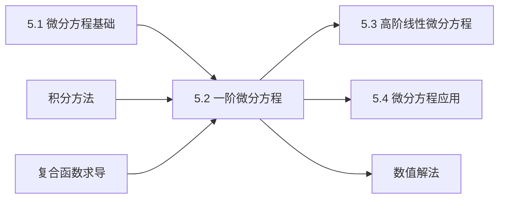

# 5.2 一阶微分方程求解方法

---

## 章节概览

### 学习目标
1. **方法掌握**：熟练掌握可分离变量、齐次方程、一阶线性方程的求解方法
2. **技巧运用**：能够灵活运用变量替换、积分因子等解题技巧
3. **类型识别**：准确识别一阶微分方程的类型，选择合适的求解方法
4. **计算能力**：熟练进行复杂积分运算，准确求解各类一阶微分方程
5. **应用意识**：理解各类方程在实际问题中的应用背景

### 重点难点

> **重点内容**
> - 可分离变量微分方程的求解
> - 齐次微分方程的求解（包括可化为齐次的方程）
> - 一阶线性微分方程的通解公式
> - 伯努利方程的求解方法
> - 全微分方程的判定与求解

> **难点内容**
> - 复杂函数的分离变量技巧
> - 齐次方程变量替换的灵活运用
> - 一阶线性方程通解公式的熟练应用
> - 积分因子的寻找方法
> - 特殊类型方程的识别与转化

### 知识架构

```
一阶微分方程求解方法
├── 可分离变量型
│   ├── 标准可分离变量方程
│   ├── 可化为分离变量的方程
│   └── 复杂分离变量技巧
├── 齐次方程型
│   ├── 标准齐次方程
│   ├── 可化为齐次的方程
│   └── 变量替换技巧
├── 一阶线性方程
│   ├── 齐次线性方程
│   ├── 非齐次线性方程
│   └── 常数变易法
├── 特殊类型方程
│   ├── 伯努利方程
│   ├── 里卡蒂方程
│   └── 全微分方程
└── 综合应用技巧
    ├── 积分因子法
    ├── 变量替换法
    └── 方程类型转化
```

### 与其他章节的联系



---

## 目录

1. [可分离变量的微分方程](#1-可分离变量的微分方程)
2. [齐次微分方程](#2-齐次微分方程)
3. [一阶线性微分方程](#3-一阶线性微分方程)
4. [伯努利方程](#4-伯努利方程)
5. [全微分方程](#5-全微分方程)
6. [其他特殊类型的一阶方程](#6-其他特殊类型的一阶方程)
7. [本章知识点总结](#7-本章知识点总结)

---

## 1. 可分离变量的微分方程

### 1.1 可分离变量方程的定义

> **定义1.1（可分离变量方程）**
> 
> 形如 $\frac{dy}{dx} = f(x)g(y)$ 的微分方程称为**可分离变量的微分方程**。

**标准形式**：
$$\frac{dy}{dx} = f(x)g(y)$$

或写成微分形式：
$$M(x)dx + N(y)dy = 0$$

其中 $M(x)$ 只含 $x$， $N(y)$ 只含 $y$ 。

### 1.2 求解方法

> **求解步骤**：
> 
> 1. **分离变量**：将方程改写为 $\frac{dy}{g(y)} = f(x)dx$
> 2. **两边积分**： $\int \frac{dy}{g(y)} = \int f(x)dx$
> 3. **求出通解**：计算积分并加上积分常数

**注意事项**：
- 分离变量时要注意 $g(y) \neq 0$ 的条件
- 如果 $g(y) = 0$ 有解，需要单独讨论这些解
- 积分常数的处理要规范

> **例题1.1**：求解微分方程  $\frac{dy}{dx} = 2xy$

**解答**：
1. **分离变量**： $\frac{dy}{y} = 2x dx$（这里假设  $y \neq 0$）

2. **两边积分**：
   $$\int \frac{dy}{y} = \int 2x dx$$
   $$\ln|y| = x^2 + C_1$$

3. **求通解**：
   $$|y| = e^{x^2 + C_1} = e^{C_1} \cdot e^{x^2}$$
   $$y = \pm e^{C_1} \cdot e^{x^2} = Ce^{x^2}$$
   
   其中 $C = \pm e^{C_1}$ 是任意非零常数。

4. **讨论 $y = 0$ 的情况**：
   当 $y = 0$ 时，$y' = 0$，代入原方程： $0 = 2x \cdot 0 = 0$，成立。
   
   因此 $y = 0$ 也是方程的解。

**通解**： $y = Ce^{x^2}$ （ $C$ 为任意常数）

> **例题1.2**：求解初值问题 $\begin{cases} \frac{dy}{dx} = \frac{x}{y} \\ y(1) = 2 \end{cases}$

**解答**：
1. **分离变量**： $y dy = x dx$

2. **两边积分**：
   $$\int y dy = \int x dx$$
   $$\frac{y^2}{2} = \frac{x^2}{2} + C$$
   $$y^2 = x^2 + 2C$$

3. **利用初值条件**：
   $y(1) = 2$，即当 $x = 1$ 时 $y = 2$
   $$4 = 1 + 2C \Rightarrow C = \frac{3}{2}$$

4. **特解**： $y^2 = x^2 + 3$，即 $y = \pm\sqrt{x^2 + 3}$
   
   由于 $y(1) = 2 > 0$，取 $y = \sqrt{x^2 + 3}$

### 1.3 可化为分离变量的方程

#### （1）形如 $y' = f(ax + by + c)$ 的方程

> **求解方法**：令 $u = ax + by + c$，则 $\frac{du}{dx} = a + b\frac{dy}{dx}$

> **例题1.3**：求解 $\frac{dy}{dx} = (x + y + 1)^2$

**解答**：
设  $u = x + y + 1$，则：
$$\frac{du}{dx} = 1 + \frac{dy}{dx}$$
$$\frac{dy}{dx} = \frac{du}{dx} - 1$$

代入原方程：
$$\frac{du}{dx} - 1 = u^2$$
$$\frac{du}{dx} = u^2 + 1$$

分离变量：
$$\frac{du}{u^2 + 1} = dx$$

积分：
$$\int \frac{du}{u^2 + 1} = \int dx$$
$$\arctan u = x + C$$

回代：
$$\arctan(x + y + 1) = x + C$$
$$y = \tan(x + C) - x - 1$$

#### （2）形如 $\frac{dy}{dx} = f\left(\frac{y}{x}\right)$ 的方程

这类方程实际上是齐次方程，将在下一节详细讨论。

---

## 2. 齐次微分方程

### 2.1 齐次方程的定义

> **定义2.1（齐次微分方程）**
> 
> 形如 $\frac{dy}{dx} = f\left(\frac{y}{x}\right)$ 的微分方程称为**齐次微分方程**。

**等价形式**：
- $\frac{dy}{dx} = f\left(\frac{y}{x}\right)$
- $M(x,y)dx + N(x,y)dy = 0$，其中 $M(x,y)$ 和 $N(x,y)$ 都是 $x,y$ 的齐次函数且次数相同

> **齐次函数的定义**：如果 $f(tx,ty) = t^n f(x,y)$，则称 $f(x,y)$ 为 $n$ 次齐次函数。

### 2.2 齐次方程的求解方法

> **求解步骤**：
> 
> 1. **变量替换**：令 $v = \frac{y}{x}$，则 $y = vx$， $\frac{dy}{dx} = v + x\frac{dv}{dx}$
> 2. **代入原方程**： $v + x\frac{dv}{dx} = f(v)$
> 3. **分离变量**： $x\frac{dv}{dx} = f(v) - v$，即 $\frac{dv}{f(v) - v} = \frac{dx}{x}$
> 4. **积分求解**： $\int \frac{dv}{f(v) - v} = \int \frac{dx}{x}$
> 5. **回代变量**：将 $v = \frac{y}{x}$ 代回得到 $y$ 与 $x$ 的关系

> **例题2.1**：求解微分方程  $\frac{dy}{dx} = \frac{y}{x} + \frac{x}{y}$

**解答**：
1. **验证齐次性**：
   $$\frac{dy}{dx} = \frac{y}{x} + \frac{x}{y} = \frac{y^2 + x^2}{xy}$$
   
   右端可写成 $\frac{y}{x}$ 的函数： $f\left(\frac{y}{x}\right) = \frac{y}{x} + \frac{x}{y} = \frac{y}{x} + \frac{1}{\frac{y}{x}}$

2. **变量替换**：
   令 $v = \frac{y}{x}$，则 $y = vx$， $\frac{dy}{dx} = v + x\frac{dv}{dx}$

3. **代入方程**：
   $$v + x\frac{dv}{dx} = v + \frac{1}{v}$$
   $$x\frac{dv}{dx} = \frac{1}{v}$$

4. **分离变量**：
   $$v dv = \frac{dx}{x}$$

5. **积分**：
   $$\int v dv = \int \frac{dx}{x}$$
   $$\frac{v^2}{2} = \ln|x| + C$$

6. **回代**：
   $$\frac{1}{2}\left(\frac{y}{x}\right)^2 = \ln|x| + C$$
   $$\frac{y^2}{2x^2} = \ln|x| + C$$
   $$y^2 = 2x^2(\ln|x| + C)$$

### 2.3 可化为齐次的方程

#### （1）形如 $\frac{dy}{dx} = f\left(\frac{a_1x + b_1y + c_1}{a_2x + b_2y + c_2}\right)$ 的方程

**情况一**： $c_1 = c_2 = 0$
此时方程已经是齐次的。

**情况二**： $c_1, c_2$ 不全为零，且 $\frac{a_1}{a_2} \neq \frac{b_1}{b_2}$

> **求解方法**：
> 
> 1. 解方程组 $\begin{cases} a_1x + b_1y + c_1 = 0 \\ a_2x + b_2y + c_2 = 0 \end{cases}$，得解 $(h, k)$
> 2. 令 $u = x - h$， $v = y - k$，代入原方程
> 3. 得到关于 $u, v$ 的齐次方程，按齐次方程方法求解

> **例题2.2**：求解 $\frac{dy}{dx} = \frac{x + y - 1}{x - y + 1}$

**解答**：
1. **求平移量**：
   解方程组 $\begin{cases} x + y - 1 = 0 \\ x - y + 1 = 0 \end{cases}$
   
   得 $x = 0, y = 1$，即 $(h, k) = (0, 1)$

2. **变量替换**：
   令 $u = x - 0 = x$， $v = y - 1$，则 $x = u$， $y = v + 1$
   
   $\frac{dy}{dx} = \frac{dv}{du}$

3. **代入方程**：
   $$\frac{dv}{du} = \frac{u + (v + 1) - 1}{u - (v + 1) + 1} = \frac{u + v}{u - v}$$

4. **齐次方程求解**：
   令 $w = \frac{v}{u}$，则 $v = wu$， $\frac{dv}{du} = w + u\frac{dw}{du}$
   
   $$w + u\frac{dw}{du} = \frac{u + wu}{u - wu} = \frac{1 + w}{1 - w}$$
   
   $$u\frac{dw}{du} = \frac{1 + w}{1 - w} - w = \frac{1 + w^2}{1 - w}$$

5. **分离变量积分**：
   $$\frac{1 - w}{1 + w^2} dw = \frac{du}{u}$$
   
   $$\int \frac{1 - w}{1 + w^2} dw = \int \frac{du}{u}$$
   
   左边： $\int \frac{1}{1 + w^2} dw - \int \frac{w}{1 + w^2} dw = \arctan w - \frac{1}{2}\ln(1 + w^2)$
   
   右边： $\ln|u|$
   
   $$\arctan w - \frac{1}{2}\ln(1 + w^2) = \ln|u| + C$$

6. **回代**：
   $$\arctan \frac{v}{u} - \frac{1}{2}\ln\left(1 + \frac{v^2}{u^2}\right) = \ln|u| + C$$
   
   即：
   $$\arctan \frac{y - 1}{x} - \frac{1}{2}\ln\left(1 + \frac{(y - 1)^2}{x^2}\right) = \ln|x| + C$$

---

## 3. 一阶线性微分方程

### 3.1 一阶线性方程的标准形式

> **定义3.1（一阶线性微分方程）**
> 
> 形如 $\frac{dy}{dx} + P(x)y = Q(x)$ 的微分方程称为**一阶线性微分方程**。

**分类**：
- **齐次线性方程**： $\frac{dy}{dx} + P(x)y = 0$（ $Q(x) = 0$）
- **非齐次线性方程**： $\frac{dy}{dx} + P(x)y = Q(x)$（ $Q(x) \neq 0$）

### 3.2 一阶齐次线性方程的求解

> **方程**： $\frac{dy}{dx} + P(x)y = 0$

**求解方法**：
$$\frac{dy}{dx} = -P(x)y$$

分离变量：
$$\frac{dy}{y} = -P(x)dx$$

积分：
$$\ln|y| = -\int P(x)dx + C_1$$

> **齐次线性方程的通解**：
> $$y = Ce^{-\int P(x)dx}$$
> 其中 $C$ 为任意常数。

> **例题3.1**：求解 $\frac{dy}{dx} + 2xy = 0$

**解答**：
这是齐次线性方程，其中 $P(x) = 2x$

$$y = Ce^{-\int 2x dx} = Ce^{-x^2}$$

### 3.3 一阶非齐次线性方程的求解

> **方程**： $\frac{dy}{dx} + P(x)y = Q(x)$

#### 方法一：常数变易法

> **求解步骤**：
> 
> 1. **求齐次方程通解**： $y_h = Ce^{-\int P(x)dx}$
> 2. **设非齐次方程解**： $y = C(x)e^{-\int P(x)dx}$
> 3. **求 $C(x)$**：代入原方程确定 $C(x)$
> 4. **写出通解**

> **例题3.2**：求解 $\frac{dy}{dx} + y = e^x$

**解答**：
1. **齐次方程通解**：
   $\frac{dy}{dx} + y = 0$ 的通解为 $y_h = Ce^{-x}$

2. **设非齐次解**：
   $y = C(x)e^{-x}$，则 $\frac{dy}{dx} = C'(x)e^{-x} - C(x)e^{-x}$

3. **代入原方程**：
   $$C'(x)e^{-x} - C(x)e^{-x} + C(x)e^{-x} = e^x$$
   $$C'(x)e^{-x} = e^x$$
   $$C'(x) = e^{2x}$$

4. **积分求 $C(x)$**：
   $$C(x) = \int e^{2x}dx = \frac{1}{2}e^{2x} + K$$

5. **通解**：
   $$y = \left(\frac{1}{2}e^{2x} + K\right)e^{-x} = \frac{1}{2}e^x + Ke^{-x}$$

#### 方法二：通解公式法

> **一阶线性非齐次方程通解公式**：
> $$y = e^{-\int P(x)dx}\left[\int Q(x)e^{\int P(x)dx}dx + C\right]$$

这个公式可以直接使用，但要注意积分的计算。

> **例题3.3**：用公式法求解 $\frac{dy}{dx} + \frac{y}{x} = x^2$

**解答**：
这里 $P(x) = \frac{1}{x}$， $Q(x) = x^2$

1. **计算积分**：
   $$\int P(x)dx = \int \frac{1}{x}dx = \ln|x|$$

2. **应用公式**：
   $$y = e^{-\ln|x|}\left[\int x^2 \cdot e^{\ln|x|}dx + C\right]$$
   $$= \frac{1}{x}\left[\int x^2 \cdot x dx + C\right]$$
   $$= \frac{1}{x}\left[\int x^3 dx + C\right]$$
   $$= \frac{1}{x}\left[\frac{x^4}{4} + C\right]$$
   $$= \frac{x^3}{4} + \frac{C}{x}$$

### 3.4 初值问题的求解

> **例题3.4**：求解初值问题 $\begin{cases} \frac{dy}{dx} - 2y = 4x \\ y(0) = 1 \end{cases}$

**解答**：
1. **化标准形式**： $\frac{dy}{dx} + (-2)y = 4x$
   
   这里 $P(x) = -2$， $Q(x) = 4x$

2. **应用通解公式**：
   $$\int P(x)dx = \int (-2)dx = -2x$$
   
   $$y = e^{2x}\left[\int 4x \cdot e^{-2x}dx + C\right]$$

3. **计算积分** $\int 4x e^{-2x}dx$（用分部积分）：
   设  $u = 4x$， $dv = e^{-2x}dx$
   则 $du = 4dx$， $v = -\frac{1}{2}e^{-2x}$
   
   $$\int 4x e^{-2x}dx = 4x \cdot \left(-\frac{1}{2}e^{-2x}\right) - \int 4 \cdot \left(-\frac{1}{2}e^{-2x}\right)dx$$
   $$= -2xe^{-2x} + 2\int e^{-2x}dx$$
   $$= -2xe^{-2x} + 2 \cdot \left(-\frac{1}{2}e^{-2x}\right)$$
   $$= -2xe^{-2x} - e^{-2x} = -e^{-2x}(2x + 1)$$

4. **通解**：
   $$y = e^{2x}[-e^{-2x}(2x + 1) + C] = -(2x + 1) + Ce^{2x}$$

5. **利用初值条件**：
   $y(0) = 1$，即 $1 = -(0 + 1) + C \cdot 1 = -1 + C$
   
   所以 $C = 2$

6. **特解**： $y = -(2x + 1) + 2e^{2x} = 2e^{2x} - 2x - 1$

---

## 4. 伯努利方程

### 4.1 伯努利方程的定义

> **定义4.1（伯努利方程）**
> 
> 形如 $\frac{dy}{dx} + P(x)y = Q(x)y^n$（ $n \neq 0, 1$）的微分方程称为**伯努利方程**。

**特殊情况**：
- 当 $n = 0$ 时，方程变为一阶线性方程
- 当 $n = 1$ 时，方程可分离变量

### 4.2 伯努利方程的求解方法

> **求解步骤**：
> 
> 1. **变量替换**：令 $z = y^{1-n}$，则 $\frac{dz}{dx} = (1-n)y^{-n}\frac{dy}{dx}$
> 2. **方程变换**：将原方程化为关于 $z$ 的一阶线性方程
> 3. **求解线性方程**：得到 $z$ 的表达式
> 4. **回代**：得到 $y$ 的表达式

> **例题4.1**：求解伯努利方程  $\frac{dy}{dx} + y = xy^2$

**解答**：
1. **识别参数**：
   对比标准形式 $\frac{dy}{dx} + P(x)y = Q(x)y^n$
   
   这里 $P(x) = 1$， $Q(x) = x$， $n = 2$

2. **变量替换**：
   令 $z = y^{1-2} = y^{-1} = \frac{1}{y}$
   
   则 $y = \frac{1}{z}$， $\frac{dy}{dx} = -\frac{1}{z^2}\frac{dz}{dx}$

3. **代入原方程**：
   $$-\frac{1}{z^2}\frac{dz}{dx} + \frac{1}{z} = x \cdot \frac{1}{z^2}$$
   
   两边乘以 $-z^2$：
   $$\frac{dz}{dx} - z = -x$$
   
   即： $\frac{dz}{dx} + (-1)z = -x$

4. **求解线性方程**：
   这是关于 $z$ 的一阶线性方程，其中 $P(x) = -1$， $Q(x) = -x$
   
   $$z = e^{x}\left[\int (-x)e^{-x}dx + C\right]$$
   
   计算 $\int (-x)e^{-x}dx$（分部积分）：
   $$\int (-x)e^{-x}dx = xe^{-x} - \int e^{-x}dx = xe^{-x} + e^{-x} = e^{-x}(x + 1)$$
   
   所以：
   $$z = e^x[e^{-x}(x + 1) + C] = (x + 1) + Ce^x$$

5. **回代求 $y$**：
   $$y = \frac{1}{z} = \frac{1}{(x + 1) + Ce^x}$$

---

## 5. 全微分方程

### 5.1 全微分方程的定义

> **定义5.1（全微分方程）**
> 
> 如果微分方程  $M(x,y)dx + N(x,y)dy = 0$ 的左端恰好是某个二元函数 $u(x,y)$ 的全微分，即
> $$M(x,y)dx + N(x,y)dy = du(x,y)$$
> 则称该方程为**全微分方程**。

**全微分方程的解**： $u(x,y) = C$（ $C$ 为任意常数）

### 5.2 全微分方程的判定条件

> **定理5.1（全微分方程的充要条件）**
> 
> 方程  $M(x,y)dx + N(x,y)dy = 0$ 是全微分方程的充要条件是：
> $$\frac{\partial M}{\partial y} = \frac{\partial N}{\partial x}$$

**证明要点**：
如果 $M dx + N dy = du$，则：
- $M = \frac{\partial u}{\partial x}$
- $N = \frac{\partial u}{\partial y}$

由于 $\frac{\partial^2 u}{\partial x \partial y} = \frac{\partial^2 u}{\partial y \partial x}$，所以 $\frac{\partial M}{\partial y} = \frac{\partial N}{\partial x}$。

### 5.3 全微分方程的求解方法

> **求解步骤**：
> 
> 1. **验证条件**：检查 $\frac{\partial M}{\partial y} = \frac{\partial N}{\partial x}$ 是否成立
> 2. **构造函数**：寻找函数 $u(x,y)$ 使得 $\frac{\partial u}{\partial x} = M$， $\frac{\partial u}{\partial y} = N$
> 3. **写出通解**： $u(x,y) = C$

#### 方法一：直接积分法

> **例题5.1**：求解 $(2xy + 3)dx + (x^2 + 2y)dy = 0$

**解答**：
1. **验证全微分条件**：
   $M(x,y) = 2xy + 3$， $N(x,y) = x^2 + 2y$
   
   $$\frac{\partial M}{\partial y} = 2x, \quad \frac{\partial N}{\partial x} = 2x$$
   
   因为 $\frac{\partial M}{\partial y} = \frac{\partial N}{\partial x}$，所以这是全微分方程。

2. **构造原函数**：
   寻找 $u(x,y)$ 使得：
   - $\frac{\partial u}{\partial x} = 2xy + 3$
   - $\frac{\partial u}{\partial y} = x^2 + 2y$

3. **对第一个方程积分**：
   $$u(x,y) = \int (2xy + 3)dx = x^2y + 3x + \varphi(y)$$
   
   其中 $\varphi(y)$ 是 $y$ 的任意函数。

4. **利用第二个条件**：
   $$\frac{\partial u}{\partial y} = x^2 + \varphi'(y) = x^2 + 2y$$
   
   所以 $\varphi'(y) = 2y$，积分得 $\varphi(y) = y^2 + C_1$

5. **原函数**：
   $$u(x,y) = x^2y + 3x + y^2$$

6. **通解**：
   $$x^2y + 3x + y^2 = C$$

#### 方法二：逐步积分法

当直接积分比较复杂时，可以采用分步骤的方法：

1. 对 $M$ 关于 $x$ 积分，得到含有 $y$ 的任意函数的表达式
2. 利用 $\frac{\partial u}{\partial y} = N$ 确定这个任意函数
3. 写出完整的原函数

### 5.4 积分因子

如果方程  $M dx + N dy = 0$ 不是全微分方程，但存在函数 $\mu(x,y) \neq 0$，使得
$$\mu(x,y)M dx + \mu(x,y)N dy = 0$$
是全微分方程，则称 $\mu(x,y)$ 为原方程的**积分因子**。

#### 特殊类型的积分因子

> **仅含 $x$ 的积分因子**：
> 
> 如果 $\frac{\frac{\partial M}{\partial y} - \frac{\partial N}{\partial x}}{N}$ 只是 $x$ 的函数，记为 $f(x)$，则积分因子为：
> $$\mu(x) = e^{\int f(x)dx}$$

> **仅含 $y$ 的积分因子**：
> 
> 如果 $\frac{\frac{\partial N}{\partial x} - \frac{\partial M}{\partial y}}{M}$ 只是 $y$ 的函数，记为 $g(y)$，则积分因子为：
> $$\mu(y) = e^{\int g(y)dy}$$

> **例题5.2**：求解 $(y^2 + 2xy)dx + (x^2 + 2xy)dy = 0$

**解答**：
1. **检查全微分条件**：
   $M = y^2 + 2xy$， $N = x^2 + 2xy$
   
   $$\frac{\partial M}{\partial y} = 2y + 2x, \quad \frac{\partial N}{\partial x} = 2x + 2y$$
   
   满足全微分条件，直接求解。

2. **构造原函数**：
   $$u = \int (y^2 + 2xy)dx = y^2x + x^2y + \varphi(y)$$
   
   $$\frac{\partial u}{\partial y} = 2yx + x^2 + \varphi'(y) = x^2 + 2xy$$
   
   所以 $\varphi'(y) = 0$， $\varphi(y) = C_1$

3. **通解**：
   $$y^2x + x^2y = C$$
   即： $xy(x + y) = C$

---

## 6. 其他特殊类型的一阶方程

### 6.1 形如 $f(x,y,y') = 0$ 的方程

#### （1）可解出 $y'$ 的方程： $y' = f(x,y)$
按前面介绍的各种方法求解。

#### （2）可解出 $y$ 的方程： $y = f(x,y')$

> **求解方法**：
> 
> 1. 设  $p = y'$，则方程变为 $y = f(x,p)$
> 2. 对 $x$ 求导： $p = \frac{\partial f}{\partial x} + \frac{\partial f}{\partial p} \cdot \frac{dp}{dx}$
> 3. 解关于 $p$ 和 $x$ 的微分方程
> 4. 得到 $p = \varphi(x,C)$ 后，代入 $y = f(x,p)$ 得到通解

#### （3）可解出 $x$ 的方程： $x = f(y,y')$

类似于情况（2），设  $p = y'$，然后利用 $\frac{dx}{dy} = \frac{1}{p}$ 求解。

### 6.2 不显含 $x$ 的方程： $f(y,y') = 0$

> **求解方法**：
> 
> 设  $p = y'$，则 $y'' = \frac{dp}{dx} = \frac{dp}{dy} \cdot \frac{dy}{dx} = p\frac{dp}{dy}$
> 
> 方程降为一阶： $f(y,p) = 0$

### 6.3 不显含 $y$ 的方程： $f(x,y') = 0$

> **求解方法**：
> 
> 设  $p = y'$，方程变为 $f(x,p) = 0$
> 
> 解出 $p = \varphi(x)$，然后积分： $y = \int \varphi(x)dx + C$

---

## 7. 本章知识点总结

### 7.1 一阶微分方程类型识别与求解策略

```
一阶微分方程求解决策树
├── 可分离变量型：dy/dx = f(x)g(y)
│   ├── 直接分离：∫dy/g(y) = ∫f(x)dx  
│   └── 需要变换：令u = ax+by+c等
├── 齐次方程型：dy/dx = f(y/x)
│   ├── 标准齐次：令v = y/x
│   └── 可化为齐次：先平移坐标
├── 一阶线性方程：dy/dx + P(x)y = Q(x)
│   ├── 齐次线性：y = Ce^(-∫P(x)dx)
│   ├── 非齐次线性：公式法或常数变易法
│   └── 特殊形式：伯努利方程等
└── 特殊类型
    ├── 全微分方程：∂M/∂y = ∂N/∂x
    ├── 积分因子法
    └── 其他可化简类型
```

### 7.2 重要公式汇总

| 方程类型 | 标准形式 | 通解公式 | 注意事项 |
|:---------|:---------|:---------|:---------|
| 可分离变量 | $\frac{dy}{dx} = f(x)g(y)$ | $\int \frac{dy}{g(y)} = \int f(x)dx$ | 注意 $g(y) = 0$ 的解 |
| 齐次方程 | $\frac{dy}{dx} = f(\frac{y}{x})$ | 令 $v = \frac{y}{x}$ 转化 | 变量替换后分离变量 |
| 一阶线性 | $\frac{dy}{dx} + P(x)y = Q(x)$ | $y = e^{-\int P(x)dx}[\int Q(x)e^{\int P(x)dx}dx + C]$ | 积分计算要仔细 |
| 伯努利方程 | $\frac{dy}{dx} + P(x)y = Q(x)y^n$ | 令 $z = y^{1-n}$ 转化为线性 | $n \neq 0, 1$ |
| 全微分方程 | $M dx + N dy = 0$ | $u(x,y) = C$，其中 $du = M dx + N dy$ | 需验证 $\frac{\partial M}{\partial y} = \frac{\partial N}{\partial x}$ |

### 7.3 常见易错点分析

> **分离变量法易错点**
> 
> ❌ **易错点1：遗漏y=0的情况**
> - **典型错误**：求解 $\frac{dy}{dx} = 2xy$ 时，直接分离变量 $\frac{dy}{y} = 2x dx$
> - **问题所在**：未考虑 $y = 0$ 的情况
> - **正确做法**：
>   1. 先讨论 $y = 0$ 是否为解
>   2. 再在 $y \neq 0$ 的条件下分离变量
> - **避错方法**：分离变量前总是先检查分母为零的情况

> ❌ **易错点2：积分常数处理错误**
> - **错误做法**： $\ln|y| = x^2 + C$ 直接写成 $y = e^{x^2 + C}$
> - **正确做法**： $y = \pm e^C \cdot e^{x^2} = Ae^{x^2}$（其中 $A = \pm e^C$）
> - **注意**：要考虑 $A = 0$ 的情况（对应 $y = 0$）

> ❌ **易错点3：分离变量时符号错误**
> - **常见错误**： $\frac{dy}{dx} = -\frac{x}{y}$ 分离为 $y dy = x dx$
> - **正确分离**： $y dy = -x dx$
> - **避错方法**：仔细移项，保持等号两边平衡

> **齐次方程易错点**
> 
> ❌ **易错点4：齐次性判断错误**
> - **错误判断**：认为 $\frac{dy}{dx} = \frac{x + y + 1}{x - y + 1}$ 是齐次方程
> - **正确判断**：分子分母不能同时化为 $\frac{y}{x}$ 的函数，不是齐次方程
> - **判断标准**：能否写成 $f(\frac{y}{x})$ 的形式

> ❌ **易错点5：变量替换公式错误**
> - **错误替换**： $v = \frac{y}{x}$ 后，$\frac{dy}{dx} = v$
> - **正确替换**： $y = vx$，则 $\frac{dy}{dx} = v + x\frac{dv}{dx}$
> - **避错方法**：牢记乘积求导法则

> ❌ **易错点6：回代时遗漏**
> - **常见错误**：求得 $v$ 的表达式后忘记用 $v = \frac{y}{x}$ 回代
> - **避错方法**：求解过程中始终记住替换关系

> **一阶线性方程易错点**
> 
> ❌ **易错点7：标准形式化错**
> - **错误**：将 $x\frac{dy}{dx} + y = x^2$ 直接应用线性方程公式
> - **正确**：先化为标准形式 $\frac{dy}{dx} + \frac{1}{x}y = x$
> - **标准形式**： $\frac{dy}{dx} + P(x)y = Q(x)$

> ❌ **易错点8：通解公式记忆错误**
> - **错误公式**： $y = e^{\int P(x)dx}[\int Q(x)e^{-\int P(x)dx}dx + C]$
> - **正确公式**： $y = e^{-\int P(x)dx}[\int Q(x)e^{\int P(x)dx}dx + C]$
> - **记忆技巧**：积分因子 $\mu = e^{\int P(x)dx}$，通解第一部分是 $\frac{1}{\mu}$

> ❌ **易错点9：常数变易法应用错误**
> - **错误步骤**：直接设  $y = C(x) \cdot y_h$ 而不理解原理
> - **正确理解**：从齐次解出发，将常数"变为"函数
> - **关键步骤**：代入原方程后，$C'(x)$ 的系数应该是 $Q(x)$

> **伯努利方程易错点**
> 
> ❌ **易错点10：变量替换选择错误**
> - **错误**：对 $y' + P(x)y = Q(x)y^n$ 使用错误的替换
> - **正确替换**： $z = y^{1-n}$（当 $n \neq 0, 1$ 时）
> - **特别注意**： $n = 0$ 时为线性方程，$n = 1$ 时为分离变量方程

> ❌ **易错点11：替换后方程转化错误**
> - **常见错误**：替换后没有正确得到关于 $z$ 的线性方程
> - **关键步骤**： $\frac{dz}{dx} = (1-n)y^{-n}\frac{dy}{dx}$

> **全微分方程易错点**
> 
> ❌ **易错点12：可积条件验证遗漏**
> - **错误**：直接积分 $M dx + N dy = 0$ 而不验证条件
> - **必要条件**： $\frac{\partial M}{\partial y} = \frac{\partial N}{\partial x}$
> - **验证方法**：分别计算两个偏导数并比较

> ❌ **易错点13：原函数构造方法混乱**
> - **错误做法**：随意选择积分路径
> - **标准方法**：
>   1. $u = \int M dx + \varphi(y)$
>   2. 利用 $\frac{\partial u}{\partial y} = N$ 确定 $\varphi(y)$

> ❌ **易错点14：积分因子寻找错误**
> - **判断公式**：
>   - $\frac{\frac{\partial M}{\partial y} - \frac{\partial N}{\partial x}}{N}$ 只依赖 $x$ → $\mu(x)$
>   - $\frac{\frac{\partial N}{\partial x} - \frac{\partial M}{\partial y}}{M}$ 只依赖 $y$ → $\mu(y)$

> **综合解题易错点**
> 
> ❌ **易错点15：方程类型判断流程混乱**
> - **建议判断顺序**：
>   1. 能否分离变量？
>   2. 是否为齐次方程？
>   3. 是否为线性方程？
>   4. 是否为伯努利方程？
>   5. 是否为全微分方程？

> ❌ **易错点16：初值问题处理错误**
> - **常见错误**：通解求出后，代入初值条件计算错误
> - **避错方法**：代入初值后仔细验算，确保满足条件

> ❌ **易错点17：解的验证疏忽**
> - **重要习惯**：解出后务必代入原方程验证
> - **检查内容**：导数计算、代数运算、特殊情况

> **避错总结**
> 
> 1. **概念清晰**：准确理解各种方程类型的定义
> 2. **步骤规范**：严格按照标准步骤求解
> 3. **计算仔细**：特别注意积分和导数计算
> 4. **验证习惯**：养成验证解的正确性的习惯
> 5. **特殊情况**：不遗漏边界情况和特殊解

### 7.4 解题步骤规范

> **标准解题流程**
> 
> 1. **方程分析**：确定方程类型和求解方法
> 2. **方法选择**：选择最适合的求解技巧
> 3. **变量处理**：正确进行变量替换或分离
> 4. **积分计算**：仔细计算各种积分
> 5. **结果整理**：将解表示为标准形式
> 6. **验证检查**：将解代入原方程验证
> 7. **初值应用**：如有初值条件，确定特解

### 7.5 与后续内容的联系

- **高阶方程降阶**：某些高阶方程可降为一阶方程求解
- **线性方程组**：一阶线性方程的方法为线性方程组提供基础
- **数值方法**：解析方法的基础上发展数值算法
- **应用建模**：为各种实际问题的数学建模提供工具
- **稳定性分析**：解的性质分析在动力系统中的应用

### 7.6 考研重点总结

> **必掌握内容（考研重点）**
> 
> 1. **可分离变量方程**：包括直接分离和需要变换的情况
> 2. **一阶线性方程**：熟练掌握通解公式的应用
> 3. **齐次方程**：变量替换 $v = \frac{y}{x}$ 的标准步骤
> 4. **伯努利方程**：变量替换 $z = y^{1-n}$ 的方法
> 5. **初值问题**：从通解到特解的完整过程

> **提高内容**
> 
> 1. **全微分方程**：偏导数相等条件的验证和原函数构造
> 2. **积分因子法**：特殊类型积分因子的寻找
> 3. **复杂变换**：可化为标准类型的各种变换技巧
> 4. **综合应用**：多种方法结合使用的复杂问题

### 7.7 学习建议

1. **重视基础**：牢固掌握基本概念和标准方法
2. **多做练习**：通过大量练习熟练掌握各种技巧
3. **注意细节**：积分计算和代数运算要准确
4. **理解本质**：理解各种方法的数学原理
5. **综合应用**：学会分析复杂问题并选择合适方法

**总结**：一阶微分方程的求解是微分方程理论的基础，掌握好本章内容对于后续学习高阶方程和应用问题都非常重要。 