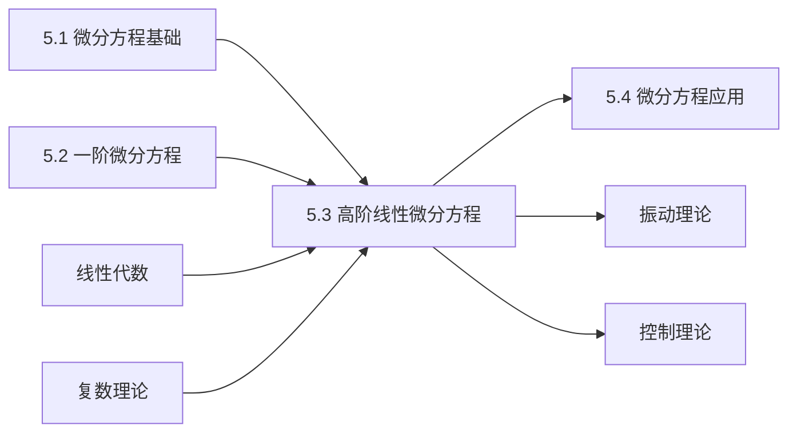

# 5.3 高阶线性微分方程

---

## 章节概览

### 学习目标
1. **理论掌握**：深刻理解高阶线性微分方程的基本理论和解的结构
2. **方法熟练**：熟练掌握常系数齐次和非齐次线性微分方程的求解方法
3. **技巧运用**：能够灵活运用特征方程法、待定系数法、常数变易法
4. **应用能力**：掌握微分算子方法和欧拉方程的求解技巧
5. **综合分析**：能够分析解的性质，解决复杂的高阶线性微分方程问题

### 重点难点

> **重点内容**
> - 二阶线性微分方程解的结构理论
> - 常系数齐次线性微分方程的特征方程法
> - 常系数非齐次线性微分方程的待定系数法
> - 常数变易法的理论与应用
> - 欧拉方程的求解方法

> **难点内容**
> - 特征方程重根情况的处理
> - 复特征根的实函数表示
> - 非齐次项形式与特解设法的对应关系
> - 常数变易法中朗斯基行列式的计算
> - 高阶方程降阶技巧的灵活运用

### 知识架构

```
高阶线性微分方程
├── 基本理论
│   ├── 解的结构定理
│   ├── 线性相关性理论
│   ├── 朗斯基行列式
│   └── 边值问题理论
├── 常系数齐次方程
│   ├── 特征方程法
│   ├── 实根情况
│   ├── 复根情况
│   └── 重根情况
├── 常系数非齐次方程
│   ├── 解的结构
│   ├── 待定系数法
│   ├── 常数变易法
│   └── 微分算子法
├── 特殊类型方程
│   ├── 欧拉方程
│   ├── 可降阶方程
│   └── 变系数方程
└── 应用与综合
    ├── 振动问题
    ├── 电路分析
    └── 数值方法简介
```

### 与其他章节的联系



---

## 目录

1. [二阶线性微分方程的基本理论](#1-二阶线性微分方程的基本理论)
2. [常系数齐次线性微分方程](#2-常系数齐次线性微分方程)
3. [常系数非齐次线性微分方程](#3-常系数非齐次线性微分方程)
4. [欧拉方程](#4-欧拉方程)
5. [高阶微分方程的降阶方法](#5-高阶微分方程的降阶方法)
6. [微分算子方法](#6-微分算子方法)
7. [本章知识点总结](#7-本章知识点总结)

---

## 1. 二阶线性微分方程的基本理论

### 1.1 二阶线性微分方程的标准形式

> **定义1.1（二阶线性微分方程）**
> 
> 形如 $y'' + P(x)y' + Q(x)y = f(x)$ 的微分方程称为**二阶线性微分方程**。

**分类**：
- **齐次方程**： $y'' + P(x)y' + Q(x)y = 0$ （ $f(x) = 0$）
- **非齐次方程**： $y'' + P(x)y' + Q(x)y = f(x)$ （ $f(x) \neq 0$）

**一般的n阶线性微分方程**：
$$y^{(n)} + a_{n-1}(x)y^{(n-1)} + \cdots + a_1(x)y' + a_0(x)y = f(x)$$

### 1.2 齐次线性方程解的性质

> **定理1.1（叠加原理）**
> 
> 若 $y_1(x)$ 和 $y_2(x)$ 是齐次线性方程  $y'' + P(x)y' + Q(x)y = 0$ 的解，则
> $$y = C_1y_1(x) + C_2y_2(x)$$
> 也是该方程的解，其中 $C_1, C_2$ 为任意常数。

**证明要点**：利用导数的线性性和方程的线性性。

### 1.3 解的线性相关性与朗斯基行列式

> **定义1.2（朗斯基行列式）**
> 
> 设  $y_1(x), y_2(x)$ 是两个函数，称
> $$W(y_1, y_2) = \begin{vmatrix}
> y_1 & y_2 \\
> y_1' & y_2'
> \end{vmatrix} = y_1y_2' - y_1'y_2$$
> 为这两个函数的**朗斯基行列式**（Wronskian determinant）。

> **定理1.2（线性无关的判定）**
> 
> 设  $y_1(x), y_2(x)$ 是齐次线性方程的两个解：
> 1. 若在某点 $x_0$ 处 $W(y_1, y_2)(x_0) \neq 0$，则 $y_1, y_2$ 线性无关
> 2. 若 $y_1, y_2$ 线性无关，则在方程有解的区间内 $W(y_1, y_2) \neq 0$
> 3. 若 $y_1, y_2$ 线性相关，则 $W(y_1, y_2) \equiv 0$

> **定理1.3（齐次方程通解结构）**
> 
> 设  $y_1(x), y_2(x)$ 是二阶齐次线性方程的两个线性无关解，则该方程的通解为：
> $$y = C_1y_1(x) + C_2y_2(x)$$
> 其中 $C_1, C_2$ 为任意常数。 $\{y_1, y_2\}$ 称为该方程的**基本解组**。

> **例题1.1**：验证 $y_1 = e^x$, $y_2 = e^{2x}$ 是否为方程  $y'' - 3y' + 2y = 0$ 的基本解组。

**解答**：
1. **验证解**：
   - 对于 $y_1 = e^x$： $y_1' = e^x$, $y_1'' = e^x$
     代入方程： $e^x - 3e^x + 2e^x = 0$ ✓
   
   - 对于 $y_2 = e^{2x}$： $y_2' = 2e^{2x}$, $y_2'' = 4e^{2x}$
     代入方程： $4e^{2x} - 3 \cdot 2e^{2x} + 2e^{2x} = 4e^{2x} - 6e^{2x} + 2e^{2x} = 0$ ✓

2. **验证线性无关性**：
   $$W(y_1, y_2) = \begin{vmatrix}
   e^x & e^{2x} \\
   e^x & 2e^{2x}
   \end{vmatrix} = e^x \cdot 2e^{2x} - e^x \cdot e^{2x} = 2e^{3x} - e^{3x} = e^{3x} \neq 0$$

因此 $\{e^x, e^{2x}\}$ 是该方程的基本解组，通解为 $y = C_1e^x + C_2e^{2x}$。

### 1.4 非齐次线性方程解的结构

> **定理1.4（非齐次方程解的结构）**
> 
> 设  $y^*$ 是非齐次方程  $y'' + P(x)y' + Q(x)y = f(x)$ 的一个特解， $Y$ 是对应齐次方程的通解，则非齐次方程的通解为：
> $$y = Y + y^* = C_1y_1 + C_2y_2 + y^*$$

**几何解释**：非齐次方程的通解是齐次方程通解（积分曲线族）沿特解方向的平移。

---

## 2. 常系数齐次线性微分方程

### 2.1 二阶常系数齐次线性方程

> **标准形式**： $y'' + py' + qy = 0$
> 
> 其中 $p, q$ 为常数。

### 2.2 特征方程法

> **方法原理**：
> 
> 设方程的解为 $y = e^{rx}$，代入原方程得到**特征方程**：
> $$r^2 + pr + q = 0$$

**求解步骤**：
1. 写出特征方程
2. 求特征根
3. 根据特征根的性质写出通解

### 2.3 根据特征根类型确定通解

#### （1）两个不相等的实根： $r_1 \neq r_2$

> **通解**： $y = C_1e^{r_1x} + C_2e^{r_2x}$

> **例题2.1**：求解 $y'' - 5y' + 6y = 0$

**解答**：
特征方程： $r^2 - 5r + 6 = 0$
解得： $(r - 2)(r - 3) = 0$，即 $r_1 = 2, r_2 = 3$

**通解**： $y = C_1e^{2x} + C_2e^{3x}$

#### （2）两个相等的实根： $r_1 = r_2 = r$

> **通解**： $y = (C_1 + C_2x)e^{rx}$

**推导要点**：当特征方程有重根时，需要寻找第二个线性无关解。可以证明 $xe^{rx}$ 也是方程的解。

> **例题2.2**：求解 $y'' - 4y' + 4y = 0$

**解答**：
特征方程： $r^2 - 4r + 4 = 0$
解得： $(r - 2)^2 = 0$，即 $r_1 = r_2 = 2$ （二重根）

**通解**： $y = (C_1 + C_2x)e^{2x}$

#### （3）一对共轭复根： $r_{1,2} = \alpha \pm \beta i$

> **通解**： $y = e^{\alpha x}(C_1\cos\beta x + C_2\sin\beta x)$

**推导过程**：
- 复数解： $y_1 = e^{(\alpha + \beta i)x}$, $y_2 = e^{(\alpha - \beta i)x}$
- 利用欧拉公式： $e^{i\beta x} = \cos\beta x + i\sin\beta x$
- 取实部和虚部得到实函数解

> **例题2.3**：求解 $y'' - 2y' + 5y = 0$

**解答**：
特征方程： $r^2 - 2r + 5 = 0$

使用求根公式：
$$r = \frac{2 \pm \sqrt{4 - 20}}{2} = \frac{2 \pm \sqrt{-16}}{2} = \frac{2 \pm 4i}{2} = 1 \pm 2i$$

即 $\alpha = 1, \beta = 2$

**通解**： $y = e^x(C_1\cos 2x + C_2\sin 2x)$

### 2.4 高阶常系数齐次方程

> **n阶常系数齐次方程**：
> $$y^{(n)} + a_{n-1}y^{(n-1)} + \cdots + a_1y' + a_0y = 0$$

**特征方程**： $r^n + a_{n-1}r^{n-1} + \cdots + a_1r + a_0 = 0$

**通解构造规则**：
1. **单实根 $r$ **：对应解 $e^{rx}$
2. **k重实根 $r$ **：对应解 $e^{rx}, xe^{rx}, x^2e^{rx}, \ldots, x^{k-1}e^{rx}$
3. **单复根 $\alpha \pm \beta i$ **：对应解 $e^{\alpha x}\cos\beta x, e^{\alpha x}\sin\beta x$
4. **k重复根 $\alpha \pm \beta i$ **：对应解 $x^je^{\alpha x}\cos\beta x, x^je^{\alpha x}\sin\beta x$ ($j = 0,1,\ldots,k-1$)

> **例题2.4**：求解 $y''' - 6y'' + 11y' - 6y = 0$

**解答**：
特征方程： $r^3 - 6r^2 + 11r - 6 = 0$

分解因式： $(r - 1)(r - 2)(r - 3) = 0$
特征根： $r_1 = 1, r_2 = 2, r_3 = 3$ （三个不同实根）

**通解**： $y = C_1e^x + C_2e^{2x} + C_3e^{3x}$

---

## 3. 常系数非齐次线性微分方程

### 3.1 解的结构

> **二阶常系数非齐次方程**： $y'' + py' + qy = f(x)$

**通解结构**： $y = y_h + y^*$
- $y_h$：对应齐次方程的通解
- $y^*$：非齐次方程的一个特解

### 3.2 待定系数法

当非齐次项 $f(x)$ 具有特殊形式时，可以根据 $f(x)$ 的形式设定特解的形式。

#### （1） $f(x) = P_n(x)e^{ax}$ 型

其中 $P_n(x)$ 是 $n$ 次多项式。

> **特解设法**：
> - 若 $a$ 不是特征根： $y^* = Q_n(x)e^{ax}$
> - 若 $a$ 是特征方程的单根： $y^* = xQ_n(x)e^{ax}$
> - 若 $a$ 是特征方程的重根： $y^* = x^2Q_n(x)e^{ax}$
> 
> 其中 $Q_n(x)$ 是待定的 $n$ 次多项式。

> **例题3.1**：求解 $y'' - 3y' + 2y = 2x + 1$

**解答**：
1. **求齐次方程通解**：
   特征方程： $r^2 - 3r + 2 = 0$，解得 $r_1 = 1, r_2 = 2$
   齐次通解： $y_h = C_1e^x + C_2e^{2x}$

2. **求特解**：
   $f(x) = 2x + 1 = (2x + 1)e^{0 \cdot x}$，这里 $a = 0, P_1(x) = 2x + 1$
   
   由于 $a = 0$ 不是特征根，设  $y^* = ax + b$
   
   $y^{*'} = a$, $y^{*''} = 0$
   
   代入原方程： $0 - 3a + 2(ax + b) = 2x + 1$
   即： $2ax + (2b - 3a) = 2x + 1$
   
   比较系数： $\begin{cases} 2a = 2 \\ 2b - 3a = 1 \end{cases}$
   
   解得： $a = 1, b = 2$
   
   **特解**： $y^* = x + 2$

3. **通解**： $y = C_1e^x + C_2e^{2x} + x + 2$

> **例题3.2**：求解 $y'' - 3y' + 2y = e^x$

**解答**：
1. **齐次通解**： $y_h = C_1e^x + C_2e^{2x}$ （同上）

2. **求特解**：
   $f(x) = e^x$，这里 $a = 1$ 是特征方程的单根
   
   设  $y^* = Axe^x$
   
   $y^{*'} = Ae^x + Axe^x = A(1 + x)e^x$
   $y^{*''} = A(1 + x)e^x + Ae^x = A(2 + x)e^x$
   
   代入原方程：
   $A(2 + x)e^x - 3A(1 + x)e^x + 2Axe^x = e^x$
   
   化简： $A(2 + x - 3 - 3x + 2x)e^x = e^x$
   即： $A(2 + x - 3 - 3x + 2x)e^x = A(-1)e^x = e^x$
   
   所以 $A = -1$
   
   **特解**： $y^* = -xe^x$

3. **通解**： $y = C_1e^x + C_2e^{2x} - xe^x$

#### （2） $f(x) = e^{ax}[P_n(x)\cos bx + Q_m(x)\sin bx]$ 型

> **特解设法**：
> - 若 $a + bi$ 不是特征根： $y^* = e^{ax}[R_l(x)\cos bx + S_l(x)\sin bx]$
> - 若 $a + bi$ 是特征根： $y^* = xe^{ax}[R_l(x)\cos bx + S_l(x)\sin bx]$
> 
> 其中 $l = \max\{n, m\}$，$R_l(x), S_l(x)$ 是待定的 $l$ 次多项式。

> **例题3.3**：求解 $y'' + y = \cos x$

**解答**：
1. **齐次通解**：
   特征方程： $r^2 + 1 = 0$，解得 $r = \pm i$
   齐次通解： $y_h = C_1\cos x + C_2\sin x$

2. **求特解**：
   $f(x) = \cos x = e^{0 \cdot x}[\cos x + 0 \cdot \sin x]$
   
   这里 $a = 0, b = 1$，$a + bi = i$ 是特征根
   
   设  $y^* = x(A\cos x + B\sin x)$
   
   计算导数（较复杂，这里直接给出结果）：
   通过计算可得 $A = 0, B = \frac{1}{2}$
   
   **特解**： $y^* = \frac{1}{2}x\sin x$

3. **通解**： $y = C_1\cos x + C_2\sin x + \frac{1}{2}x\sin x$

### 3.3 常数变易法

当非齐次项不能用待定系数法处理时，使用常数变易法。

> **方法步骤**（以二阶方程为例）：
> 
> 1. **求齐次通解**： $y_h = C_1y_1 + C_2y_2$
> 2. **设非齐次解**： $y = C_1(x)y_1 + C_2(x)y_2$
> 3. **建立方程组**：
>    $$\begin{cases}
>    C_1'y_1 + C_2'y_2 = 0 \\
>    C_1'y_1' + C_2'y_2' = f(x)
>    \end{cases}$$
> 4. **解方程组**：
>    $$C_1' = -\frac{y_2f(x)}{W}, \quad C_2' = \frac{y_1f(x)}{W}$$
>    其中 $W = y_1y_2' - y_1'y_2$ 是朗斯基行列式
> 5. **积分求解**： $C_1(x) = \int C_1'dx$, $C_2(x) = \int C_2'dx$

> **例题3.4**：求解 $y'' + y = \tan x$

**解答**：
1. **齐次通解**： $y_h = C_1\cos x + C_2\sin x$
   这里 $y_1 = \cos x, y_2 = \sin x$

2. **计算朗斯基行列式**：
   $$W = \begin{vmatrix}
   \cos x & \sin x \\
   -\sin x & \cos x
   \end{vmatrix} = \cos^2 x + \sin^2 x = 1$$

3. **建立方程组并求解**：
   $$C_1' = -\frac{\sin x \cdot \tan x}{1} = -\sin x \tan x = -\frac{\sin^2 x}{\cos x}$$
   $$C_2' = \frac{\cos x \cdot \tan x}{1} = \cos x \tan x = \sin x$$

4. **积分**：
   $$C_1(x) = \int -\frac{\sin^2 x}{\cos x}dx = \int -\frac{1-\cos^2 x}{\cos x}dx$$
   $$= \int \left(-\frac{1}{\cos x} + \cos x\right)dx = -\ln|\sec x + \tan x| + \sin x$$
   
   $$C_2(x) = \int \sin x dx = -\cos x$$

5. **特解**：
   $$y^* = (-\ln|\sec x + \tan x| + \sin x)\cos x + (-\cos x)\sin x$$
   $$= -\cos x \ln|\sec x + \tan x| + \sin x \cos x - \cos x \sin x$$
   $$= -\cos x \ln|\sec x + \tan x|$$

6. **通解**： $y = C_1\cos x + C_2\sin x - \cos x \ln|\sec x + \tan x|$

---

## 4. 欧拉方程

### 4.1 欧拉方程的定义

> **定义4.1（欧拉方程）**
> 
> 形如 $x^2y'' + pxy' + qy = f(x)$ 的微分方程称为**欧拉方程**（或等维方程）。

**一般形式**：
$$x^ny^{(n)} + a_{n-1}x^{n-1}y^{(n-1)} + \cdots + a_1xy' + a_0y = f(x)$$

### 4.2 齐次欧拉方程的求解

> **求解方法**：作变量替换 $x = e^t$ （或 $t = \ln x$）

**变换关系**：
- $\frac{dy}{dx} = \frac{dy}{dt} \cdot \frac{dt}{dx} = \frac{1}{x}\frac{dy}{dt}$
- $\frac{d^2y}{dx^2} = \frac{1}{x^2}\left(\frac{d^2y}{dt^2} - \frac{dy}{dt}\right)$

> **例题4.1**：求解 $x^2y'' - xy' + y = 0$

**解答**：
1. **变量替换**： $x = e^t$，则：
   $$x^2\frac{d^2y}{dx^2} - x\frac{dy}{dx} + y = 0$$
   
   变为：
   $$\frac{d^2y}{dt^2} - \frac{dy}{dt} - \frac{dy}{dt} + y = 0$$
   即： $$\frac{d^2y}{dt^2} - 2\frac{dy}{dt} + y = 0$$

2. **求解常系数方程**：
   特征方程： $r^2 - 2r + 1 = 0$，得 $(r-1)^2 = 0$，即 $r = 1$ （二重根）
   
   **解**： $y = (C_1 + C_2t)e^t$

3. **回代变量**：
   $t = \ln x$，所以：
   $$y = (C_1 + C_2\ln x)e^{\ln x} = (C_1 + C_2\ln x)x$$

**通解**： $y = x(C_1 + C_2\ln x)$

### 4.3 直接求解法

对于欧拉方程，也可以直接设  $y = x^r$ 求解。

设  $y = x^r$，则：
- $y' = rx^{r-1}$
- $y'' = r(r-1)x^{r-2}$

代入二阶欧拉方程  $x^2y'' + pxy' + qy = 0$：
$$x^2 \cdot r(r-1)x^{r-2} + px \cdot rx^{r-1} + qx^r = 0$$
$$r(r-1)x^r + prx^r + qx^r = 0$$
$$[r(r-1) + pr + q]x^r = 0$$

得到**特征方程**： $r^2 + (p-1)r + q = 0$

根据特征根的情况确定通解形式（类似于常系数方程）。

---

## 5. 高阶微分方程的降阶方法

### 5.1 缺某些变量的方程

#### （1）不显含 $y$ 的方程： $F(x, y', y'', \ldots, y^{(n)}) = 0$

> **降阶方法**：设  $p = y'$，方程变为 $(n-1)$ 阶方程：
> $$F(x, p, p', \ldots, p^{(n-1)}) = 0$$

#### （2）不显含 $x$ 的方程： $F(y, y', y'', \ldots, y^{(n)}) = 0$

> **降阶方法**：设  $p = y'$，利用 $\frac{dp}{dx} = \frac{dp}{dy} \cdot \frac{dy}{dx} = p\frac{dp}{dy}$

> **例题5.1**：求解 $yy'' = (y')^2$

**解答**：
设  $p = y'$，则 $y'' = \frac{dp}{dx} = \frac{dp}{dy} \cdot \frac{dy}{dx} = p\frac{dp}{dy}$

原方程变为：
$$y \cdot p\frac{dp}{dy} = p^2$$

当 $p \neq 0$ 时，化简得：
$$y\frac{dp}{dy} = p$$

分离变量：
$$\frac{dp}{p} = \frac{dy}{y}$$

积分：
$$\ln|p| = \ln|y| + \ln|C_1|$$
$$p = C_1y$$

即 $y' = C_1y$，这是一阶线性方程：
$$\frac{dy}{dx} = C_1y$$

解得： $y = C_2e^{C_1x}$

当 $p = 0$ 时， $y' = 0$，所以 $y = $ 常数也是解。

**通解**： $y = C_2e^{C_1x}$ （包含常数解）

### 5.2 可降阶的特殊二阶方程

#### （1） $y'' = f(x)$ 型

直接二次积分：
$$y' = \int f(x)dx + C_1$$
$$y = \int\left[\int f(x)dx + C_1\right]dx + C_2$$

#### （2） $y'' = f(x, y')$ 型

设  $p = y'$，得一阶方程  $p' = f(x, p)$。

#### （3） $y'' = f(y, y')$ 型

设  $p = y'$，$y'' = p\frac{dp}{dy}$，得一阶方程  $p\frac{dp}{dy} = f(y, p)$。

---

## 6. 微分算子方法

### 6.1 微分算子的定义

> **定义6.1（微分算子）**
> 
> 记 $D = \frac{d}{dx}$，称为**微分算子**。
> 
> - $Dy = y'$
> - $D^2y = y''$
> - $D^ny = y^{(n)}$

**算子多项式**：
$$L(D) = D^n + a_{n-1}D^{n-1} + \cdots + a_1D + a_0$$

则线性微分方程可写成： $L(D)y = f(x)$

### 6.2 算子方法求解非齐次方程

> **算子解法**：
> $$y = \frac{1}{L(D)}f(x)$$

对于某些特殊的 $f(x)$，有简便的求解公式：

#### （1） $f(x) = e^{ax}$ 型

$$\frac{1}{L(D)}e^{ax} = \frac{1}{L(a)}e^{ax} \quad (\text{当 } L(a) \neq 0)$$

#### （2） $f(x) = \sin ax$ 或 $f(x) = \cos ax$ 型

$$\frac{1}{L(D)}\sin ax = \frac{1}{L(ia)}\sin ax$$
$$\frac{1}{L(D)}\cos ax = \frac{1}{L(ia)}\cos ax$$

其中将结果的虚部对应 $\sin ax$，实部对应 $\cos ax$。

> **例题6.1**：用算子方法求解 $y'' + y = e^{2x}$

**解答**：
$$L(D) = D^2 + 1$$
$$y = \frac{1}{D^2 + 1}e^{2x} = \frac{1}{4 + 1}e^{2x} = \frac{1}{5}e^{2x}$$

加上齐次通解： $y = C_1\cos x + C_2\sin x + \frac{1}{5}e^{2x}$

---

## 7. 本章知识点总结

### 7.1 高阶线性微分方程求解方法总结

| 方程类型 | 标准形式 | 求解方法 | 关键步骤 |
|:---------|:---------|:---------|:---------|
| 常系数齐次 | $y^{(n)} + a_{n-1}y^{(n-1)} + \cdots + a_0y = 0$ | 特征方程法 | 解特征方程，根据根的类型写通解 |
| 常系数非齐次 | $y^{(n)} + a_{n-1}y^{(n-1)} + \cdots + a_0y = f(x)$ | 待定系数法/常数变易法 | 求齐次通解+特解 |
| 欧拉方程 | $x^ny^{(n)} + \cdots + a_0y = f(x)$ | 变量替换 | $x = e^t$ 或直接设  $y = x^r$ |
| 可降阶方程 | 缺某些变量 | 降阶法 | 适当变量替换降低阶数 |

### 7.2 特征根与通解的对应关系

| 特征根类型 | 对应的通解项 |
|:-----------|:-------------|
| 单实根 $r$ | $Ce^{rx}$ |
| $k$ 重实根 $r$ | $(C_1 + C_2x + \cdots + C_kx^{k-1})e^{rx}$ |
| 单复根 $\alpha \pm \beta i$ | $e^{\alpha x}(C_1\cos\beta x + C_2\sin\beta x)$ |
| $k$ 重复根 $\alpha \pm \beta i$ | $e^{\alpha x}[(C_1 + C_2x + \cdots)cos\beta x + (D_1 + D_2x + \cdots)\sin\beta x]$ |

### 7.3 待定系数法设解表

| $f(x)$ 的形式 | 特解 $y^*$ 的设法 |
|:--------------|:------------------|
| $P_n(x)e^{ax}$ | $x^kQ_n(x)e^{ax}$ |
| $P_n(x)e^{ax}\cos bx$ | $x^ke^{ax}[Q_n(x)\cos bx + R_n(x)\sin bx]$ |
| $P_n(x)e^{ax}\sin bx$ | $x^ke^{ax}[Q_n(x)\cos bx + R_n(x)\sin bx]$ |

其中 $k$ 是 $a$ （或 $a+bi$）作为特征根的重数， $Q_n(x), R_n(x)$ 是待定的 $n$ 次多项式。

### 7.4 常见错误与注意事项

> **常见错误**：
> 
> 1. 特征方程求根错误
> 2. 重根情况下通解形式错误
> 3. 复根对应的实函数解写错
> 4. 待定系数法中特解设法错误
> 5. 常数变易法中朗斯基行列式计算错误

> **注意事项**：
> 
> 1. 准确判断特征根的类型和重数
> 2. 复根必须写成实函数形式
> 3. 待定系数法要考虑特征根与非齐次项系数的关系
> 4. 验证解的正确性
> 5. 注意定义域和解的性质

### 7.5 解题策略

1. **类型识别**：
   - 首先判断是否为线性方程
   - 确定系数是否为常数
   - 识别齐次性和特殊结构

2. **方法选择**：
   - 常系数：特征方程法
   - 变系数：可能降阶或特殊变换
   - 非齐次：待定系数法优先，复杂时用常数变易法

3. **计算技巧**：
   - 特征方程的因式分解
   - 复数运算和欧拉公式应用
   - 积分技巧的熟练运用

4. **结果验证**：
   - 代入原方程检验
   - 检查解的连续性和可微性
   - 初值问题的常数确定

这一章的内容为微分方程的实际应用奠定了重要基础，特别是在振动、电路、控制等工程领域有广泛应用。 