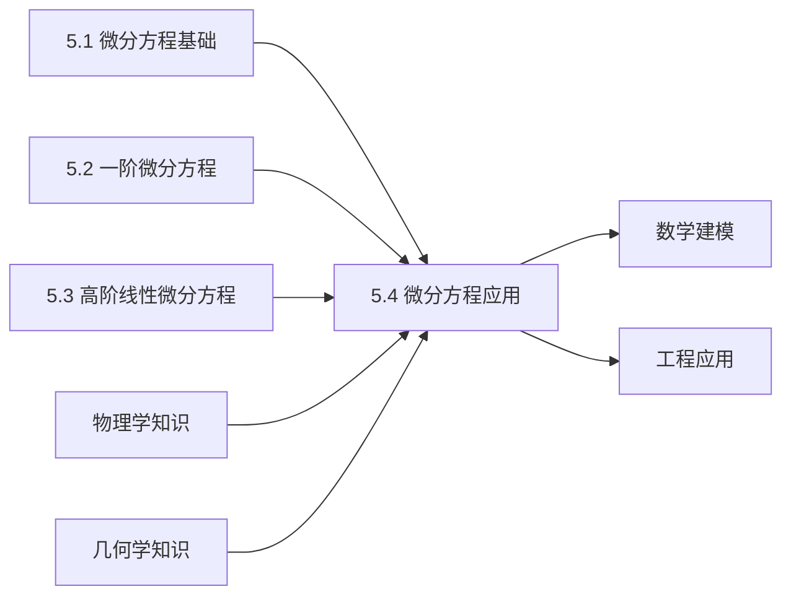

# 5.4 微分方程的应用

---

## 章节概览

### 学习目标
1. **建模能力**：能够将实际问题转化为微分方程模型
2. **方法应用**：熟练运用前面学过的求解方法解决实际问题
3. **几何理解**：掌握微分方程在几何问题中的应用（如正交轨线）
4. **物理应用**：理解微分方程在力学、电学等物理问题中的应用
5. **综合分析**：能够对解的物理意义进行分析和解释

### 重点难点

> **重点内容**
> - 实际问题的微分方程建模过程
> - 正交轨线问题
> - 简单的增长与衰减模型
> - 振动问题的微分方程描述
> - 电路问题中的微分方程

> **难点内容**
> - 从实际问题中提取数学关系建立微分方程
> - 复杂的几何问题的分析
> - 物理意义的理解和解释
> - 边界条件和初始条件的确定
> - 解的实际意义分析

### 知识架构

```
微分方程的应用
├── 几何应用
│   ├── 正交轨线问题
│   ├── 等角轨线问题
│   └── 曲线族问题
├── 物理应用
│   ├── 力学问题
│   │   ├── 自由落体
│   │   ├── 简谐振动
│   │   └── 阻尼振动
│   ├── 热传导问题
│   └── 电路问题
├── 生物与经济应用
│   ├── 人口增长模型
│   ├── 生物繁殖模型
│   └── 经济增长模型
└── 综合应用技巧
    ├── 建模方法
    ├── 求解策略
    └── 结果分析
```

### 与其他章节的联系




---

## 目录

1. [微分方程应用的一般方法](#1-微分方程应用的一般方法)
2. [几何问题中的应用](#2-几何问题中的应用)
3. [物理问题中的应用](#3-物理问题中的应用)
4. [增长与衰减模型](#4-增长与衰减模型)
5. [振动问题](#5-振动问题)
6. [综合应用实例](#6-综合应用实例)
7. [本章知识点总结](#7-本章知识点总结)

---

## 1. 微分方程应用的一般方法

### 1.1 建立微分方程的基本步骤

> **建模步骤**：
> 
> 1. **理解问题**：明确已知条件和要求结果
> 2. **引入变量**：选择合适的自变量和因变量
> 3. **建立关系**：根据问题的物理、几何或其他规律建立微分方程
> 4. **确定条件**：确定初始条件或边界条件
> 5. **求解方程**：选择合适的方法求解微分方程
> 6. **解释结果**：对解的实际意义进行分析和验证

### 1.2 常见的建模思路

#### （1）变化率关系
当问题涉及某量的变化率与该量本身或其他量的关系时，通常可以建立微分方程。

#### （2）几何关系
利用几何性质（如切线、法线、曲率等）建立微分方程。

#### （3）物理定律
根据物理定律（如牛顿定律、胡克定律、冷却定律等）建立微分方程。

#### （4）平衡条件
某些问题可以通过考虑系统的平衡或守恒条件来建立微分方程。

---

## 2. 几何问题中的应用

### 2.1 正交轨线问题

> **定义2.1（正交轨线）**
> 
> 设有曲线族 $\Phi(x, y, C) = 0$，如果另一曲线族的每一条曲线都与原曲线族的每一条曲线正交相交，则称这个新曲线族为原曲线族的**正交轨线族**。

**求解方法**：

1. 由曲线族方程  $\Phi(x, y, C) = 0$ 消去参数 $C$，得到微分方程  $F(x, y, y') = 0$
2. 用 $-\frac{1}{y'}$ 替换 $y'$，得到正交轨线族的微分方程
3. 求解新的微分方程得到正交轨线族

> **例题2.1**：求曲线族 $x^2 + y^2 = C^2$ 的正交轨线。

**解答**：
1. **求原曲线族的微分方程**：
   $x^2 + y^2 = C^2$ 两边对 $x$ 求导：
   $$2x + 2yy' = 0$$
   $$y' = -\frac{x}{y}$$

2. **建立正交轨线的微分方程**：
   用 $-\frac{1}{y'}$ 替换 $y'$：
   $$-\frac{1}{y'} = -\frac{x}{y}$$
   $$y' = \frac{y}{x}$$

3. **求解正交轨线方程**：
   这是齐次方程，设  $v = \frac{y}{x}$，则 $y = vx$， $y' = v + xv'$
   
   代入： $v + xv' = v$，即 $xv' = 0$，所以 $v' = 0$，$v = C_1$
   
   因此 $\frac{y}{x} = C_1$，即 $y = C_1x$

**正交轨线族**： $y = kx$ （一族通过原点的直线）

**几何解释**：同心圆的正交轨线是通过圆心的直线。

> **例题2.2**：求曲线族 $y = Ce^x$ 的正交轨线。

**解答**：
1. **求原曲线族的微分方程**：
   $y = Ce^x$，求导： $y' = Ce^x = y$

2. **建立正交轨线的微分方程**：
   $$y' = -\frac{1}{y}$$

3. **求解**：
   分离变量： $y dy = -dx$
   
   积分： $\frac{y^2}{2} = -x + C_1$
   
   **正交轨线族**： $y^2 + 2x = C$ （一族抛物线）

### 2.2 等角轨线问题

> **定义2.2（等角轨线）**
> 
> 如果一条曲线与给定曲线族的每一条曲线都以相同的角度 $\alpha$ 相交，则称此曲线为该曲线族的**等角轨线**。

**求解方法**：设原曲线族的微分方程为 $y' = f(x, y)$，则等角轨线的微分方程为：
$$y' = \frac{f(x, y) + \tan\alpha}{1 - f(x, y)\tan\alpha}$$

### 2.3 包络线问题

对于含参数的曲线族，其包络线可以通过消去参数得到。这类问题也常用微分方程方法求解。

---

## 3. 物理问题中的应用

### 3.1 力学问题

#### （1）自由落体运动

考虑空气阻力的自由落体运动：
$$m\frac{dv}{dt} = mg - kv$$

其中 $m$ 是质量， $g$ 是重力加速度， $k$ 是阻力系数。

> **例题3.1**：质量为 $m$ 的物体从静止开始下落，空气阻力与速度成正比，阻力系数为 $k$。求速度 $v(t)$ 和位移 $s(t)$。

**解答**：
1. **建立微分方程**：
   $$m\frac{dv}{dt} = mg - kv$$
   $$\frac{dv}{dt} + \frac{k}{m}v = g$$

2. **求解速度**：
   这是一阶线性方程， $P(t) = \frac{k}{m}$， $Q(t) = g$
   
   通解公式：
   $$v(t) = e^{-\frac{k}{m}t}\left[\int g \cdot e^{\frac{k}{m}t}dt + C\right]$$
   $$= e^{-\frac{k}{m}t}\left[\frac{mg}{k}e^{\frac{k}{m}t} + C\right]$$
   $$= \frac{mg}{k} + Ce^{-\frac{k}{m}t}$$

3. **利用初始条件**：
   $v(0) = 0$，所以 $0 = \frac{mg}{k} + C$，得 $C = -\frac{mg}{k}$
   
   $$v(t) = \frac{mg}{k}(1 - e^{-\frac{k}{m}t})$$

4. **求位移**：
   $$s(t) = \int_0^t v(\tau)d\tau = \int_0^t \frac{mg}{k}(1 - e^{-\frac{k}{m}\tau})d\tau$$
   $$= \frac{mg}{k}\left[t + \frac{m}{k}e^{-\frac{k}{m}t} - \frac{m}{k}\right]$$
   $$= \frac{mg}{k}t - \frac{m^2g}{k^2}(1 - e^{-\frac{k}{m}t})$$

**物理意义**：
- 当 $t \to \infty$ 时， $v \to \frac{mg}{k}$ （终端速度）
- 位移随时间线性增长（在达到终端速度后）

#### （2）简谐振动

无阻尼弹簧振子：
$$m\frac{d^2x}{dt^2} + kx = 0$$

其中 $m$ 是质量， $k$ 是弹簧常数。

> **例题3.2**：质量为 $m$ 的物体连接在弹簧上，弹簧常数为 $k$。初始时刻物体位于平衡位置下方 $a$ 处且速度为零。求位移 $x(t)$。

**解答**：
1. **微分方程**：
   $$\frac{d^2x}{dt^2} + \frac{k}{m}x = 0$$

2. **特征方程**：
   $r^2 + \frac{k}{m} = 0$，得 $r = \pm i\sqrt{\frac{k}{m}}$

3. **通解**：
   $$x(t) = C_1\cos\left(\sqrt{\frac{k}{m}}t\right) + C_2\sin\left(\sqrt{\frac{k}{m}}t\right)$$

4. **初始条件**：
   - $x(0) = a$： $C_1 = a$
   - $x'(0) = 0$： $C_2\sqrt{\frac{k}{m}} = 0$，所以 $C_2 = 0$

5. **特解**：
   $$x(t) = a\cos\left(\sqrt{\frac{k}{m}}t\right)$$

**物理意义**：物体做简谐振动，振幅为 $a$，角频率为 $\omega = \sqrt{\frac{k}{m}}$。

### 3.2 电路问题

#### RLC串联电路

根据基尔霍夫电压定律：
$$L\frac{di}{dt} + Ri + \frac{q}{C} = E(t)$$

其中 $i = \frac{dq}{dt}$，所以：
$$L\frac{d^2q}{dt^2} + R\frac{dq}{dt} + \frac{q}{C} = E(t)$$

> **例题3.3**：RC串联电路， $R = 100\Omega$， $C = 10^{-4}F$，初始电荷 $q(0) = 0$，电源电压 $E = 100V$ （常电压）。求电荷 $q(t)$ 和电流 $i(t)$。

**解答**：
1. **微分方程**：
   $$RC\frac{dq}{dt} + q = CE$$
   $$10^{-2}\frac{dq}{dt} + q = 10^{-2}$$
   $$\frac{dq}{dt} + 100q = 1$$

2. **求解**：
   这是一阶线性方程：
   $$q(t) = e^{-100t}\left[\int 1 \cdot e^{100t}dt + C\right]$$
   $$= e^{-100t}\left[\frac{1}{100}e^{100t} + C\right]$$
   $$= \frac{1}{100} + Ce^{-100t}$$

3. **初始条件**：
   $q(0) = 0$，所以 $0 = \frac{1}{100} + C$，得 $C = -\frac{1}{100}$
   
   $$q(t) = \frac{1}{100}(1 - e^{-100t})$$

4. **电流**：
   $$i(t) = \frac{dq}{dt} = \frac{1}{100} \cdot 100e^{-100t} = e^{-100t}$$

**物理意义**：电荷指数趋向稳态值，电流指数衰减。

---

## 4. 增长与衰减模型

### 4.1 指数增长模型

最简单的增长模型：
$$\frac{dy}{dt} = ky$$

其中 $k > 0$ 表示增长率。

**解**： $y(t) = y_0e^{kt}$

**应用**：人口增长、细菌繁殖、放射性衰变等。

### 4.2 Logistic增长模型

考虑环境阻力的增长模型：
$$\frac{dy}{dt} = ky\left(1 - \frac{y}{L}\right)$$

其中 $L$ 是环境容量。

> **例题4.1**：某种细菌在理想条件下每小时增长率为20%，但环境最大容量为1000万个。初始时有10万个细菌。建立并求解Logistic模型。

**解答**：
1. **建立方程**：
   $$\frac{dy}{dt} = 0.2y\left(1 - \frac{y}{1000}\right)$$

2. **分离变量**：
   $$\frac{dy}{y(1000-y)} = \frac{0.2}{1000}dt$$

3. **部分分式分解**：
   $$\frac{1}{y(1000-y)} = \frac{A}{y} + \frac{B}{1000-y}$$
   
   解得： $A = \frac{1}{1000}$， $B = \frac{1}{1000}$
   
   $$\frac{1}{1000}\left(\frac{1}{y} + \frac{1}{1000-y}\right) = \frac{0.2}{1000}dt$$

4. **积分**：
   $$\ln\left|\frac{y}{1000-y}\right| = 0.2t + C$$

5. **利用初始条件**：
   $y(0) = 100$，得 $C = \ln\frac{100}{900} = \ln\frac{1}{9}$
   
   $$\ln\left|\frac{y}{1000-y}\right| = 0.2t + \ln\frac{1}{9}$$
   
   $$\frac{y}{1000-y} = \frac{1}{9}e^{0.2t}$$

6. **解出y**：
   $$y = \frac{1000e^{0.2t}}{9 + e^{0.2t}}$$

**模型特点**：
- 初期近似指数增长
- 后期增长率逐渐减小
- 最终趋于环境容量 $L = 1000$

### 4.3 衰减模型

> **例题4.2**：放射性物质的衰变遵循规律：单位时间内衰变的原子数与当时存在的原子数成正比。已知某放射性元素的半衰期为5天，求任意时刻剩余原子数的表达式。

**解答**：
1. **建立方程**：
   $$\frac{dN}{dt} = -kN$$（ $k > 0$ ）

2. **求解**：
   $$N(t) = N_0e^{-kt}$$

3. **利用半衰期条件**：
   $N(5) = \frac{N_0}{2}$，所以：
   $$\frac{N_0}{2} = N_0e^{-5k}$$
   $$k = \frac{\ln 2}{5}$$

4. **最终解**：
   $$N(t) = N_0e^{-\frac{\ln 2}{5}t} = N_0\left(\frac{1}{2}\right)^{t/5}$$

---

## 5. 振动问题

### 5.1 自由振动（无阻尼）

**方程**： $m\ddot{x} + kx = 0$

**通解**： $x(t) = A\cos(\omega t + \phi)$，其中 $\omega = \sqrt{\frac{k}{m}}$

### 5.2 阻尼振动

**方程**： $m\ddot{x} + c\dot{x} + kx = 0$

根据判别式 $\Delta = c^2 - 4mk$ 的符号：

1. **过阻尼**（ $\Delta > 0$）：两个不同实根，无振动
2. **临界阻尼**（ $\Delta = 0$）：重根，无振动，最快回到平衡
3. **欠阻尼**（ $\Delta < 0$）：复根，衰减振动

> **例题5.1**：质量 $m = 1kg$ 的物体连接弹簧（ $k = 9N/m$）和阻尼器（ $c = 6N·s/m$）。初始位移 $x(0) = 2m$，初始速度 $\dot{x}(0) = 0$。求运动方程。

**解答**：
1. **微分方程**：
   $$\ddot{x} + 6\dot{x} + 9x = 0$$

2. **特征方程**：
   $r^2 + 6r + 9 = 0$，即 $(r + 3)^2 = 0$
   
   特征根： $r = -3$ （二重根）

3. **通解**：
   $$x(t) = (C_1 + C_2t)e^{-3t}$$

4. **初始条件**：
   - $x(0) = 2$： $C_1 = 2$
   - $\dot{x}(0) = 0$： $C_2 - 3C_1 = 0$，所以 $C_2 = 6$

5. **特解**：
   $$x(t) = (2 + 6t)e^{-3t}$$

**物理意义**：临界阻尼情况，物体不振动，指数衰减回到平衡位置。

### 5.3 受迫振动

**方程**： $m\ddot{x} + c\dot{x} + kx = F(t)$

当外力为 $F(t) = F_0\cos\omega t$ 时，会产生共振现象。

---

## 6. 综合应用实例

### 6.1 混合问题

> **例题6.1**：容器中有100L盐水，含盐10kg。现以2L/min的速度注入清水，同时以2L/min的速度排出混合液。求任意时刻容器中的含盐量。

**解答**：
1. **建立微分方程**：
   设  $t$ 时刻含盐量为 $x(t)$ kg
   
   流入速率：0 kg/min（清水）
   流出速率： $\frac{x(t)}{100} \times 2 = \frac{x(t)}{50}$ kg/min
   
   $$\frac{dx}{dt} = 0 - \frac{x}{50} = -\frac{x}{50}$$

2. **求解**：
   $$x(t) = x_0e^{-t/50} = 10e^{-t/50}$$

3. **结果分析**：
   含盐量指数衰减，当 $t \to \infty$ 时， $x \to 0$

### 6.2 追踪问题

> **例题6.2**：一艘船在原点正北100km处，以20km/h的速度向东行驶。同时，另一艘船从原点开始，始终指向第一艘船，速度为25km/h。求第二艘船的轨迹。

**解答**：
1. **建立坐标系**：第一艘船位置 $(20t, 100)$，第二艘船位置 $(x, y)$

2. **速度关系**：
   第二艘船的速度方向指向第一艘船：
   $$\frac{dy/dt}{dx/dt} = \frac{100 - y}{20t - x}$$

3. **速度大小**：
   $$\left(\frac{dx}{dt}\right)^2 + \left(\frac{dy}{dt}\right)^2 = 25^2$$

4. **建立微分方程**：
   设  $y' = \frac{dy}{dx}$，则：
   $$y' = \frac{100 - y}{20t - x}$$
   
   由于 $\frac{dt}{dx} = \frac{dt/ds}{dx/ds} = \frac{1/25}{(dx/dt)/25}$，这是一个复杂的微分方程。

**求解过程较复杂，需要参数方程方法或数值方法。**

---

## 7. 本章知识点总结

### 7.1 应用问题分类

| 问题类型 | 常见微分方程 | 典型应用 |
|:---------|:-------------|:---------|
| 增长衰减 | $\frac{dy}{dt} = ky$ | 人口增长、放射性衰变 |
| Logistic模型 | $\frac{dy}{dt} = ky(1-\frac{y}{L})$ | 有限环境中的增长 |
| 振动问题 | $m\ddot{x} + c\dot{x} + kx = F(t)$ | 弹簧振子、电路振荡 |
| 几何问题 | 各种类型 | 正交轨线、等角轨线 |
| 混合问题 | $\frac{dx}{dt} = $ 流入率 - 流出率 | 化学反应、物质混合 |

### 7.2 建模常用物理定律

1. **牛顿第二定律**： $F = ma$
2. **胡克定律**： $F = -kx$
3. **牛顿冷却定律**： $\frac{dT}{dt} = -k(T - T_0)$
4. **基尔霍夫定律**： $\sum U = 0$
5. **质量守恒**：流入量 - 流出量 = 积累量

### 7.3 求解策略

1. **问题分析**：
   - 明确物理过程或几何关系
   - 识别关键变量和参数
   - 确定已知条件和待求量

2. **建立方程**：
   - 根据物理定律或几何关系建立微分方程
   - 确定初始条件或边界条件
   - 检查方程的合理性

3. **求解验证**：
   - 选择合适的求解方法
   - 验证解的正确性
   - 分析解的物理意义

### 7.4 常见错误与注意事项

> **常见错误**：
> 
> 1. 建模时遗漏重要因素或关系
> 2. 初始条件或边界条件确定错误
> 3. 单位不统一或量纲分析错误
> 4. 忽略解的定义域限制
> 5. 对解的物理意义理解错误

> **注意事项**：
> 
> 1. 仔细分析实际问题的物理背景
> 2. 注意变量的定义和单位
> 3. 合理简化假设，但不能忽略本质
> 4. 验证解的合理性和物理意义
> 5. 注意特殊情况的讨论

### 7.5 解题技巧

1. **几何问题**：
   - 利用切线、法线的几何性质
   - 注意坐标系的选择
   - 正交轨线用斜率倒数相反

2. **物理问题**：
   - 明确力的分析和运动学关系
   - 注意能量守恒和动量守恒
   - 电路问题要用基尔霍夫定律

3. **增长模型**：
   - 区分指数增长和Logistic增长
   - 注意环境容量的概念
   - 理解半衰期的含义

4. **振动问题**：
   - 区分自由振动和受迫振动
   - 理解阻尼对振动的影响
   - 注意共振现象

### 7.6 实际意义分析

求解微分方程后，必须对解进行实际意义分析：

1. **定性分析**：解的趋势、稳定性、周期性等
2. **定量分析**：特征参数的物理意义
3. **极限行为**： $t \to 0$ 和 $t \to \infty$ 时的行为
4. **参数影响**：各参数对解的影响
5. **合理性检验**：解是否符合物理直觉和实际观察

微分方程的应用广泛深入到科学技术的各个领域，掌握建模方法和求解技巧对于解决实际问题具有重要意义。通过这些应用实例，我们可以看到数学理论与实际问题的密切联系，体会到数学的实用价值和美妙之处。

---

## 8. 考研重点强化

### 8.1 必考应用类型

> **考研热点问题**
> 
> 1. **正交轨线问题**：
>    - 曲线族 $F(x,y,c) = 0$ 的正交轨线
>    - 求解步骤：消参 → 求导 → 变倒数 → 求解
>    
> 2. **增长衰减模型**：
>    - 指数增长： $\frac{dy}{dt} = ky$，解为 $y = y_0e^{kt}$
>    - Logistic模型： $\frac{dy}{dt} = ky(1-\frac{y}{L})$
>    
> 3. **几何应用**：
>    - 切线、法线问题
>    - 等角轨线（与坐标轴成定角）
>    
> 4. **物理应用**：
>    - 牛顿冷却定律： $\frac{dT}{dt} = -k(T-T_0)$
>    - 自由落体与阻力： $m\frac{dv}{dt} = mg - kv$

### 8.2 考研题型分析

| 题型 | 分值 | 常见形式 | 重点考查 |
|:-----|:-----|:---------|:---------|
| 选择题 | 4分 | 概念判断、模型识别 | 基本概念理解 |
| 填空题 | 4分 | 简单计算、参数求解 | 基本计算能力 |
| 解答题 | 10-12分 | 综合应用问题 | 建模+求解+分析 |

### 8.3 解题策略总结

> **应用题解题四步法**
> 
> **第一步：理解题意**
> - 明确物理背景或几何关系
> - 识别关键信息和条件
> - 确定自变量和因变量
> 
> **第二步：建立模型**
> - 根据物理定律建立微分方程
> - 确定初始条件或边界条件
> - 检查方程类型和可解性
> 
> **第三步：求解方程**
> - 选择合适的求解方法
> - 仔细进行计算（常是得分关键）
> - 不要忘记利用初始条件
> 
> **第四步：结果分析**
> - 检验解的合理性
> - 分析解的物理意义
> - 必要时作图或数值验证

### 8.4 考研常考错误点

> **易错提醒**
> 
> 1. **建模错误**：
>    - 物理定律应用错误
>    - 坐标系选择不当
>    - 忽略约束条件
> 
> 2. **求解错误**：
>    - 分离变量时遗漏常数
>    - 积分计算错误
>    - 初始条件代入错误
> 
> 3. **结果分析错误**：
>    - 忽略解的定义域
>    - 不验证解的合理性
>    - 单位或量纲错误

### 8.5 备考建议

> **复习重点**
> 
> 1. **熟练掌握基本模型**：
>    - 增长衰减模型的标准形式和解
>    - 正交轨线的求解步骤
>    - 常见物理定律的数学表达
> 
> 2. **强化计算训练**：
>    - 微分方程求解的熟练度
>    - 积分计算的准确性
>    - 参数确定的方法
> 
> 3. **理解物理背景**：
>    - 主要物理定律和原理
>    - 几何问题的基本性质
>    - 实际问题的简化方法

> **学习方法**
> 
> 1. **理论与实践结合**：在掌握理论的基础上多做应用题
> 2. **总结解题模式**：对常见应用类型形成固定的解题套路
> 3. **注重物理直觉**：培养对结果合理性的判断能力
> 4. **练习计算技能**：保证在考试中计算的准确性和速度

### 8.6 典型考研真题类型

> **真题类型示例**
> 
> 1. **2019年数学一**：正交轨线问题
> 2. **2018年数学一**：人口增长模型
> 3. **2017年数学一**：牛顿冷却定律应用
> 4. **2016年数学一**：几何应用（切线问题）
> 
> 这些题目都体现了微分方程应用的核心：**建模能力 + 求解技巧 + 结果分析**

微分方程的应用是考研数学的重要组成部分，既考查理论掌握程度，也考查实际问题的分析和解决能力。通过系统的学习和练习，可以有效提高这部分的得分能力。 