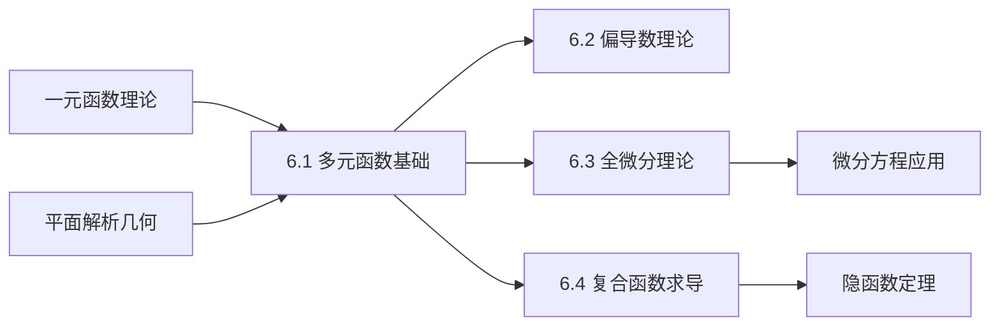

# 6.1 多元函数基础理论

---

## 章节概览

### 学习目标
1. **概念理解**：深刻理解多元函数的基本概念，掌握定义域、值域的确定方法
2. **极限理论**：理解二元函数极限的定义，掌握极限计算的基本方法
3. **连续性质**：掌握多元函数连续性的判定，理解连续性与极限的关系
4. **几何直观**：理解多元函数的几何意义——曲面与等高线
5. **应用准备**：为后续偏导数、全微分等内容打下坚实基础

### 重点难点

> **重点内容**
> - 二元函数的定义域与值域
> - 二元函数的极限概念与计算
> - 二元函数的连续性
> - 多元函数的几何表示
> - 复合函数与隐函数概念

> **难点内容**
> - 二元函数极限的 $\varepsilon-\delta$ 定义
> - 极限不存在的判定方法
> - 连续性在边界点的判定
> - 复杂定义域的确定
> - 三元及以上函数的抽象理解

### 知识架构

```
多元函数基础理论
├── 多元函数概念
│   ├── 二元函数定义
│   ├── 定义域与值域
│   ├── 几何意义
│   └── n元函数推广
├── 多元函数极限
│   ├── 极限定义
│   ├── 极限性质
│   ├── 极限计算方法
│   └── 极限不存在判定
├── 多元函数连续性
│   ├── 连续性定义
│   ├── 连续性判定
│   ├── 连续函数性质
│   └── 一致连续性
└── 特殊函数类型
    ├── 复合函数
    ├── 隐函数
    ├── 分段函数
    └── 参数方程表示
```

### 与其他章节的联系



---

## 目录

1. [多元函数的概念](#1-多元函数的概念)
2. [二元函数的几何意义](#2-二元函数的几何意义)
3. [多元函数的极限](#3-多元函数的极限)
4. [多元函数的连续性](#4-多元函数的连续性)
5. [特殊类型的多元函数](#5-特殊类型的多元函数)
6. [本章知识点总结](#6-本章知识点总结)

---

## 1. 多元函数的概念

### 1.1 多元函数的定义

> **定义1.1（二元函数）**
> 
> 设  $D$ 是平面上的一个点集，如果按照某个确定的法则 $f$，使对于集合 $D$ 中的每一点 $(x,y)$，都有唯一确定的实数 $z$ 与之对应，则称 $f$ 为定义在 $D$ 上的**二元函数**，记作：
> $$z = f(x,y), \quad (x,y) \in D$$

**相关概念**：
- **自变量**： $x, y$
- **因变量**： $z$
- **定义域**： $D$
- **值域**：函数值 $z$ 的取值范围

> **定义1.2（n元函数）**
> 
> 类似地，可以定义 $n$ 元函数：
> $$u = f(x_1, x_2, \ldots, x_n), \quad (x_1, x_2, \ldots, x_n) \in D \subset \mathbb{R}^n$$

### 1.2 定义域的确定

确定多元函数定义域的基本原则与一元函数相同，需要使函数表达式有意义。

**常见情况**：

1. **分母不为零**：分母中的表达式 $\neq 0$
2. **开方被开方数非负**：偶次根式的被开方数 $\geq 0$
3. **对数的真数为正**：对数函数的真数 $> 0$
4. **反三角函数的定义域限制**

> **例题1.1**：求下列函数的定义域：
> 
> (1) $z = \sqrt{x^2 + y^2 - 1}$
> (2) $z = \frac{1}{\sqrt{x^2 + y^2 - 4}}$
> (3) $z = \ln(x - y)$
> (4) $z = \arcsin\left(\frac{x}{y}\right)$

**解答**：

(1) **函数** $z = \sqrt{x^2 + y^2 - 1}$
   
   要求： $x^2 + y^2 - 1 \geq 0$，即 $x^2 + y^2 \geq 1$
   
   **定义域**： $D = \{(x,y) | x^2 + y^2 \geq 1\}$ （圆心在原点，半径为1的圆的外部及边界）

(2) **函数** $z = \frac{1}{\sqrt{x^2 + y^2 - 4}}$
   
   要求： $x^2 + y^2 - 4 > 0$，即 $x^2 + y^2 > 4$
   
   **定义域**： $D = \{(x,y) | x^2 + y^2 > 4\}$ （圆心在原点，半径为2的圆的外部）

(3) **函数** $z = \ln(x - y)$
   
   要求： $x - y > 0$，即 $x > y$
   
   **定义域**： $D = \{(x,y) | x > y\}$ （直线 $y = x$ 下方的区域）

(4) **函数** $z = \arcsin\left(\frac{x}{y}\right)$
   
   要求： $y \neq 0$ 且 $-1 \leq \frac{x}{y} \leq 1$
   
   即： $y \neq 0$ 且 $|x| \leq |y|$
   
   **定义域**： $D = \{(x,y) | y \neq 0, |x| \leq |y|\}$

### 1.3 函数值的计算

> **例题1.2**：设  $f(x,y) = x^2 + xy + y^2$，求：
> 
> (1) $f(1,2)$
> (2) $f(x+h, y+k) - f(x,y)$
> (3) $f(x,x)$

**解答**：

(1) $f(1,2) = 1^2 + 1 \cdot 2 + 2^2 = 1 + 2 + 4 = 7$

(2) $f(x+h, y+k) = (x+h)^2 + (x+h)(y+k) + (y+k)^2$
   
   $= x^2 + 2xh + h^2 + xy + xk + hy + hk + y^2 + 2yk + k^2$
   
   $f(x+h, y+k) - f(x,y) = 2xh + h^2 + xk + hy + hk + 2yk + k^2$

(3) $f(x,x) = x^2 + x \cdot x + x^2 = 3x^2$

---

## 2. 二元函数的几何意义

### 2.1 函数图形

> **定义2.1（二元函数的图形）**
> 
> 二元函数 $z = f(x,y)$ 的图形是三维空间中的点集：
> $$\{(x,y,z) | z = f(x,y), (x,y) \in D\}$$
> 
> 这个点集通常是一个**曲面**。

**常见曲面**：

1. **平面**： $z = ax + by + c$
2. **抛物面**： $z = x^2 + y^2$
3. **球面**： $x^2 + y^2 + z^2 = r^2$ （这不是函数图形，但可以分成上下两部分）
4. **椭圆抛物面**： $z = \frac{x^2}{a^2} + \frac{y^2}{b^2}$
5. **双曲抛物面（马鞍面）**： $z = \frac{x^2}{a^2} - \frac{y^2}{b^2}$

### 2.2 等高线

> **定义2.2（等高线）**
> 
> 方程  $f(x,y) = c$ （ $c$ 为常数）在 $xOy$ 平面上的图形称为函数 $z = f(x,y)$ 的**等高线**或**水平截线**。

等高线的作用：
- 帮助理解函数的性质和形状
- 简化三维问题为二维问题
- 在实际应用中表示等值线（如地形图的等高线）

> **例题2.1**：画出函数 $z = x^2 + y^2$ 的等高线族。

**解答**：
方程  $x^2 + y^2 = c$：
- 当 $c < 0$ 时，无解（没有等高线）
- 当 $c = 0$ 时，得到点 $(0,0)$
- 当 $c > 0$ 时，得到圆心在原点，半径为 $\sqrt{c}$ 的圆

等高线族是以原点为中心的同心圆族。

### 2.3 截面曲线

通过曲面的平面截线能帮助我们理解曲面的形状：

1. **平行于 $xOz$ 平面的截面**： $y = y_0$，得 $z = f(x, y_0)$
2. **平行于 $yOz$ 平面的截面**： $x = x_0$，得 $z = f(x_0, y)$
3. **平行于 $xOy$ 平面的截面**： $z = c$，得等高线 $f(x,y) = c$

---

## 3. 多元函数的极限

### 3.1 二元函数极限的定义

> **定义3.1（二元函数的极限）**
> 
> 设函数 $z = f(x,y)$ 在点 $(x_0, y_0)$ 的某个去心邻域内有定义，如果存在常数 $A$，使得对于任意给定的正数 $\varepsilon$，总存在正数 $\delta$，当 $0 < \sqrt{(x-x_0)^2 + (y-y_0)^2} < \delta$ 时，恒有 $|f(x,y) - A| < \varepsilon$，则称 $A$ 为函数 $f(x,y)$ 当 $(x,y) \to (x_0, y_0)$ 时的**极限**，记作：
> $$\lim_{(x,y) \to (x_0, y_0)} f(x,y) = A$$
> 
> 或 $$\lim_{\substack{x \to x_0 \\ y \to y_0}} f(x,y) = A$$

**几何意义**：点 $(x,y)$ 以任意方式趋向于点 $(x_0, y_0)$ 时，函数值 $f(x,y)$ 都趋向于同一个值 $A$。

### 3.2 极限的性质

如果 $\lim_{(x,y) \to (x_0, y_0)} f(x,y) = A$， $\lim_{(x,y) \to (x_0, y_0)} g(x,y) = B$，则：

1. **和差法则**：
   $$\lim_{(x,y) \to (x_0, y_0)} [f(x,y) \pm g(x,y)] = A \pm B$$

2. **乘积法则**：
   $$\lim_{(x,y) \to (x_0, y_0)} [f(x,y) \cdot g(x,y)] = A \cdot B$$

3. **商法则**（当 $B \neq 0$ 时）：
   $$\lim_{(x,y) \to (x_0, y_0)} \frac{f(x,y)}{g(x,y)} = \frac{A}{B}$$

4. **复合函数法则**：
   $$\lim_{(x,y) \to (x_0, y_0)} h(f(x,y)) = h(A)$$
   （其中 $h$ 在点 $A$ 处连续）

### 3.3 极限的计算方法

#### （1）直接代入法

当函数在该点连续时，可以直接代入。

> **例题3.1**：求 $\lim_{(x,y) \to (1,2)} (x^2 + xy + y^2)$

**解答**：
函数 $f(x,y) = x^2 + xy + y^2$ 在点 $(1,2)$ 处连续，故：
$$\lim_{(x,y) \to (1,2)} (x^2 + xy + y^2) = 1^2 + 1 \cdot 2 + 2^2 = 7$$

#### （2）两个重要极限的推广

1. $\lim_{(x,y) \to (0,0)} \frac{\sin(x^2 + y^2)}{x^2 + y^2} = 1$
2. $\lim_{(x,y) \to (0,0)} \left(1 + x^2 + y^2\right)^{\frac{1}{x^2 + y^2}} = e$

#### （3）极坐标变换法

对于形如 $\lim_{(x,y) \to (0,0)} f(x,y)$ 的极限，可以使用极坐标变换：
$$x = r\cos\theta, \quad y = r\sin\theta$$
则 $(x,y) \to (0,0)$ 等价于 $r \to 0^+$。

> **例题3.2**：求 $\lim_{(x,y) \to (0,0)} \frac{x^2 y}{x^2 + y^2}$

**解答**：
使用极坐标变换： $x = r\cos\theta$， $y = r\sin\theta$

$$\frac{x^2 y}{x^2 + y^2} = \frac{r^2\cos^2\theta \cdot r\sin\theta}{r^2\cos^2\theta + r^2\sin^2\theta} = \frac{r^3\cos^2\theta\sin\theta}{r^2} = r\cos^2\theta\sin\theta$$

当 $(x,y) \to (0,0)$ 时， $r \to 0^+$，而 $|\cos^2\theta\sin\theta| \leq 1$，所以：
$$\lim_{(x,y) \to (0,0)} \frac{x^2 y}{x^2 + y^2} = \lim_{r \to 0^+} r\cos^2\theta\sin\theta = 0$$

### 3.4 极限不存在的判定

> **定理3.1（极限不存在的充分条件）**
> 
> 如果点 $(x,y)$ 沿不同路径趋于 $(x_0, y_0)$ 时，函数 $f(x,y)$ 趋于不同的值（或某条路径上的极限不存在），则 $\lim_{(x,y) \to (x_0, y_0)} f(x,y)$ 不存在。

**常用路径**：
1. 沿直线 $y = kx$ 趋向原点
2. 沿抛物线 $y = ax^2$ 趋向原点
3. 沿 $x$ 轴（ $y = 0$）或 $y$ 轴（ $x = 0$）趋向原点

> **例题3.3**：证明 $\lim_{(x,y) \to (0,0)} \frac{xy}{x^2 + y^2}$ 不存在。

**解答**：
考虑沿不同直线 $y = kx$ 趋向原点：

$$\lim_{\substack{x \to 0 \\ y = kx}} \frac{xy}{x^2 + y^2} = \lim_{x \to 0} \frac{x \cdot kx}{x^2 + (kx)^2} = \lim_{x \to 0} \frac{kx^2}{x^2(1 + k^2)} = \frac{k}{1 + k^2}$$

这个值依赖于 $k$ 的取值：
- 当 $k = 0$ （沿 $x$ 轴）时，极限为 $0$
- 当 $k = 1$ （沿直线 $y = x$）时，极限为 $\frac{1}{2}$
- 当 $k = -1$ （沿直线 $y = -x$）时，极限为 $-\frac{1}{2}$

由于沿不同路径得到不同的极限值，所以原极限不存在。

---

## 4. 多元函数的连续性

### 4.1 连续性的定义

> **定义4.1（二元函数的连续性）**
> 
> 设函数 $z = f(x,y)$ 在点 $(x_0, y_0)$ 的某邻域内有定义，如果
> $$\lim_{(x,y) \to (x_0, y_0)} f(x,y) = f(x_0, y_0)$$
> 则称函数 $f(x,y)$ 在点 $(x_0, y_0)$ 处**连续**。

**等价表述**：
$$\lim_{\substack{\Delta x \to 0 \\ \Delta y \to 0}} [f(x_0 + \Delta x, y_0 + \Delta y) - f(x_0, y_0)] = 0$$

### 4.2 连续函数的性质

> **定理4.1（连续函数的运算性质）**
> 
> 如果函数 $f(x,y)$ 和 $g(x,y)$ 在点 $(x_0, y_0)$ 处连续，则下列函数在该点也连续：
> 1. $f(x,y) \pm g(x,y)$
> 2. $f(x,y) \cdot g(x,y)$
> 3. $\frac{f(x,y)}{g(x,y)}$ （当 $g(x_0, y_0) \neq 0$ 时）
> 4. $h(f(x,y))$ （其中 $h$ 在点 $f(x_0, y_0)$ 处连续）

### 4.3 初等函数的连续性

**基本结论**：
1. **多项式函数**在整个定义域内连续
2. **有理函数**在定义域内连续
3. **由基本初等函数经过有限次运算得到的函数**在定义域内连续

> **例题4.1**：讨论函数 $f(x,y) = \begin{cases} \frac{xy}{x^2 + y^2}, & (x,y) \neq (0,0) \\ 0, & (x,y) = (0,0) \end{cases}$ 在原点的连续性。

**解答**：
要判断在原点的连续性，需要验证：
$$\lim_{(x,y) \to (0,0)} f(x,y) = f(0,0) = 0$$

使用极坐标变换：
$$\left|\frac{xy}{x^2 + y^2}\right| = \left|\frac{r\cos\theta \cdot r\sin\theta}{r^2}\right| = |r\cos\theta\sin\theta| \leq \frac{r}{2}$$

当 $(x,y) \to (0,0)$ 时， $r \to 0$，所以：
$$\lim_{(x,y) \to (0,0)} \frac{xy}{x^2 + y^2} = 0 = f(0,0)$$

因此函数在原点连续。

### 4.4 一致连续性

> **定义4.2（一致连续性）**
> 
> 设函数 $f(x,y)$ 在区域 $D$ 内有定义，如果对于任意 $\varepsilon > 0$，存在 $\delta > 0$，使得对于 $D$ 内任意两点 $(x_1, y_1)$ 和 $(x_2, y_2)$，只要 $\sqrt{(x_1-x_2)^2 + (y_1-y_2)^2} < \delta$，就有 $|f(x_1, y_1) - f(x_2, y_2)| < \varepsilon$，则称 $f(x,y)$ 在 $D$ 上**一致连续**。

> **定理4.2（有界闭区域上连续函数的性质）**
> 
> 在有界闭区域 $D$ 上的连续函数具有以下性质：
> 1. **有界性**：函数在 $D$ 上有界
> 2. **最值定理**：函数在 $D$ 上能取到最大值和最小值
> 3. **一致连续性**：函数在 $D$ 上一致连续
> 4. **中间值定理**：函数在 $D$ 上取遍最大值和最小值之间的所有值

---

## 5. 特殊类型的多元函数

### 5.1 复合函数

> **定义5.1（二元复合函数）**
> 
> 设  $z = f(u,v)$， $u = \phi(x,y)$， $v = \psi(x,y)$，则复合函数为：
> $$z = f(\phi(x,y), \psi(x,y))$$

**常见形式**：
1. $z = f(u)$， $u = g(x,y)$
2. $z = f(u,v)$， $u = g(x,y)$， $v = h(x,y)$
3. $z = f(u,v)$， $u = g(t)$， $v = h(t)$

### 5.2 隐函数

> **定义5.2（隐函数）**
> 
> 由方程  $F(x,y,z) = 0$ 确定的函数 $z = z(x,y)$ 称为**隐函数**。

**例如**：
- 方程  $x^2 + y^2 + z^2 = 1$ 确定隐函数 $z = \pm\sqrt{1 - x^2 - y^2}$
- 方程  $xe^y + ye^z = 1$ 确定隐函数 $z = z(x,y)$

### 5.3 参数方程表示的函数

**参数曲面**：
$$\begin{cases}
x = x(u,v) \\
y = y(u,v) \\
z = z(u,v)
\end{cases}$$

**参数曲线**：
$$\begin{cases}
x = x(t) \\
y = y(t) \\
z = z(t)
\end{cases}$$

---

## 6. 本章知识点总结

### 6.1 重要概念回顾

1. **多元函数定义**：映射关系 $f: D \subset \mathbb{R}^n \to \mathbb{R}$
2. **定义域确定**：使函数表达式有意义的点集
3. **几何意义**：二元函数的图形是三维空间中的曲面
4. **极限定义**：邻域内函数值的趋向性质
5. **连续性**：极限值等于函数值的性质

### 6.2 主要定理

1. **极限运算法则**：和差、乘积、商、复合函数的极限法则
2. **连续函数性质**：有界性、最值定理、一致连续性
3. **极限不存在判定**：不同路径趋向得到不同极限值

### 6.3 重要方法

1. **定义域求解**：分析函数表达式的限制条件
2. **极限计算**：直接代入、极坐标变换、重要极限
3. **极限不存在证明**：构造不同趋向路径
4. **连续性判定**：验证极限与函数值相等

### 6.4 考研要点

> **考试重点**
> - 多元函数定义域的求解
> - 二元函数极限的计算
> - 极限不存在的判定
> - 连续性的判定
> - 等高线的理解和应用

> **常见题型**
> - 求多元函数的定义域
> - 计算二元函数的极限
> - 证明极限不存在
> - 判断函数的连续性
> - 根据等高线分析函数性质

### 6.5 学习建议

1. **几何直观**：多画图，理解几何意义
2. **类比一元**：利用一元函数的知识理解多元函数
3. **多练计算**：熟练掌握极限计算技巧
4. **注意反例**：掌握极限不存在的典型例子
5. **联系后续**：为偏导数和全微分打好基础

---

> **学习心得**
> 
> 多元函数是一元函数的自然推广，但由于变量增多，复杂性显著增加。理解多元函数需要更强的空间想象能力和几何直观。在学习过程中，要注意：
> 
> 1. **从简单到复杂**：先掌握二元函数，再推广到多元
> 2. **几何与代数结合**：既要会计算，也要理解几何意义
> 3. **特殊情况的处理**：边界点、不连续点的特殊性
> 4. **为后续内容打基础**：本章是偏导数、全微分的基础

---

*本章内容为考研数学一的重要组成部分，要求理解概念、掌握方法、熟练计算。* 