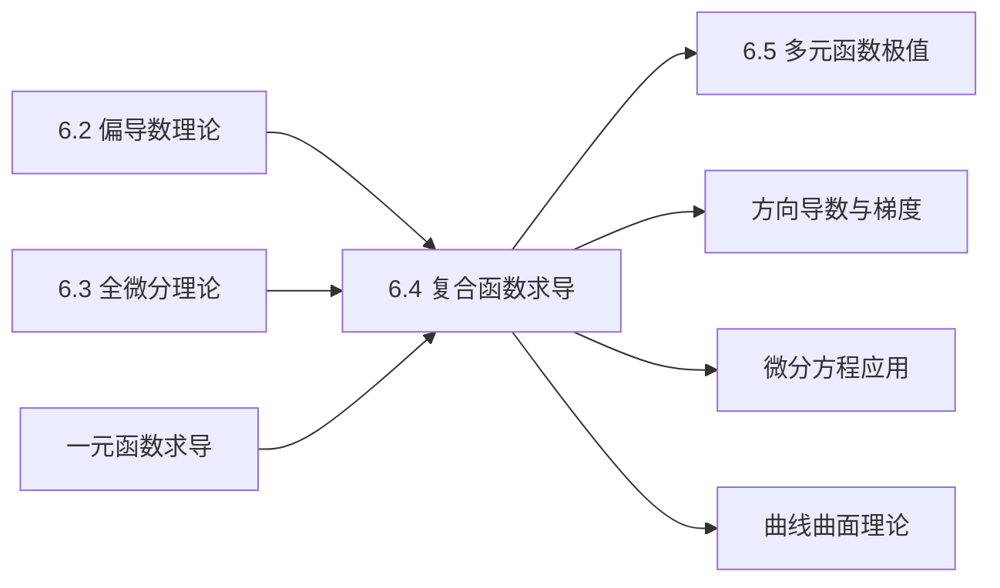

# 6.4 多元复合函数与隐函数求导

---

## 章节概览

### 学习目标
1. **链式法则掌握**：熟练掌握多元复合函数的链式法则及其应用
2. **求导技巧**：掌握各种复合情况下的求导方法和技巧
3. **隐函数求导**：掌握一元隐函数和多元隐函数的求导方法
4. **隐函数存在定理**：理解隐函数存在性和唯一性的条件
5. **实际应用**：能够应用复合函数和隐函数求导解决实际问题

### 重点难点

> **重点内容**
> - 多元复合函数的链式法则
> - 复合函数求导的各种情况
> - 隐函数的求导方法
> - 隐函数存在定理及其应用
> - 复合函数与隐函数的综合问题

> **难点内容**
> - 复杂复合关系的分析
> - 隐函数存在条件的判断
> - 高阶导数的计算
> - 隐函数组的求导
> - 实际问题的建模与求解

### 知识架构

```
多元复合函数与隐函数求导
├── 复合函数求导
│   ├── 链式法则基础
│   ├── 一元复合多元
│   ├── 多元复合多元
│   └── 复杂复合情况
├── 隐函数求导
│   ├── 一元隐函数
│   ├── 多元隐函数
│   ├── 隐函数组
│   └── 参数方程求导
├── 理论基础
│   ├── 隐函数存在定理
│   ├── 雅可比行列式
│   ├── 反函数组定理
│   └── 应用条件分析
└── 综合应用
    ├── 几何应用
    ├── 物理应用
    ├── 工程问题
    └── 优化问题
```

### 与其他章节的联系



---

## 目录

1. [多元复合函数的链式法则](#1-多元复合函数的链式法则)
2. [复合函数求导的典型情况](#2-复合函数求导的典型情况)
3. [隐函数求导](#3-隐函数求导)
4. [隐函数存在定理](#4-隐函数存在定理)
5. [综合应用与实例](#5-综合应用与实例)
6. [本章知识点总结](#6-本章知识点总结)

---

## 1. 多元复合函数的链式法则

### 1.1 链式法则的基本形式

> **定理1.1（多元复合函数链式法则）**
> 
> 设  $u = f(x, y)$ 在点 $(x, y)$ 可微， $x = \varphi(t)$，$y = \psi(t)$ 在对应点 $t$ 可导，则复合函数 $u = f(\varphi(t), \psi(t))$ 在点 $t$ 可导，且
> $$\frac{du}{dt} = \frac{\partial u}{\partial x} \cdot \frac{dx}{dt} + \frac{\partial u}{\partial y} \cdot \frac{dy}{dt}$$

**记忆方法**：按照"分路相乘，分路相加"的原则。

> **例题1.1**：设  $u = x^2 + y^2$，$x = \cos t$，$y = \sin t$，求 $\frac{du}{dt}$。

**解答**：
$$\frac{\partial u}{\partial x} = 2x, \quad \frac{\partial u}{\partial y} = 2y$$
$$\frac{dx}{dt} = -\sin t, \quad \frac{dy}{dt} = \cos t$$

$$\frac{du}{dt} = 2x(-\sin t) + 2y(\cos t) = 2\cos t(-\sin t) + 2\sin t(\cos t) = 0$$

**验证**：直接代入得 $u = \cos^2 t + \sin^2 t = 1$，所以 $\frac{du}{dt} = 0$ ✓

### 1.2 二元函数对二元变量的复合

> **定理1.2（更一般的链式法则）**
> 
> 设  $u = f(x, y)$ 在点 $(x, y)$ 可微， $x = \varphi(s, t)$，$y = \psi(s, t)$ 在对应点 $(s, t)$ 可微，则
> $$\frac{\partial u}{\partial s} = \frac{\partial u}{\partial x} \cdot \frac{\partial x}{\partial s} + \frac{\partial u}{\partial y} \cdot \frac{\partial y}{\partial s}$$
> $$\frac{\partial u}{\partial t} = \frac{\partial u}{\partial x} \cdot \frac{\partial x}{\partial t} + \frac{\partial u}{\partial y} \cdot \frac{\partial y}{\partial t}$$

> **例题1.2**：设  $u = xy$，$x = s + t$，$y = st$，求 $\frac{\partial u}{\partial s}$ 和 $\frac{\partial u}{\partial t}$。

**解答**：
$$\frac{\partial u}{\partial x} = y, \quad \frac{\partial u}{\partial y} = x$$
$$\frac{\partial x}{\partial s} = 1, \quad \frac{\partial x}{\partial t} = 1$$
$$\frac{\partial y}{\partial s} = t, \quad \frac{\partial y}{\partial t} = s$$

$$\frac{\partial u}{\partial s} = y \cdot 1 + x \cdot t = st + (s + t)t = st + st + t^2 = 2st + t^2$$
$$\frac{\partial u}{\partial t} = y \cdot 1 + x \cdot s = st + (s + t)s = st + s^2 + st = s^2 + 2st$$

**验证**：直接代入得 $u = (s + t)(st) = s^2t + st^2$
$$\frac{\partial u}{\partial s} = 2st + t^2 \quad ✓$$
$$\frac{\partial u}{\partial t} = s^2 + 2st \quad ✓$$

### 1.3 链式法则的矩阵形式

对于更复杂的复合函数，可以用矩阵形式表示：

设  $\vec{u} = (u_1, u_2, \ldots, u_m) = \vec{f}(\vec{x})$，$\vec{x} = (x_1, x_2, \ldots, x_n) = \vec{g}(\vec{t})$，则：

$$\frac{\partial \vec{u}}{\partial \vec{t}} = \frac{\partial \vec{f}}{\partial \vec{x}} \cdot \frac{\partial \vec{x}}{\partial \vec{t}}$$

其中 $\frac{\partial \vec{f}}{\partial \vec{x}}$ 是雅可比矩阵。

---

## 2. 复合函数求导的典型情况

### 2.1 混合型复合函数

当变量既是独立变量又是中间变量时，需要特别注意。

> **例题2.1**：设  $u = f(x, y, z)$，其中 $z = \varphi(x, y)$，求 $\frac{\partial u}{\partial x}$。

**解答**：
这里 $x$ 既是独立变量，又通过 $z$ 间接影响 $u$：
$$\frac{\partial u}{\partial x} = \frac{\partial f}{\partial x} + \frac{\partial f}{\partial z} \cdot \frac{\partial z}{\partial x}$$

**注意**：第一项是把 $y, z$ 都看作常数对 $x$ 求偏导；第二项是通过 $z$ 的变化对 $u$ 的影响。

> **例题2.2**：设  $u = f(x + y, xy)$，求 $\frac{\partial u}{\partial x}$ 和 $\frac{\partial u}{\partial y}$。

**解答**：
设  $s = x + y$，$t = xy$，则 $u = f(s, t)$

$$\frac{\partial u}{\partial x} = \frac{\partial f}{\partial s} \cdot \frac{\partial s}{\partial x} + \frac{\partial f}{\partial t} \cdot \frac{\partial t}{\partial x} = f_s \cdot 1 + f_t \cdot y = f_s + yf_t$$

$$\frac{\partial u}{\partial y} = \frac{\partial f}{\partial s} \cdot \frac{\partial s}{\partial y} + \frac{\partial f}{\partial t} \cdot \frac{\partial t}{\partial y} = f_s \cdot 1 + f_t \cdot x = f_s + xf_t$$

### 2.2 抽象复合函数

> **例题2.3**：设  $z = f(u, v)$ 具有二阶连续偏导数， $u = x + y$，$v = x - y$，求 $\frac{\partial^2 z}{\partial x^2}$。

**解答**：
1. **一阶偏导数**：
   $$\frac{\partial z}{\partial x} = \frac{\partial f}{\partial u} \cdot \frac{\partial u}{\partial x} + \frac{\partial f}{\partial v} \cdot \frac{\partial v}{\partial x} = f_u \cdot 1 + f_v \cdot 1 = f_u + f_v$$

2. **二阶偏导数**：
   $$\frac{\partial^2 z}{\partial x^2} = \frac{\partial}{\partial x}(f_u + f_v)$$
   
   $$= \frac{\partial f_u}{\partial x} + \frac{\partial f_v}{\partial x}$$
   
   $$= \left(\frac{\partial f_u}{\partial u} \cdot \frac{\partial u}{\partial x} + \frac{\partial f_u}{\partial v} \cdot \frac{\partial v}{\partial x}\right) + \left(\frac{\partial f_v}{\partial u} \cdot \frac{\partial u}{\partial x} + \frac{\partial f_v}{\partial v} \cdot \frac{\partial v}{\partial x}\right)$$
   
   $$= f_{uu} \cdot 1 + f_{uv} \cdot 1 + f_{vu} \cdot 1 + f_{vv} \cdot 1$$
   
   $$= f_{uu} + 2f_{uv} + f_{vv}$$

### 2.3 坐标变换中的应用

> **例题2.4**：将拉普拉斯方程  $\frac{\partial^2 u}{\partial x^2} + \frac{\partial^2 u}{\partial y^2} = 0$ 用极坐标 $x = r\cos\theta$，$y = r\sin\theta$ 表示。

**解答**：
1. **反变换**： $r = \sqrt{x^2 + y^2}$，$\theta = \arctan\frac{y}{x}$

2. **一阶偏导数**：
   $$\frac{\partial u}{\partial x} = \frac{\partial u}{\partial r} \cdot \frac{\partial r}{\partial x} + \frac{\partial u}{\partial \theta} \cdot \frac{\partial \theta}{\partial x}$$
   
   其中：
   $$\frac{\partial r}{\partial x} = \frac{x}{\sqrt{x^2 + y^2}} = \frac{x}{r} = \cos\theta$$
   $$\frac{\partial \theta}{\partial x} = \frac{-y}{x^2 + y^2} = -\frac{y}{r^2} = -\frac{\sin\theta}{r}$$
   
   所以：
   $$\frac{\partial u}{\partial x} = u_r \cos\theta - u_\theta \frac{\sin\theta}{r}$$

3. **类似地**：
   $$\frac{\partial u}{\partial y} = u_r \sin\theta + u_\theta \frac{\cos\theta}{r}$$

4. **二阶偏导数**（计算过程较复杂，直接给出结果）：
   $$\frac{\partial^2 u}{\partial x^2} + \frac{\partial^2 u}{\partial y^2} = \frac{\partial^2 u}{\partial r^2} + \frac{1}{r}\frac{\partial u}{\partial r} + \frac{1}{r^2}\frac{\partial^2 u}{\partial \theta^2}$$

**结果**：极坐标形式的拉普拉斯方程为：
$$\frac{\partial^2 u}{\partial r^2} + \frac{1}{r}\frac{\partial u}{\partial r} + \frac{1}{r^2}\frac{\partial^2 u}{\partial \theta^2} = 0$$

---

## 3. 隐函数求导

### 3.1 一元隐函数求导

> **方法1：直接求导法**
> 
> 对方程  $F(x, y) = 0$ 两边关于 $x$ 求导，把 $y$ 看作 $x$ 的函数。

> **例题3.1**：由方程  $x^2 + y^2 = 1$ 确定的隐函数 $y = y(x)$，求 $\frac{dy}{dx}$。

**解答**：
对方程两边关于 $x$ 求导：
$$\frac{d}{dx}(x^2 + y^2) = \frac{d}{dx}(1)$$
$$2x + 2y\frac{dy}{dx} = 0$$
$$\frac{dy}{dx} = -\frac{x}{y} \quad (y \neq 0)$$

> **方法2：公式法**
> 
> 对于方程  $F(x, y) = 0$，如果 $F_y \neq 0$，则：
> $$\frac{dy}{dx} = -\frac{F_x}{F_y}$$

**用公式法验证例题3.1**：
$$F(x, y) = x^2 + y^2 - 1$$
$$F_x = 2x, \quad F_y = 2y$$
$$\frac{dy}{dx} = -\frac{2x}{2y} = -\frac{x}{y} \quad ✓$$

### 3.2 多元隐函数求导

> **定理3.1（隐函数求导公式）**
> 
> 设方程  $F(x, y, z) = 0$ 确定隐函数 $z = z(x, y)$，如果 $F_z \neq 0$，则：
> $$\frac{\partial z}{\partial x} = -\frac{F_x}{F_z}, \quad \frac{\partial z}{\partial y} = -\frac{F_y}{F_z}$$

> **例题3.2**：由方程  $x^2 + y^2 + z^2 = 6$ 确定的隐函数 $z = z(x, y)$，求 $\frac{\partial z}{\partial x}$ 和 $\frac{\partial z}{\partial y}$。

**解答**：
$$F(x, y, z) = x^2 + y^2 + z^2 - 6$$
$$F_x = 2x, \quad F_y = 2y, \quad F_z = 2z$$

$$\frac{\partial z}{\partial x} = -\frac{F_x}{F_z} = -\frac{2x}{2z} = -\frac{x}{z} \quad (z \neq 0)$$
$$\frac{\partial z}{\partial y} = -\frac{F_y}{F_z} = -\frac{2y}{2z} = -\frac{y}{z} \quad (z \neq 0)$$

### 3.3 隐函数的高阶导数

> **例题3.3**：由方程  $x^2 + y^2 = 1$ 确定的隐函数 $y = y(x)$，求 $\frac{d^2y}{dx^2}$。

**解答**：
从例题3.1知道： $\frac{dy}{dx} = -\frac{x}{y}$

对 $\frac{dy}{dx} = -\frac{x}{y}$ 再次求导：
$$\frac{d^2y}{dx^2} = \frac{d}{dx}\left(-\frac{x}{y}\right) = -\frac{y \cdot 1 - x \cdot \frac{dy}{dx}}{y^2}$$

$$= -\frac{y - x \cdot \left(-\frac{x}{y}\right)}{y^2} = -\frac{y + \frac{x^2}{y}}{y^2} = -\frac{y^2 + x^2}{y^3}$$

由于 $x^2 + y^2 = 1$，所以：
$$\frac{d^2y}{dx^2} = -\frac{1}{y^3}$$

### 3.4 隐函数组

当有多个方程和多个未知函数时，需要用到雅可比行列式。

> **例题3.4**：设方程组 $\begin{cases} F(x, y, u, v) = 0 \\ G(x, y, u, v) = 0 \end{cases}$ 确定隐函数组 $u = u(x, y)$，$v = v(x, y)$，求 $\frac{\partial u}{\partial x}$。

**解答**：
对方程组分别关于 $x$ 求偏导：
$$\begin{cases}
F_x + F_u \frac{\partial u}{\partial x} + F_v \frac{\partial v}{\partial x} = 0 \\
G_x + G_u \frac{\partial u}{\partial x} + G_v \frac{\partial v}{\partial x} = 0
\end{cases}$$

整理成线性方程组：
$$\begin{cases}
F_u \frac{\partial u}{\partial x} + F_v \frac{\partial v}{\partial x} = -F_x \\
G_u \frac{\partial u}{\partial x} + G_v \frac{\partial v}{\partial x} = -G_x
\end{cases}$$

用克拉默法则求解：
$$\frac{\partial u}{\partial x} = \frac{\begin{vmatrix} -F_x & F_v \\ -G_x & G_v \end{vmatrix}}{\begin{vmatrix} F_u & F_v \\ G_u & G_v \end{vmatrix}} = \frac{-F_x G_v + F_v G_x}{F_u G_v - F_v G_u}$$

其中分母 $J = \frac{\partial(F, G)}{\partial(u, v)} = \begin{vmatrix} F_u & F_v \\ G_u & G_v \end{vmatrix}$ 称为雅可比行列式。

---

## 4. 隐函数存在定理

### 4.1 一元隐函数存在定理

> **定理4.1（隐函数存在唯一性定理）**
> 
> 设函数 $F(x, y)$ 在点 $(x_0, y_0)$ 的某个邻域内满足：
> 1. $F(x_0, y_0) = 0$
> 2. $F(x, y)$ 在该邻域内有连续的偏导数
> 3. $F_y(x_0, y_0) \neq 0$
> 
> 则在点 $(x_0, y_0)$ 的某个邻域内，方程  $F(x, y) = 0$ 唯一确定一个连续函数 $y = f(x)$，满足 $y_0 = f(x_0)$，且
> $$\frac{dy}{dx} = -\frac{F_x}{F_y}$$

**定理的几何意义**：条件 $F_y(x_0, y_0) \neq 0$ 保证了曲线 $F(x, y) = 0$ 在点 $(x_0, y_0)$ 处不与 $x$ 轴相切。

> **例题4.1**：讨论方程  $x^2 + y^2 - 1 = 0$ 在点 $(0, 1)$ 附近隐函数的存在性。

**解答**：
$$F(x, y) = x^2 + y^2 - 1$$
$$F_x = 2x, \quad F_y = 2y$$

在点 $(0, 1)$：
1. $F(0, 1) = 0 + 1 - 1 = 0$ ✓
2. $F_x, F_y$ 连续 ✓
3. $F_y(0, 1) = 2 \neq 0$ ✓

所以在点 $(0, 1)$ 附近存在唯一的隐函数 $y = f(x)$。

### 4.2 多元隐函数存在定理

> **定理4.2（多元隐函数存在定理）**
> 
> 设函数 $F(x, y, z)$ 在点 $(x_0, y_0, z_0)$ 的某个邻域内满足：
> 1. $F(x_0, y_0, z_0) = 0$
> 2. $F$ 有连续的偏导数
> 3. $F_z(x_0, y_0, z_0) \neq 0$
> 
> 则在该点邻域内，方程  $F(x, y, z) = 0$ 唯一确定连续函数 $z = f(x, y)$，且
> $$\frac{\partial z}{\partial x} = -\frac{F_x}{F_z}, \quad \frac{\partial z}{\partial y} = -\frac{F_y}{F_z}$$

### 4.3 隐函数组存在定理

> **定理4.3（隐函数组存在定理）**
> 
> 设函数组 $F(x, y, u, v), G(x, y, u, v)$ 在点 $(x_0, y_0, u_0, v_0)$ 的某个邻域内满足：
> 1. $F(x_0, y_0, u_0, v_0) = G(x_0, y_0, u_0, v_0) = 0$
> 2. $F, G$ 有连续的偏导数
> 3. 雅可比行列式 $J = \frac{\partial(F, G)}{\partial(u, v)} \neq 0$
> 
> 则在该点邻域内，方程组唯一确定连续函数组 $u = u(x, y), v = v(x, y)$。

### 4.4 反函数组定理

> **定理4.4（反函数组定理）**
> 
> 设函数组 $u = f(x, y), v = g(x, y)$ 在点 $(x_0, y_0)$ 的某个邻域内满足：
> 1. $f, g$ 有连续的偏导数
> 2. 雅可比行列式 $J = \frac{\partial(u, v)}{\partial(x, y)} \neq 0$
> 
> 则存在反函数组 $x = x(u, v), y = y(u, v)$，且
> $$\frac{\partial(x, y)}{\partial(u, v)} = \frac{1}{\frac{\partial(u, v)}{\partial(x, y)}}$$

> **例题4.2**：设  $u = x + y, v = x - y$，求反函数的雅可比行列式。

**解答**：
$$J = \frac{\partial(u, v)}{\partial(x, y)} = \begin{vmatrix} 1 & 1 \\ 1 & -1 \end{vmatrix} = -1 - 1 = -2 \neq 0$$

所以存在反函数，且：
$$\frac{\partial(x, y)}{\partial(u, v)} = \frac{1}{-2} = -\frac{1}{2}$$

验证： $x = \frac{u + v}{2}, y = \frac{u - v}{2}$
$$\frac{\partial(x, y)}{\partial(u, v)} = \begin{vmatrix} \frac{1}{2} & \frac{1}{2} \\ \frac{1}{2} & -\frac{1}{2} \end{vmatrix} = -\frac{1}{4} - \frac{1}{4} = -\frac{1}{2} \quad ✓$$

---

## 5. 综合应用与实例

### 5.1 几何应用

> **例题5.1**：求曲面 $F(x, y, z) = x^2 + y^2 + z^2 - 6 = 0$ 与平面 $x + y + z = 0$ 的交线在点 $(1, -2, 1)$ 处的切线方程。

**解答**：
交线可以看作参数方程：设平面上 $x = t, y = s$，则 $z = -t - s$

代入曲面方程： $t^2 + s^2 + (-t - s)^2 = 6$
即： $2t^2 + 2s^2 + 2ts = 6$，简化为 $t^2 + s^2 + ts = 3$

在点 $(1, -2, 1)$： $t = 1, s = -2$

对隐函数 $t^2 + s^2 + ts - 3 = 0$ 求导：
$$\frac{ds}{dt} = -\frac{2t + s}{2s + t} = -\frac{2 \cdot 1 + (-2)}{2 \cdot (-2) + 1} = -\frac{0}{-3} = 0$$

所以切线方向向量为 $(1, 0, -1)$ （因为 $\frac{dz}{dt} = -\frac{dx}{dt} - \frac{dy}{dt} = -1 - 0 = -1$）

**切线方程**：
$$\frac{x - 1}{1} = \frac{y + 2}{0} = \frac{z - 1}{-1}$$

### 5.2 物理应用

> **例题5.2**：理想气体状态方程  $PV = nRT$ （ $n, R$ 为常数），求 $\frac{\partial P}{\partial T}$ 当 $V$ 保持常数时。

**解答**：
从 $PV = nRT$ 得 $P = \frac{nRT}{V}$

$$\frac{\partial P}{\partial T}\bigg|_V = \frac{nR}{V}$$

这表明在恒定体积下，压强随温度的变化率与体积成反比。

### 5.3 工程优化问题

> **例题5.3**：制造一个容积为 $V$ 的圆柱形容器，使其表面积最小。设高为 $h$，底半径为 $r$，建立约束条件并用隐函数求导求解最优比例。

**解答**：
**约束条件**： $\pi r^2 h = V$ （体积约束）
**目标函数**： $S = 2\pi r^2 + 2\pi rh$ （表面积）

由约束条件： $h = \frac{V}{\pi r^2}$

代入目标函数：
$$S(r) = 2\pi r^2 + 2\pi r \cdot \frac{V}{\pi r^2} = 2\pi r^2 + \frac{2V}{r}$$

求最值：
$$\frac{dS}{dr} = 4\pi r - \frac{2V}{r^2} = 0$$
$$4\pi r = \frac{2V}{r^2}$$
$$r^3 = \frac{V}{2\pi}$$
$$r = \sqrt[3]{\frac{V}{2\pi}}$$

对应的高：
$$h = \frac{V}{\pi r^2} = \frac{V}{\pi \cdot \sqrt[3]{\frac{V^2}{4\pi^2}}} = 2\sqrt[3]{\frac{V}{2\pi}} = 2r$$

**结论**：最优设计是 $h = 2r$，即高等于直径。

### 5.4 经济学应用

> **例题5.4**：生产函数 $Q = f(K, L)$ （ $K$ 为资本， $L$ 为劳动），在预算约束 $rK + wL = C$ （ $r, w, C$ 为常数）下，求最优要素配比的一阶条件。

**解答**：
用拉格朗日乘数法或隐函数方法：

由约束条件： $K = \frac{C - wL}{r}$

代入生产函数： $Q = f\left(\frac{C - wL}{r}, L\right)$

最优化一阶条件：
$$\frac{dQ}{dL} = f_K \cdot \frac{d}{dL}\left(\frac{C - wL}{r}\right) + f_L = f_K \cdot \left(-\frac{w}{r}\right) + f_L = 0$$

即： $f_L = \frac{w}{r} f_K$

整理得： $\frac{f_L}{f_K} = \frac{w}{r}$

**经济学意义**：边际技术替代率等于要素价格比。

---

## 6. 本章知识点总结

### 6.1 核心概念体系

```
复合函数与隐函数求导
├── 链式法则应用
│   ├── 一元复合多元
│   ├── 多元复合多元
│   ├── 混合型复合
│   └── 抽象函数复合
├── 隐函数求导
│   ├── 直接求导法
│   ├── 公式法
│   ├── 高阶导数
│   └── 隐函数组
├── 存在性理论
│   ├── 隐函数存在定理
│   ├── 雅可比行列式
│   ├── 反函数组定理
│   └── 应用条件
└── 综合应用
    ├── 几何问题
    ├── 物理问题
    ├── 工程优化
    └── 经济分析
```

### 6.2 重要公式总结

**链式法则**：
- $\frac{du}{dt} = \frac{\partial u}{\partial x}\frac{dx}{dt} + \frac{\partial u}{\partial y}\frac{dy}{dt}$
- $\frac{\partial u}{\partial s} = \frac{\partial u}{\partial x}\frac{\partial x}{\partial s} + \frac{\partial u}{\partial y}\frac{\partial y}{\partial s}$

**隐函数求导**：
- $\frac{dy}{dx} = -\frac{F_x}{F_y}$ （ $F(x,y) = 0$）
- $\frac{\partial z}{\partial x} = -\frac{F_x}{F_z}$ （ $F(x,y,z) = 0$）

**雅可比行列式**：
- $J = \frac{\partial(F,G)}{\partial(u,v)} = \begin{vmatrix} F_u & F_v \\ G_u & G_v \end{vmatrix}$

### 6.3 解题策略总结

> **复合函数求导步骤**
> 
> 1. **分析复合关系**：画出复合函数的结构图
> 2. **应用链式法则**：按照"分路相乘，分路相加"
> 3. **计算各项导数**：逐一计算所需的偏导数
> 4. **合并整理结果**：化简最终表达式

> **隐函数求导步骤**
> 
> 1. **选择求导方法**：直接求导法或公式法
> 2. **检查存在条件**：验证隐函数存在的充分条件
> 3. **计算相关导数**：求出所需的偏导数
> 4. **应用求导公式**：代入隐函数求导公式

### 6.4 常见错误与注意事项

> **常见错误**
> 
> 1. **复合关系分析错误**：没有正确识别变量间的依赖关系
> 2. **链式法则应用错误**：遗漏某些求导项或符号错误
> 3. **隐函数存在性忽略**：没有检查隐函数存在的条件
> 4. **高阶导数计算错误**：在求高阶导数时出现运算错误

> **注意事项**
> 
> 1. **变量独立性**：明确哪些变量是独立的，哪些是相关的
> 2. **存在性条件**：使用隐函数求导前要检查存在条件
> 3. **计算仔细性**：复合函数求导计算量大，要仔细计算
> 4. **结果验证**：可能的话用其他方法验证结果

### 6.5 考研重点强化

> **必考内容**
> 
> 1. **基本链式法则**：一元复合多元、多元复合多元的求导
> 2. **隐函数求导**：一元和多元隐函数的求导方法
> 3. **复杂复合函数**：抽象函数的复合求导
> 4. **应用问题**：实际问题中的复合函数和隐函数
> 5. **存在性理论**：隐函数存在定理的理解和应用

> **解题技巧**
> 
> 1. **结构图分析**：复杂复合关系用图形分析
> 2. **分步计算**：将复杂求导分解为简单步骤
> 3. **公式熟记**：掌握常用的求导公式和模式
> 4. **实际应用**：结合具体问题理解抽象概念

### 6.6 与其他章节的联系

**前置知识**：
- 偏导数的计算（6.2章）
- 全微分理论（6.3章）
- 一元函数求导法则

**后续应用**：
- 多元函数极值问题（6.5章）
- 方向导数与梯度
- 微分方程求解
- 优化理论

复合函数与隐函数求导是多元函数微分学的重要组成部分，它不仅是理论工具，也是解决实际问题的有力武器。通过系统学习本章内容，可以为后续的极值理论、微分方程等内容打下坚实基础。 