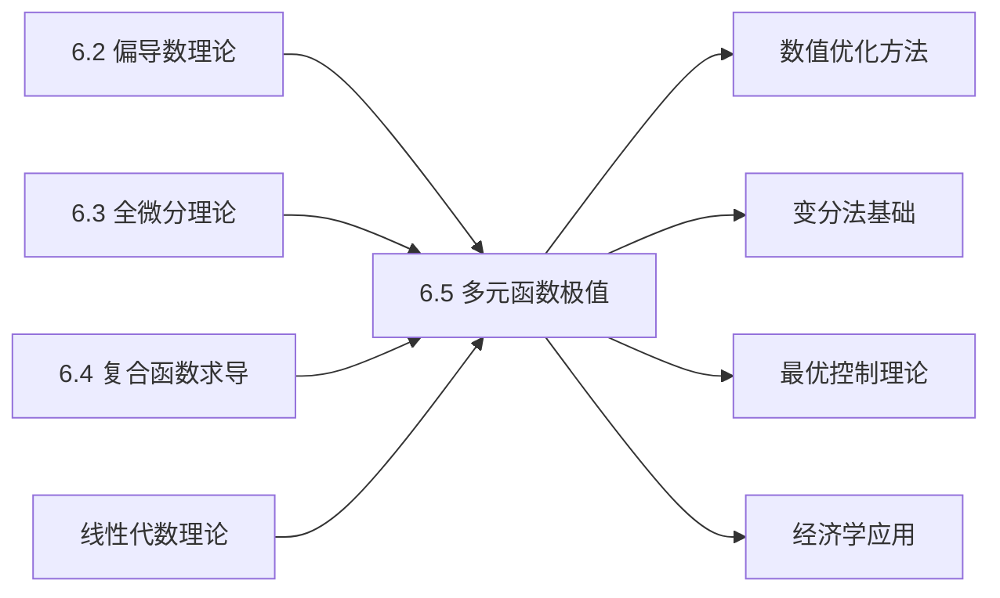

# 6.5 多元函数极值理论与应用

---

## 章节概览

### 学习目标
1. **极值理论**：深刻理解多元函数极值的定义和几何意义
2. **无约束极值**：熟练掌握无约束极值的求解方法和判别条件
3. **条件极值**：掌握拉格朗日乘数法的理论和应用技巧
4. **实际应用**：能够建立和求解各类优化问题的数学模型
5. **综合能力**：具备分析和解决复杂极值问题的能力

### 重点难点

> **重点内容**
> - 多元函数极值的定义和几何意义
> - 无约束极值的必要条件和充分条件
> - 拉格朗日乘数法的理论基础和计算方法
> - 实际应用问题的数学建模
> - 边界极值和全局优化问题

> **难点内容**
> - 二阶充分条件的判别方法
> - 多约束条件的拉格朗日乘数法
> - 条件极值存在性的理论分析
> - 复杂几何和物理问题的建模
> - 数值优化方法的理论基础

### 知识架构

```
多元函数极值理论与应用
├── 无约束极值
│   ├── 极值定义与几何意义
│   ├── 必要条件（费马定理）
│   ├── 充分条件（海塞矩阵）
│   └── 鞍点理论
├── 条件极值
│   ├── 拉格朗日乘数法
│   ├── 多约束条件处理
│   ├── 几何意义解释
│   └── 存在性理论
├── 判别方法体系
│   ├── 一阶必要条件
│   ├── 二阶充分条件
│   ├── 海塞矩阵判别法
│   └── 边界分析方法
└── 实际应用
    ├── 几何优化问题
    ├── 物理极值问题
    ├── 经济优化模型
    └── 工程设计优化
```

### 与其他章节的联系



---

## 目录

1. [无约束极值](#1-无约束极值)
2. [条件极值与拉格朗日乘数法](#2-条件极值与拉格朗日乘数法)
3. [极值判别方法](#3-极值判别方法)
4. [实际应用问题](#4-实际应用问题)
5. [本章知识点总结](#5-本章知识点总结)

---

## 1. 无约束极值

### 1.1 极值的定义

> **定义1.1（极值）**
> 
> 设函数 $f(x, y)$ 在点 $(x_0, y_0)$ 的某个邻域内有定义：
> - 若对该邻域内任一点 $(x, y) \neq (x_0, y_0)$ 都有 $f(x, y) \leq f(x_0, y_0)$，则称 $(x_0, y_0)$ 为函数的**极大值点**
> - 若对该邻域内任一点 $(x, y) \neq (x_0, y_0)$ 都有 $f(x, y) \geq f(x_0, y_0)$，则称 $(x_0, y_0)$ 为函数的**极小值点**

### 1.2 极值存在的必要条件

> **定理1.1（费马定理推广）**
> 
> 设函数 $f(x, y)$ 在点 $(x_0, y_0)$ 处取得极值，且偏导数存在，则：
> $$f_x(x_0, y_0) = 0, \quad f_y(x_0, y_0) = 0$$

满足 $f_x = f_y = 0$ 的点称为**驻点**或**临界点**。

> **例题1.1**：求函数 $f(x, y) = x^3 + y^3 - 3xy$ 的驻点。

**解答**：
$$f_x = 3x^2 - 3y = 0 \Rightarrow x^2 = y$$
$$f_y = 3y^2 - 3x = 0 \Rightarrow y^2 = x$$

联立得： $x^2 = y, y^2 = x$，即 $(x^2)^2 = x$，所以 $x^4 = x$
解得： $x(x^3 - 1) = 0$，即 $x = 0$ 或 $x = 1$

驻点为： $(0, 0)$ 和 $(1, 1)$

### 1.3 极值存在的充分条件

> **定理1.2（二阶充分条件）**
> 
> 设函数 $f(x, y)$ 在点 $(x_0, y_0)$ 处：
> 1. $f_x(x_0, y_0) = f_y(x_0, y_0) = 0$
> 2. 二阶偏导数连续
> 
> 记： $A = f_{xx}(x_0, y_0)$，$B = f_{xy}(x_0, y_0)$，$C = f_{yy}(x_0, y_0)$
> 
> 则：
> - 当 $\Delta = AC - B^2 > 0$ 且 $A < 0$ 时， $(x_0, y_0)$ 为极大值点
> - 当 $\Delta = AC - B^2 > 0$ 且 $A > 0$ 时， $(x_0, y_0)$ 为极小值点  
> - 当 $\Delta = AC - B^2 < 0$ 时， $(x_0, y_0)$ 为鞍点
> - 当 $\Delta = AC - B^2 = 0$ 时，无法确定

> **例题1.2**：判断例题1.1中驻点的性质。

**解答**：
$$f_{xx} = 6x, \quad f_{xy} = -3, \quad f_{yy} = 6y$$

**对点 $(0, 0)$ **：
$$A = 0, \quad B = -3, \quad C = 0$$
$$\Delta = 0 \cdot 0 - (-3)^2 = -9 < 0$$
所以 $(0, 0)$ 是鞍点。

**对点 $(1, 1)$ **：
$$A = 6, \quad B = -3, \quad C = 6$$
$$\Delta = 6 \cdot 6 - (-3)^2 = 36 - 9 = 27 > 0$$
且 $A = 6 > 0$，所以 $(1, 1)$ 是极小值点。

---

## 2. 条件极值与拉格朗日乘数法

### 2.1 条件极值问题

> **定义2.1（条件极值）**
> 
> 在约束条件 $\varphi(x, y) = 0$ 下，求函数 $f(x, y)$ 的极值，称为**条件极值问题**。

### 2.2 拉格朗日乘数法

> **定理2.1（拉格朗日乘数法）**
> 
> 设函数 $f(x, y)$ 和 $\varphi(x, y)$ 在某区域内具有连续的一阶偏导数，且 $\nabla \varphi \neq \vec{0}$。若 $(x_0, y_0)$ 为条件极值点，则存在常数 $\lambda$，使得：
> $$\nabla f(x_0, y_0) = \lambda \nabla \varphi(x_0, y_0)$$

**拉格朗日函数**： $L(x, y, \lambda) = f(x, y) - \lambda \varphi(x, y)$

**求解步骤**：
1. 建立方程组：
   $$\begin{cases}
   L_x = f_x - \lambda \varphi_x = 0 \\
   L_y = f_y - \lambda \varphi_y = 0 \\
   L_\lambda = -\varphi(x, y) = 0
   \end{cases}$$

2. 解方程组得到可能的极值点
3. 比较各点的函数值确定极值

> **例题2.1**：求椭圆 $x^2 + 2y^2 = 6$ 上到原点距离的最大值和最小值。

**解答**：
**目标函数**： $f(x, y) = x^2 + y^2$
**约束条件**： $\varphi(x, y) = x^2 + 2y^2 - 6 = 0$

建立拉格朗日函数： $L = x^2 + y^2 - \lambda(x^2 + 2y^2 - 6)$

求解方程组：
$$\begin{cases}
2x - 2\lambda x = 0 \\
2y - 4\lambda y = 0 \\
x^2 + 2y^2 - 6 = 0
\end{cases}$$

从前两个方程：
- 若 $x \neq 0$，则 $\lambda = 1$
- 若 $y \neq 0$，则 $\lambda = \frac{1}{2}$

**情况1**： $\lambda = 1$，则 $y = 0$，代入约束条件： $x^2 = 6$，得 $x = \pm\sqrt{6}$
**情况2**： $\lambda = \frac{1}{2}$，则 $x = 0$，代入约束条件： $2y^2 = 6$，得 $y = \pm\sqrt{3}$

计算函数值：
- $f(\pm\sqrt{6}, 0) = 6$
- $f(0, \pm\sqrt{3}) = 3$

所以最大距离为 $\sqrt{6}$，最小距离为 $\sqrt{3}$。

### 2.3 多约束条件的拉格朗日乘数法

对于多个约束条件：
$$\min f(x, y, z) \text{ subject to } \begin{cases} \varphi_1(x, y, z) = 0 \\ \varphi_2(x, y, z) = 0 \end{cases}$$

拉格朗日函数： $L = f - \lambda_1 \varphi_1 - \lambda_2 \varphi_2$

---

## 3. 极值判别方法

### 3.1 海塞矩阵判别法

对于函数 $f(x, y)$，海塞矩阵为：
$$H = \begin{pmatrix} f_{xx} & f_{xy} \\ f_{yx} & f_{yy} \end{pmatrix}$$

**判别规则**：
- $H$ 正定 ⇒ 极小值点
- $H$ 负定 ⇒ 极大值点  
- $H$ 不定 ⇒ 鞍点

### 3.2 边界极值

当定义域有边界时，还需检查边界上的极值。

> **例题3.1**：求函数 $f(x, y) = x^2 + y^2 - 2x$ 在区域 $D: x^2 + y^2 \leq 4$ 上的最值。

**解答**：
**内部驻点**：
$$f_x = 2x - 2 = 0 \Rightarrow x = 1$$
$$f_y = 2y = 0 \Rightarrow y = 0$$
驻点 $(1, 0)$ 在区域内， $f(1, 0) = -1$

**边界极值**：在边界 $x^2 + y^2 = 4$ 上
用拉格朗日乘数法或参数方程： $x = 2\cos\theta, y = 2\sin\theta$
$$f = 4\cos^2\theta + 4\sin^2\theta - 4\cos\theta = 4 - 4\cos\theta$$
最大值在 $\cos\theta = -1$ 时取得，即点 $(-2, 0)$，$f(-2, 0) = 8$
最小值在 $\cos\theta = 1$ 时取得，即点 $(2, 0)$，$f(2, 0) = 0$

比较得：最大值为 $8$，最小值为 $-1$。

---

## 4. 实际应用问题

### 4.1 几何优化问题

> **例题4.1**：在第一象限内，求椭圆 $\frac{x^2}{a^2} + \frac{y^2}{b^2} = 1$ 的内接矩形的最大面积。

**解答**：
设矩形顶点为 $(x, y)$，面积 $S = 4xy$
约束条件： $\frac{x^2}{a^2} + \frac{y^2}{b^2} = 1$

用拉格朗日乘数法：
$$L = 4xy - \lambda\left(\frac{x^2}{a^2} + \frac{y^2}{b^2} - 1\right)$$

得到： $x = \frac{a}{\sqrt{2}}, y = \frac{b}{\sqrt{2}}$

最大面积： $S_{\max} = 4 \cdot \frac{a}{\sqrt{2}} \cdot \frac{b}{\sqrt{2}} = 2ab$

### 4.2 经济优化问题

> **例题4.2**：某厂生产两种产品，产量分别为 $x, y$，利润函数为 $P = 100x + 80y - x^2 - y^2 - xy$，在总投入约束 $2x + y = 100$ 下，求最大利润。

**解答**：
用拉格朗日乘数法：
$$L = 100x + 80y - x^2 - y^2 - xy - \lambda(2x + y - 100)$$

求解得： $x = 20, y = 60$，最大利润 $P = 3900$

### 4.3 物理应用问题

在物理学中，极值原理广泛应用于：
- 最小作用量原理
- 能量最小原理
- 费马原理（光学）

---

## 5. 本章知识点总结

### 5.1 核心概念体系

**无约束极值**：
- 必要条件： $\nabla f = 0$
- 充分条件：海塞矩阵判别

**条件极值**：
- 拉格朗日乘数法
- 几何解释：等值线相切

### 5.2 解题策略

> **无约束极值求解步骤**
> 1. 求驻点：解 $\nabla f = 0$
> 2. 计算二阶偏导数
> 3. 用判别式判断极值性质
> 4. 考虑边界情况

> **条件极值求解步骤**  
> 1. 建立拉格朗日函数
> 2. 求解方程组
> 3. 比较各候选点的函数值
> 4. 确定极值

### 5.3 重点

**必考**：
- 无约束极值的判定
- 拉格朗日乘数法
- 实际应用问题的建模

**常见**：
- 求函数的极值
- 条件极值问题
- 几何和物理应用
- 经济优化问题

### 5.4 注意事项

1. **驻点不一定是极值点**
2. **条件极值必须满足约束条件**
3. **边界极值不能忽略**
4. **实际问题要检验解的合理性**

多元函数极值理论是微分学的重要应用，不仅有深刻的理论意义，更在实际问题中有广泛应用。掌握好本章内容，对于解决优化问题具有重要意义。 