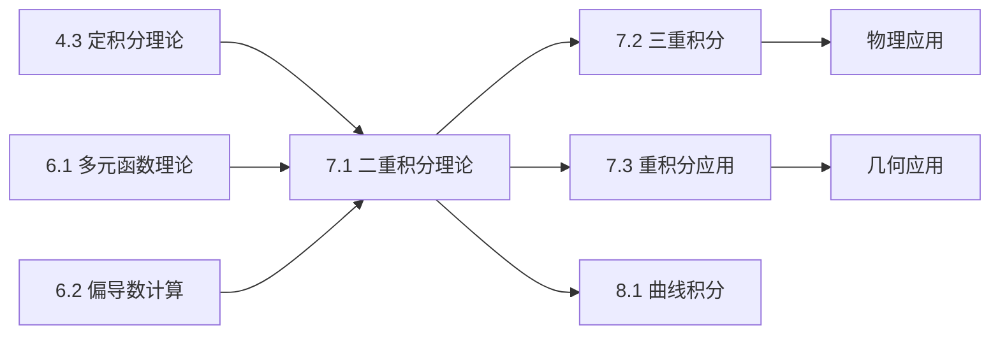

# 7.1 二重积分理论与计算

---

## 章节概览

### 学习目标
1. **概念理解**：深刻理解二重积分的定义和几何意义
2. **计算熟练**：掌握二重积分的各种计算方法
3. **坐标变换**：熟练运用极坐标等坐标变换简化计算
4. **积分区域**：能够正确分析和处理各种积分区域
5. **理论应用**：理解二重积分在几何、物理中的应用

### 重点难点

> **重点内容**
> - 二重积分的定义和性质
> - 二重积分的计算方法（直角坐标、极坐标）
> - 积分区域的分析和处理
> - 积分次序的选择和交换
> - 坐标变换的雅可比行列式

> **难点内容**
> - 复杂积分区域的处理
> - 积分次序的优化选择
> - 极坐标变换的适用条件
> - 一般坐标变换的应用
> - 广义二重积分的计算

### 知识架构

```
二重积分理论与计算
├── 二重积分基本理论
│   ├── 定义与几何意义
│   ├── 存在性条件
│   ├── 基本性质
│   └── 平均值定理
├── 直角坐标系计算
│   ├── X型区域积分
│   ├── Y型区域积分
│   ├── 积分次序交换
│   └── 复杂区域处理
├── 极坐标系计算
│   ├── 极坐标变换公式
│   ├── 极坐标区域描述
│   ├── 典型积分类型
│   └── 计算技巧总结
├── 一般坐标变换
│   ├── 变换公式理论
│   ├── Jacobian行列式
│   ├── 常用变换类型
│   └── 变换的选择原则
└── 特殊积分计算
    ├── 对称性利用
    ├── 被积函数特殊性质
    ├── 积分估值方法
    └── 数值积分简介
```

### 与其他章节的联系



---

## 目录

1. [二重积分的定义](#1-二重积分的定义)
2. [二重积分的性质](#2-二重积分的性质)
3. [直角坐标系下的计算](#3-直角坐标系下的计算)
4. [极坐标变换](#4-极坐标变换)
5. [一般坐标变换](#5-一般坐标变换)
6. [本章知识点总结](#6-本章知识点总结)

---

## 1. 二重积分的定义

### 1.1 二重积分的定义

> **定义1.1（二重积分）**
> 
> 设函数 $f(x, y)$ 在有界闭区域 $D$ 上有界，将 $D$ 任意分割成 $n$ 个小区域 $\Delta D_i$ （面积为 $\Delta A_i$），在每个 $\Delta D_i$ 内任取一点 $(\xi_i, \eta_i)$，作和式：
> $$S_n = \sum_{i=1}^{n} f(\xi_i, \eta_i) \Delta A_i$$
> 
> 如果当各小区域的直径的最大值趋于零时，上述和式的极限存在且与区域的分割方法和点的选取无关，则称此极限为函数 $f(x, y)$ 在区域 $D$ 上的**二重积分**，记作：
> $$\iint_D f(x, y) dA = \lim_{\lambda \to 0} \sum_{i=1}^{n} f(\xi_i, \eta_i) \Delta A_i$$

### 1.2 二重积分的几何意义

当 $f(x, y) \geq 0$ 时，二重积分 $\iint_D f(x, y) dA$ 表示以区域 $D$ 为底，以曲面 $z = f(x, y)$ 为顶的曲顶柱体的体积。

**物理意义**：
- 当 $f(x,y) = 1$ 时，二重积分等于区域 $D$ 的面积
- 当 $f(x,y)$ 表示面密度时，二重积分表示薄片的质量
- 当 $f(x,y)$ 表示压强时，二重积分表示总压力

### 1.3 二重积分的存在性

> **定理1.1（二重积分存在定理）**
> 
> 若函数 $f(x, y)$ 在有界闭区域 $D$ 上连续，则二重积分 $\iint_D f(x, y) dA$ 存在。

**推广**：若 $f(x,y)$ 在区域 $D$ 上除了有限个点或有限条光滑曲线上不连续外，在其余点连续且有界，则二重积分仍然存在。

---

## 2. 二重积分的性质

### 2.1 基本性质

1. **线性性**：
   $$\iint_D [af(x,y) + bg(x,y)] dA = a\iint_D f(x,y) dA + b\iint_D g(x,y) dA$$

2. **区域可加性**：若 $D = D_1 \cup D_2$ 且 $D_1 \cap D_2$ 的面积为零，则：
   $$\iint_D f(x,y) dA = \iint_{D_1} f(x,y) dA + \iint_{D_2} f(x,y) dA$$

3. **保序性**：若在 $D$ 上 $f(x,y) \leq g(x,y)$，则：
   $$\iint_D f(x,y) dA \leq \iint_D g(x,y) dA$$

4. **绝对值不等式**：
   $$\left|\iint_D f(x,y) dA\right| \leq \iint_D |f(x,y)| dA$$

### 2.2 二重积分的估值

> **定理2.1（二重积分估值定理）**
> 
> 设  $m$ 和 $M$ 分别是 $f(x,y)$ 在闭区域 $D$ 上的最小值和最大值， $S$ 是区域 $D$ 的面积，则：
> $$m \cdot S \leq \iint_D f(x,y) dA \leq M \cdot S$$

### 2.3 二重积分中值定理

> **定理2.2（二重积分中值定理）**
> 
> 若 $f(x, y)$ 在有界闭区域 $D$ 上连续，则至少存在一点 $(\xi, \eta) \in D$，使得：
> $$\iint_D f(x, y) dA = f(\xi, \eta) \cdot S$$

**几何意义**：存在某个高度 $f(\xi, \eta)$，使得以此高度为顶的柱体体积等于曲顶柱体的体积。

> **例题2.1**：利用二重积分中值定理估计积分 $\iint_D (x^2 + y^2) dA$ 的值，其中 $D$ 是单位圆 $x^2 + y^2 \leq 1$。

**解答**：
1. **确定函数的最值**：
   - 在区域 $D: x^2 + y^2 \leq 1$ 上
   - $f(x,y) = x^2 + y^2$ 的最小值： $m = 0$ （在原点处）
   - $f(x,y) = x^2 + y^2$ 的最大值： $M = 1$ （在边界 $x^2 + y^2 = 1$ 上）

2. **计算区域面积**：
   $S = \pi \cdot 1^2 = \pi$

3. **应用估值定理**：
   $$0 \cdot \pi \leq \iint_D (x^2 + y^2) dA \leq 1 \cdot \pi$$
   即： $$0 \leq \iint_D (x^2 + y^2) dA \leq \pi$$

4. **应用中值定理**：
   存在点 $(\xi, \eta) \in D$，使得：
   $$\iint_D (x^2 + y^2) dA = (\xi^2 + \eta^2) \cdot \pi$$

5. **精确计算验证**：
   使用极坐标： $\iint_D (x^2 + y^2) dA = \int_0^{2\pi} d\theta \int_0^1 r^2 \cdot r dr = \int_0^{2\pi} d\theta \int_0^1 r^3 dr = 2\pi \cdot \left[\frac{r^4}{4}\right]_0^1 = 2\pi \cdot \frac{1}{4} = \frac{\pi}{2}$
   
   因此 $\xi^2 + \eta^2 = \frac{1}{2}$，即中值点在圆 $x^2 + y^2 = \frac{1}{2}$ 上。

> **例题2.2**：设  $D = \{(x,y) | 0 \leq x \leq 1, 0 \leq y \leq 1\}$，利用中值定理分析积分 $\iint_D \sin(x+y) dA$。

**解答**：
1. **分析函数性质**：
   - 在 $D$ 上， $0 \leq x + y \leq 2$
   - $\sin(x+y)$ 在 $[0, 2]$ 上连续
   - 最小值： $\sin(0) = 0$
   - 最大值： $\sin(2) \approx 0.909$

2. **区域面积**： $S = 1$

3. **中值定理应用**：
   存在 $(\xi, \eta) \in D$，使得：
   $$\iint_D \sin(x+y) dA = \sin(\xi + \eta) \cdot 1 = \sin(\xi + \eta)$$

4. **估值**：
   $$0 \leq \iint_D \sin(x+y) dA \leq \sin(2)$$

**物理意义**：如果 $\sin(x+y)$ 表示某种密度分布，则中值定理告诉我们存在某点的密度值等于平均密度。

---

## 3. 直角坐标系下的计算

### 3.1 X型区域

> **定义3.1（X型区域）**
> 
> 区域 $D = \{(x, y) | a \leq x \leq b, \varphi_1(x) \leq y \leq \varphi_2(x)\}$ 称为X型区域。

**计算公式**：
$$\iint_D f(x, y) dA = \int_a^b dx \int_{\varphi_1(x)}^{\varphi_2(x)} f(x, y) dy$$

### 3.2 Y型区域

> **定义3.2（Y型区域）**
> 
> 区域 $D = \{(x, y) | c \leq y \leq d, \psi_1(y) \leq x \leq \psi_2(y)\}$ 称为Y型区域。

**计算公式**：
$$\iint_D f(x, y) dA = \int_c^d dy \int_{\psi_1(y)}^{\psi_2(y)} f(x, y) dx$$

### 3.3 积分次序的选择

选择积分次序的原则：
1. **被积函数的特点**：选择使得内层积分容易计算的次序
2. **积分区域的形状**：选择使得积分限简单的次序
3. **避免分割区域**：选择不需要分割积分区域的次序

> **例题3.1**：计算 $\iint_D xy dA$，其中 $D$ 是由 $y = x$，$y = x^2$ 围成的区域。

**解答**：

**确定积分区域**：
- 交点： $x = x^2 \Rightarrow x(x-1) = 0 \Rightarrow x = 0, 1$
- 区域： $D = \{(x, y) | 0 \leq x \leq 1, x^2 \leq y \leq x\}$ （X型区域）

**计算积分**：
$$\iint_D xy dA = \int_0^1 x dx \int_{x^2}^x y dy$$
$$= \int_0^1 x \left[\frac{y^2}{2}\right]_{x^2}^x dx = \int_0^1 x \cdot \frac{x^2 - x^4}{2} dx$$
$$= \frac{1}{2} \int_0^1 (x^3 - x^5) dx = \frac{1}{2} \left[\frac{x^4}{4} - \frac{x^6}{6}\right]_0^1$$
$$= \frac{1}{2} \left(\frac{1}{4} - \frac{1}{6}\right) = \frac{1}{2} \cdot \frac{1}{12} = \frac{1}{24}$$

### 3.4 积分次序的选择

选择合适的积分次序可以简化计算：

> **例题3.2**：计算 $\iint_D e^{x^2} dA$，其中 $D = \{(x, y) | 0 \leq x \leq 1, 0 \leq y \leq x\}$。

**解答**：

**方法1**（按 $dydx$ 次序）：
$$\iint_D e^{x^2} dA = \int_0^1 dx \int_0^x e^{x^2} dy = \int_0^1 e^{x^2} \cdot x dx$$

由于 $\int e^{x^2} dx$ 无法用初等函数表示，此路不通。

**方法2**（按 $dxdy$ 次序）：
改写区域： $D = \{(x, y) | 0 \leq y \leq 1, y \leq x \leq 1\}$ （Y型区域）

$$\iint_D e^{x^2} dA = \int_0^1 dy \int_y^1 e^{x^2} dx$$

这仍然困难，但如果被积函数是 $e^{y^2}$，则第二种次序会更好。

---

## 4. 极坐标变换

### 4.1 极坐标变换公式

坐标变换：
$$x = r\cos\theta, \quad y = r\sin\theta$$

**雅可比行列式**：
$$J = \frac{\partial(x, y)}{\partial(r, \theta)} = \begin{vmatrix} \cos\theta & -r\sin\theta \\ \sin\theta & r\cos\theta \end{vmatrix} = r$$

**变换公式**：
$$\iint_D f(x, y) dxdy = \iint_{D'} f(r\cos\theta, r\sin\theta) \cdot r \, drd\theta$$

### 4.2 适用条件

极坐标变换适用于：
1. 积分区域为圆、扇形、环形等
2. 被积函数含有 $x^2 + y^2$、 $\sqrt{x^2 + y^2}$ 等形式

> **例题4.1**：计算 $\iint_D (x^2 + y^2) dA$，其中 $D: x^2 + y^2 \leq 4$。

**解答**：

**极坐标变换**：
- 区域： $D' = \{(r, \theta) | 0 \leq r \leq 2, 0 \leq \theta \leq 2\pi\}$
- 被积函数： $x^2 + y^2 = r^2$

**计算积分**：
$$\iint_D (x^2 + y^2) dA = \int_0^{2\pi} d\theta \int_0^2 r^2 \cdot r dr$$
$$= \int_0^{2\pi} d\theta \int_0^2 r^3 dr = 2\pi \cdot \left[\frac{r^4}{4}\right]_0^2 = 2\pi \cdot 4 = 8\pi$$

> **例题4.2**：计算 $\iint_D e^{-(x^2+y^2)} dA$，其中 $D: x^2 + y^2 \leq 1$。

**解答**：
$$\iint_D e^{-(x^2+y^2)} dA = \int_0^{2\pi} d\theta \int_0^1 e^{-r^2} \cdot r dr$$

令 $t = r^2$，则 $dt = 2r dr$，$r dr = \frac{1}{2} dt$：
$$= \int_0^{2\pi} d\theta \int_0^1 e^{-t} \cdot \frac{1}{2} dt = 2\pi \cdot \frac{1}{2} \left[-e^{-t}\right]_0^1$$
$$= \pi (1 - e^{-1}) = \pi \left(1 - \frac{1}{e}\right)$$

---

## 5. 一般坐标变换

### 5.1 坐标变换的一般公式

设坐标变换：
$$x = x(u, v), \quad y = y(u, v)$$

雅可比行列式：
$$J = \frac{\partial(x, y)}{\partial(u, v)} = \begin{vmatrix} \frac{\partial x}{\partial u} & \frac{\partial x}{\partial v} \\ \frac{\partial y}{\partial u} & \frac{\partial y}{\partial v} \end{vmatrix}$$

**变换公式**：
$$\iint_D f(x, y) dxdy = \iint_{D'} f(x(u,v), y(u,v)) |J| dudv$$

> **例题5.0**：计算坐标变换 $x = u + v, y = u - v$ 的雅可比行列式，并用此变换计算积分 $\iint_D (x + y) dxdy$，其中 $D$ 是由 $x + y = 0, x + y = 2, x - y = 0, x - y = 1$ 围成的区域。

**解答**：
1. **计算雅可比行列式**：
   $$\frac{\partial x}{\partial u} = 1, \quad \frac{\partial x}{\partial v} = 1$$
   $$\frac{\partial y}{\partial u} = 1, \quad \frac{\partial y}{\partial v} = -1$$
   
   $$J = \begin{vmatrix} 1 & 1 \\ 1 & -1 \end{vmatrix} = 1 \cdot (-1) - 1 \cdot 1 = -2$$
   
   因此 $|J| = 2$

2. **确定新的积分区域**：
   - 原区域边界： $x + y = 0, 2$ 和 $x - y = 0, 1$
   - 由于 $x + y = (u + v) + (u - v) = 2u$ 和 $x - y = (u + v) - (u - v) = 2v$
   - 新区域： $D' = \{(u,v) | 0 \leq 2u \leq 2, 0 \leq 2v \leq 1\}$
   - 即： $D' = \{(u,v) | 0 \leq u \leq 1, 0 \leq v \leq \frac{1}{2}\}$

3. **变换被积函数**：
   $x + y = 2u$

4. **计算积分**：
   $$\iint_D (x + y) dxdy = \iint_{D'} 2u \cdot |J| dudv = \iint_{D'} 2u \cdot 2 dudv$$
   $$= 4 \int_0^1 u du \int_0^{1/2} dv = 4 \cdot \frac{1}{2} \cdot \frac{1}{2} = 1$$

### 5.2 常用坐标变换

**椭圆坐标变换**：
$$x = ar\cos\theta, \quad y = br\sin\theta$$
$$J = abr$$

> **例题5.1**：计算椭圆 $\frac{x^2}{a^2} + \frac{y^2}{b^2} \leq 1$ 的面积。

**解答**：
使用椭圆坐标变换，区域变为： $0 \leq r \leq 1, 0 \leq \theta \leq 2\pi$

$$S = \iint_D 1 \, dxdy = \int_0^{2\pi} d\theta \int_0^1 ab \cdot r \, dr$$
$$= ab \int_0^{2\pi} d\theta \int_0^1 r \, dr = ab \cdot 2\pi \cdot \frac{1}{2} = \pi ab$$

---

## 6. 本章知识点总结

### 6.1 核心概念体系

```
二重积分理论与计算
├── 基本概念
│   ├── 定义（黎曼和极限）
│   ├── 几何意义（体积）
│   ├── 存在条件
│   └── 基本性质
├── 计算方法
│   ├── 直角坐标（X型、Y型）
│   ├── 极坐标变换
│   ├── 一般坐标变换
│   └── 积分次序选择
└── 应用技巧
    ├── 区域分析
    ├── 变换选择
    ├── 计算优化
    └── 特殊方法
```

### 6.2 计算策略总结

> **直角坐标计算步骤**
> 1. **分析积分区域**：判断是X型还是Y型
> 2. **选择积分次序**：考虑计算难易程度
> 3. **确定积分限**：写出上下限函数
> 4. **逐次积分**：先内层后外层

> **极坐标变换使用条件**
> - 积分区域为圆形、扇形、环形
> - 被积函数含有 $x^2 + y^2$ 项
> - 直角坐标计算困难时

### 6.3 常见题型与方法

**计算型题目**：
- 选择合适的坐标系和积分次序
- 正确确定积分区域和积分限
- 熟练进行逐次积分

**应用型题目**：
- 几何应用（面积、体积）
- 物理应用（质量、重心等）

### 6.4 常见易错点分析

> **积分区域易错点**
> 
> ❌ **易错点1：积分区域描述错误**
> - **典型错误**：区域 $D: 0 \leq x \leq 1, 0 \leq y \leq x$ 描述为 $0 \leq y \leq 1, 0 \leq x \leq y$
> - **正确理解**：要明确哪个变量是外层变量，哪个是内层变量
> - **避错方法**：画图确定区域边界，选择合适的积分类型

> ❌ **易错点2：X型和Y型区域判断错误**
> - **混淆情况**：不能正确判断区域应该用X型还是Y型描述
> - **判断标准**：
>   - X型：垂直线与边界最多两个交点
>   - Y型：水平线与边界最多两个交点
> - **建议**：两种方法都尝试，选择积分限更简单的

> ❌ **易错点3：区域边界确定错误**
> - **常见错误**：曲线交点计算错误，导致积分限错误
> - **解决方法**：
>   1. 准确求出边界曲线交点
>   2. 分析区域的几何形状
>   3. 验证积分限的合理性

> **积分次序选择易错点**
> 
> ❌ **易错点4：积分次序选择不当**
> - **错误倾向**：总是按照 $dxdy$ 或 $dydx$ 的固定顺序
> - **正确策略**：
>   - 分析被积函数形式
>   - 考虑积分区域形状
>   - 选择计算较简单的次序
> - **典型例子**： $\int_0^1 dx \int_0^x e^{y^2} dy$ 应改为 $\int_0^1 dy \int_y^1 e^{y^2} dx$

> ❌ **易错点5：换序时区域重新描述错误**
> - **常见错误**：换序后积分限设置错误
> - **正确步骤**：
>   1. 画出积分区域
>   2. 按新的次序重新分析区域
>   3. 确定新的积分限
> - **验证方法**：检查积分区域面积是否一致

> **极坐标变换易错点**
> 
> ❌ **易错点6：忘记乘以r（雅可比行列式）**
> - **典型错误**： $\iint_D f(x,y) dxdy = \iint_{D'} f(r\cos\theta, r\sin\theta) drd\theta$
> - **正确公式**： $\iint_D f(x,y) dxdy = \iint_{D'} f(r\cos\theta, r\sin\theta) \cdot r \, drd\theta$
> - **记忆方法**：极坐标变换必须乘以 $r$

> ❌ **易错点7：极坐标区域描述错误**
> - **角度范围错误**：没有正确确定 $\theta$ 的范围
> - **径向范围错误**： $r$ 的上下限函数写错
> - **避错方法**：
>   - 确定角度的起始和终止位置
>   - 对每个固定角度，确定 $r$ 的变化范围

> ❌ **易错点8：极坐标适用条件判断错误**
> - **错误使用**：所有圆形区域都用极坐标
> - **正确判断**：
>   - 区域形状：圆、扇形、环形等
>   - 被积函数：含有 $x^2+y^2$、 $\sqrt{x^2+y^2}$ 等
>   - 两个条件都满足时才使用

> **计算过程易错点**
> 
> ❌ **易错点9：逐次积分计算错误**
> - **内层积分错误**：把外层变量当作变量处理
> - **正确理解**：内层积分时外层变量是常数
> - **避错方法**：明确每一步的积分变量

> ❌ **易错点10：积分限代入错误**
> - **上下限颠倒**：积分限的上下限写反
> - **函数代入错误**：变上限积分中函数代入错误
> - **检查方法**：代入限值后检查结果合理性

> ❌ **易错点11：定积分计算错误**
> - **基本积分公式错误**： $\int x^n dx$、 $\int e^x dx$ 等基本公式记错
> - **分部积分应用错误**： $u$ 和 $dv$ 选择不当
> - **避错建议**：熟练掌握基本积分公式和技巧

> **坐标变换易错点**
> 
> ❌ **易错点12：雅可比行列式计算错误**
> - **行列式计算错误**：2×2行列式计算错误
> - **绝对值遗漏**：忘记取雅可比行列式的绝对值
> - **正确步骤**：
>   1. 计算偏导数
>   2. 列出雅可比矩阵
>   3. 计算行列式并取绝对值

> ❌ **易错点13：变换后区域确定错误**
> - **新坐标区域描述错误**：变换后区域边界确定错误
> - **参数范围错误**：新坐标参数的取值范围错误
> - **解决方法**：
>   - 分析原区域的几何特征
>   - 通过变换关系确定新区域
>   - 验证边界对应关系

> **对称性利用易错点**
> 
> ❌ **易错点14：对称性判断错误**
> - **区域对称性**：错误判断区域的对称性
> - **函数奇偶性**：错误判断被积函数的奇偶性
> - **正确应用**：
>   - 区域关于坐标轴对称
>   - 被积函数具有相应的奇偶性
>   - 两个条件同时满足才能简化

> ❌ **易错点15：对称性简化公式应用错误**
> - **错误公式**： $\iint_D f(x,y) dA = 2\iint_{D_1} f(x,y) dA$ （条件不满足时）
> - **正确条件**：
>   - 区域关于 $x$ 轴对称， $f(x,-y) = -f(x,y)$ → 积分为0
>   - 区域关于 $x$ 轴对称， $f(x,-y) = f(x,y)$ → 积分可减半计算

> **特殊类型易错点**
> 
> ❌ **易错点16：分段函数积分区域分割错误**
> - **错误处理**：没有按照函数的定义区域正确分割积分区域
> - **正确方法**：
>   1. 分析函数的定义区域
>   2. 将积分区域相应分割
>   3. 分别计算各部分积分

> ❌ **易错点17：无界函数的广义积分处理错误**
> - **错误**：直接按照普通积分计算
> - **正确**：需要考虑广义积分的收敛性
> - **注意**：被积函数在积分区域内有无穷间断点时

> **综合易错点总结**
> 
> 1. **几何直观**：画图分析积分区域和对称性
> 2. **变换技巧**：正确选择坐标变换和计算雅可比行列式
> 3. **计算准确**：逐次积分和基本积分公式要熟练  
> 4. **次序优化**：根据被积函数和区域特点选择积分次序
> 5. **特殊性质**：充分利用对称性和周期性简化计算

### 6.5 考研重点

**必考内容**：
- 二重积分的计算（直角坐标、极坐标）
- 积分区域的分析
- 积分次序的交换
- 坐标变换的应用

**解题技巧**：
- 画图分析积分区域
- 合理选择坐标系
- 利用对称性简化计算
- 注意特殊函数的处理

二重积分是重积分理论的基础，不仅在数学理论中占重要地位，在物理、工程等应用领域也有广泛应用。掌握好本章内容对于后续学习三重积分、曲线曲面积分等都有重要意义。 