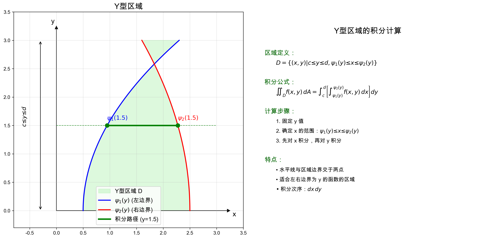
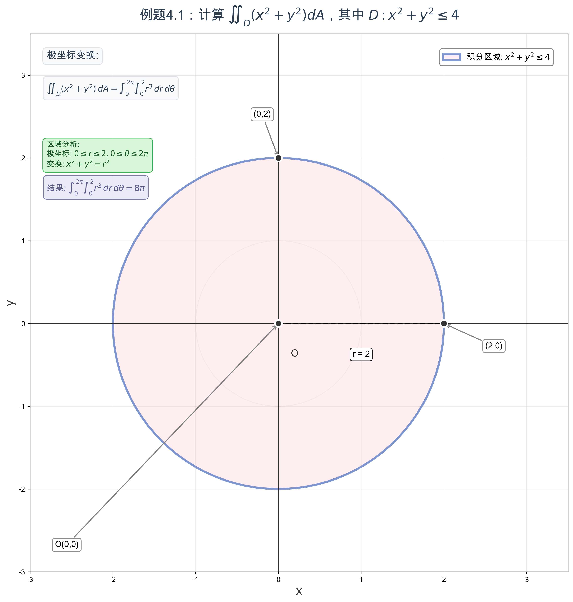
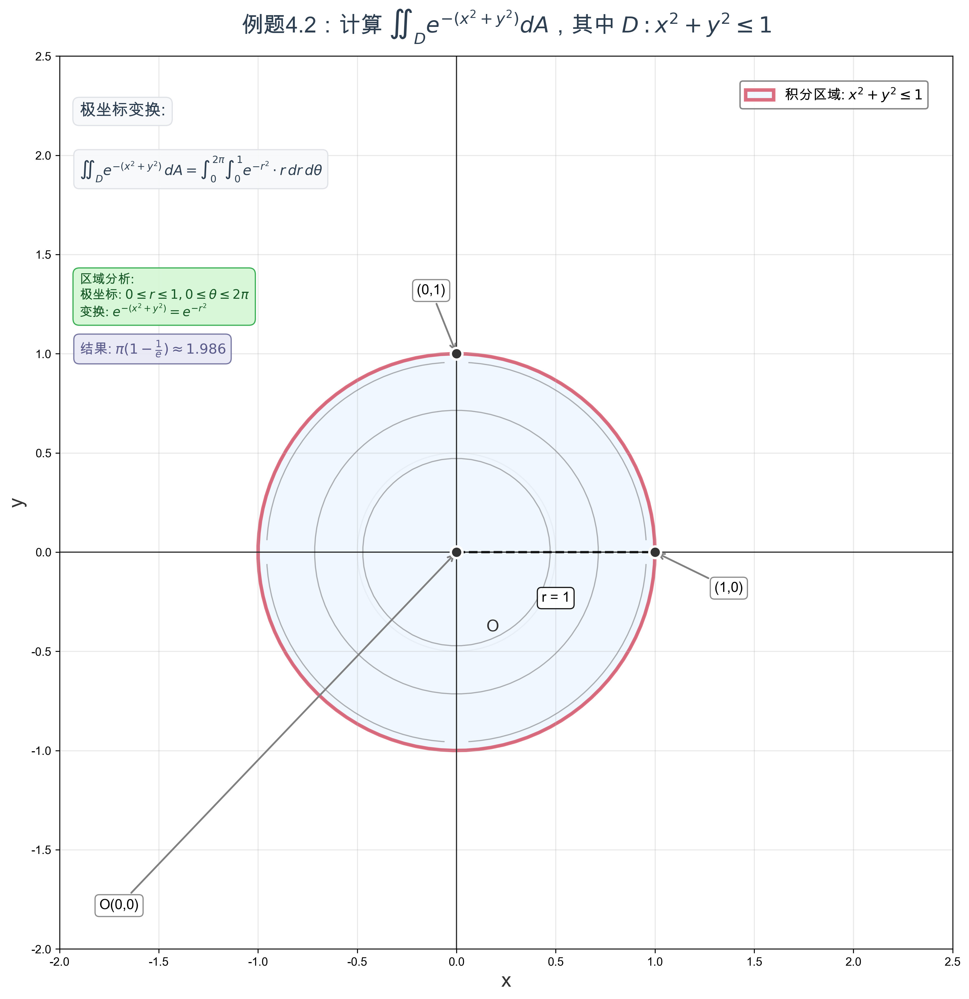
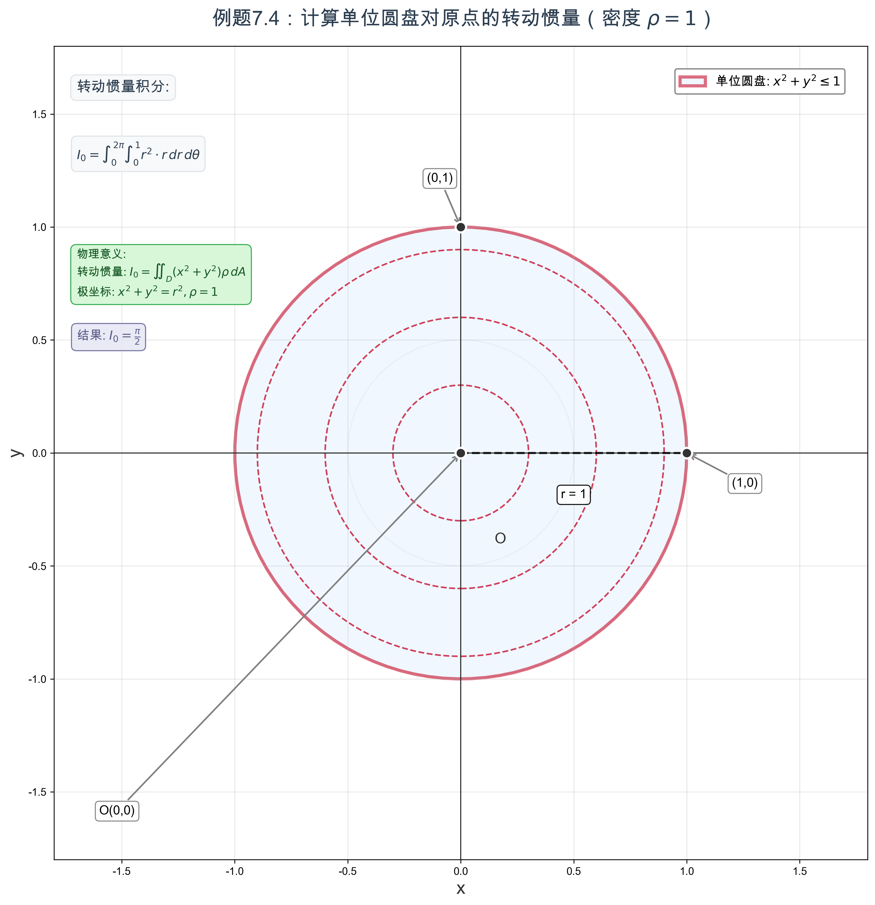
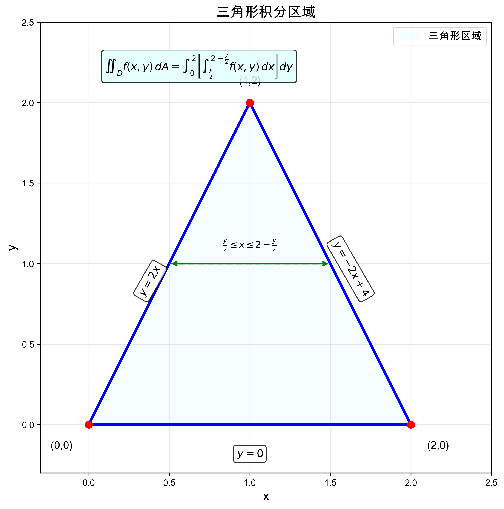

# 7.1 二重积分理论与计算
 
## 目录

1. [二重积分的定义](#1-二重积分的定义)
2. [二重积分的性质](#2-二重积分的性质)
3. [直角坐标系下的计算](#3-直角坐标系下的计算)
4. [极坐标变换](#4-极坐标变换)
5. [一般坐标变换](#5-一般坐标变换)
6. [对称性的利用](#6-对称性的利用)
7. [二重积分的应用](#7-二重积分的应用)
8. [计算技巧与注意事项](#8-计算技巧与注意事项)
9. [典型例题](#9-典型例题)

---

## 1. 二重积分的定义

### 1.1 二重积分的定义

> **定义1.1（二重积分）**
> 
> 设函数 $f(x, y)$ 在有界闭区域 $D$ 上有界，将 $D$ 任意分割成 $n$ 个小区域 $\Delta D_i$ （面积为 $\Delta A_i$），在每个 $\Delta D_i$ 内任取一点 $(\xi_i, \eta_i)$，作和式：
> $$S_n = \sum_{i=1}^{n} f(\xi_i, \eta_i) \Delta A_i$$
> 
> 如果当各小区域的直径的最大值趋于零时，上述和式的极限存在且与区域的分割方法和点的选取无关，则称此极限为函数 $f(x, y)$ 在区域 $D$ 上的**二重积分**，记作：
> $$\iint_D f(x, y) dA = \lim_{\lambda \to 0} \sum_{i=1}^{n} f(\xi_i, \eta_i) \Delta A_i$$

### 1.2 二重积分的几何意义

当 $f(x, y) \geq 0$ 时，二重积分 $\iint_D f(x, y) dA$ 表示以区域 $D$ 为底，以曲面 $z = f(x, y)$ 为顶的曲顶柱体的体积。


**物理意义**：
- 当 $f(x,y) = 1$ 时，二重积分等于区域 $D$ 的面积
- 当 $f(x,y)$ 表示面密度时，二重积分表示薄片的质量
- 当 $f(x,y)$ 表示压强时，二重积分表示总压力

### 1.3 二重积分的存在性

> **定理1.1（二重积分存在定理）**
> 
> 若函数 $f(x, y)$ 在有界闭区域 $D$ 上连续，则二重积分 $\iint_D f(x, y) dA$ 存在。

**推广**：若 $f(x,y)$ 在区域 $D$ 上除了有限个点或有限条光滑曲线上不连续外，在其余点连续且有界，则二重积分仍然存在。

---

## 2. 二重积分的性质

### 2.1 基本性质

1. **线性性**：
   $$\iint_D [af(x,y) + bg(x,y)] dA = a\iint_D f(x,y) dA + b\iint_D g(x,y) dA$$

2. **区域可加性**：若 $D = D_1 \cup D_2$ 且 $D_1 \cap D_2$ 的面积为零，则：
   $$\iint_D f(x,y) dA = \iint_{D_1} f(x,y) dA + \iint_{D_2} f(x,y) dA$$

3. **保序性**：若在 $D$ 上 $f(x,y) \leq g(x,y)$，则：
   $$\iint_D f(x,y) dA \leq \iint_D g(x,y) dA$$

4. **绝对值不等式**：
   $$\left|\iint_D f(x,y) dA\right| \leq \iint_D |f(x,y)| dA$$

### 2.2 二重积分的估值

> **定理2.1（二重积分估值定理）**
> 
> 设  $m$ 和 $M$ 分别是 $f(x,y)$ 在闭区域 $D$ 上的最小值和最大值， $S$ 是区域 $D$ 的面积，则：
> $$m \cdot S \leq \iint_D f(x,y) dA \leq M \cdot S$$

### 2.3 二重积分中值定理

> **定理2.2（二重积分中值定理）**
> 
> 若 $f(x, y)$ 在有界闭区域 $D$ 上连续，则至少存在一点 $(\xi, \eta) \in D$，使得：
> $$\iint_D f(x, y) dA = f(\xi, \eta) \cdot S$$

**几何意义**：存在某个高度 $f(\xi, \eta)$，使得以此高度为顶的柱体体积等于曲顶柱体的体积。

> **例题2.1**：利用二重积分中值定理估计积分 $\iint_D (x^2 + y^2) dA$ 的值，其中 $D$ 是单位圆 $x^2 + y^2 \leq 1$。

**解答**：
1. **确定函数的最值**：
   - 在区域 $D: x^2 + y^2 \leq 1$ 上
   - $f(x,y) = x^2 + y^2$ 的最小值： $m = 0$ （在原点处）
   - $f(x,y) = x^2 + y^2$ 的最大值： $M = 1$ （在边界 $x^2 + y^2 = 1$ 上）

2. **计算区域面积**：
   $S = \pi \cdot 1^2 = \pi$

3. **应用估值定理**：
   $$0 \cdot \pi \leq \iint_D (x^2 + y^2) dA \leq 1 \cdot \pi$$
   即： $$0 \leq \iint_D (x^2 + y^2) dA \leq \pi$$

4. **应用中值定理**：
   存在点 $(\xi, \eta) \in D$，使得：
   $$\iint_D (x^2 + y^2) dA = (\xi^2 + \eta^2) \cdot \pi$$

5. **精确计算验证**：
   使用极坐标： $\iint_D (x^2 + y^2) dA = \int_0^{2\pi} d\theta \int_0^1 r^2 \cdot r dr = \int_0^{2\pi} d\theta \int_0^1 r^3 dr = 2\pi \cdot \left[\frac{r^4}{4}\right]_0^1 = 2\pi \cdot \frac{1}{4} = \frac{\pi}{2}$
   
   因此 $\xi^2 + \eta^2 = \frac{1}{2}$，即中值点在圆 $x^2 + y^2 = \frac{1}{2}$ 上。

> **例题2.2**：设  $D = \{(x,y) | 0 \leq x \leq 1, 0 \leq y \leq 1\}$，利用中值定理分析积分 $\iint_D \sin(x+y) dA$。

**解答**：
1. **分析函数性质**：
   - 在 $D$ 上， $0 \leq x + y \leq 2$
   - $\sin(x+y)$ 在 $[0, 2]$ 上连续
   - 最小值： $\sin(0) = 0$
   - 最大值： $\sin(2) \approx 0.909$

2. **区域面积**： $S = 1$

3. **中值定理应用**：
   存在 $(\xi, \eta) \in D$，使得：
   $$\iint_D \sin(x+y) dA = \sin(\xi + \eta) \cdot 1 = \sin(\xi + \eta)$$

4. **估值**：
   $$0 \leq \iint_D \sin(x+y) dA \leq \sin(2)$$

**物理意义**：如果 $\sin(x+y)$ 表示某种密度分布，则中值定理告诉我们存在某点的密度值等于平均密度。

---

## 3. 直角坐标系下的计算

### 3.1 X型区域

> **定义3.1（X型区域）**
> 
> 区域 $D = \{(x, y) | a \leq x \leq b, \varphi_1(x) \leq y \leq \varphi_2(x)\}$ 称为X型区域。

**几何特征**：对于任意 $x \in [a,b]$，垂直线 $x =$ 常数与区域边界有两个交点。


**计算公式**：
$$\iint_D f(x, y) dA = \int_a^b dx \int_{\varphi_1(x)}^{\varphi_2(x)} f(x, y) dy$$

**积分顺序**：先对 $y$ 积分，再对 $x$ 积分


### 3.2 Y型区域

> **定义3.2（Y型区域）**
> 
> 区域 $D = \{(x, y) | c \leq y \leq d, \psi_1(y) \leq x \leq \psi_2(y)\}$ 称为Y型区域。

**几何特征**：对于任意 $y \in [c,d]$，水平线 $y =$ 常数与区域边界有两个交点。



**计算公式**：
$$\iint_D f(x, y) dA = \int_c^d dy \int_{\psi_1(y)}^{\psi_2(y)} f(x, y) dx$$

**积分顺序**：先对 $x$ 积分，再对 $y$ 积分


### 3.3 积分次序的选择

选择积分次序的原则：
1. **被积函数的特点**：选择使得内层积分容易计算的次序
2. **积分区域的形状**：选择使得积分限简单的次序
3. **避免分割区域**：选择不需要分割积分区域的次序


> **例题3.1**：计算 $\iint_D xy dA$，其中 $D$ 是由 $y = x$，$y = x^2$ 围成的区域。

**解答**：

**确定积分区域**：
- 交点： $x = x^2 \Rightarrow x(x-1) = 0 \Rightarrow x = 0, 1$
- 区域： $D = \{(x, y) | 0 \leq x \leq 1, x^2 \leq y \leq x\}$ （X型区域）

**区域图示**：


**计算积分**：
$$\iint_D xy dA = \int_0^1 x dx \int_{x^2}^x y dy$$
$$= \int_0^1 x \left[\frac{y^2}{2}\right]_{x^2}^x dx = \int_0^1 x \cdot \frac{x^2 - x^4}{2} dx$$
$$= \frac{1}{2} \int_0^1 (x^3 - x^5) dx = \frac{1}{2} \left[\frac{x^4}{4} - \frac{x^6}{6}\right]_0^1$$
$$= \frac{1}{2} \left(\frac{1}{4} - \frac{1}{6}\right) = \frac{1}{2} \cdot \frac{1}{12} = \frac{1}{24}$$

### 3.4 积分次序的选择

选择合适的积分次序可以简化计算：

> **例题3.2**：计算 $\iint_D e^{x^2} dA$，其中 $D = \{(x, y) | 0 \leq x \leq 1, 0 \leq y \leq x\}$。

**解答**：

**方法1**（按 $dydx$ 次序）：
$$\iint_D e^{x^2} dA = \int_0^1 dx \int_0^x e^{x^2} dy = \int_0^1 e^{x^2} \cdot x dx$$

由于 $\int e^{x^2} dx$ 无法用初等函数表示，此路不通。

**方法2**（按 $dxdy$ 次序）：
改写区域： $D = \{(x, y) | 0 \leq y \leq 1, y \leq x \leq 1\}$ （Y型区域）

$$\iint_D e^{x^2} dA = \int_0^1 dy \int_y^1 e^{x^2} dx$$

这仍然困难，但如果被积函数是 $e^{y^2}$，则第二种次序会更好。

### 3.5 复杂区域的分割处理

当积分区域无法用简单的X型或Y型区域表示时，需要进行区域分割。

> **例题3.3**：计算 $\iint_D x dA$，其中 $D$ 是由 $y = x^2$ 和 $y = 2 - x^2$ 围成的区域。

**解答**：

**第一步：确定交点**
$x^2 = 2 - x^2 \Rightarrow 2x^2 = 2 \Rightarrow x = \pm 1$

**第二步：分析区域**
- 在 $[-1, 1]$ 内，上边界是 $y = 2 - x^2$，下边界是 $y = x^2$
- 区域可以表示为X型： $D = \{(x,y) | -1 \leq x \leq 1, x^2 \leq y \leq 2-x^2\}$

**第三步：计算积分**
$$\iint_D x dA = \int_{-1}^1 x dx \int_{x^2}^{2-x^2} dy$$
$$= \int_{-1}^1 x(2-x^2-x^2) dx = \int_{-1}^1 x(2-2x^2) dx$$
$$= \int_{-1}^1 (2x - 2x^3) dx = 0$$

**说明**：由于被积函数 $f(x,y) = x$ 是关于 $x$ 的奇函数，且积分区域关于 $y$ 轴对称，所以积分值为0。

> **例题3.4**：计算 $\iint_D xy dA$，其中 $D$ 是由 $y = x^2$， $y = 2x-1$ 和 $x = 2$ 围成的区域。

**解答**：

**第一步：确定交点**
- $y = x^2$ 与 $y = 2x-1$ 的交点：$x^2 = 2x-1 \Rightarrow x^2-2x+1=0 \Rightarrow (x-1)^2=0 \Rightarrow x=1$
- 交点为 $(1,1)$
- $x = 2$ 与 $y = x^2$ 的交点：$(2,4)$  
- $x = 2$ 与 $y = 2x-1$ 的交点：$(2,3)$

**第二步：区域分割**
由于在 $x \in [1,2]$ 区间内，上边界是 $y = x^2$，下边界是 $y = 2x-1$，所以：
$$D = \{(x,y) | 1 \leq x \leq 2, 2x-1 \leq y \leq x^2\}$$

**第三步：计算积分**
$$\iint_D xy dA = \int_1^2 x dx \int_{2x-1}^{x^2} y dy$$
$$= \int_1^2 x \left[\frac{y^2}{2}\right]_{2x-1}^{x^2} dx$$
$$= \frac{1}{2}\int_1^2 x[x^4 - (2x-1)^2] dx$$
$$= \frac{1}{2}\int_1^2 x[x^4 - 4x^2 + 4x - 1] dx$$
$$= \frac{1}{2}\int_1^2 (x^5 - 4x^3 + 4x^2 - x) dx$$
$$= \frac{1}{2}\left[\frac{x^6}{6} - x^4 + \frac{4x^3}{3} - \frac{x^2}{2}\right]_1^2$$
$$= \frac{1}{2}\left[\left(\frac{64}{6} - 16 + \frac{32}{3} - 2\right) - \left(\frac{1}{6} - 1 + \frac{4}{3} - \frac{1}{2}\right)\right]$$
$$= \frac{37}{12}$$

---

## 4. 极坐标变换

### 4.1 极坐标变换公式

坐标变换：
$$x = r\cos\theta, \quad y = r\sin\theta$$

**雅可比行列式**：
$$J = \frac{\partial(x, y)}{\partial(r, \theta)} = \begin{vmatrix} \cos\theta & -r\sin\theta \\ \sin\theta & r\cos\theta \end{vmatrix} = r$$

**变换公式**：
$$\iint_D f(x, y) dxdy = \iint_{D'} f(r\cos\theta, r\sin\theta) \cdot r \, drd\theta$$


### 4.2 适用条件

极坐标变换适用于：
1. 积分区域为圆、扇形、环形等
2. 被积函数含有 $x^2 + y^2$、 $\sqrt{x^2 + y^2}$ 等形式

> **例题4.1**：计算 $\iint_D (x^2 + y^2) dA$，其中 $D: x^2 + y^2 \leq 4$。



**解答**：

**极坐标变换**：
- 区域： $D' = \{(r, \theta) | 0 \leq r \leq 2, 0 \leq \theta \leq 2\pi\}$
- 被积函数： $x^2 + y^2 = r^2$

**计算积分**：
$$\iint_D (x^2 + y^2) dA = \int_0^{2\pi} d\theta \int_0^2 r^2 \cdot r dr$$
$$= \int_0^{2\pi} d\theta \int_0^2 r^3 dr = 2\pi \cdot \left[\frac{r^4}{4}\right]_0^2 = 2\pi \cdot 4 = 8\pi$$

> **例题4.2**：计算 $\iint_D e^{-(x^2+y^2)} dA$，其中 $D: x^2 + y^2 \leq 1$。



**解答**：
$$\iint_D e^{-(x^2+y^2)} dA = \int_0^{2\pi} d\theta \int_0^1 e^{-r^2} \cdot r dr$$

令 $t = r^2$，则 $dt = 2r dr$，$r dr = \frac{1}{2} dt$：
$$= \int_0^{2\pi} d\theta \int_0^1 e^{-t} \cdot \frac{1}{2} dt = 2\pi \cdot \frac{1}{2} \left[-e^{-t}\right]_0^1$$
$$= \pi (1 - e^{-1}) = \pi \left(1 - \frac{1}{e}\right)$$

---

## 5. 一般坐标变换

### 5.1 坐标变换的一般公式

设坐标变换：
$$x = x(u, v), \quad y = y(u, v)$$

雅可比行列式：
$$J = \frac{\partial(x, y)}{\partial(u, v)} = \begin{vmatrix} \frac{\partial x}{\partial u} & \frac{\partial x}{\partial v} \\ \frac{\partial y}{\partial u} & \frac{\partial y}{\partial v} \end{vmatrix}$$

**变换公式**：
$$\iint_D f(x, y) dxdy = \iint_{D'} f(x(u,v), y(u,v)) |J| dudv$$

> **例题5.0**：计算坐标变换 $x = u + v, y = u - v$ 的雅可比行列式，并用此变换计算积分 $\iint_D (x + y) dxdy$，其中 $D$ 是由 $x + y = 0, x + y = 2, x - y = 0, x - y = 1$ 围成的区域。

**解答**：
1. **计算雅可比行列式**：
   $$\frac{\partial x}{\partial u} = 1, \quad \frac{\partial x}{\partial v} = 1$$
   $$\frac{\partial y}{\partial u} = 1, \quad \frac{\partial y}{\partial v} = -1$$
   
   $$J = \begin{vmatrix} 1 & 1 \\ 1 & -1 \end{vmatrix} = 1 \cdot (-1) - 1 \cdot 1 = -2$$
   
   因此 $|J| = 2$

2. **确定新的积分区域**：
   - 原区域边界： $x + y = 0, 2$ 和 $x - y = 0, 1$
   - 由于 $x + y = (u + v) + (u - v) = 2u$ 和 $x - y = (u + v) - (u - v) = 2v$
   - 新区域： $D' = \{(u,v) | 0 \leq 2u \leq 2, 0 \leq 2v \leq 1\}$
   - 即： $D' = \{(u,v) | 0 \leq u \leq 1, 0 \leq v \leq \frac{1}{2}\}$

3. **变换被积函数**：
   $x + y = 2u$

4. **计算积分**：
   $$\iint_D (x + y) dxdy = \iint_{D'} 2u \cdot |J| dudv = \iint_{D'} 2u \cdot 2 dudv$$
   $$= 4 \int_0^1 u du \int_0^{1/2} dv = 4 \cdot \frac{1}{2} \cdot \frac{1}{2} = 1$$

### 5.2 常用坐标变换

**椭圆坐标变换**：
$$x = ar\cos\theta, \quad y = br\sin\theta$$
$$J = abr$$

> **例题5.1**：计算椭圆 $\frac{x^2}{a^2} + \frac{y^2}{b^2} \leq 1$ 的面积。

**解答**：
使用椭圆坐标变换，区域变为： $0 \leq r \leq 1, 0 \leq \theta \leq 2\pi$

$$S = \iint_D 1 \, dxdy = \int_0^{2\pi} d\theta \int_0^1 ab \cdot r \, dr$$
$$= ab \int_0^{2\pi} d\theta \int_0^1 r \, dr = ab \cdot 2\pi \cdot \frac{1}{2} = \pi ab$$

---

## 6. 对称性的利用

### 6.1 轮换对称性

> **定理6.1（轮换对称性）**
> 
> 若积分区域 $D$ 关于直线 $y = x$ 对称，则：
> $$\iint_D f(x,y) dA = \iint_D f(y,x) dA$$

**推论**：
$$\iint_D [f(x,y) + f(y,x)] dA = 2\iint_D f(x,y) dA$$

### 6.2 奇偶对称性

> **定理6.2（奇偶对称性）**
> 
> 1. 若区域 $D$ 关于 $x$ 轴对称，且 $f(x,-y) = -f(x,y)$（关于 $y$ 为奇函数），则：
>    $$\iint_D f(x,y) dA = 0$$
> 
> 2. 若区域 $D$ 关于 $x$ 轴对称，且 $f(x,-y) = f(x,y)$（关于 $y$ 为偶函数），则：
>    $$\iint_D f(x,y) dA = 2\iint_{D_1} f(x,y) dA$$
>    其中 $D_1$ 是 $D$ 在上半平面的部分。

> **例题6.1**：计算 $\iint_D (x^3 + xy^2) dA$，其中 $D: x^2 + y^2 \leq 1$。

**解答**：

**利用奇偶性**：
1. 区域 $D$ 关于 $x$ 轴对称
2. $f(x,y) = x^3 + xy^2 = x(x^2 + y^2)$
3. $f(x,-y) = x(x^2 + (-y)^2) = x(x^2 + y^2) = f(x,y)$

因此 $f(x,y)$ 关于 $y$ 为偶函数，所以：
$$\iint_D (x^3 + xy^2) dA = 2\iint_{D_1} (x^3 + xy^2) dA$$

其中 $D_1$ 是上半圆 $\{(x,y) | x^2 + y^2 \leq 1, y \geq 0\}$。

但注意到 $D$ 也关于 $y$ 轴对称，而 $x^3 + xy^2$ 关于 $x$ 为奇函数，所以：
$$\iint_D (x^3 + xy^2) dA = 0$$

---

## 7. 二重积分的应用

### 7.1 几何应用

#### 7.1.1 计算平面图形的面积

区域 $D$ 的面积：
$$S = \iint_D 1 \, dA$$

> **例题7.1**：求由曲线 $y = x^2$ 和 $y = 2x$ 围成图形的面积。

**解答**：
1. **求交点**： $x^2 = 2x \Rightarrow x = 0, 2$
2. **确定区域**： $D = \{(x,y) | 0 \leq x \leq 2, x^2 \leq y \leq 2x\}$
3. **计算面积**：
   $$S = \iint_D 1 \, dA = \int_0^2 dx \int_{x^2}^{2x} dy = \int_0^2 (2x - x^2) dx$$
   $$= \left[x^2 - \frac{x^3}{3}\right]_0^2 = 4 - \frac{8}{3} = \frac{4}{3}$$

#### 7.1.2 计算曲面的体积

曲面 $z = f(x,y)$ 在区域 $D$ 上方的体积：
$$V = \iint_D f(x,y) dA$$

> **例题7.2**：计算由 $z = x^2 + y^2$ 与 $z = 2$ 围成的立体体积。


**解答**：
1. **确定投影区域**：$x^2 + y^2 \leq 2$
2. **体积计算**：
   $$V = \iint_D (2 - x^2 - y^2) dA$$
   
   使用极坐标：
   $$V = \int_0^{2\pi} d\theta \int_0^{\sqrt{2}} (2 - r^2) r dr$$
   $$= 2\pi \int_0^{\sqrt{2}} (2r - r^3) dr = 2\pi \left[r^2 - \frac{r^4}{4}\right]_0^{\sqrt{2}}$$
   $$= 2\pi \left(2 - 1\right) = 2\pi$$

### 7.2 物理应用

#### 7.2.1 质量与质心

**质量**：
$$m = \iint_D \rho(x,y) dA$$

**质心坐标**：
$$\bar{x} = \frac{1}{m}\iint_D x\rho(x,y) dA, \quad \bar{y} = \frac{1}{m}\iint_D y\rho(x,y) dA$$

> **例题7.3**：求三角形区域 $D: 0 \leq x \leq 1, 0 \leq y \leq 1-x$ 的质心，设密度 $\rho(x,y) = x + y$。

**解答**：
1. **计算质量**：
   $$m = \iint_D (x + y) dA = \int_0^1 dx \int_0^{1-x} (x + y) dy$$
   $$= \int_0^1 \left[xy + \frac{y^2}{2}\right]_0^{1-x} dx = \int_0^1 \left[x(1-x) + \frac{(1-x)^2}{2}\right] dx$$
   $$= \int_0^1 \left(\frac{3x}{2} - \frac{3x^2}{2} + \frac{1}{2}\right) dx = \frac{1}{2}$$

2. **计算质心的 $x$ 坐标**：
   $$\bar{x} = \frac{1}{m}\iint_D x(x + y) dA = 2\int_0^1 dx \int_0^{1-x} x(x + y) dy$$
   $$= 2\int_0^1 x\left[xy + \frac{y^2}{2}\right]_0^{1-x} dx = \frac{5}{12}$$

#### 7.2.2 转动惯量

**对 $x$ 轴的转动惯量**：
$$I_x = \iint_D y^2 \rho(x,y) dA$$

**对 $y$ 轴的转动惯量**：
$$I_y = \iint_D x^2 \rho(x,y) dA$$

**对原点的转动惯量**：
$$I_0 = \iint_D (x^2 + y^2) \rho(x,y) dA$$

> **例题7.4**：计算单位圆盘 $x^2 + y^2 \leq 1$ 对原点的转动惯量，设密度 $\rho = 1$。



**解答**：

**使用极坐标计算**：
$$I_0 = \iint_D (x^2 + y^2) \rho(x,y) dA = \iint_D (x^2 + y^2) \cdot 1 \, dA$$

在极坐标下：$x^2 + y^2 = r^2$，$dA = r \, dr \, d\theta$

区域：$D' = \{(r, \theta) | 0 \leq r \leq 1, 0 \leq \theta \leq 2\pi\}$

$$I_0 = \int_0^{2\pi} d\theta \int_0^1 r^2 \cdot r \, dr = \int_0^{2\pi} d\theta \int_0^1 r^3 \, dr$$

$$= 2\pi \int_0^1 r^3 \, dr = 2\pi \left[\frac{r^4}{4}\right]_0^1 = 2\pi \cdot \frac{1}{4} = \frac{\pi}{2}$$

**物理意义**：单位圆盘对原点的转动惯量为 $\frac{\pi}{2}$，这个结果在物理学中有重要应用。

---

## 8. 计算技巧与注意事项

### 8.1 常见计算技巧

1. **合理选择坐标系**：
   - 圆形、环形区域 → 极坐标
   - 椭圆区域 → 椭圆坐标
   - 矩形区域 → 直角坐标

2. **利用对称性**：
   - 奇偶性可简化计算
   - 轮换对称性可统一积分

3. **分解复杂区域**：
   - 将复杂区域分解为简单区域
   - 利用区域可加性

4. **合理选择积分次序**：
   - 使积分限简单
   - 使被积函数易于积分

### 8.2 常见错误与注意事项

1. **坐标变换时忘记雅可比行列式**
2. **积分限确定错误**
3. **对称性判断错误**
4. **积分次序选择不当**

> **易错例题**：计算 $\iint_D \frac{1}{\sqrt{x^2 + y^2}} dA$，其中 $D: 1 \leq x^2 + y^2 \leq 4$。

**常见错误**：直接用直角坐标计算

**正确方法**：使用极坐标
$$\iint_D \frac{1}{\sqrt{x^2 + y^2}} dA = \int_0^{2\pi} d\theta \int_1^2 \frac{1}{r} \cdot r dr = 2\pi \int_1^2 dr = 2\pi$$

**关键提醒**：遇到 $\sqrt{x^2 + y^2}$ 形式时，优先考虑极坐标变换。

### 8.2 积分次序选择的决策树

```
积分区域分析
    ↓
判断被积函数特点
    ↓

 含有某变量的复杂形式？         
 (如 e^{y²}, sin(y²) 等)      
 
    ↓ 是                    ↓ 否
让该变量在外层积分      ← → 分析区域形状
    ↓                          ↓
选择相应的积分次序      
    ↓                   X型？Y型？复杂？  
验证计算可行性         
    ↓                          ↓
确定最终积分表达式      选择最简单的次序
```

---

## 9. 典型例题

### 9.1 积分次序选择的重要性

> **例题9.1**：计算 $\iint_\sigma \frac{y^2}{x^2} d\sigma$，其中 $(\sigma)$ 是由 $y = x^2, y = x$ 围成的区域。


**解答**：

**第一步：分析积分区域**

由题意，积分区域由两条曲线围成：
- $y = x^2$（抛物线）
- $y = x$（直线）

**找交点**：
两曲线的交点满足：$x^2 = x$，即 $x^2 - x = 0$，$x(x-1) = 0$
所以交点为：$(0,0)$ 和 $(1,1)$

**第二步：选择积分次序**

**方法一：先积 $y$ 后积 $x$（X型区域，推荐）**

对于 $x \in [0, 1]$：
- 上边界：$y = x$
- 下边界：$y = x^2$

$$\iint_\sigma \frac{y^2}{x^2} d\sigma = \int_0^1 \int_{x^2}^x \frac{y^2}{x^2} dy dx$$

**方法二：先积 $x$ 后积 $y$（Y型区域）**

对于 $y \in [0, 1]$：
- 左边界：$x = \sqrt{y}$（从 $y = x^2$ 得到，$x \geq 0$）
- 右边界：$x = y$（从 $y = x$ 得到）

$$\iint_\sigma \frac{y^2}{x^2} d\sigma = \int_0^1 \int_{\sqrt{y}}^y \frac{y^2}{x^2} dx dy$$

注意：方法一更简单，因为避免了根号运算。

**第三步：计算积分（使用方法一）**

$$\iint_\sigma \frac{y^2}{x^2} d\sigma = \int_0^1 \int_{x^2}^x \frac{y^2}{x^2} dy dx$$

内层积分：
$$\int_{x^2}^x \frac{y^2}{x^2} dy = \frac{1}{x^2} \int_{x^2}^x y^2 dy = \frac{1}{x^2} \left[\frac{y^3}{3}\right]_{x^2}^x$$
$$= \frac{1}{x^2} \cdot \frac{1}{3}(x^3 - (x^2)^3) = \frac{1}{x^2} \cdot \frac{1}{3}(x^3 - x^6) = \frac{1}{3x^2}(x^3 - x^6)$$
$$= \frac{1}{3}(x - x^4) = \frac{x}{3} - \frac{x^4}{3}$$

外层积分：
$$\int_0^1 \left(\frac{x}{3} - \frac{x^4}{3}\right) dx = \frac{1}{3} \int_0^1 (x - x^4) dx$$
$$= \frac{1}{3} \left[\frac{x^2}{2} - \frac{x^5}{5}\right]_0^1 = \frac{1}{3} \left(\frac{1}{2} - \frac{1}{5}\right)$$
$$= \frac{1}{3} \cdot \frac{5-2}{10} = \frac{1}{3} \cdot \frac{3}{10} = \frac{1}{10}$$

**第四步：验证（使用方法二）**

$$\int_0^1 \int_{\sqrt{y}}^y \frac{y^2}{x^2} dx dy = \int_0^1 y^2 \int_{\sqrt{y}}^y x^{-2} dx dy$$
$$= \int_0^1 y^2 \left[-\frac{1}{x}\right]_{\sqrt{y}}^y dy = \int_0^1 y^2 \left(-\frac{1}{y} + \frac{1}{\sqrt{y}}\right) dy$$
$$= \int_0^1 y^2 \left(-\frac{1}{y} + \frac{1}{\sqrt{y}}\right) dy = \int_0^1 \left(-y + \frac{y^2}{\sqrt{y}}\right) dy$$
$$= \int_0^1 \left(-y + y^{3/2}\right) dy = \left[-\frac{y^2}{2} + \frac{2y^{5/2}}{5}\right]_0^1$$
$$= -\frac{1}{2} + \frac{2}{5} = \frac{-5+4}{10} = -\frac{1}{10}$$

**数学解释**：这个负值实际上是错误的，因为被积函数 $\frac{y^2}{x^2} \geq 0$，积分结果应该为正。错误来源于在 $x = 0$ 附近被积函数不连续，此方法在数学上不严格。正确结果应为 $\frac{1}{10}$。

**最终答案**：$\iint_\sigma \frac{y^2}{x^2} d\sigma = \frac{1}{10}$

---

### 9.2 被积函数特殊形式的处理

> **例题9.2**：计算 $\iint_\sigma e^{y^2} d\sigma$，其中 $(\sigma)$ 为直线 $y = x, y = 1, x = 0$ 围成的区域。



**解答**：

**第一步：分析积分区域**

积分区域是由三条直线围成的三角形：
- $y = x$（斜率为1的直线）
- $y = 1$（水平线）
- $x = 0$（y轴）

**顶点**：$(0,0)$, $(1,1)$, $(0,1)$

**第二步：积分次序分析**

**方法一：先积 $x$ 后积 $y$（Y型区域，推荐）**

注意到被积函数是 $e^{y^2}$，其原函数 $\int e^{y^2} dy$ 无法用初等函数表示。

但如果先对 $x$ 积分，被积函数中没有 $x$，积分会简化：

对于 $y \in [0, 1]$：
- 左边界：$x = 0$
- 右边界：$x = y$（从 $y = x$ 得到）

$$\iint_\sigma e^{y^2} d\sigma = \int_0^1 \int_0^y e^{y^2} dx dy$$

**方法二：先积 $y$ 后积 $x$（X型区域，不可行）**

对于 $x \in [0, 1]$：
- 下边界：$y = x$
- 上边界：$y = 1$

$$\iint_\sigma e^{y^2} d\sigma = \int_0^1 \int_x^1 e^{y^2} dy dx$$

由于 $\int e^{y^2} dy$ 无初等函数形式，此方法不可行。

**第三步：计算积分（使用方法一）**

$$\iint_\sigma e^{y^2} d\sigma = \int_0^1 \int_0^y e^{y^2} dx dy$$

内层积分（$e^{y^2}$ 对 $x$ 的积分）：
$$\int_0^y e^{y^2} dx = e^{y^2} \int_0^y dx = e^{y^2} \cdot y = y e^{y^2}$$

外层积分：
$$\int_0^1 y e^{y^2} dy$$

使用换元法，令 $u = y^2$，则 $du = 2y dy$，$y dy = \frac{1}{2} du$：
- 当 $y = 0$ 时，$u = 0$
- 当 $y = 1$ 时，$u = 1$

$$\int_0^1 y e^{y^2} dy = \int_0^1 e^u \cdot \frac{1}{2} du = \frac{1}{2} \int_0^1 e^u du$$
$$= \frac{1}{2} [e^u]_0^1 = \frac{1}{2}(e^1 - e^0) = \frac{1}{2}(e - 1) = \frac{e-1}{2}$$

**第四步：结果验证**

我们可以通过几何直观验证：积分区域是面积为 $\frac{1}{2}$ 的三角形，被积函数 $e^{y^2}$ 在 $[0,1]$ 上的值在 $[1, e]$ 之间，所以积分结果应该在 $\frac{1}{2} \times 1 = \frac{1}{2}$ 到 $\frac{1}{2} \times e = \frac{e}{2}$ 之间。

我们的结果 $\frac{e-1}{2} \approx \frac{2.718-1}{2} = \frac{1.718}{2} = 0.859$ 确实在这个范围内，验证了计算的正确性。

**最终答案**：$\iint_\sigma e^{y^2} d\sigma = \frac{e-1}{2}$

---

### 9.3 例题总结与方法对比

#### 积分次序选择的指导原则

1. **被积函数分析**：
   - 如果被积函数含有某个变量的复杂形式（如 $e^{y^2}$、$\sin(y^2)$ 等），优先让该变量在外层积分
   - 如果被积函数可以因式分解，选择使计算简化的次序

2. **积分区域形状**：
   - X型区域：垂直线与边界有两个交点，适合 $dy dx$ 次序
   - Y型区域：水平线与边界有两个交点，适合 $dx dy$ 次序
   - 复杂区域：可能需要分割或选择合适的坐标变换

3. **积分难度评估**：
   - 尝试写出两种次序的积分表达式
   - 比较内层积分的复杂程度
   - 选择内层积分易于计算的次序

#### 常见错误与避免方法

**错误1**：盲目选择积分次序
- **避免方法**：先分析被积函数的形式，再确定次序

**错误2**：积分区域描述错误
- **避免方法**：仔细画图，明确边界函数和交点

**错误3**：换元计算错误
- **避免方法**：换元后要相应改变积分限，检查符号

这两个例题充分展示了**正确选择积分次序**的重要性，这是二重积分计算中的关键技巧。
