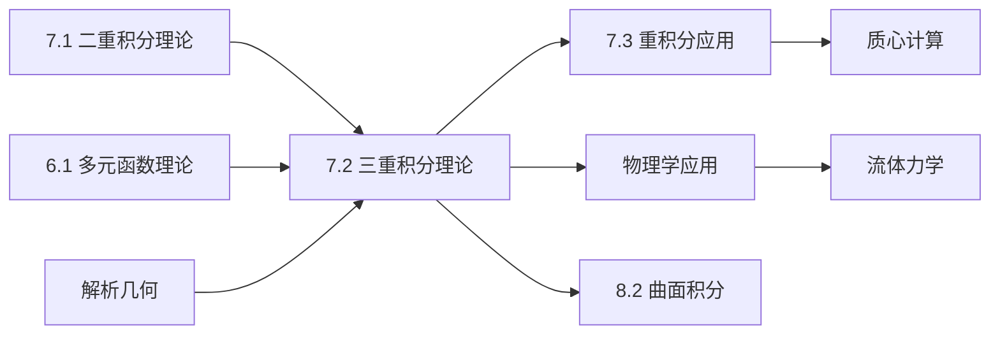

# 7.2 三重积分理论与计算

---

## 章节概览

### 学习目标
1. **概念理解**：深刻理解三重积分的定义和几何意义，掌握三重积分的基本性质
2. **计算方法**：熟练掌握直角坐标系、柱坐标系和球坐标系下三重积分的计算
3. **积分区域**：能够正确分析和描述各种类型的三维积分区域
4. **坐标选择**：根据积分区域和被积函数的特点选择最合适的坐标系
5. **实际应用**：理解三重积分在物理学中的重要应用

### 重点难点

> **重点内容**
> - 三重积分的定义和几何意义
> - 直角坐标系下的三重积分计算
> - 柱坐标系和球坐标系的变换及计算
> - 积分区域的正确描述和分析
> - 三重积分的对称性应用

> **难点内容**
> - 复杂三维区域的分析和描述
> - 球坐标系变换的熟练运用
> - 积分次序的合理选择
> - 不同坐标系之间的转换
> - 被积函数的奇偶性分析

### 知识架构

```
三重积分理论与计算
├── 三重积分基本理论
│   ├── 定义与几何意义
│   ├── 存在性条件
│   ├── 基本性质
│   └── 物理意义
├── 直角坐标系计算
│   ├── 投影法计算
│   ├── 截面法计算
│   ├── 积分次序选择
│   └── 复杂区域处理
├── 柱坐标系计算
│   ├── 柱坐标变换公式
│   ├── 适用区域类型
│   ├── 计算步骤
│   └── 典型例题
├── 球坐标系计算
│   ├── 球坐标变换公式
│   ├── 球对称区域
│   ├── 角度范围确定
│   └── 计算技巧
└── 对称性与特殊技巧
    ├── 奇偶性利用
    ├── 轮换对称性
    ├── 积分估值
    └── 数值方法简介
```

### 与其他章节的联系



---

## 目录

1. [三重积分的概念](#1-三重积分的概念)
2. [直角坐标系下的三重积分](#2-直角坐标系下的三重积分)
3. [柱坐标系下的三重积分](#3-柱坐标系下的三重积分)
4. [球坐标系下的三重积分](#4-球坐标系下的三重积分)
5. [三重积分的对称性](#5-三重积分的对称性)
6. [本章知识点总结](#6-本章知识点总结)

---

## 1. 三重积分的概念

### 1.1 三重积分的定义

> **定义1.1（三重积分）**
> 
> 设函数 $f(x,y,z)$ 在有界闭区域 $\Omega$ 上有界，将区域 $\Omega$ 任意分割成 $n$ 个小区域 $\Delta \Omega_1, \Delta \Omega_2, \ldots, \Delta \Omega_n$，各小区域的体积分别为 $\Delta V_1, \Delta V_2, \ldots, \Delta V_n$。在每个 $\Delta \Omega_i$ 上任取一点 $(\xi_i, \eta_i, \zeta_i)$，作积分和：
> $$S_n = \sum_{i=1}^{n} f(\xi_i, \eta_i, \zeta_i) \Delta V_i$$
> 
> 如果当所有小区域的直径趋于零时，积分和 $S_n$ 的极限存在且不依赖于区域的分割方式和点的选取方式，则称此极限为函数 $f(x,y,z)$ 在区域 $\Omega$ 上的**三重积分**，记作：
> $$\iiint_\Omega f(x,y,z) \, dV = \lim_{\lambda \to 0} \sum_{i=1}^{n} f(\xi_i, \eta_i, \zeta_i) \Delta V_i$$
> 
> 其中 $\lambda$ 是所有小区域直径的最大值， $dV = dx \, dy \, dz$ 称为体积元素。

### 1.2 三重积分的几何意义

> **几何意义**
> 
> 当 $f(x,y,z) = 1$ 时，三重积分 $\iiint_\Omega 1 \, dV$ 表示区域 $\Omega$ 的体积。

**物理意义**：
- 当 $f(x,y,z)$ 表示密度函数时，三重积分表示物体的质量
- 当 $f(x,y,z)$ 表示温度分布时，三重积分可以计算平均温度
- 当 $f(x,y,z)$ 表示电荷密度时，三重积分表示总电荷量

### 1.3 三重积分的性质

三重积分具有与二重积分类似的性质：

> **基本性质**
> 
> 1. **线性性**： $\iiint_\Omega [αf + βg] \, dV = α\iiint_\Omega f \, dV + β\iiint_\Omega g \, dV$
> 2. **区域可加性**：若 $\Omega = \Omega_1 \cup \Omega_2$ 且内部不重叠，则 $\iiint_\Omega f \, dV = \iiint_{\Omega_1} f \, dV + \iiint_{\Omega_2} f \, dV$
> 3. **保序性**：若 $f \leq g$，则 $\iiint_\Omega f \, dV \leq \iiint_\Omega g \, dV$

---

## 2. 直角坐标系下的三重积分

### 2.1 长方体区域上的三重积分

对于长方体区域 $\Omega = \{(x,y,z): a \leq x \leq b, c \leq y \leq d, p \leq z \leq q\}$：

> **Fubini定理的推广**
> 
> $$\iiint_\Omega f(x,y,z) \, dx \, dy \, dz = \int_a^b \left[\int_c^d \left[\int_p^q f(x,y,z) \, dz\right] dy\right] dx$$

积分次序可以任意改变，共有 $3! = 6$ 种不同的积分次序。

### 2.2 投影法计算三重积分

> **投影法**
> 
> 设区域 $\Omega$ 在 $xy$ 平面上的投影为 $D_{xy}$，对于 $xy$ 平面上的每一点 $(x,y) \in D_{xy}$，相应的纵线与区域 $\Omega$ 的交线为 $z_1(x,y) \leq z \leq z_2(x,y)$，则：
> $$\iiint_\Omega f(x,y,z) \, dx \, dy \, dz = \iint_{D_{xy}} \left[\int_{z_1(x,y)}^{z_2(x,y)} f(x,y,z) \, dz\right] dx \, dy$$

**计算步骤**：
1. 确定积分区域在坐标平面上的投影
2. 确定穿过投影区域内任一点的直线与积分区域的交线
3. 建立三重积分的累次积分表达式

> **例题2.1**：计算 $\iiint_\Omega xyz \, dx \, dy \, dz$，其中 $\Omega$ 是由平面 $x = 0, y = 0, z = 0, x + y + z = 1$ 围成的四面体。

**解答**：

**步骤1：分析积分区域**
四面体的顶点为 $(0,0,0)$、 $(1,0,0)$、 $(0,1,0)$、 $(0,0,1)$

在 $xy$ 平面上的投影为： $D_{xy} = \{(x,y): x \geq 0, y \geq 0, x + y \leq 1\}$

对于点 $(x,y) \in D_{xy}$，$z$ 的范围为： $0 \leq z \leq 1 - x - y$

**步骤2：建立累次积分**
$$\iiint_\Omega xyz \, dx \, dy \, dz = \iint_{D_{xy}} \left[\int_0^{1-x-y} xyz \, dz\right] dx \, dy$$

**步骤3：计算积分**
内层积分：
$$\int_0^{1-x-y} xyz \, dz = xy \int_0^{1-x-y} z \, dz = xy \cdot \frac{z^2}{2}\bigg|_0^{1-x-y} = \frac{xy(1-x-y)^2}{2}$$

中间积分：
$$\iint_{D_{xy}} \frac{xy(1-x-y)^2}{2} \, dx \, dy = \frac{1}{2} \int_0^1 \left[\int_0^{1-x} xy(1-x-y)^2 \, dy\right] dx$$

设  $u = 1-x-y$，则 $y = 1-x-u$，$dy = -du$：
$$\int_0^{1-x} xy(1-x-y)^2 \, dy = x \int_x^1 (1-x-u)u^2(-du) = x \int_0^{1-x} (1-x-u)u^2 \, du$$
$$= x(1-x)\int_0^{1-x} u^2 \, du - x\int_0^{1-x} u^3 \, du$$
$$= x(1-x) \cdot \frac{(1-x)^3}{3} - x \cdot \frac{(1-x)^4}{4} = \frac{x(1-x)^4}{3} - \frac{x(1-x)^4}{4} = \frac{x(1-x)^4}{12}$$

外层积分：
$$\frac{1}{2} \int_0^1 \frac{x(1-x)^4}{12} \, dx = \frac{1}{24} \int_0^1 x(1-x)^4 \, dx$$

使用 Beta 函数： $\int_0^1 x^{m-1}(1-x)^{n-1} \, dx = B(m,n) = \frac{\Gamma(m)\Gamma(n)}{\Gamma(m+n)}$

$$\int_0^1 x(1-x)^4 \, dx = B(2,5) = \frac{\Gamma(2)\Gamma(5)}{\Gamma(7)} = \frac{1! \cdot 4!}{6!} = \frac{24}{720} = \frac{1}{30}$$

因此：
$$\iiint_\Omega xyz \, dx \, dy \, dz = \frac{1}{24} \cdot \frac{1}{30} = \frac{1}{720}$$

### 2.3 截面法计算三重积分

> **截面法**
> 
> 用平行于某个坐标平面的平面族截积分区域，每个截面都得到一个平面区域，然后在该平面区域上进行二重积分。

例如，用平面 $z = $ 常数截区域 $\Omega$，得到截面 $D(z)$：
$$\iiint_\Omega f(x,y,z) \, dx \, dy \, dz = \int_{z_1}^{z_2} \left[\iint_{D(z)} f(x,y,z) \, dx \, dy\right] dz$$

---

## 3. 柱坐标系下的三重积分

### 3.1 柱坐标系变换

> **柱坐标变换公式**：
> $$\begin{cases}
> x = r\cos\theta \\
> y = r\sin\theta \\
> z = z
> \end{cases}$$
> 
> **体积元素变换**： $dx \, dy \, dz = r \, dr \, d\theta \, dz$

**Jacobian行列式**：
$$J = \frac{\partial(x,y,z)}{\partial(r,\theta,z)} = \begin{vmatrix}
\cos\theta & -r\sin\theta & 0 \\
\sin\theta & r\cos\theta & 0 \\
0 & 0 & 1
\end{vmatrix} = r$$

### 3.2 柱坐标系下三重积分的计算

> **柱坐标系下的三重积分**
> 
> $$\iiint_\Omega f(x,y,z) \, dx \, dy \, dz = \iiint_{\Omega'} f(r\cos\theta, r\sin\theta, z) \cdot r \, dr \, d\theta \, dz$$

### 3.3 柱坐标系的适用条件

**适用情况**：
1. 积分区域关于 $z$ 轴具有旋转对称性
2. 被积函数含有 $x^2 + y^2$ 或 $\sqrt{x^2 + y^2}$
3. 积分区域为圆柱形、圆锥形等

> **例题3.1**：计算 $\iiint_\Omega (x^2 + y^2) \, dx \, dy \, dz$，其中 $\Omega$ 是圆柱体 $x^2 + y^2 \leq a^2, 0 \leq z \leq h$。

**解答**：

**使用柱坐标变换**：
- 区域描述： $0 \leq r \leq a, 0 \leq \theta \leq 2\pi, 0 \leq z \leq h$
- 被积函数： $x^2 + y^2 = r^2$

$$\iiint_\Omega (x^2 + y^2) \, dx \, dy \, dz = \int_0^{2\pi} \int_0^a \int_0^h r^2 \cdot r \, dz \, dr \, d\theta$$

$$= \int_0^{2\pi} \int_0^a \int_0^h r^3 \, dz \, dr \, d\theta = \int_0^{2\pi} \int_0^a r^3 \cdot h \, dr \, d\theta$$

$$= h \int_0^{2\pi} \left[\frac{r^4}{4}\right]_0^a d\theta = h \int_0^{2\pi} \frac{a^4}{4} \, d\theta = \frac{ha^4}{4} \cdot 2\pi = \frac{\pi ha^4}{2}$$

> **例题3.2**：计算 $\iiint_\Omega z \, dx \, dy \, dz$，其中 $\Omega$ 是由抛物面 $z = x^2 + y^2$ 和平面 $z = 4$ 围成的区域。

**解答**：

**区域分析**：
- 抛物面 $z = x^2 + y^2$ 与平面 $z = 4$ 的交线： $x^2 + y^2 = 4$
- 在 $xy$ 平面上的投影： $x^2 + y^2 \leq 4$

**使用柱坐标**：
- 区域描述： $0 \leq r \leq 2, 0 \leq \theta \leq 2\pi, r^2 \leq z \leq 4$

$$\iiint_\Omega z \, dx \, dy \, dz = \int_0^{2\pi} \int_0^2 \int_{r^2}^4 z \cdot r \, dz \, dr \, d\theta$$

内层积分：
$$\int_{r^2}^4 z \, dz = \frac{z^2}{2}\bigg|_{r^2}^4 = \frac{16 - r^4}{2}$$

中层积分：
$$\int_0^2 \frac{16 - r^4}{2} \cdot r \, dr = \frac{1}{2} \int_0^2 (16r - r^5) \, dr = \frac{1}{2}\left[8r^2 - \frac{r^6}{6}\right]_0^2$$
$$= \frac{1}{2}\left(32 - \frac{64}{6}\right) = \frac{1}{2} \cdot \frac{192 - 64}{6} = \frac{128}{12} = \frac{32}{3}$$

外层积分：
$$\int_0^{2\pi} \frac{32}{3} \, d\theta = \frac{32}{3} \cdot 2\pi = \frac{64\pi}{3}$$

---

## 4. 球坐标系下的三重积分

### 4.1 球坐标系变换

> **球坐标变换公式**：
> $$\begin{cases}
> x = r\sin\varphi\cos\theta \\
> y = r\sin\varphi\sin\theta \\
> z = r\cos\varphi
> \end{cases}$$
> 
> 其中： $r \geq 0$ (径向距离)， $0 \leq \varphi \leq \pi$ (极角)， $0 \leq \theta \leq 2\pi$ (方位角)
> 
> **体积元素变换**： $dx \, dy \, dz = r^2\sin\varphi \, dr \, d\varphi \, d\theta$

**Jacobian行列式**：
$$J = \frac{\partial(x,y,z)}{\partial(r,\varphi,\theta)} = r^2\sin\varphi$$

### 4.2 球坐标系下三重积分的计算

> **球坐标系下的三重积分**
> 
> $$\iiint_\Omega f(x,y,z) \, dx \, dy \, dz = \iiint_{\Omega'} f(r\sin\varphi\cos\theta, r\sin\varphi\sin\theta, r\cos\varphi) \cdot r^2\sin\varphi \, dr \, d\varphi \, d\theta$$

### 4.3 球坐标系的适用条件

**适用情况**：
1. 积分区域为球、球壳、球扇形等
2. 被积函数含有 $x^2 + y^2 + z^2$ 或 $\sqrt{x^2 + y^2 + z^2}$
3. 积分区域关于原点具有球对称性

> **例题4.1**：计算 $\iiint_\Omega (x^2 + y^2 + z^2) \, dx \, dy \, dz$，其中 $\Omega$ 是球 $x^2 + y^2 + z^2 \leq a^2$。

**解答**：

**使用球坐标变换**：
- 区域描述： $0 \leq r \leq a, 0 \leq \varphi \leq \pi, 0 \leq \theta \leq 2\pi$
- 被积函数： $x^2 + y^2 + z^2 = r^2$

$$\iiint_\Omega (x^2 + y^2 + z^2) \, dx \, dy \, dz = \int_0^{2\pi} \int_0^\pi \int_0^a r^2 \cdot r^2\sin\varphi \, dr \, d\varphi \, d\theta$$

$$= \int_0^{2\pi} \int_0^\pi \int_0^a r^4\sin\varphi \, dr \, d\varphi \, d\theta$$

内层积分：
$$\int_0^a r^4 \, dr = \frac{r^5}{5}\bigg|_0^a = \frac{a^5}{5}$$

中层积分：
$$\int_0^\pi \sin\varphi \, d\varphi = [-\cos\varphi]_0^\pi = -(-1 - 1) = 2$$

外层积分：
$$\int_0^{2\pi} d\theta = 2\pi$$

因此：
$$\iiint_\Omega (x^2 + y^2 + z^2) \, dx \, dy \, dz = \frac{a^5}{5} \cdot 2 \cdot 2\pi = \frac{4\pi a^5}{5}$$

> **例题4.2**：计算 $\iiint_\Omega z^2 \, dx \, dy \, dz$，其中 $\Omega$ 是球 $x^2 + y^2 + z^2 \leq a^2$ 在第一卦限的部分。

**解答**：

**区域分析**：
第一卦限： $x \geq 0, y \geq 0, z \geq 0$

**球坐标表示**：
- $0 \leq r \leq a$
- $0 \leq \varphi \leq \frac{\pi}{2}$ (保证 $z \geq 0$)
- $0 \leq \theta \leq \frac{\pi}{2}$ (保证 $x \geq 0, y \geq 0$)
- $z^2 = r^2\cos^2\varphi$

$$\iiint_\Omega z^2 \, dx \, dy \, dz = \int_0^{\pi/2} \int_0^{\pi/2} \int_0^a r^2\cos^2\varphi \cdot r^2\sin\varphi \, dr \, d\varphi \, d\theta$$

$$= \int_0^{\pi/2} \int_0^{\pi/2} \int_0^a r^4\cos^2\varphi\sin\varphi \, dr \, d\varphi \, d\theta$$

内层积分：
$$\int_0^a r^4 \, dr = \frac{a^5}{5}$$

中层积分： $\int_0^{\pi/2} \cos^2\varphi\sin\varphi \, d\varphi$
令 $u = \cos\varphi$，$du = -\sin\varphi \, d\varphi$：
$$\int_0^{\pi/2} \cos^2\varphi\sin\varphi \, d\varphi = -\int_1^0 u^2 \, du = \int_0^1 u^2 \, du = \frac{1}{3}$$

外层积分：
$$\int_0^{\pi/2} d\theta = \frac{\pi}{2}$$

因此：
$$\iiint_\Omega z^2 \, dx \, dy \, dz = \frac{a^5}{5} \cdot \frac{1}{3} \cdot \frac{\pi}{2} = \frac{\pi a^5}{30}$$

---

## 5. 三重积分的对称性

### 5.1 奇偶性的应用

> **奇偶性定理**
> 
> 若积分区域 $\Omega$ 关于某个坐标平面对称，被积函数关于相应坐标变量具有奇偶性，则：
> - 若被积函数关于该变量为奇函数，则积分值为 0
> - 若被积函数关于该变量为偶函数，则积分等于在对称区域一半上积分的 2 倍

> **例题5.1**：计算 $\iiint_\Omega xyz \, dx \, dy \, dz$，其中 $\Omega$ 是球 $x^2 + y^2 + z^2 \leq 1$。

**解答**：

**利用对称性**：
球关于三个坐标平面都对称，而 $xyz$ 关于每个变量都是奇函数，因此：
$$\iiint_\Omega xyz \, dx \, dy \, dz = 0$$

### 5.2 轮换对称性

> **轮换对称性**
> 
> 若积分区域对于坐标变量的轮换对称，则积分值对变量轮换不变。

> **例题5.2**：计算 $\iiint_\Omega (x^2 + y^2 + z^2) \, dx \, dy \, dz$，其中 $\Omega$ 是四面体 $x \geq 0, y \geq 0, z \geq 0, x + y + z \leq 1$。

**解答**：

**利用轮换对称性**：
由于区域对 $x, y, z$ 轮换对称，所以：
$$\iiint_\Omega x^2 \, dx \, dy \, dz = \iiint_\Omega y^2 \, dx \, dy \, dz = \iiint_\Omega z^2 \, dx \, dy \, dz$$

因此：
$$\iiint_\Omega (x^2 + y^2 + z^2) \, dx \, dy \, dz = 3\iiint_\Omega x^2 \, dx \, dy \, dz$$

计算 $\iiint_\Omega x^2 \, dx \, dy \, dz$：
$$\iiint_\Omega x^2 \, dx \, dy \, dz = \int_0^1 \int_0^{1-x} \int_0^{1-x-y} x^2 \, dz \, dy \, dx$$

$$= \int_0^1 \int_0^{1-x} x^2(1-x-y) \, dy \, dx = \int_0^1 x^2 \left[(1-x)y - \frac{y^2}{2}\right]_0^{1-x} dx$$

$$= \int_0^1 x^2 \left[(1-x)^2 - \frac{(1-x)^2}{2}\right] dx = \int_0^1 x^2 \cdot \frac{(1-x)^2}{2} \, dx$$

$$= \frac{1}{2} \int_0^1 x^2(1-x)^2 \, dx = \frac{1}{2} \cdot B(3,3) = \frac{1}{2} \cdot \frac{\Gamma(3)\Gamma(3)}{\Gamma(6)} = \frac{1}{2} \cdot \frac{4}{120} = \frac{1}{60}$$

因此：
$$\iiint_\Omega (x^2 + y^2 + z^2) \, dx \, dy \, dz = 3 \cdot \frac{1}{60} = \frac{1}{20}$$

---

## 6. 本章知识点总结

### 6.1 核心概念总结

> **三重积分的核心框架**
> 
> 1. **定义理解**：三重积分是对三维区域上函数值的"加权求和"
> 2. **几何意义**：当 $f = 1$ 时表示区域体积
> 3. **物理意义**：质量、电荷量、热量等物理量的计算
> 4. **计算方法**：根据区域特点选择合适的坐标系

### 6.2 坐标系选择指南

| **坐标系** | **适用区域** | **被积函数特点** | **体积元素** |
|------------|--------------|------------------|--------------|
| 直角坐标 | 长方体、平行六面体 | 一般函数 | $dx \, dy \, dz$ |
| 柱坐标 | 圆柱、圆锥、旋转体 | 含 $x^2+y^2$ | $r \, dr \, d\theta \, dz$ |
| 球坐标 | 球、球壳、球锥 | 含 $x^2+y^2+z^2$ | $r^2\sin\varphi \, dr \, d\varphi \, d\theta$ |

### 6.3 计算技巧总结

> **解题策略**
> 
> 1. **区域分析**：明确积分区域的形状和对称性
> 2. **坐标选择**：根据区域和函数特点选择最合适的坐标系
> 3. **积分次序**：选择使计算简化的积分次序
> 4. **对称性利用**：充分利用区域和函数的对称性质
> 5. **分割区域**：必要时将复杂区域分割为简单区域

### 6.4 常见积分区域

> **典型区域及其描述**
> 
> 1. **球体**： $x^2 + y^2 + z^2 \leq a^2$，适用球坐标
> 2. **圆柱体**： $x^2 + y^2 \leq a^2, 0 \leq z \leq h$，适用柱坐标
> 3. **四面体**： $x,y,z \geq 0, x+y+z \leq 1$，适用直角坐标
> 4. **圆锥**： $x^2 + y^2 \leq z^2, 0 \leq z \leq h$，适用柱坐标或球坐标

### 6.5 考研重点

> **高频考点**
> 
> - ⭐⭐⭐ 三重积分的计算（各种坐标系）
> - ⭐⭐⭐ 坐标系的正确选择
> - ⭐⭐ 球坐标系的熟练运用
> - ⭐⭐ 对称性质的应用
> - ⭐ 复杂区域的分析和处理

### 6.6 学习建议

> **学习方法**
> 
> 1. **立体几何基础**：加强空间想象能力，能够准确描述三维区域
> 2. **坐标变换熟练**：熟练掌握各种坐标系的变换公式
> 3. **计算练习**：大量练习不同坐标系下的积分计算
> 4. **对称性敏感**：培养识别和利用对称性的能力
> 5. **物理联系**：理解三重积分在物理学中的应用

### 6.7 与后续内容的联系

本章为以下内容奠定基础：
- **重积分应用**：质心、转动惯量、引力等的计算
- **曲面积分**：在曲面上的积分
- **向量场论**：散度定理等
- **物理学应用**：电磁学、流体力学等

### 6.8 坐标系选择的详细指导

> **坐标系选择决策表**
> 
> | **积分区域特征** | **被积函数特征** | **推荐坐标系** | **选择理由** |
> |:-----------------|:-----------------|:---------------|:-------------|
> | 长方体、平行六面体 | 一般函数 | 直角坐标 | 积分限简单 |
> | 圆柱、圆锥、旋转椭球面 | 含 $x^2+y^2$ | 柱坐标 | 消除根号，简化计算 |
> | 球、球壳、球锥 | 含 $x^2+y^2+z^2$ | 球坐标 | 充分利用球对称性 |
> | 椭球体 | 二次型函数 | 椭球坐标 | 标准化椭球方程 |

> **坐标系转换的常见误区**
> 
> 1. **Jacobian行列式的计算和应用**：
>    - 误区：忘记乘以Jacobian行列式
>    - 正确： $dV = |J| \, du \, dv \, dw$
> 
> 2. **角度范围的确定**：
>    - 误区：球坐标中 $\varphi$ 和 $\theta$ 的范围搞混
>    - 正确： $0 \leq \varphi \leq \pi$，$0 \leq \theta \leq 2\pi$
> 
> 3. **积分次序的选择**：
>    - 误区：盲目按照 $r$、 $\theta$、 $\varphi$ 的顺序积分
>    - 正确：根据具体问题选择最合适的积分次序

### 6.9 常见积分区域的标准化描述

> **球相关区域**
> 
> 1. **完整球**： $x^2+y^2+z^2 \leq a^2$
>    - 球坐标： $0 \leq r \leq a, 0 \leq \varphi \leq \pi, 0 \leq \theta \leq 2\pi$
> 
> 2. **球壳**： $a^2 \leq x^2+y^2+z^2 \leq b^2$
>    - 球坐标： $a \leq r \leq b, 0 \leq \varphi \leq \pi, 0 \leq \theta \leq 2\pi$
> 
> 3. **球扇形**： $x^2+y^2+z^2 \leq a^2, z \geq 0$
>    - 球坐标： $0 \leq r \leq a, 0 \leq \varphi \leq \frac{\pi}{2}, 0 \leq \theta \leq 2\pi$

> **柱相关区域**
> 
> 1. **圆柱**： $x^2+y^2 \leq a^2, 0 \leq z \leq h$
>    - 柱坐标： $0 \leq r \leq a, 0 \leq \theta \leq 2\pi, 0 \leq z \leq h$
> 
> 2. **圆锥**： $x^2+y^2 \leq z^2, 0 \leq z \leq h$
>    - 柱坐标： $0 \leq r \leq z, 0 \leq \theta \leq 2\pi, 0 \leq z \leq h$
> 
> 3. **抛物面**： $x^2+y^2 \leq 2az, 0 \leq z \leq h$
>    - 柱坐标： $0 \leq r \leq \sqrt{2az}, 0 \leq \theta \leq 2\pi, 0 \leq z \leq h$

### 6.10 计算技巧总结

> **提高计算效率的方法**
> 
> 1. **利用对称性简化计算**：
>    - 奇偶性：奇函数在对称区域上的积分为零
>    - 轮换对称性：利用变量轮换减少计算量
> 
> 2. **合理分割积分区域**：
>    - 将复杂区域分解为简单区域的组合
>    - 选择使积分限最简单的分割方式
> 
> 3. **换元积分的高级技巧**：
>    - 三角替换：处理含有 $\sqrt{a^2-x^2}$ 等的积分
>    - 双曲替换：处理含有 $\sqrt{x^2-a^2}$ 等的积分
> 
> 4. **递推公式的应用**：
>    - 建立并利用递推关系简化重复计算
>    - 特别适用于含有高次幂的被积函数

---

> **本章核心**：三重积分是二重积分在三维空间的推广，是计算三维区域上各种物理量的重要工具。掌握不同坐标系的特点和适用条件，能够根据具体问题选择最合适的坐标系进行计算，是学好本章的关键。同时，充分利用对称性可以大大简化计算过程。通过系统学习和大量练习，可以培养良好的空间想象能力和数学计算技能。 