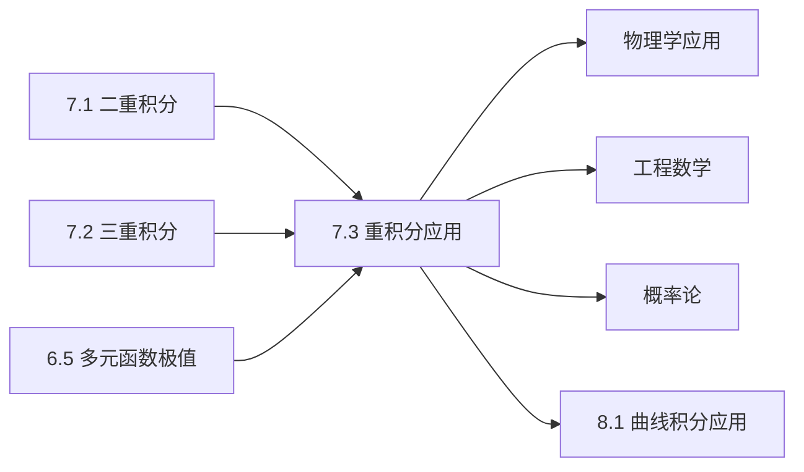

# 7.3 重积分的应用

---

## 章节概览

### 学习目标
1. **几何应用**：掌握利用重积分计算体积、曲面面积等几何量
2. **物理应用**：熟练运用重积分解决质心、转动惯量、引力等物理问题
3. **建模能力**：能够将实际问题转化为重积分问题并求解
4. **综合运用**：将重积分理论与其他数学分支有机结合
5. **实际意义**：理解重积分在工程技术和科学研究中的重要作用

### 重点难点

> **重点内容**
> - 体积、面积的计算公式和方法
> - 质心、重心的概念和计算
> - 转动惯量的物理意义和数学表达
> - 引力、电场等物理场的计算
> - 平均值、概率密度等统计应用

> **难点内容**
> - 复杂几何体的体积计算
> - 变密度物体的质心和转动惯量
> - 三维空间中的物理场计算
> - 实际问题的数学建模
> - 不同坐标系的灵活运用

### 知识架构

```
重积分的应用
├── 几何应用
│   ├── 体积计算
│   ├── 曲面面积
│   ├── 弧长计算
│   └── 投影面积
├── 物理应用
│   ├── 质量与质心
│   ├── 转动惯量
│   ├── 引力场
│   ├── 电磁场
│   └── 流体问题
├── 工程应用
│   ├── 结构力学
│   ├── 热传导
│   ├── 材料科学
│   └── 控制理论
└── 概率统计应用
    ├── 概率密度函数
    ├── 随机变量的特征值
    ├── 统计物理
    └── 信息论
```

### 与其他章节的联系



---

## 目录

1. [几何应用](#1-几何应用)
2. [质量与质心问题](#2-质量与质心问题)
3. [转动惯量计算](#3-转动惯量计算)
4. [物理场问题](#4-物理场问题)
5. [工程技术应用](#5-工程技术应用)
6. [本章知识点总结](#6-本章知识点总结)

---

## 1. 几何应用

### 1.1 平面区域的面积

> **面积公式**
> 
> 平面区域 $D$ 的面积为：
> $$S = \iint_D 1 \, dx \, dy$$

> **例题1.1**：求椭圆 $\frac{x^2}{a^2} + \frac{y^2}{b^2} = 1$ 的面积。

**解答**：

使用广义极坐标变换： $x = ar\cos\theta, y = br\sin\theta$

椭圆区域变为： $r^2 \leq 1$，Jacobian = $abr$

$$S = \iint_D 1 \, dx \, dy = \int_0^{2\pi} \int_0^1 ab \cdot r \, dr \, d\theta = ab \int_0^{2\pi} \left[\frac{r^2}{2}\right]_0^1 d\theta = ab \int_0^{2\pi} \frac{1}{2} \, d\theta = \pi ab$$

### 1.2 立体的体积

> **体积公式**
> 
> 1. **曲顶柱体**：底面为 $D$，顶面为 $z = f(x,y)$ 的体积：
>    $$V = \iint_D f(x,y) \, dx \, dy$$
> 
> 2. **一般立体**：区域 $\Omega$ 的体积：
>    $$V = \iiint_\Omega 1 \, dV$$

> **例题1.2**：求抛物面 $z = x^2 + y^2$ 与平面 $z = 4$ 之间的体积。

**解答**：

**方法一**：曲顶柱体
底面： $D = \{(x,y): x^2 + y^2 \leq 4\}$
高度： $4 - (x^2 + y^2)$

使用极坐标：
$$V = \iint_D [4 - (x^2 + y^2)] \, dx \, dy = \int_0^{2\pi} \int_0^2 (4 - r^2) \cdot r \, dr \, d\theta$$

$$= \int_0^{2\pi} \int_0^2 (4r - r^3) \, dr \, d\theta = \int_0^{2\pi} \left[2r^2 - \frac{r^4}{4}\right]_0^2 d\theta$$

$$= \int_0^{2\pi} \left(8 - 4\right) d\theta = 4 \cdot 2\pi = 8\pi$$

### 1.3 曲面面积

> **曲面面积公式**
> 
> 设曲面由方程  $z = f(x,y)$ 给出，$(x,y) \in D$，则曲面面积为：
> $$S = \iint_D \sqrt{1 + \left(\frac{\partial z}{\partial x}\right)^2 + \left(\frac{\partial z}{\partial y}\right)^2} \, dx \, dy$$

> **例题1.3**：求球面 $x^2 + y^2 + z^2 = a^2$ 在第一卦限的面积。

**解答**：

第一卦限： $x,y,z \geq 0$，曲面方程： $z = \sqrt{a^2 - x^2 - y^2}$

投影区域： $D = \{(x,y): x^2 + y^2 \leq a^2, x \geq 0, y \geq 0\}$

计算偏导数：
$$\frac{\partial z}{\partial x} = \frac{-x}{\sqrt{a^2 - x^2 - y^2}}, \quad \frac{\partial z}{\partial y} = \frac{-y}{\sqrt{a^2 - x^2 - y^2}}$$

$$1 + \left(\frac{\partial z}{\partial x}\right)^2 + \left(\frac{\partial z}{\partial y}\right)^2 = 1 + \frac{x^2 + y^2}{a^2 - x^2 - y^2} = \frac{a^2}{a^2 - x^2 - y^2}$$

使用极坐标： $x = r\cos\theta, y = r\sin\theta$，$0 \leq r \leq a, 0 \leq \theta \leq \frac{\pi}{2}$

$$S = \iint_D \frac{a}{\sqrt{a^2 - x^2 - y^2}} \, dx \, dy = \int_0^{\pi/2} \int_0^a \frac{a}{\sqrt{a^2 - r^2}} \cdot r \, dr \, d\theta$$

内层积分：令 $u = a^2 - r^2$，$du = -2r \, dr$
$$\int_0^a \frac{ar}{\sqrt{a^2 - r^2}} \, dr = -\frac{a}{2} \int_{a^2}^0 u^{-1/2} \, du = -\frac{a}{2} \cdot 2\sqrt{u}\bigg|_{a^2}^0 = a^2$$

$$S = \int_0^{\pi/2} a^2 \, d\theta = a^2 \cdot \frac{\pi}{2} = \frac{\pi a^2}{2}$$

这正是整个球面面积 $4\pi a^2$ 的 $\frac{1}{8}$。

---

## 2. 质量与质心问题

### 2.1 质量的计算

> **质量公式**
> 
> 设物体占据区域 $\Omega$，密度函数为 $\rho(x,y,z)$，则物体的质量为：
> $$m = \iiint_\Omega \rho(x,y,z) \, dV$$
> 
> 对于平面薄片，占据区域 $D$，面密度为 $\rho(x,y)$：
> $$m = \iint_D \rho(x,y) \, dx \, dy$$

### 2.2 质心的计算

> **质心公式**
> 
> 质心坐标为：
> $$\bar{x} = \frac{1}{m} \iiint_\Omega x \rho(x,y,z) \, dV$$
> $$\bar{y} = \frac{1}{m} \iiint_\Omega y \rho(x,y,z) \, dV$$
> $$\bar{z} = \frac{1}{m} \iiint_\Omega z \rho(x,y,z) \, dV$$

**特殊情况**：
- 当密度均匀时，质心就是几何中心（形心）
- 利用对称性可以简化计算

> **例题2.1**：求半圆盘 $x^2 + y^2 \leq a^2, y \geq 0$ 的形心。

**解答**：

由于密度均匀，质心即为形心。由对称性，$\bar{x} = 0$。

计算面积： $S = \frac{\pi a^2}{2}$

计算一次矩：
$$M_x = \iint_D y \, dx \, dy$$

使用极坐标： $0 \leq r \leq a, 0 \leq \theta \leq \pi$

$$M_x = \int_0^\pi \int_0^a r\sin\theta \cdot r \, dr \, d\theta = \int_0^\pi \sin\theta \left[\frac{r^3}{3}\right]_0^a d\theta = \frac{a^3}{3} \int_0^\pi \sin\theta \, d\theta$$

$$= \frac{a^3}{3} [-\cos\theta]_0^\pi = \frac{a^3}{3} \cdot 2 = \frac{2a^3}{3}$$

因此：
$$\bar{y} = \frac{M_x}{S} = \frac{\frac{2a^3}{3}}{\frac{\pi a^2}{2}} = \frac{4a}{3\pi}$$

半圆盘的形心为 $\left(0, \frac{4a}{3\pi}\right)$。

> **例题2.2**：求密度为 $\rho(x,y,z) = z$ 的半球 $x^2 + y^2 + z^2 \leq a^2, z \geq 0$ 的质心。

**解答**：

使用球坐标： $0 \leq r \leq a, 0 \leq \varphi \leq \frac{\pi}{2}, 0 \leq \theta \leq 2\pi$

**计算质量**：
$$m = \iiint_\Omega z \, dV = \iiint_\Omega r\cos\varphi \cdot r^2\sin\varphi \, dr \, d\varphi \, d\theta$$

$$= \int_0^{2\pi} \int_0^{\pi/2} \int_0^a r^3\cos\varphi\sin\varphi \, dr \, d\varphi \, d\theta$$

$$= \int_0^{2\pi} d\theta \int_0^{\pi/2} \cos\varphi\sin\varphi \, d\varphi \int_0^a r^3 \, dr$$

$$= 2\pi \cdot \frac{1}{2} \int_0^{\pi/2} \sin(2\varphi) \, d\varphi \cdot \frac{a^4}{4} = \pi \cdot \frac{1}{2} \cdot \frac{a^4}{4} = \frac{\pi a^4}{8}$$

**计算 $\bar{z}$**：
$$M_{xy} = \iiint_\Omega z^2 \, dV = \iiint_\Omega r^2\cos^2\varphi \cdot r^2\sin\varphi \, dr \, d\varphi \, d\theta$$

$$= \int_0^{2\pi} d\theta \int_0^{\pi/2} \cos^2\varphi\sin\varphi \, d\varphi \int_0^a r^4 \, dr$$

对于 $\int_0^{\pi/2} \cos^2\varphi\sin\varphi \, d\varphi$，令 $u = \cos\varphi$：
$$\int_0^{\pi/2} \cos^2\varphi\sin\varphi \, d\varphi = \int_0^1 u^2 \, du = \frac{1}{3}$$

$$M_{xy} = 2\pi \cdot \frac{1}{3} \cdot \frac{a^5}{5} = \frac{2\pi a^5}{15}$$

因此：
$$\bar{z} = \frac{M_{xy}}{m} = \frac{\frac{2\pi a^5}{15}}{\frac{\pi a^4}{8}} = \frac{2a^5}{15} \cdot \frac{8}{a^4} = \frac{16a}{15}$$

由对称性，$\bar{x} = \bar{y} = 0$，所以质心为 $\left(0, 0, \frac{16a}{15}\right)$。

---

## 3. 转动惯量计算

### 3.1 转动惯量的定义

> **转动惯量公式**
> 
> 1. **对坐标轴的转动惯量**：
>    - $I_x = \iiint_\Omega (y^2 + z^2) \rho(x,y,z) \, dV$（对 $x$ 轴）
>    - $I_y = \iiint_\Omega (x^2 + z^2) \rho(x,y,z) \, dV$（对 $y$ 轴）
>    - $I_z = \iiint_\Omega (x^2 + y^2) \rho(x,y,z) \, dV$（对 $z$ 轴）
> 
> 2. **对原点的转动惯量**：
>    $$I_O = \iiint_\Omega (x^2 + y^2 + z^2) \rho(x,y,z) \, dV$$
> 
> 3. **平面薄片的转动惯量**：
>    - $I_x = \iint_D y^2 \rho(x,y) \, dx \, dy$
>    - $I_y = \iint_D x^2 \rho(x,y) \, dx \, dy$
>    - $I_O = \iint_D (x^2 + y^2) \rho(x,y) \, dx \, dy$

### 3.2 回转半径

> **回转半径**
> 
> 对于轴的回转半径： $R = \sqrt{\frac{I}{m}}$
> 
> 其中 $I$ 是对该轴的转动惯量，$m$ 是总质量。

> **例题3.1**：求均匀圆盘 $x^2 + y^2 \leq a^2$ 对 $z$ 轴的转动惯量。

**解答**：

设面密度为 $\rho$（常数），则：
$$I_z = \iint_D (x^2 + y^2) \rho \, dx \, dy = \rho \iint_D (x^2 + y^2) \, dx \, dy$$

使用极坐标：
$$I_z = \rho \int_0^{2\pi} \int_0^a r^2 \cdot r \, dr \, d\theta = \rho \int_0^{2\pi} \left[\frac{r^4}{4}\right]_0^a d\theta = \rho \int_0^{2\pi} \frac{a^4}{4} \, d\theta = \frac{\pi \rho a^4}{2}$$

质量： $m = \rho \pi a^2$

因此： $I_z = \frac{ma^2}{2}$

> **例题3.2**：求半径为 $a$、密度为 $\rho$ 的均匀球体对通过球心的任一直径的转动惯量。

**解答**：

由对称性，对各坐标轴的转动惯量相等，不妨计算对 $z$ 轴的转动惯量。

使用球坐标：
$$I_z = \iiint_\Omega (x^2 + y^2) \rho \, dV = \rho \iiint_\Omega r^2\sin^2\varphi \cdot r^2\sin\varphi \, dr \, d\varphi \, d\theta$$

$$= \rho \int_0^{2\pi} \int_0^\pi \int_0^a r^4\sin^3\varphi \, dr \, d\varphi \, d\theta$$

$$= \rho \int_0^{2\pi} d\theta \int_0^\pi \sin^3\varphi \, d\varphi \int_0^a r^4 \, dr$$

计算各部分：
- $\int_0^{2\pi} d\theta = 2\pi$
- $\int_0^a r^4 \, dr = \frac{a^5}{5}$
- $\int_0^\pi \sin^3\varphi \, d\varphi = \int_0^\pi \sin\varphi(1-\cos^2\varphi) \, d\varphi$

对于 $\int_0^\pi \sin^3\varphi \, d\varphi$：
$$\int_0^\pi \sin^3\varphi \, d\varphi = \int_0^\pi \sin\varphi \, d\varphi - \int_0^\pi \sin\varphi\cos^2\varphi \, d\varphi = 2 - \frac{2}{3} = \frac{4}{3}$$

因此：
$$I_z = \rho \cdot 2\pi \cdot \frac{4}{3} \cdot \frac{a^5}{5} = \frac{8\pi \rho a^5}{15}$$

球体质量： $m = \rho \cdot \frac{4\pi a^3}{3}$

所以： $I_z = \frac{8\pi \rho a^5}{15} = \frac{2}{5}ma^2$

---

## 4. 物理场问题

### 4.1 引力场

> **万有引力公式**
> 
> 质量为 $m$ 的质点在点 $P(x_0, y_0, z_0)$ 处，受到占据区域 $\Omega$、密度为 $\rho(x,y,z)$ 的物体的引力为：
> $$\vec{F} = -Gm \iiint_\Omega \rho(x,y,z) \frac{\vec{r} - \vec{r_0}}{|\vec{r} - \vec{r_0}|^3} \, dV$$
> 
> 其中 $\vec{r} = (x,y,z)$，$\vec{r_0} = (x_0,y_0,z_0)$，$G$ 是万有引力常数。

> **例题4.1**：求半径为 $a$、密度为 $\rho$ 的均匀球体对距球心为 $d$ ($ d > a$) 的单位质量质点的引力。

**解答**：

建立坐标系，球心在原点，质点在 $(d,0,0)$。

由对称性，引力只有 $x$ 方向分量：
$$F_x = -G \iiint_\Omega \rho \frac{x - d}{[(x-d)^2 + y^2 + z^2]^{3/2}} \, dV$$

使用球坐标： $x = r\cos\varphi, y = r\sin\varphi\cos\theta, z = r\sin\varphi\sin\theta$

$$F_x = -G\rho \int_0^{2\pi} \int_0^\pi \int_0^a \frac{r\cos\varphi - d}{[r^2 - 2rd\cos\varphi + d^2]^{3/2}} r^2\sin\varphi \, dr \, d\varphi \, d\theta$$

由于积分关于 $\theta$ 对称，且 $d > a$，可以证明：
$$F_x = -G \cdot \frac{4\pi a^3 \rho}{3} \cdot \frac{1}{d^2} = -\frac{GMm}{d^2}$$

其中 $M = \frac{4\pi a^3 \rho}{3}$ 是球体总质量。

这说明均匀球体的引力场等价于全部质量集中在球心的质点引力场。

### 4.2 电场和电势

> **电场强度和电势**
> 
> 电荷密度为 $\rho(x,y,z)$ 的带电体在点 $P$ 产生的电势为：
> $$V(P) = \frac{1}{4\pi\varepsilon_0} \iiint_\Omega \frac{\rho(x,y,z)}{|\vec{r} - \vec{r_P}|} \, dV$$
> 
> 电场强度为： $\vec{E} = -\nabla V$

### 4.3 流体静力学

> **静水压力**
> 
> 垂直放置的平面在静水中受到的总压力为：
> $$F = \rho g \iint_D h(x,y) \, dx \, dy$$
> 
> 其中 $h(x,y)$ 是点 $(x,y)$ 处的水深，$\rho$ 是水的密度。

> **例题4.2**：计算半径为 $a$ 的圆形闸门，当其垂直放置且圆心在水面下 $h$ 处时受到的静水压力。

**解答**：

建立坐标系，圆心在原点，$y$ 轴向上。

圆形区域： $x^2 + y^2 \leq a^2$

任一点 $(x,y)$ 处的水深： $h - y$

总压力：
$$F = \rho g \iint_D (h - y) \, dx \, dy = \rho g \left[h \iint_D 1 \, dx \, dy - \iint_D y \, dx \, dy\right]$$

由于区域关于 $x$ 轴对称，$\iint_D y \, dx \, dy = 0$

圆的面积： $\iint_D 1 \, dx \, dy = \pi a^2$

因此： $F = \rho g h \pi a^2$

这个结果说明总压力等于圆心处压强乘以面积。

---

## 5. 工程技术应用

### 5.1 热传导问题

> **平均温度**
> 
> 区域 $\Omega$ 内的平均温度为：
> $$\bar{T} = \frac{1}{V} \iiint_\Omega T(x,y,z) \, dV$$
> 
> 其中 $V$ 是区域的体积。

### 5.2 材料力学

> **应力和应变**
> 
> 在材料力学中，重积分用于计算：
> - 截面的几何性质（惯性矩、截面模量等）
> - 应力分布的合力和合力矩
> - 变形能和应变能

### 5.3 概率统计应用

> **概率密度函数**
> 
> 二维随机变量 $(X,Y)$ 的概率密度函数 $f(x,y)$ 满足：
> 1. $f(x,y) \geq 0$
> 2. $\iint_{-\infty}^{\infty} f(x,y) \, dx \, dy = 1$
> 3. $P((X,Y) \in D) = \iint_D f(x,y) \, dx \, dy$

> **期望值**
> 
> 二维随机变量的期望值：
> $$E[X] = \iint_{-\infty}^{\infty} x f(x,y) \, dx \, dy$$
> $$E[Y] = \iint_{-\infty}^{\infty} y f(x,y) \, dx \, dy$$

> **例题5.1**：设二维随机变量 $(X,Y)$ 的概率密度函数为：
> $$f(x,y) = \begin{cases}
> c(x + y), & 0 \leq x \leq 1, 0 \leq y \leq 1 \\
> 0, & \text{其他}
> \end{cases}$$
> 求常数 $c$ 和 $E[X]$。

**解答**：

**求常数 $c$**：
由归一化条件：
$$\iint_{-\infty}^{\infty} f(x,y) \, dx \, dy = 1$$

$$c \int_0^1 \int_0^1 (x + y) \, dx \, dy = c \int_0^1 \left[\frac{x^2}{2} + xy\right]_0^1 dy = c \int_0^1 \left(\frac{1}{2} + y\right) dy$$

$$= c \left[\frac{y}{2} + \frac{y^2}{2}\right]_0^1 = c \left(\frac{1}{2} + \frac{1}{2}\right) = c$$

因此 $c = 1$。

**求 $E[X]$**：
$$E[X] = \int_0^1 \int_0^1 x(x + y) \, dx \, dy = \int_0^1 \int_0^1 (x^2 + xy) \, dx \, dy$$

$$= \int_0^1 \left[\frac{x^3}{3} + \frac{x^2y}{2}\right]_0^1 dy = \int_0^1 \left(\frac{1}{3} + \frac{y}{2}\right) dy$$

$$= \left[\frac{y}{3} + \frac{y^2}{4}\right]_0^1 = \frac{1}{3} + \frac{1}{4} = \frac{7}{12}$$

---

## 6. 本章知识点总结

### 6.1 应用领域总结

> **重积分应用的主要领域**
> 
> 1. **几何学**：面积、体积、曲面面积的计算
> 2. **力学**：质心、转动惯量、静力学问题
> 3. **物理学**：场论、热学、电磁学
> 4. **工程学**：结构分析、材料力学、流体力学
> 5. **概率论**：概率密度、期望值、方差

### 6.2 解题方法总结

| **应用类型** | **基本公式** | **关键技巧** | **注意事项** |
|--------------|--------------|--------------|--------------|
| 体积计算 | $V = \iiint_\Omega 1 \, dV$ | 选择合适坐标系 | 正确描述积分区域 |
| 质心计算 | $\bar{x} = \frac{M_{yz}}{m}$ | 利用对称性 | 区分质心与形心 |
| 转动惯量 | $I = \iiint_\Omega r^2 \rho \, dV$ | 平行轴定理 | 转轴的选择 |
| 引力计算 | $F \propto \frac{1}{r^2}$ | 矢量积分 | 坐标系建立 |

### 6.3 建模步骤

> **实际问题求解步骤**
> 
> 1. **问题分析**：明确要求解的物理量
> 2. **建立模型**：确定积分区域和被积函数
> 3. **选择坐标系**：根据对称性选择最合适的坐标系
> 4. **建立积分**：写出重积分表达式
> 5. **计算积分**：选择合适的积分次序
> 6. **结果验证**：检查结果的物理意义和量纲

### 6.4 常用技巧

> **计算技巧总结**
> 
> 1. **对称性利用**：充分利用几何和物理对称性
> 2. **坐标变换**：选择简化计算的坐标系
> 3. **分割区域**：将复杂区域分解为简单区域
> 4. **物理直觉**：利用物理直觉检验结果合理性
> 5. **特殊情况验证**：用简单情况验证一般公式

### 6.5 考研重点

> **高频考点**
> 
> - ⭐⭐⭐ 体积计算（各种几何体）
> - ⭐⭐⭐ 质心和转动惯量计算
> - ⭐⭐ 曲面面积计算
> - ⭐⭐ 物理场问题（引力、电场等）
> - ⭐ 概率统计应用

### 6.6 学习建议

> **学习方法建议**
> 
> 1. **物理背景**：了解各种应用的物理背景和实际意义
> 2. **公式记忆**：熟记常用的应用公式
> 3. **计算练习**：大量练习不同类型的应用题
> 4. **建模能力**：培养将实际问题转化为数学模型的能力
> 5. **综合运用**：将重积分与其他数学分支结合

### 6.7 与其他学科的联系

本章内容与以下学科密切相关：
- **理论力学**：刚体力学、流体力学
- **电磁学**：电场、磁场的计算
- **热力学**：温度分布、热传导
- **概率论**：多维随机变量
- **工程力学**：结构分析、材料力学

### 6.8 跨学科应用总结

> **物理学中的重积分应用**
> 
> 1. **力学应用**：
>    - 质心、重心的计算
>    - 转动惯量、惯性矩
>    - 静力学中的压力计算
>    - 流体的流量和压强分布
> 
> 2. **电磁学应用**：
>    - 电荷分布产生的电场和电势
>    - 磁偶极矩的计算
>    - 电容器的电容计算
>    - 磁场中的磁通量
> 
> 3. **热学应用**：
>    - 温度场的平均值计算
>    - 热传导方程的解
>    - 热辐射的功率计算
>    - 相变过程中的能量计算

> **工程技术中的重积分应用**
> 
> 1. **结构工程**：
>    - 梁的弯曲应力分布
>    - 截面的几何性质计算
>    - 应变能的计算
>    - 疲劳寿命分析
> 
> 2. **流体工程**：
>    - 管道中的流量计算
>    - 压力分布分析
>    - 阻力系数的确定
>    - 混合过程的分析
> 
> 3. **电子工程**：
>    - 电路中的功耗计算
>    - 信号的能量和功率
>    - 天线的辐射特性
>    - 传输线的特性阻抗

### 6.9 综合建模指导

> **重积分建模的一般策略**
> 
> 1. **问题分析阶段**：
>    - 明确所求的物理量或几何量
>    - 分析问题的对称性和特殊性质
>    - 确定影响因素和边界条件
> 
> 2. **数学建模阶段**：
>    - 选择合适的坐标系
>    - 确定积分区域的数学描述
>    - 建立被积函数的表达式
>    - 设定积分的次序和限制
> 
> 3. **计算求解阶段**：
>    - 利用对称性简化计算
>    - 选择最优的计算路径
>    - 应用适当的数值方法
>    - 验证计算结果的合理性
> 
> 4. **结果分析阶段**：
>    - 检查量纲的一致性
>    - 分析结果的物理意义
>    - 与已知结果或特殊情况对比
>    - 分析参数变化对结果的影响

> **建模中的常见问题及解决方案**
> 
> 1. **积分区域描述不准确**：
>    - 问题：边界条件理解错误
>    - 解决：仔细分析约束条件，绘制三维图形
> 
> 2. **被积函数建立错误**：
>    - 问题：物理意义理解偏差
>    - 解决：回顾物理概念，从基本原理出发
> 
> 3. **坐标系选择不当**：
>    - 问题：计算过于复杂
>    - 解决：分析对称性，选择最自然的坐标系
> 
> 4. **数值计算误差**：
>    - 问题：积分难以解析求解
>    - 解决：采用适当的数值积分方法

### 6.10 学习进阶建议

> **深入学习路径**
> 
> 1. **理论深化**：
>    - 学习测度论基础
>    - 理解Lebesgue积分理论
>    - 掌握广义积分的判别法
> 
> 2. **计算技能**：
>    - 熟练掌握各种坐标变换
>    - 学习数值积分方法
>    - 掌握符号计算软件的使用
> 
> 3. **应用拓展**：
>    - 学习偏微分方程的积分方法
>    - 了解变分法的基本思想
>    - 掌握积分方程的求解
> 
> 4. **跨学科联系**：
>    - 结合具体专业学习相关应用
>    - 参与科研项目的实际计算
>    - 学习计算物理和工程数学

---

> **本章核心**：重积分的应用体现了数学与物理、工程等学科的密切联系。掌握重积分在各个领域的应用，不仅加深了对重积分理论的理解，也为解决实际问题提供了有力的数学工具。在学习过程中，要注重理论与实践的结合，培养用数学方法解决实际问题的能力。通过跨学科的学习和应用，可以更好地理解数学的工具性和实用性，为后续的专业学习和科研工作奠定坚实的数学基础。 